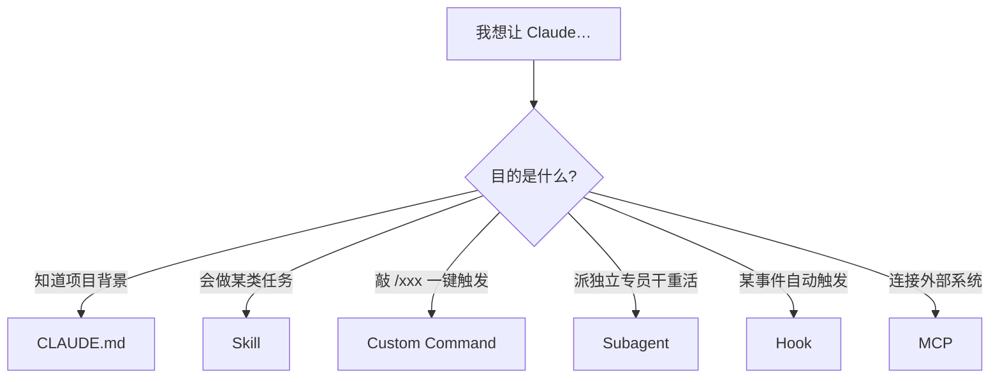
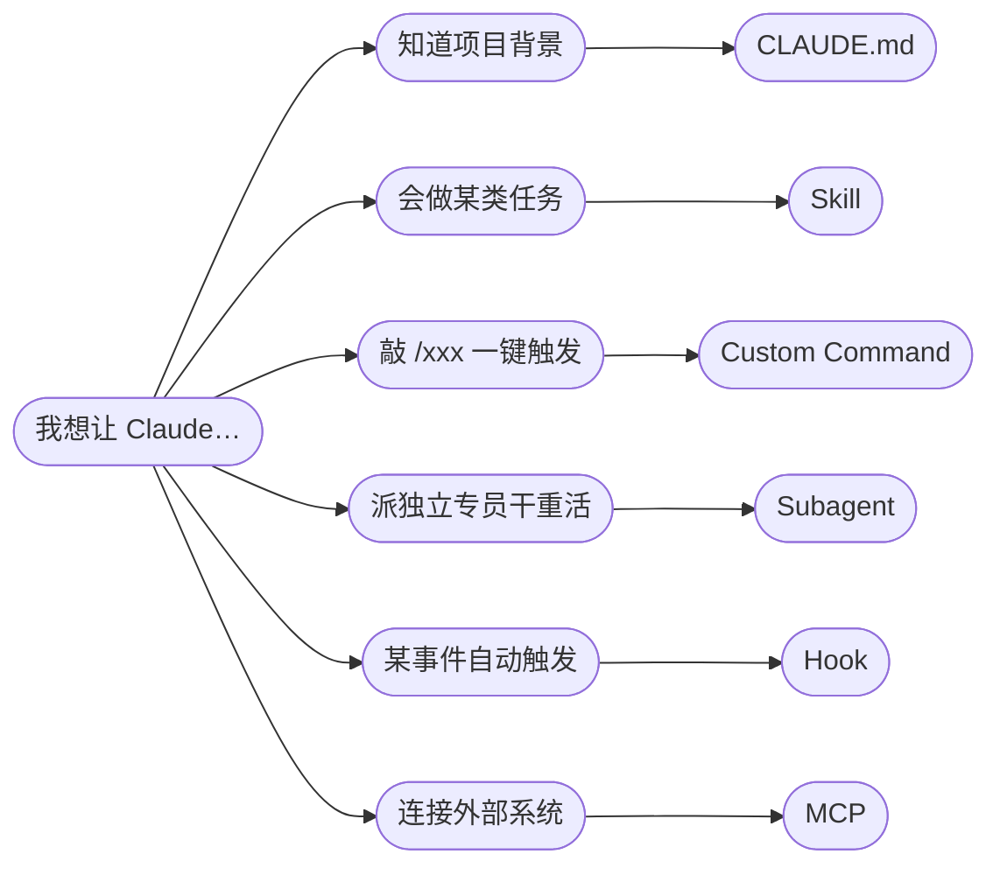
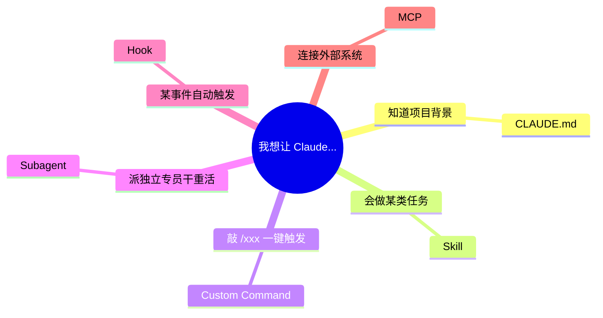

# 图表风格对比（实验）

> 同一张"扩展机制选型"图，三种渲染方式——用于决定全书采用哪种风格。

## 方案 A：当前风格（handDrawn + 手写字体）

**特点**：手绘抖动线条 + 手写字体 + 方形节点。友好、随性。

---

## 方案 B：MindNode 风（平滑曲线 + 胶囊节点 + 柔和色）

**特点**：
- `curve: basis` 让连线变 S 形样条曲线（MindNode 的招牌）
- `([...])` 胶囊/药丸形节点
- 柔和蓝色 + 无边框感
- 左右布局（`LR`）更像思维导图
- **代价**：不能在中间加"目的是什么?"这种菱形决策点，也没法给分支打标签（"知道项目背景"只能放节点里）

---

## 方案 C：真正的 mindmap（Mermaid 原生思维导图）

**特点**：
- 真正的放射状思维导图
- 根节点圆形、子节点云朵/矩形
- 默认就是 MindNode 风
- **硬伤**：**只能画纯层级**，不能画带"是/否"、"读/改/跑"这种决策分支——附录 D 的图 1-5 全部画不出来

---

## 决策建议

| 附录 D 的图 | 类型 | 方案 A 能画吗 | 方案 B 能画吗 | 方案 C 能画吗 |
|---|---|---|---|---|
| 图 1 权限决策 | 带标签决策 | ✅ | ⚠️ 没法标"是/否" | ❌ |
| 图 2 模型选择 | 带标签决策 | ✅ | ⚠️ | ❌ |
| 图 3 Ctx% 分档 | 带标签分流 | ✅ | ⚠️ | ❌ |
| 图 4 卡住原则 | 带标签决策 | ✅ | ⚠️ | ❌ |
| 图 5 信息分层 | 带标签分类 | ✅ | ⚠️ | ❌ |
| 图 6 扩展机制 | 纯分类 | ✅ | ✅ | ✅ |

只有图 6 三种都能画。其他 5 张如果要 MindNode 风，只能用方案 B 并把标签塞进节点里，丢掉"是/否"这种分支语义。

---

## 如何选

- **要 MindNode 的"线条美感" + 保留决策语义** → 方案 B，但每张图都要把分支标签硬塞进节点，可能导致节点文字变长
- **要 MindNode 的"纯净清爽"** → 只有图 6 那种纯分类图适合，其他图需要另找方案
- **维持现状（handDrawn）** → 方案 A，全部 6 张图通吃，但观感是"手绘课堂风"而非"思维导图风"
