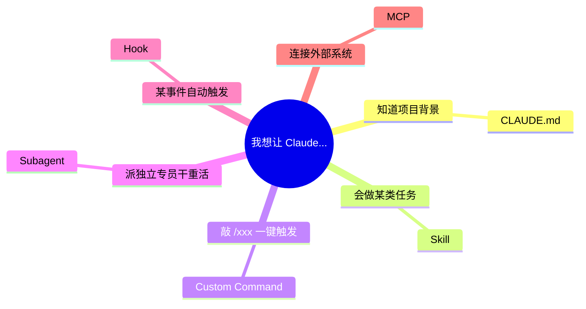
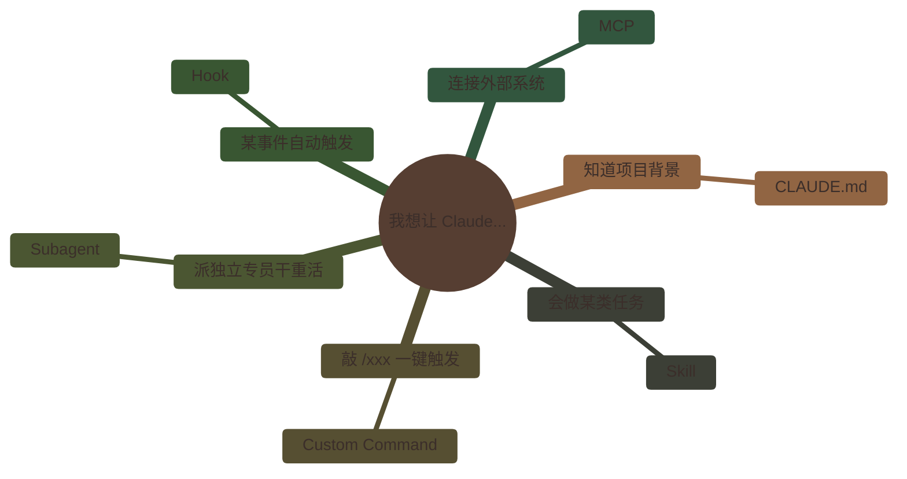
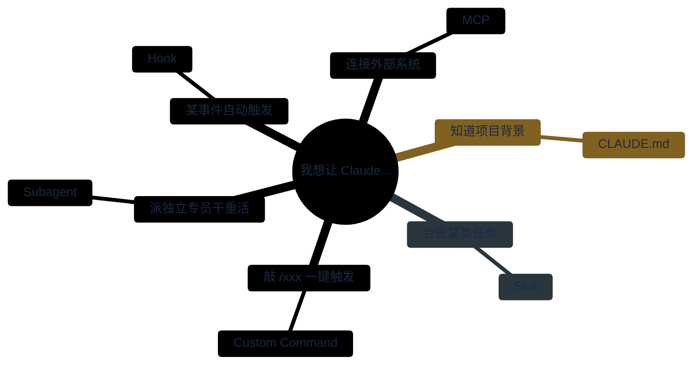
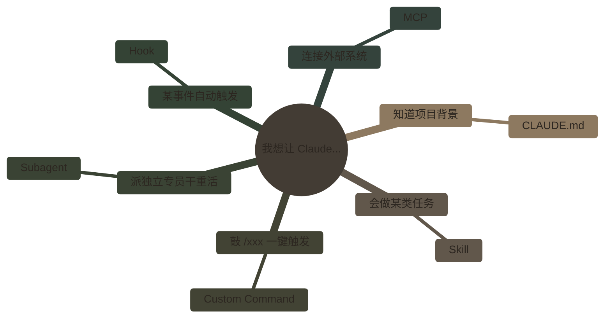
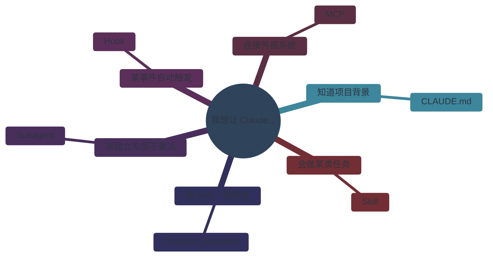

# Mindmap 配色对比（实验）

> 同一张 mindmap 图（图 6 扩展机制选型），套用 4 套杂志/设计圈公认配色，直接在 GitHub 渲染对比。

---

## 参考：默认配色（做基准）

---

## 配色 1：Pantone 2025 年度色 "Mocha Mousse"

**出处**：Pantone Color Institute 2024 年 12 月发布的 2025 年度代表色 `#A47864`（柔和咖啡/摩卡），今年几乎所有时尚、室内、平面设计都在用。

**调色板**：
- 背景 `#F5EDE4`（奶咖）
- 主节点 `#A47864`（Mocha Mousse 本尊）
- 分支深色 `#6B4F3F`（可可）
- 分支浅色 `#C9A68B`（燕麦）
- 点缀色 `#7D8471`（鼠尾草）
- 线条 `#6B4F3F`
- 文字 `#3B2E2A`

**气质**：温暖、克制、当季感强。适合一本强调"友好、慢阅读"的入门书。

---

## 配色 2：Monocle 杂志风

**出处**：伦敦 *Monocle* 杂志 20 年来一直用的一套配色——深海军蓝主色 + 奶油纸色背景 + 芥末黄点缀。国际主义设计标配。

**调色板**：
- 背景 `#FAF6F0`（牛皮纸白）
- 主节点 `#1B2845`（深海军蓝）
- 分支主 `#D4A84B`（芥末黄）
- 分支次 `#5C7A89`（雾蓝）
- 点缀 `#A63D40`（砖红）
- 线条 `#1B2845`
- 文字 `#1B2845`

**气质**：克制、成熟、国际。宋体 + 深蓝让整本书更像"严肃出版物"。

---

## 配色 3：Cereal / Kinfolk 极简风

**出处**：英国独立杂志 *Cereal* 和美国 *Kinfolk* 共同推动的"极简编辑设计"浪潮——去饱和、接近单色、大量留白。过去 10 年独立出版圈的默认审美。

**调色板**：
- 背景 `#F5F1EA`（亚麻色）
- 主节点 `#4A4238`（深橄榄棕）
- 分支深 `#8B7D6B`（石色）
- 分支浅 `#C4B8A8`（燕麦）
- 点缀 `#A39788`（温灰）
- 线条 `#6B5F52`
- 文字 `#2C2620`

**气质**：安静、无年龄感、不抢戏。图是"信息"而不是"装饰"。适合长读。

---

## 配色 4：Nord / 北欧编辑风

**出处**：开源配色 *Nord*（2016 起，被 Linear、VS Code、大量 tech 出版物采用）。比 Monocle 冷、比 Kinfolk 有现代感，介于"编辑"和"科技"之间。

**调色板**：
- 背景 `#ECEFF4`（极光雪）
- 主节点 `#2E3440`（极夜）
- 分支主 `#5E81AC`（霜蓝）
- 分支次 `#88C0D0`（冰蓝）
- 点缀 `#BF616A`（极光红）
- 线条 `#4C566A`
- 文字 `#2E3440`

**气质**：干净、现代、略有科技感。适合"书在讲技术但设计不土"的定位。

---

## 四套对比速览

| 配色 | 情绪 | 最像什么出版物 | 适合本书吗 |
|---|---|---|---|
| 1 Mocha Mousse | 温暖、当季 | *Kinfolk*、*Apartamento* | 友好入门定位契合 |
| 2 Monocle | 成熟、克制 | *Monocle*、*Aperture* | 略偏"严肃出版" |
| 3 Cereal / Kinfolk | 安静、极简 | *Cereal*、*The Gentlewoman* | 最"去存在感"，图不抢正文 |
| 4 Nord | 现代、微科技 | Linear 文档、*Wired* | 技术感偏强 |

---

## 后续待决

1. 选哪套配色（或要我糅一套新的）
2. mindmap 只能画纯层级 → 附录 D 图 1-5 怎么办：
   - (a) 重构内容，把决策分支改写成层级分类
   - (b) 图 6 用 mindmap，其他 5 张继续用 handDrawn flowchart（两种风格并存）
   - (c) 全部放弃 mindmap，改回方案 B（平滑曲线 flowchart），统一风格
