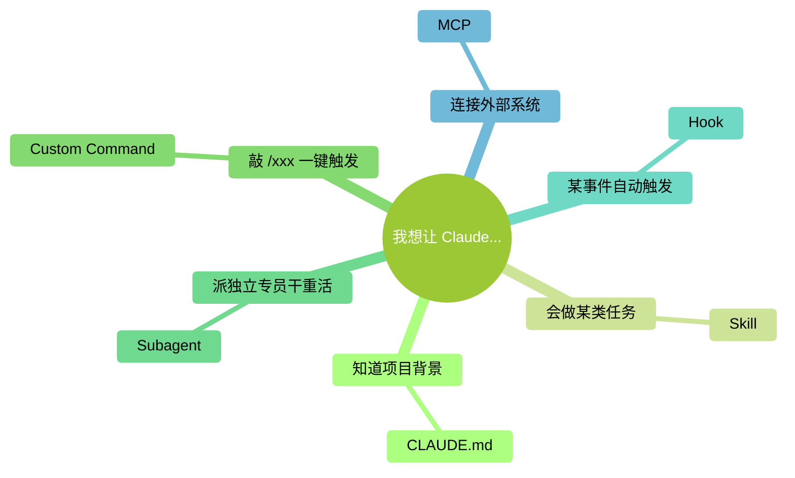
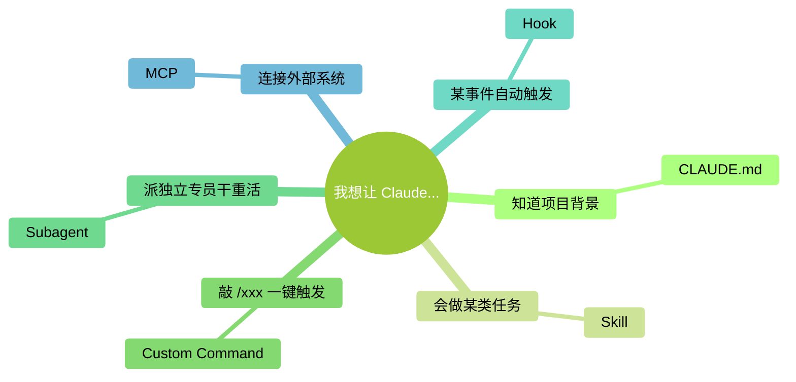
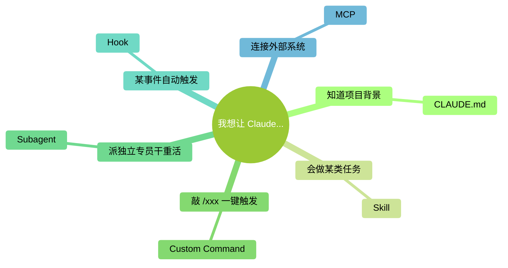

# Forest 主题的三种变体

> 在上一轮选中"forest + 苹果字体"（清爽偏绿）的基础上，沿三个维度各变一次：
> **变体 A** 改线条、**变体 B** 改背景、**变体 C** 改字体。
> 每个变体只动一维，便于你说"喜欢 A 的线 + B 的纸色 + C 的字"，最终混搭。

---

## 基准：上一轮选中的 forest 版（对照组）

---

## 变体 A：纤细版（线条更淡、字号更大）

**改动**：`lineColor` 换成极浅灰、`fontSize` 从 15 → 17。
**目的**：MindNode 的招牌是"几乎看不见的连线"——把重心放在节点上。

---

## 变体 B：纸感版（奶油色背景 + 暖色线条）

**改动**：背景从白色换成奶油色、线条换成暖灰。
**目的**：从"App 截图感"换到"杂志内页感"，更像书。

---

## 变体 C：编辑版（思源宋体 / 苹方宋体，出版物感）

**改动**：字体从 Apple sans-serif 换成中文宋体 + 英文衬线体。
**目的**：让图的气质更靠近"印刷书"，和本书的"慢阅读"调性呼应。

---

## 三维决策表

| 维度 | 基准 | 变体 A | 变体 B | 变体 C |
|---|---|---|---|---|
| 背景 | 白 | 白 | **奶油** | 白 |
| 线条 | 中灰 | **极浅灰** | **暖灰** | 浅灰 |
| 字号 | 15 | **17** | 15 | 16 |
| 字体 | 苹方/SF | 苹方/SF | 苹方/SF | **宋体** |

---

## 看完你怎么答我

告诉我你最终想要的组合，例如：

- "**A 的线 + B 的背景**，字体维持苹方" → 我就给你做出这套最终版
- "**就 B 这套**，别动了" → 直接按 B 固化
- "**C 的宋体不对，太老气**，但 A 的线 + B 的背景可以" → 排除宋体方向
- "三个都不对，我要 ___" → 告诉我具体哪里不对

收到答复我就把最终配置写进 `写作规范.md`，并把附录 D 的图 6 先按最终版重渲染一遍给你确认。
