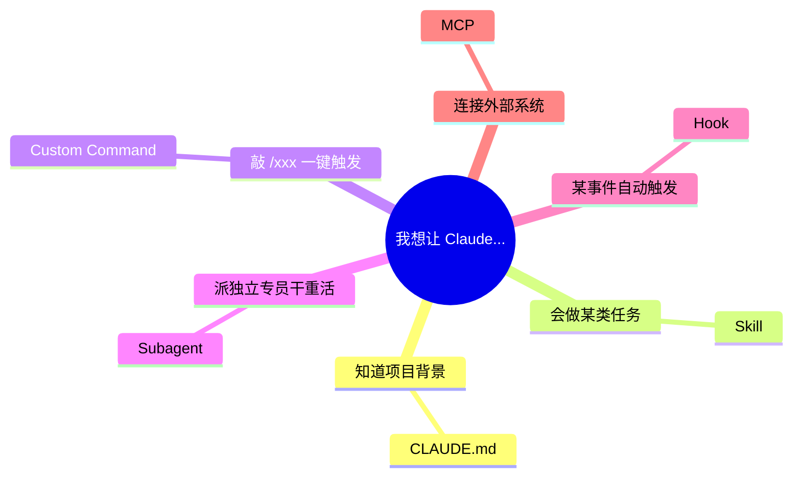
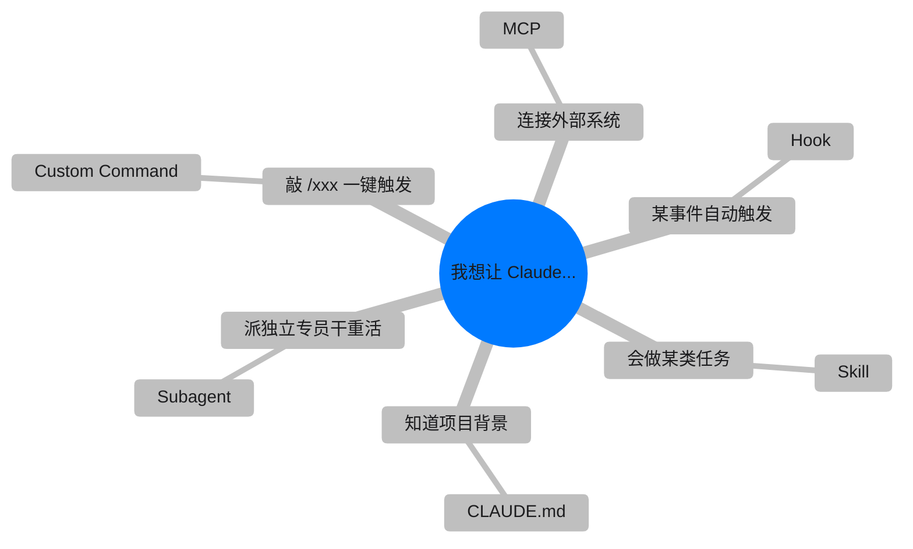
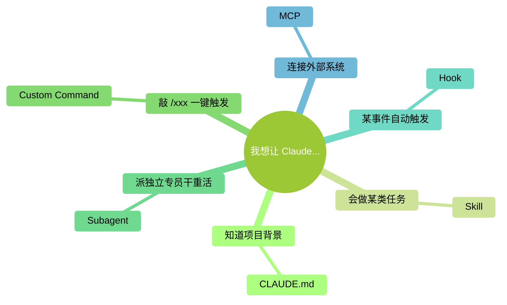

# Mindmap MindNode 风尝试

> 目标：尽量接近 MindNode 的视觉——**纯白背景 + Apple 系统色 + 苹果字体 + 细灰连线**。
> Mermaid mindmap 的每支颜色是内部按主题自动轮转的，无法逐支指定颜色；
> 所以这里只能换主题、字体、线条色来靠近。

---

## 尝试 1：default 主题 + SF / 苹方字体

---

## 尝试 2：base 主题 + 手动塞入 Apple 系统色槽位

尝试 2 的 `git0-git7` 变量不保证在所有 Mermaid 版本上都生效，能生效就是纯 MindNode 配色，不生效就退化为默认主题色。

---

## 尝试 3：forest 主题 + 苹果字体（偏绿调，相对清爽）

---

## 如果 Mermaid 出来的效果还是不够 MindNode

Mermaid 的约束就到这里了。再往下只有三个现实选项：

1. **接受妥协**：选三种里面最接近的，全书统一
2. **转 Excalidraw**：真的能做到每支单独指定颜色、线条粗细、字体——但需要手动画（前面讨论过了）
3. **直接上 MindNode App**：你截图 / 导出 SVG 放进书（授权没问题的话）——最像，但工作量最大且涉及软件截图版权

我的建议：先看上面三个尝试，告诉我哪个最接近（或者都不满意哪里还差），我再调。
