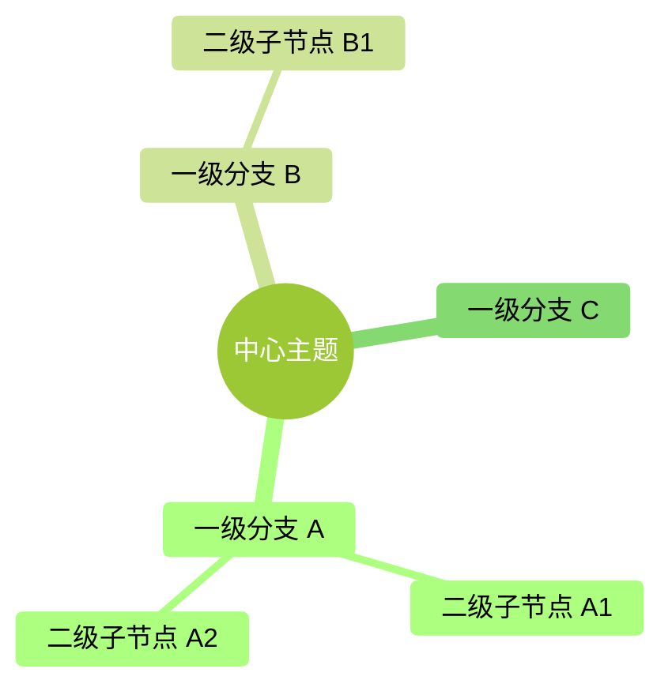

# 新增 Mindmap 模板（复制粘贴用）

## 使用步骤

1. 从下面的"完整代码块"里**把 Mermaid 代码块整体复制**（从 ``` 开头到 ``` 结尾）
2. 粘贴到 manuscript 目标章节的对应位置
3. **把 `<!-- diagram: MM-XX -->` 里的 `XX` 替换成清单里下一个未用的 MM 编号**
4. 修改 `root((…))` 里的中心主题
5. 修改下面的分支结构（每缩进一层是一级）
6. 去 [`README.md`](./README.md) 的 MM 清单表格尾部追加一行登记

## 完整代码块

> **注意**：下面的 Mermaid 代码块本身**不会**在这个文件里渲染——因为外面套了引用。
> 要看实际渲染效果，复制到 manuscript 的 `.md` 文件里、推到 GitHub 后查看。

````markdown
<!-- diagram: MM-XX -->

````

## 适用场景

**适合 mindmap**：
- 纯分类 / 归纳（例："扩展机制选型" → 6 种机制的平级分类）
- 知识点的层级归属（例："Skill 的三个组成部分"）
- 能力地图 / 功能矩阵

**不适合 mindmap**（mindmap 画不了）：
- 带"是/否"、"读/改/跑"这种**决策分支标签**的流程 → 当前走 ASCII 图或附录 D 保留的 flowchart
- 步骤顺序不可调换的流程 → 用编号列表或章节小节
- 对比类（需要并列展示） → 用表格

**判断方法**：如果你想画的图可以自然地用"以 X 为中心，发散出几类东西"来描述，就适合 mindmap；
如果要表达"先这样，然后那样，分岔时是/否"，就不适合。

## 风格参数从哪来

所有 mindmap 共用 [`_style.md`](./_style.md) 里定义的风格。
不要在单张图里**覆盖**风格参数——如果你觉得某张图应该不一样，去讨论要不要升级全局风格。
