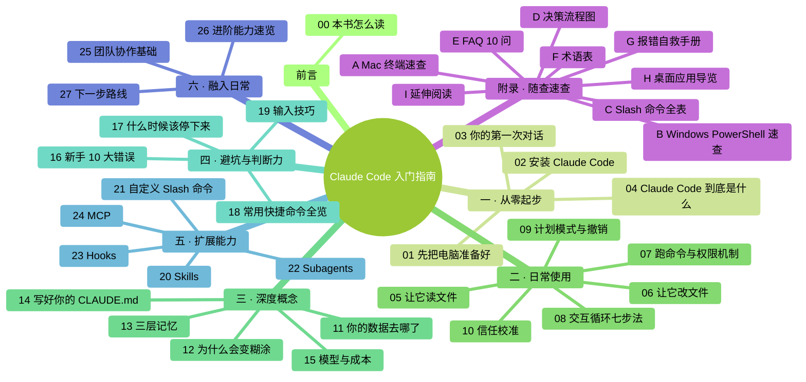

# 第 0 章：本书怎么读

欢迎。正式开始前，先花 10 分钟搞清楚——这本书是给谁写的、怎么读最省力、读完你能得到什么。

### 全书地图（一张图看清整本书脉络）

下图是整本书的结构。先用 30 秒扫一眼，你会对"我要读的是什么"有个**整体感**——后面每章开头也会有一张更细的"章首导览"，但**这张图只画一次**，它是整本书的坐标系。

<!-- diagram: MM-08 -->

---

> 🎯 **【主线】—— 本章必读核心**
>
> 下面 6 节是全书导读的骨架。读完即可进入第 1 章。预估 10 分钟。

---

## 0.1 这本书适合谁

你同时满足下面**几乎全部**条件时，这本书最适合你：

- **不会编程**——从没写过一行代码，也不想专门去学
- **没用过命令行**——打开"终端"或"PowerShell"会发懵，甚至不知道它们在哪、长什么样
- **没用过 AI 编程工具**——Cursor、Copilot、Windsurf 这些名字对你是陌生的
- **有真实的工作场景想解决**——比如整理一堆下载的文件、把杂乱的表格清洗一下、把一堆资料总结成一篇文档、给自己做点小自动化
- **用 Mac 或 Windows 电脑**（Linux 用户本书不专门覆盖，可自行类推）

如果你**已经会编程**或熟悉终端，本书前半部分对你会略显啰嗦——但第 10、12、14 章（信任校准、上下文、CLAUDE.md）对所有层次的读者都有价值。

## 0.2 读完你能做什么

认真读完并完成所有动手任务后，你能：

1. 独立**安装并启动** Claude Code
2. 在终端里发起**有效对话**——让它读文件、改文件、跑命令
3. **读懂权限提示**，知道什么时候该允许、什么时候该拒绝
4. 在 Claude **变糊涂时知道该怎么办**
5. 写一份自己的 **CLAUDE.md**，让 Claude 长期记住你的偏好
6. 识别 **10 个新手常踩的坑**
7. 至少装一个扩展能力（Skill、自定义命令 或 MCP）
8. 明白**什么时候该停下来、改手工做**

简言之：**从"不敢打开终端"到"能独立用 Claude Code 解决日常工作任务"**。

## 0.3 本书用到的记号

全书使用这几种固定记号：

| 记号 | 含义 |
|------|------|
| ⚠️ | 危险操作或容易出错的地方，停下来看清楚 |
| 💡 | 小贴士，可选但有用 |
| 📌 | 重点，必须记住 |
| ❓ | 常见疑问 |
| `反引号里的字` | 命令、代码、文件名、按键 |
| **你**：... | 示例对话中你说的话（粗体） |
| Claude：... | Claude 的回复 |

当你看到类似 `ls ~/Desktop` 这种代码方框里的文字，**那是需要你一字一字打进终端的命令**，不是普通的中文阅读内容。

还有两个**贯穿全书的重要标志**——告诉你一段内容是"必读"还是"可跳过"：

- 🎯 **【主线】** = 本章必读核心。读完就合格，可以进下一章
- 🌿 **【支线】** = 可选深入。第一遍读**可以直接跳过**，用熟了再回头看

比如本章——你正读到的就是"主线"。本章末尾有两条"支线"，第一遍不读完全没问题。

## 0.4 章节地图

全书 27 章 + 10 个附录，分 6 个部分：

| 部分 | 章节 | 讲什么 |
|------|-----|-------|
| **一、从零起步** | Ch 0-4 | 电脑怎么准备、怎么装、第一次对话、Claude Code 是什么 |
| **二、日常使用** | Ch 5-10 | 读文件、改文件、跑命令、权限机制、审核、信任校准 |
| **三、深度概念** | Ch 11-15 | 隐私与数据、上下文原理、三层记忆、CLAUDE.md、模型与成本 |
| **四、避坑与判断力** | Ch 16-19 | 10 大错误、何时停下、常用命令、输入技巧 |
| **五、扩展能力** | Ch 20-24 | Skills、自定义命令、Subagents、Hooks、MCP |
| **六、融入日常** | Ch 25-27 | 团队协作、进阶速览、下一步 |

📌 **强烈建议按顺序读**——后面的章节都假设你已经掌握前面的内容。**每章的"主线"读完就行，支线可以最后再回来翻**。

## 0.5 别搞错——还有两种"会干活的 Claude"

Anthropic（开发 Claude 的公司）目前有**三种不同形态**的产品都能帮你"读文件、改文件、跑任务"，一定要对号入座：

| 产品 | 界面 | 适合谁 |
|------|-----|-------|
| **① Claude Code（终端版）** | 命令行窗口，只能打字 | **本书主讲**——愿意学一点基础终端的人 |
| **② Claude Code 桌面应用** | 图形界面 | 不爱切终端、想多会话可视化编排的人 |
| **③ Claude Cowork** | 全图形，不写代码 | 完全不想学终端、任务是整理文件/做表格/处理文档的知识工作者 |

📌 **一句话分流**：
- **愿意学点基础终端，换一套威力大的长期工具** → 继续读本书
- **只想让 AI 帮整文件、做表、写文档，对终端没兴趣** → 去 `claude.com/cowork` 用 Cowork，和本书教的类似但更直观

我们不强留你——你节省时间，对大家都好。

## 0.6 每章都有的三件套

从第 1 章起，每章**主线末尾**都有这**三件套**，顺序固定：

1. **本章小结**——合上书也能复述的几条要点
2. **动手任务**——带预估时间、步骤、成功标志
3. **如果你卡住了**——列最可能的 2-3 个卡点 + 解决办法

动手任务**一定要做**。光看不练，真打开终端时会发现手是陌生的——**动手任务本身就是最好的自测**，能做出来就是真懂了。

---

## 本章小结

- 这本书给**完全零基础**的普通人，用 Mac 或 Windows
- 读完能从"不敢打开终端"到"独立解决日常工作任务"
- **Claude Code 有三种形态**：终端版（本书主讲）、桌面应用、Cowork——看清楚自己该用哪个
- **每章分 🎯 主线 / 🌿 支线**——第一遍读只读主线就够
- 每章主线末尾有**三件套**：小结 / 动手任务 / 卡住了
- **按顺序读**最省力

---

## 动手任务

### 任务 1：想清楚你为什么读这本书（2 分钟）

合上书，对自己说一遍："我为什么要读这本书？我期望学完能具体解决什么问题？"

**成功标志**：你能**具体说出** 1 件你最近想让 AI 帮你处理、但不知道怎么做的事。比如："把我下载文件夹里 300 个 PDF 按主题分类"、"把 10 个 Excel 合并成一个"、"把一年的会议笔记整理成摘要"。

**为什么做这个任务**：带着具体目标读书，比泛泛地"学习一下"效率高 5 倍。

---

## 如果你卡住了

**症状：你读完本章觉得"术语太多、好复杂"**
- 原因：Ch 0 会提到终端、PowerShell、Cowork 等好几个名字，你可能一个都没听过。这正常。
- 解决：别担心，后面都会讲。特别是第 1 章会从"什么是终端"从零讲起。**直接往下读就行**。

**症状：不确定自己是不是"真零基础"**
- 原因：你可能用过命令行一次两次、或者跟着教程跑过一段代码。
- 解决：这仍然算"零基础"。只要你没把终端当日常工具用，本书就适合你。顶多前两章读得快一点。

---

主线到这里结束。如果你想进第 1 章，**往下翻，直接跳到下一章的文件**。

下面是两条支线——对本书怎么用得更好感兴趣的人可以看看，第一遍读完全可以跳过。

---

> 🌿 **【支线】—— 可选深入（学有余力再看）**
>
> 下面两小节是关于"怎么读这本书"的补充建议和本书背景。第一遍读时**完全可以直接跳到第 1 章**；等你读完前三部分、对本书节奏有感觉了，再回来看看。

---

## 🌿 支线 0.A：读这本书的节奏建议

> 这段讲什么：怎么分配阅读时间、哪些章可以跳、遇到不懂怎么办。
> 什么时候回头读：读完 Ch 1-2 觉得信息量大想规划一下，就回来看这段。

- **每次读 1-2 小时，别一口气灌完**——认知负担过载会让你记不住
- **第一部分（Ch 0-4）尽量连着读完**——心理门槛都在这几章，一鼓作气过
- **每章先读 🎯 主线、完成动手任务**，再决定要不要读当章支线
- **进阶章节（第五部分 Ch 20-24）可以先跳**——用熟了基础再回来
- **附录随时查**，不用死记硬背
- **遇到看不懂的术语**：先往下读一两段，通常下一段会解释；还不懂，翻**附录 F 术语表**
- **第二遍阅读**：建议在用 Claude Code 1 个月左右时重读——那时你的问题和第一次不一样，支线会突然变得有用

## 🌿 支线 0.B：这本书和其他 Claude Code 教程有啥不一样

> 这段讲什么：为什么你读这本书，而不是其他同类教程。
> 什么时候回头读：好奇作者视角 / 想对比其他资源的时候。

市面上已有不少 Claude Code 教程（英文版 Ultimate Guide、中文 awesome-claudcode-tutorial 等），但它们几乎都有同一个问题：**默认读者已经会编程或熟悉终端**。

本书的差异化取舍：

| 维度 | 大多数同类教程 | 本书 |
|------|--------------|-----|
| 前置知识 | 假设会 git、熟悉 API 等 | **从"什么是终端"开始讲** |
| 前几章密度 | 快节奏，新手容易卡 | **前 5 章颗粒度最细**，每步都手把手 |
| 示例类型 | React 组件、后端 API | **日常任务**（整文件、做表格、写文档） |
| 结构 | 线性长文 | **主线 / 支线双轨** |
| CLAUDE.md 这类高杠杆内容 | 常常一句"跑 /init"带过 | **整整一章讲透**，含反模式 |

**简单讲**：如果你已经是程序员，本书显得啰嗦；如果你是零基础，其他教程读起来像天书。这本书就是填"零基础到入门"这段路。

---

好了。准备好就进入第 1 章，我们从最基础的"什么是终端"讲起。

---

<!-- chapter-nav -->

📖  （本书开篇）  ·  [📑 返回目录](../../README.md)  ·  [第 1 章 · 先把电脑准备好 →](../part1-从零起步/01-先把电脑准备好.md)
