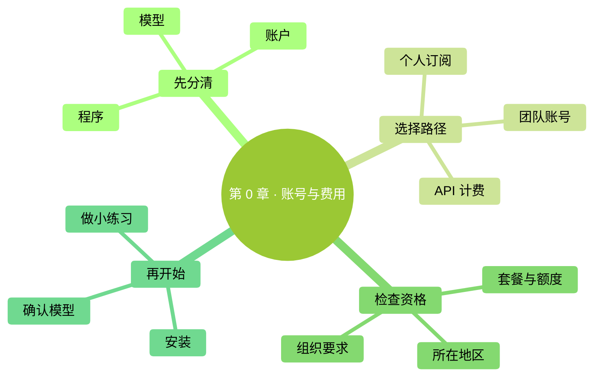

# 第 0 章：先选好账号与费用路径

> **本章在全书的位置**：前言之后、第 1 章之前 / 约 15 分钟。
>
> **学完能做什么**：判断自己是否有 Claude Code 使用资格，分清订阅、API 和第三方接入，决定下一步从哪里开始。
>
> 老版把这一章叫“免费用上 Claude Code”。现在保留文件地址，方便旧链接继续访问；内容已改为账号与费用准备。活动赠送额度不能当成长久有效的免费承诺。

## 开场三问

- 你会遇到什么问题：能打开 Claude 聊天网站，却不一定能使用 Claude Code。
- 不读会踩什么坑：把第三方平台余额、Claude 订阅和 API 余额当成同一个钱包。
- 读完多会什么事：在安装前确认自己的可用路径，不因模型不可用而反复重装程序。

### 本章地图

<!-- diagram: MM-46 -->

> 🎯 **【主线】—— 本章必读核心**

## 0.1 三件东西，不要混成一件

你接下来会用到三个不同的东西。**Claude Code 是帮你读文件、改文件和运行命令的工具**；**Claude 模型负责理解任务和生成回答**，例如 Opus 5.5、Fable 5.1；**账户决定你能访问哪些服务，以及费用由谁承担**。同一台电脑装好了工具，换一个账户，能选的模型和可用额度也可能不同。

把它想成装好了一个视频播放软件：软件存在，不等于你已经订阅每一个付费频道。Claude Code 的安装程序可以取得，也不等于请求模型永久免费。官方目前明确说明，Claude 免费聊天计划不包含 Claude Code 使用资格。[官方安装与账号说明](https://code.claude.com/docs/en/setup)

另外，本书可以在 GitHub 阅读，与使用云端模型的费用是两件事。你完全可以先读、先准备练习资料，再决定是否购买适合自己的服务。本章不要求你下单，也不会让你先把支付方式交给不明来源的中转站。

## 0.2 按自己的情况选择路径

| 你的情况 | 先确认什么 | 后面怎样登录 |
|---|---|---|
| 已有个人 Pro 或 Max 订阅 | 套餐是否有效、Code 使用范围和额度 | 在 Claude Code 中走 Claude 账号登录 |
| 公司提供 Team 或 Enterprise | 自己的席位、管理员授权、数据规则 | 按组织提供的方式登录 |
| 准备用开发者 API | Console 中的余额、预算和计费账户 | 走 Console/API 路径，按使用量计费 |
| 只有免费聊天账号 | 当前没有包含 Code 的订阅资格 | 先读与准备，或自行选择合适的正式路径 |
| 使用其他云平台或兼容服务 | 提供方明确支持什么、如何计费和处理数据 | 只按该提供方最新文档配置，见附录 K |

**API** 可以理解为软件向另一项服务发请求的接口。采用 API 时，常用一把 **API Key（接口密钥）**证明账户身份；谁拿到它，谁就可能使用对应额度，因此不要把它放进公开仓库或聊天截图。**token** 是模型处理文字的计量单位，不能稳定地换算成“一个汉字”或“一分钟”。详细费用留到第 15 章再算。

个人订阅和 API 按量付费各有适用场景，但钱包不共用。买了 Pro，不代表 Console 自动出现同等金额的 API 余额。第三方提供的优惠更不会自动兑换成官方 Opus 或 Fable 的访问权。

## 0.3 在 Mac 或 Windows 上完成同一张准备单

这一步只需要浏览器，不用懂终端。Mac 可以打开 Safari 或你惯用的浏览器；Windows 可以打开 Edge 或你惯用的浏览器。输入 [claude.com/pricing](https://claude.com/pricing)，查看个人或团队计划。**先阅读，不必点购买。** 接着登录你自己的账户，在账户设置里确认当前计划；如果是公司发的账户，向负责管理的人核对席位与 Code 是否开放。

把这三项记到自己的普通笔记里：**账号类型、费用由谁承担、遇到额度限制去哪里查看**。不记密码或密钥。看到自己的套餐名称、知道预算由自己还是公司管理，就完成了准备；找不到套餐或 Code 入口时，先停在这里查账号，不要跳去“修复安装”。

如果选择 API，打开 [Claude Console](https://platform.claude.com/)，确认进入的是自己的组织。看清余额、计费与可用的支出控制。使用量估算并不等于银行账单，仍应以提供方控制台为准。你不需要为了跟着本书学终端，先批量创建密钥。

还要确认[官方支持地区](https://www.anthropic.com/supported-countries)。能浏览介绍页、能下载安装器与具备服务资格不是同一回事。本书不提供“任何地区都能直连”“绝对不需要某种验证”的保证。公司电脑也应先确认哪些资料可以交给云端服务处理。

## 0.4 为什么不再按七个平台逐个承诺免费额度

旧版列过多个供应商的新人赠送、免费次数和低价套餐。这样的数字变化很快：可能只限特定模型、另有到期时间，或者没有开放 Claude Code 所需的工具调用。把四月的活动额度照抄到九月，会让你在安装前就作出错误预算。

因此，本版主线以官方支持路径讲清第一次成功；兼容服务统一放在[附录 K](../附录/K-第三方模型接入.md)。如果你已经在用某个服务，可以继续按其官方文档核对：**端点、密钥类型、实际模型、客户端支持范围、账单**。端点就是请求送到的服务地址。能得到一句回答，仅说明一次请求成功，不证明文件编辑、图片、长上下文和其他工具都兼容。

尤其别用“请告诉我你是什么模型”作为身份鉴定。模型的文字回答可能受提示词影响；应看提供方设置、请求记录或模型清单。在兼容服务里把菜单名设成 `opus`，也不会把另一个模型变成 Anthropic 的 Opus 5.5。

## 本章小结

- 安装程序、调用模型、支付费用是三件事。
- 免费聊天计划不自动包含 Claude Code。
- 订阅、Console API、第三方服务要各查各的资格和账单。
- 活动额度有条件和有效期，不当作永久免费路线。
- 先完成账号准备，再到第 1、2 章学习终端与安装。

## 动手任务

1. **写一张账号准备单（5 分钟）**：记录自己采用哪条路径、费用归谁、去哪里看用量。成功标志是三项都能用一句话说明，且笔记里没有密钥。
2. **确认学习入口（3 分钟）**：没用过终端，继续第 1 章；会用终端，读第 2 章；只想用桌面界面，先看附录 H。成功标志是知道下一步读哪里，而不是同时尝试多种安装方式。

## 如果你卡住了

- **登录聊天网站没问题，Code 却要求升级**：先检查是否只有免费聊天计划。
- **订阅里有额度，API 却报余额不足**：检查是否误选了 Console/API 计费路径。
- **公司账号没有新模型**：核对组织开放范围，别用私人密钥替公司绕过管理规定。

> 🌿 **【支线】—— 可选深入**

## 🌿 支线 0.A：只想了解 Fable 5.1 和 Opus 5.5，从哪里看

如果你已熟悉旧版，可以直接读第 15 章和附录 J。Opus 5.5 于 2026 年 9 月 22 日发布，Fable 5.1 于 9 月 1 日发布，本版已纳入两者。它们都是 Claude 模型，与 Code 的权限模式、桌面界面或账户计划不是一个层级的东西。

第一次练习无需先把所有模型试一遍。先让当前可用的日常模型完成一个小任务，再根据完成质量与费用决定是否需要更强的模型。Fable 的可用额度和费用有套餐条件，不能因菜单里出现它，就假定每次使用都含在已有订阅内。具体比较、切换命令和来源见[第 15 章](../part3-深度概念/15-模型与成本.md)。

<!-- studio:nav -->
← [前言：本书怎么读](00-%E6%9C%AC%E4%B9%A6%E6%80%8E%E4%B9%88%E8%AF%BB.md) · [目录](../../README.md) · [第 1 章：先把电脑准备好](../part1-%E4%BB%8E%E9%9B%B6%E8%B5%B7%E6%AD%A5/01-%E5%85%88%E6%8A%8A%E7%94%B5%E8%84%91%E5%87%86%E5%A4%87%E5%A5%BD.md) →
<!-- /studio:nav -->
