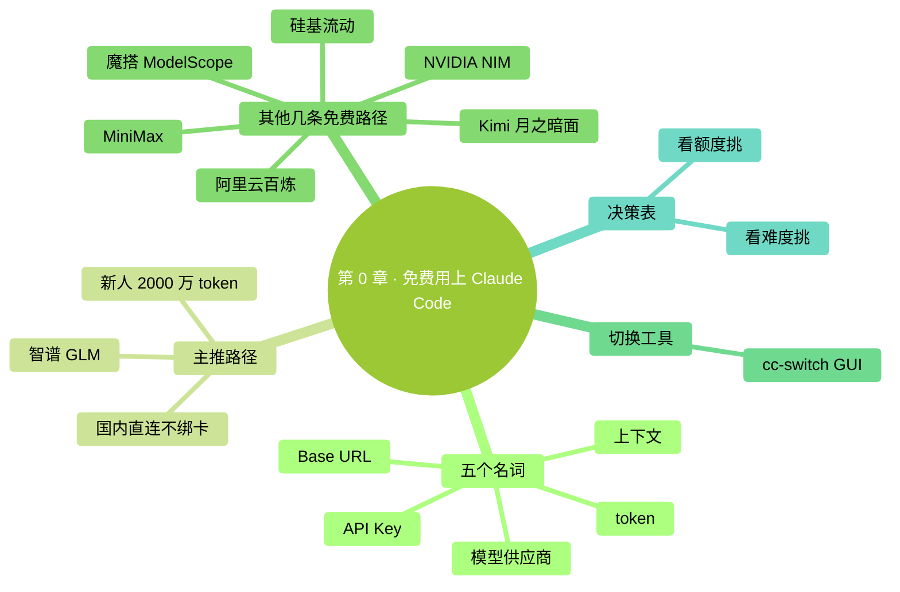

# 第 0 章：先告诉你怎么免费用上 Claude Code

> **本章在全书的位置**：第 0 章（前言之后、第 1 章之前） / 预估阅读+动手时长：**主线 30-45 分钟 + 支线 10 分钟**
>
> **学完能做什么（主线）**：从国内一条免费路径领到 API Key，把它配进 Claude Code，跑出第一句"它真的回我了"。整个过程**不绑信用卡、不要海外手机号、不开代理**。

---

## 开场三问

- **你会遇到什么问题**：跟着别的教程把 Claude Code 装好了，最后卡在登录环节——要海外手机号、要 Visa/Master 信用卡、要"翻墙"，三个里有一个搞不定就用不上。
- **不读这章会踩什么坑**：以为自己"装失败了"，删掉重来；或者听信"中转站"卖 Key 的，把钱打过去发现号被封。
- **读完你会多会什么事**：知道 Claude Code **不一定要连 Claude 官方**，国内有好几条**官方且免费**的路可以走，挑最稳的一条三五分钟就能跑通。

⚠️ **本章和第 1 章一样适用"颗粒度最细"原则**——主线主推那一条会一步步写到位，包括"按回车""复制粘贴"这种级别。零基础读者请**逐字跟着做**。

### 本章地图（一眼看全貌）

<!-- diagram: MM-46 -->


---

> 🎯 **【主线】—— 本章必读核心**
>
> 下面 11 节 + 动手任务，让你从"装好但用不上"走到"第一句话回得很顺"。预估 30-45 分钟。

---

## 0.1 五个名词，先认它们

下面五个词全章会反复出现，先 30 秒扫一遍——后面看到不再发懵就行，不用现在记死。

| 名词 | 大白话 |
|------|------|
| **API Key** | 你向某个模型供应商表明身份的一长串字符——像门禁卡。一定要保密，泄露了别人就能用你的额度 |
| **模型供应商** | 提供模型 API 服务的公司——比如智谱、阿里云、Kimi 都是；本章讲的就是怎么在 Claude Code 里换不同的供应商 |
| **Base URL** | API 的地址。Claude Code 默认指向 Anthropic 官方；换供应商就是把这个地址改掉 |
| **上下文** | Claude 一次对话能记住的字数总量。详见第 12 章；本章只要知道"越大越能聊长任务"就行 |
| **token** | 计费单位。粗略 1 个汉字 ≈ 1 token，1 个英文单词 ≈ 1 token。免费额度都是按 token 算的 |

---

## 0.2 为什么这一章放在最前面

Claude Code 装上之后默认连的是 **Claude 官方**——但官方账号有三个国内常见门槛：

- **付费账号需要 Visa/Master 信用卡**（国内借记卡不一定行）
- **手机号验证需要海外手机号**（国内号经常失败）
- **网络得能访问 anthropic.com**（默认在国内访问不稳）

但有一个**很多人不知道的事实**：Claude Code 是 Anthropic 的官方客户端，**它不绑死 Claude 模型**——它走的是叫 "Anthropic Messages API" 的标准协议，**任何提供这套协议的服务商都能当后端**。国内主流的智谱、通义、Kimi、MiniMax 都已经**官方兼容**这套协议——这意味着你换一个 Base URL + 一把 API Key，就能把 Claude Code 接到国内便宜（或者干脆免费）的模型上去。

📌 **一句话总结**：Claude Code 的"皮"是 Anthropic，"芯"可以换。**这一章就是教你怎么换芯，免费跑起来**。

> 💡 **要不要回 Claude 官方？** 当然可以——能拿到信用卡和海外手机号、网络也通，本书后面的章节默认就是 Claude 官方的体验。但**现在不要让这些门槛挡住你**，先用免费方案跑通，把第 1-15 章读完。等你对 Claude Code 上手了再决定要不要"升级"到官方账号。

---

## 0.3 主推路径：智谱 GLM（手把手，Mac / Windows 都给）

我从七八条可选路径里选出**最适合零基础读者**的一条：**智谱 GLM**。理由如下：

- 新用户注册送 **2000 万 token**——这个量按本书第 1-15 章的练习节奏，能用三个月以上
- **官方提供 Anthropic 协议端点**，配置就改两行字，没有协议转换那种弯弯绕
- **国内直连**，不要海外手机号、不开代理
- 智谱（Z.AI）是国内一线大模型公司，平台稳定

下面四步从注册到跑通，**逐字跟着做**。

### 第 1 步：注册智谱开放平台账号（约 3 分钟）

1. 用浏览器打开 [https://bigmodel.cn](https://bigmodel.cn)
2. 点右上角"**注册/登录**"
3. 用国内手机号注册——收验证码、设密码
4. 注册完成后，去**邮箱验证**那一栏，绑定一个邮箱并完成验证

**成功标志**：登录后页面右上角显示你的用户名，左侧能看到"个人中心"。系统会**自动**把 2000 万 token 的体验额度发到你账户里。

> ❓ **没收到额度？** 多数情况是"邮箱没绑定"——回个人中心补一下邮箱验证就发放。

### 第 2 步：创建 API Key（约 1 分钟）

1. 在智谱开放平台，左侧菜单点"**API Keys**"（也叫"密钥管理"）
2. 点"**创建新密钥**"
3. 给它起个名字，比如 `claude-code`，点确定
4. 系统会给你一串以字母+数字组成的长字符串，**点"复制"**——这就是你的 API Key

⚠️ **API Key 只在创建那一刻能看到完整值**。复制完先粘到一个临时记事本里别丢；如果丢了只能重新创建一把。

### 第 3 步：配置 Claude Code（Mac 和 Windows 各自看）

Claude Code 读一份叫 `settings.json` 的配置文件。我们要做的是把"指向智谱"和"用智谱的 Key"写进去。

> 📌 **前提**：你已经按第 2 章装好了 Claude Code。如果还没装，**先去第 2 章把 Claude Code 装上，再回来这一节**。

#### Mac 用户

打开**终端**（不知道终端是啥？翻第 1 章）。在终端里输入：

```bash
mkdir -p ~/.claude
open -e ~/.claude/settings.json
```

第一行是"如果 `~/.claude` 文件夹不存在就建一个"；第二行是"用 Mac 自带的文本编辑（TextEdit）打开这个文件"——文件不存在的话编辑器会提示新建。

把下面这段**整段**粘进去（粘完替换里面 `<粘贴你的智谱 Key>` 那串占位文字）：

```json
{
  "env": {
    "ANTHROPIC_BASE_URL": "https://api.z.ai/api/anthropic",
    "ANTHROPIC_AUTH_TOKEN": "<粘贴你的智谱 Key>",
    "ANTHROPIC_DEFAULT_SONNET_MODEL": "glm-4.7",
    "ANTHROPIC_DEFAULT_OPUS_MODEL": "glm-4.7",
    "ANTHROPIC_DEFAULT_HAIKU_MODEL": "glm-4.5-air"
  }
}
```

按 `Cmd + S` 保存，关掉编辑器。

#### Windows 用户

按 `Win 键`，搜"**记事本**"，打开。然后**文件 → 打开 → 在"文件名"框里直接输入**：

```
%USERPROFILE%\.claude\settings.json
```

文件不存在记事本会问你要不要新建——选**新建**。

把上面那段 JSON **整段**粘进去（同样替换 Key 占位）。`Ctrl + S` 保存，关掉记事本。

> 💡 **`~/` 和 `%USERPROFILE%` 是什么？** 它们都代表"你自己的用户文件夹"，Mac 上是 `/Users/你的名字`，Windows 上是 `C:\Users\你的名字`。详见第 1 章。

### 第 4 步：启动 Claude Code 验证（约 1 分钟）

**关掉**所有正在跑的 Claude Code 窗口，**重新打开终端**（这一步重要，否则旧的环境变量会留着），输入：

```bash
claude
```

进去后随便问一句：

```
你现在连的是哪个模型？回我一句就行。
```

**预期**：回复会提到"GLM"或"智谱"或"glm-4.7"之类的字眼——说明接通了。

**到这里，你就免费用上 Claude Code 了**。继续往下读第 1 章 / 第 2 章 / 第 3 章，把整本书的练习跑一遍。

---

## 0.4 备选 1：阿里云百炼（DeepSeek V4 / 通义千问）

**适合谁**：希望用国内最大牌云服务商的人；想试 DeepSeek V4 模型的人；做过实名认证的开发者。

**免费额度**：新用户**每个模型独立 100 万 token**，3 个月有效期。覆盖**通义千问全系、DeepSeek 全系、Kimi、MiniMax、智谱 GLM**——也就是说你登录百炼一次能领好几份。

**关键信息**：

| 项 | 值 |
|---|---|
| 注册入口 | [bailian.console.aliyun.com](https://bailian.console.aliyun.com) |
| Anthropic 端点 | `https://dashscope.aliyuncs.com/apps/anthropic` |
| 推荐模型（编程） | `deepseek-v4-flash`（默认就 1M 上下文，无需后缀） |
| 备用推荐 | `qwen3-coder-plus`（通义官方主推） |

**坑提醒**：网上有教程让你在模型名后加 `[1m]` 后缀（比如 `deepseek-v4-flash[1m]`）开 1M 上下文——**这是错的**。百炼上的 V4 模型默认就是 1M 上下文，**模型名里别加方括号**，加了反而报"模型不存在"。

**详细步骤**：参见 **附录 K · K.4 节**（以 GLM 为例的完整流程），**百炼把 K.4 里的 BASE_URL 和模型名换成上表的值即可**。

---

## 0.5 备选 2：魔搭社区 ModelScope（每天 2000 次免费调用）

**适合谁**：每天用得不多（开发学习、偶尔问问），不想为了几个 token 注册一堆账号的人。阿里达摩院旗下的开源模型社区。

**免费额度**：登录就送，**每日 2000 次 API 调用**——按调用次数算，不按 token。注意单个模型还有独立上限：DeepSeek-R1 推理版每天 200 次、Qwen3-Coder 每天 500 次，其他不少模型 2000 次共享池。

**关键信息**：

| 项 | 值 |
|---|---|
| 注册入口 | [modelscope.cn](https://modelscope.cn) |
| 接口风格 | OpenAI 兼容（**不是** Anthropic 直接兼容） |
| 推荐模型 | `deepseek-ai/DeepSeek-V4-Flash`、`Qwen/Qwen3-Coder` |

**重要提醒**：魔搭的接口是 **OpenAI 兼容格式**，Claude Code 默认讲的是 Anthropic 协议。直接接会报错——需要中间放一个**协议转换层**（最常用的是 `claude-code-router`，开源、本地跑）。

**详细步骤**：附录 K 的 **K.6 方案 C** 介绍了 `claude-code-router` 的安装和配置——把里面的目标模型换成魔搭的端点即可。**对零基础读者：先用 0.3 节的智谱方案跑通，等用熟了再来折腾 ModelScope**。

---

## 0.6 备选 3：硅基流动 SiliconFlow（注册送 2000 万 token）

**适合谁**：希望一次拿一大笔免费额度、慢慢花的人；想用 DeepSeek R1/V3 系列（含推理模型）的人。

**免费额度**：注册即送 **2000 万 token**——比智谱那 2000 万还要"无门槛"些（不强制邮箱验证）。

**关键信息**：

| 项 | 值 |
|---|---|
| 注册入口 | [siliconflow.cn](https://siliconflow.cn) |
| 接口风格 | OpenAI 兼容 |
| 推荐模型 | `deepseek-ai/DeepSeek-V3.2`、`Qwen/Qwen3-Coder-480B`、`zai-org/GLM-4.6` |

**重要提醒**：和魔搭一样是 **OpenAI 兼容协议**——直接接 Claude Code 不行，需要 `claude-code-router` 这种转换层。

**详细步骤**：参考附录 K · K.6 方案 C。

---

## 0.7 备选 4：Kimi（月之暗面）

**适合谁**：写中文为主、长文档处理多的人。Kimi 在中文长文场景上口碑很好。

**免费额度**：新用户有**注册 trial credit**（具体金额会变，以官网为准）；不算"白嫖大户"，但够你试用熟悉。月之暗面也有 **Kimi Code Plan** 月度套餐（约 99 元/月）适合后续认真用。

**关键信息**：

| 项 | 值 |
|---|---|
| 注册入口 | [platform.moonshot.cn](https://platform.moonshot.cn)（国内）/ [platform.moonshot.ai](https://platform.moonshot.ai)（国际） |
| Anthropic 端点 | `https://api.moonshot.cn/anthropic` |
| 推荐模型 | `kimi-k2-thinking-turbo`、`kimi-k2-turbo-preview` |

**详细步骤**：附录 K · K.4 + K.5（Kimi 在 K.5 里和 GLM 是同样流程，只换 BASE_URL + Key + 模型名）。

---

## 0.8 备选 5：MiniMax

**适合谁**：想试 MiniMax M2 系列的人。MiniMax 在编程和 agentic（让 AI 自己跑工具链）场景上一直在快速进步。

**免费额度**：新用户有 trial credit；国内做了 **Token Plan** 套餐（同时覆盖文本、语音、图像、视频）。

**关键信息**：

| 项 | 值 |
|---|---|
| 注册入口（国内） | [platform.minimaxi.com](https://platform.minimaxi.com) |
| 注册入口（国际） | [platform.minimax.io](https://platform.minimax.io) |
| Anthropic 端点（国内） | `https://api.minimaxi.com/anthropic` |
| Anthropic 端点（国际） | `https://api.minimax.io/anthropic` |
| 推荐模型 | `MiniMax-M2` |

**详细步骤**：附录 K · K.5。

---

## 0.9 备选 6：NVIDIA NIM（黄大善人的免费桶）

**适合谁**：想试 GLM-5、Kimi K2、MiniMax M2.1 等等十几款模型、不想分别注册的人。

**免费额度**：注册即用，**速率限制约 40 请求/分钟**——不限总量，只限频率。属于"开发学习级"免费——量大商用不行。

**关键信息**：

| 项 | 值 |
|---|---|
| 注册入口 | [build.nvidia.com](https://build.nvidia.com) |
| 接口风格 | OpenAI 兼容（**不是** Anthropic 直连） |
| 国内直连 | ✅ 可以 |
| 推荐模型 | `z-ai/glm4.7`、`moonshotai/kimi-k2`、`minimaxai/minimax-m2.1` |

**重要提醒**：NVIDIA NIM 的**云上免费 API 是 OpenAI 协议**——直接接 Claude Code 不通，需要 `claude-code-router` 或 `LiteLLM` 这类转换层。**注意**：NVIDIA 官方文档里讲的"Claude Code 直连 NIM"是指**自己部署 NIM 服务**的场景，和这里的"云上免费"是两回事。

**详细步骤**：附录 K · K.6 方案 C。**对零基础读者：暂缓**——熟悉智谱那条路之后再来玩。

---

## 0.10 cc-switch：图形化一键切换

注册了几家之后，你早晚会想"今天我用智谱、明天换百炼"——手动改 `settings.json` 累。这时候用 **cc-switch**。

**它是什么**：一个开源的桌面小工具（Mac / Windows 都有），菜单栏挂着一个图标，点一下就能切换 Claude Code 的后端供应商，不用每次手改配置文件。

**核心好处**：

- **预设了 50+ 家供应商**——智谱、百炼、Kimi、MiniMax、ModelScope、SiliconFlow 都在内置预设里，选一下、粘 Key、给个昵称就完事
- **菜单栏点击切换**——不用关 Claude Code、不用改文件
- 支持配额和余额展示（部分供应商）、Codex / OpenCode / Gemini CLI 一并管

**下载地址**：[github.com/farion1231/cc-switch](https://github.com/farion1231/cc-switch) → Releases 页选自己系统的安装包。

⚠️ **网传 `[1m]` 写法是错的**：网上有些 cc-switch 教程让你在模型名后追加 `[1m]` 来开 1M 上下文，**这个写法不被任何主流国产供应商接受**——它是 Anthropic 自家 Claude Code 内部的展示约定（见附录 J），不是模型 ID。**填模型名时不要加方括号**。如果你确实想给 Codex 启 1M 上下文，cc-switch 在"添加供应商"界面有个独立开关，用那个，别动模型名。

**详细步骤**：参见附录 K · K.6 方案 B（cc-switch GUI 切换方案）。

---

## 0.11 我该挑哪条？决策表

零基础读者**直接选第一行**就好——其他几行是给"智谱用了一阵想试别家"的你回头查的。

| 你的情况 | 推荐 | 为什么 |
|---|---|---|
| 完全零基础、想 5 分钟跑通 | **智谱 GLM**（0.3 节） | 2000 万 token 免费、原生 Anthropic 协议、不用代理 |
| 想试 DeepSeek V4 这种当下最火的开源模型 | 阿里云百炼 | DeepSeek V4 Flash 默认 1M 上下文，每模型 100w token |
| 调用次数少、不在意单个模型限额 | 魔搭 ModelScope | 2000 次/天纯免费，但要装 `claude-code-router` |
| 想要一次大额度（2000w token）、慢慢花 | 硅基流动 | 注册即送，但 OpenAI 协议要装转换层 |
| 经常多家来回切 | **+ cc-switch**（0.10 节） | 菜单栏一键切，不用每次改配置 |
| 已能拿到 Visa 卡 + 海外手机号 + 网络通 | 直接用 Claude 官方 | 体验最强、特性最新（见第 2 章默认流程） |

---

## 真实对话示例（接通智谱后的样子）

```
**你**：你现在连的是哪个模型？

Claude：你好！我是基于 GLM-4.7 的助手，由智谱 AI 提供。
有什么可以帮你的？

**你**：帮我建一个文件夹叫 my-first-test

Claude：[请求权限运行 mkdir my-first-test]

**你**：（按 y 同意）

Claude：✅ 已建好。文件夹 my-first-test 在你当前目录里。
要不要我在里面放一个 README.md 占位？
```

注意**完全没有任何"我现在不是 Claude 官方"的违和感**——Claude Code 的交互界面、权限弹窗、`/` 命令、文件操作全都正常。**唯一区别**：回答里偶尔会冒出"GLM"字样——这就是底层模型在说话。

---

## 本章小结

- Claude Code **不绑死 Claude 模型**——换 Base URL + Key 就能接国内供应商
- 国内最稳的零基础免费路径是 **智谱 GLM**（2000 万 token，原生 Anthropic 协议）
- 其他备选按需选：百炼有 DeepSeek V4、魔搭按次免费、硅基流动一次给大额度、Kimi/MiniMax 各有特色
- **`[1m]` 后缀是错的**——国产平台没人吃这个写法
- 嫌手改配置麻烦就用 **cc-switch** 图形化切换
- 备选路径详细步骤都汇总在 **附录 K**

---

## 动手任务

### 任务：拿智谱免费额度跑通你的第一句对话（预估 15-20 分钟）

**步骤**：

1. 打开 [bigmodel.cn](https://bigmodel.cn) 注册账号、绑邮箱
2. 在"API Keys"页创建一把 Key、复制下来
3. 按 0.3 节第 3 步把 `~/.claude/settings.json`（Mac）或 `%USERPROFILE%\.claude\settings.json`（Windows）配好
4. **重新打开**终端、输入 `claude` 启动
5. 问一句"你是谁、用的什么模型？"

**成功标志**：回复里能看到 "GLM" 或 "智谱" 字样。

**失败了怎么办**：

- **报 401 / Authentication failed**：Key 复制不全或多了空格，回控制台再复制一次
- **报 connection refused / unable to connect**：BASE_URL 拼错——比对 0.3 节那段 JSON 一字一字检查
- **回答完全是英文 + 自称 Claude**：环境变量没生效——彻底关 Claude Code 和终端再重开

> 💡 **任务完成后**：把这把 Key 也保存到密码管理器里。它会陪你走完后面 27 章。

---

## 如果你卡住了

**症状 A：注册智谱时短信一直收不到**
- 最可能原因：手机号被用过、运营商屏蔽
- 解决：换个号试；或先用别家——0.4 阿里云百炼通常用阿里云账号秒过

**症状 B：粘进 settings.json 后 Claude Code 启动报错"JSON 解析失败"**
- 最可能原因：JSON 里多了一个逗号、或者 Key 里带了换行符
- 解决：去 [jsonlint.com](https://jsonlint.com) 把整段贴进去校验，提示改哪一行就改哪一行

**症状 C：跟着别的教程在模型名后加了 `[1m]` 结果报"模型不存在"**
- 最可能原因：你看到的就是网传那个错教程
- 解决：把 `deepseek-v4-flash[1m]` 改回 `deepseek-v4-flash`——百炼默认就是 1M 上下文，不需要后缀

**症状 D：回答正常但**特别慢**（一句话要等 30 秒）**
- 最可能原因：免费档共享池高峰期排队、或者你选了重型推理模型
- 解决：把 `ANTHROPIC_DEFAULT_SONNET_MODEL` 从 `glm-4.7` 换成更轻量的 `glm-4.5-air`；或换时段

**还是不行？** → 翻**附录 G 报错自救手册** + **附录 K 第三方模型接入**详解。

---

> 🌿 **【支线】—— 可选深入（学有余力再看）**
>
> 下面一节讲"免费方案能撑多久"和"什么时候该升级到付费"。第一遍读完全可以跳过。

---

## 🌿 支线 0.A：免费额度撑得住一本书的练习吗

> 这段讲什么：每条免费路径**到底够你做多少事**，以及什么时候你会"不够用"。
> 什么时候回头读：用了一两周开始好奇额度还剩多少时。

按本书的练习节奏粗略估算（一次完整对话 + 一两次工具调用约 2000-5000 token）：

| 路径 | 免费额度 | 大致能做的事 |
|---|---|---|
| 智谱 GLM | 2000 万 token / 3 个月 | **本书第 1-15 章全部练习 + 自己玩两周**，富裕 |
| 阿里云百炼 | 100 万 token / 模型 / 3 个月 | 单模型够第 1-5 章；想长期用就多领几个模型 |
| 魔搭 ModelScope | 2000 次/天 | 偶尔问问够；不适合长任务 |
| 硅基流动 | 2000 万 token（一次性） | 类似智谱，但花完就要充钱 |

**什么时候你会用完免费额度**：

- 开了**自动接受模式**让 Claude Code 跑长任务（一次几十万 token 砍出去）
- 反复用 Opus 这种最重模型来做小事（高级模型 token 计费更狠）
- 对着同一个文件改改改改——每次都把全文塞进上下文

**省着花的小技巧**：

1. **小事用小模型**——本书 0.3 节配的 `glm-4.5-air` 比 `glm-4.7` 便宜数倍，问答级任务用它够了
2. **及时 `/clear`**——不需要的对话上下文清掉，下一句不带累赘
3. **用计划模式（第 9 章）**——先让它出方案再动手，避免改了又退

> 用完了之后怎么办？一是去**别家**领新一份免费（同一家不能反复领，但供应商有 N 家）；二是开始考虑**官方 Claude 账号**或者智谱/Kimi/MiniMax 的**月度 Coding Plan** 套餐（约 ¥20-99/月）。本书后面所有讲"成本"的章节（特别是第 15 章）会让你判断这笔钱值不值。

---

主线到这里结束。下一章我们正式开始动手：**先把电脑准备好**——打开终端、看懂提示符、用基础命令在文件夹间穿梭。

---

<!-- chapter-nav -->

📖  [← 前言 · 本书怎么读](./00-本书怎么读.md)  ·  [📑 返回目录](../../README.md)  ·  [第 1 章 · 先把电脑准备好 →](../part1-从零起步/01-先把电脑准备好.md)
