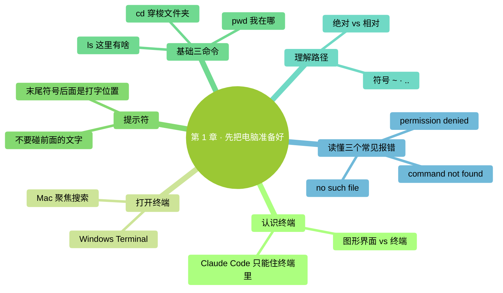

# 第 1 章：先把电脑准备好

> **本章在全书的位置**：第一部分 · 第 1 章 / 预估阅读+动手时长：**主线 40-50 分钟 + 支线 15-20 分钟**
>
> **学完能做什么（主线）**：独立打开终端、看懂提示符、用 `pwd` / `ls` / `cd` 在文件夹间穿梭、理解"路径"、读懂三个常见报错。这些是后面所有章节的前提。

---

## 开场三问

- **你会遇到什么问题**：下一章就要用终端装 Claude Code——连终端都没打开过的话，那一章会变噩梦。
- **不读这章会踩什么坑**：看到 `$` `%` `>` 这些符号不知道干什么；看到"请 cd 到你的工作文件夹"手足无措；看到 `command not found` 慌。
- **读完你会多会什么事**：像切换微信和浏览器那样自然地在终端里进出文件夹、看看里面有啥。

⚠️ **本章适用"颗粒度最细"原则**——主线每一步都会写出来，包括"按回车"这种级别。真零基础请**逐字跟着做**。

### 本章地图（一眼看全貌）

<!-- diagram: MM-07 -->


---

> 🎯 **【主线】—— 本章必读核心**
>
> 下面 6 节 + 动手任务，让你从"没见过终端"走到"能在终端里自由行走"。预估 40-50 分钟。

---

## 1.1 认识终端

平时你用鼠标点图标、打开微信、用 Word——这叫**图形界面**。图形界面很直观，但有个缺点：**只能做软件作者做好的功能**。

**终端**（terminal）是另一种和电脑打交道的方式——一个**只能打字的窗口**。你在里面一行一行打命令，电脑一条一条回复你。这样你能让电脑干很多图形界面里做不到的事，比如"把这个文件夹里所有 PDF 的文件名前加上今天的日期"、"统计这 30 个表格里'已付款'的条数"——这些事图形界面要么做不了，要么得点几百下。

> 💡 **生活化比喻**：图形界面像外卖 App（菜单有什么你点什么），终端像直接跟后厨说话（你说啥他给你做啥）。Claude Code 就是后厨里那位能听懂你自然语言的大厨——**所以它只能住在终端里**。不学会打开终端，就没法用 Claude Code。

**好消息**：本书**只需要你学 5-6 个最基础的命令**，就能走完所有章节。你不需要成为命令行专家。

**两个平台的终端叫什么名字**：

| 平台 | 名字 | 里面跑什么 |
|------|-----|----------|
| **Mac** | 终端（Terminal），系统自带 | 新系统用 zsh，老系统用 bash（对用户没区别） |
| **Windows** | **Windows Terminal**（新版系统），或直接用 **PowerShell**（老版系统） | 都跑 PowerShell 命令语言 |

两个平台的终端外观不同、少数命令有差异，但**概念完全一样**。本书涉及平台差异时会分段讲。

## 1.2 打开你的终端

### Mac 用户

**步骤 1**：按住 `Command` 键（⌘，空格键左边），再按**空格键**。

**你会看到**：屏幕中央弹出一个搜索框。这是 **聚焦搜索**（Spotlight）——Mac 自带的快速搜索工具。

**步骤 2**：搜索框里打"**终端**"或英文 `Terminal`。

**步骤 3**：按**回车键**。

**你会看到**：弹出一个窗口——通常白色底黑色字（也可能反过来，看系统主题）。第一行类似：

```
Last login: Sat Apr 19 14:32:10 on ttys000
你的名字@你的电脑名字 ~ %
```

👆 **这就是终端**。末尾那个 `%` 符号（或 `$`，看系统版本）后面有一个闪烁的光标——它在等你打字。

💡 **还有别的打开方式 / 想把图标固定到 Dock**？见本章末尾 🌿 支线 1.A。

### Windows 用户

Windows 要先分清自己的版本。按 `Windows 键 + R`，弹出"运行"小窗口，打 `winver` 回车——会弹窗告诉你 Windows 版本。

**步骤 1**：按键盘左下角的 **Windows 键**（有 Windows 图标那个键），或点屏幕左下角的开始按钮。

**步骤 2**：
- **Win11 / 新版 Win10**：打 `terminal` 或 `终端`
- **老版 Win10**（搜不到 terminal）：打 `powershell`

**步骤 3**：点击搜索结果里的 **Windows Terminal**（或 **Windows PowerShell**）。

**你会看到**：弹出一个深蓝或黑色窗口，内容类似：

```
PS C:\Users\你的名字>
```

👆 前面 `PS` 是 **PowerShell** 的缩写。末尾的 `>` 是提示符。

📌 **本书后面所有 Windows 操作都在 PowerShell 里进行**（不管是 Windows Terminal 里的 PowerShell 还是直接打开的 PowerShell）。

⚠️ **千万别用"命令提示符"（cmd.exe）**：Windows 还有一个更老的终端叫"命令提示符"，标题栏写"命令提示符"或"cmd"。它的命令和 PowerShell 不一样，**本书不覆盖**。如果你不小心开了它，关掉重新开 PowerShell 或 Windows Terminal。

## 1.3 第一次使用：看懂提示符，输入 `pwd`

### 认识提示符

打开终端后，每一行末尾都有一段类似这样的文字——**提示符**（prompt）：

- **Mac（新系统）**：`你的名字@你的电脑 ~ %`
- **Mac（老系统）**：`你的名字@你的电脑 ~ $`
- **Windows PowerShell**：`PS C:\Users\你的名字>`

提示符告诉你"**轮到你打字了**"。

📌 **关键就一条**：**末尾那个符号**（`%` 或 `$` 或 `>`）**后面的光标位置，就是你该打字的地方**。不要打到前面的文字里去，也不要动前面已经显示的内容。

💡 **想知道提示符每一段分别是什么意思**？见 🌿 支线 1.C。

### 输入你的第一个命令：`pwd`

**步骤 1**：确认光标在提示符后面闪。
**步骤 2**：一个字一个字打 `pwd`（全小写）。
**步骤 3**：按**回车键**。

**你会看到**：

- Mac 显示：`/Users/你的名字`
- Windows 显示：`C:\Users\你的名字`

### 这是什么意思

`pwd` 是 "**print working directory**" 的缩写，意思是 **"打印当前所在文件夹"**。

终端刚打开时默认把你放在 **家目录**（home directory）里——也就是 `/Users/你的名字`（Mac）或 `C:\Users\你的名字`（Windows）。你的桌面、下载、文档都在家目录下面。

> 💡 **为什么一上来就要知道"我在哪"**：你后面所有命令都是**相对于当前位置**起作用的。"列出这里的文件"的"这里"就是 `pwd` 返回的那个地方。每次做事前打一下 `pwd` 确认位置，是个好习惯。

## 1.4 在文件夹间穿梭：`ls` 和 `cd`

这两个命令一起用——`ls` 看当前文件夹里有什么，`cd` 进入/离开文件夹。

### `ls` ——列出当前文件夹里的东西

打 `ls`，按回车。

**Mac 你会看到**（一行或几行简洁列表）：

```
Desktop    Documents    Downloads    Music    Pictures    ...
```

**Windows PowerShell 你会看到**（带列的表格）：

```
Mode    LastWriteTime    Length    Name
d-----  2026/4/10 14:00            Desktop
d-----  2026/4/10 14:00            Documents
```

> 左边 `Mode` 列里有 `d` 就是**文件夹**，没 `d` 就是文件。

`ls` 是 "**list**"（列出）的缩写。Windows 也可以用 `dir`（效果相同），但**本书统一用 `ls`**，两平台都认。

💡 **想看隐藏文件？想看文件大小？** 见 🌿 支线 1.B。

### `cd` ——进入 / 离开文件夹

`cd` 是 "**change directory**"（切换文件夹）的缩写。三种用法：

**① 进入某个子文件夹**

```
cd Desktop
```

（`cd` 和 `Desktop` 之间**必须有空格**；Mac 大小写敏感，`desktop` 进不去桌面）

按回车后，提示符会变——末尾出现你刚进的文件夹名。再打 `ls` 就是桌面里的东西了。

**② 退回上一层**

```
cd ..
```

（`cd` 和 `..` 之间**有空格**）

`..` 是 **"上一层文件夹"** 的符号，两平台都一样。

**③ 一步回家**

```
cd ~
```

或直接 `cd` 什么都不带。**无论你在哪**，都能一步跳回家目录。

💡 **一次跳好几层 / 路径里有空格怎么办**？见 🌿 支线 1.B。

## 1.5 理解"路径"

`pwd` 返回的 `/Users/你的名字` 或 `C:\Users\你的名字`——这种东西叫 **路径**（path）。

**路径就是文件或文件夹在电脑里的地址写法**。就像"北京市海淀区中关村大街 1 号"是一个地址，`/Users/小明/Desktop/笔记.txt` 也是一个地址，表示"**小明的家目录里、桌面里、叫笔记.txt 的那个文件**"。

### 绝对路径 vs 相对路径

路径有两种写法：

| 类型 | 特征 | 例子 | 什么时候用 |
|------|-----|------|----------|
| **绝对路径** | 从最顶层开始写（Mac 以 `/` 开头，Windows 以 `C:\`）；**不管当前在哪都能找到** | `/Users/小明/Desktop/笔记.txt`、`C:\Users\小明\Desktop\笔记.txt` | 告诉 Claude Code 在哪操作、写自动化脚本时——**更保险** |
| **相对路径** | 从当前位置开始写 | `Desktop/笔记.txt`（相对于家目录）、`../其他` | 手打命令时——**更省力** |

### 三个必须认识的路径符号

这三个符号在路径里经常出现，一定要认识：

| 符号 | 含义 | 例子 |
|-----|-----|-----|
| `~` | **家目录** | `~/Desktop` = 你的桌面（不管当前在哪） |
| `.` | **当前文件夹** | `./笔记.txt` = 当前位置里的笔记.txt |
| `..` | **上一层文件夹** | `../其他文件夹` |

💡 **Mac 和 Windows 路径的所有细节差异 / `~/` 和 `./` 别混淆**——见 🌿 支线 1.C。

## 1.6 收尾：退出终端 + 三个常见报错

### 退出终端

两种方式都行：

1. 打 `exit` 回车 —— 干净退出
2. 直接关窗口（Mac `Cmd + Q` / Windows 点右上角 ×）

终端里**没有"未保存的修改"**，关窗口不会丢东西。

### 三个最常见的报错——读懂就不慌

#### 报错 1：`command not found`（Mac）/ `不是内部或外部命令`（Windows）

```
zsh: command not found: lss
```

**意思**：你打的这个词终端不认识。**99% 是打错字**。

**怎么办**：对比原命令——少个字母、大小写错、多/少空格，都会这样。

#### 报错 2：`no such file or directory`（Mac）/ `Cannot find path`（Windows）

```
cd: no such file or directory: Desktopp
```

**意思**：你想进的文件/文件夹不存在。

**怎么办**：
1. 先 `pwd` 确认当前位置
2. 再 `ls` 看这里实际有什么
3. 对照拼写——Mac 用户特别检查大小写（`desktop` ≠ `Desktop`）

#### 报错 3：`permission denied`

```
permission denied: /System/somefile
```

**意思**：这地方你没权限动。

**怎么办**：
- **不要急着用 `sudo`** 或其他提权命令——**很多时候是你本来就不该去那个地方**
- 确认你想动的是不是自己的文件（家目录 `~` 下通常都有权限）
- 真遇到需要权限的情况，第 7 章会讲 Claude Code 的权限机制

---

## 本章小结

- **终端**是只能打字的窗口，Claude Code 只能住在里面
- Mac 叫"终端"、Windows 推荐"Windows Terminal + PowerShell"；**不要用 cmd.exe**
- **提示符**末尾符号（`%` / `$` / `>`）后面就是你打字的地方
- **三个基础命令**：`pwd`（我在哪）/ `ls`（这里有啥）/ `cd`（去/回）
- **路径**是文件的地址；绝对路径从根开始、相对路径从当前开始
- **三个符号**：`~`（家）/ `.`（当前）/ `..`（上一层）
- **三个报错**：command not found（打错字）/ no such file（不存在）/ permission denied（没权限）

---

## 动手任务

### 任务 1：打开终端并找到自己（3 分钟）

**步骤**：用你平台的方法打开终端 → `pwd` 回车 → 对照输出。
**成功标志**：终端显示你的家目录路径（`/Users/你的名字` 或 `C:\Users\你的名字`）。
**失败了怎么办**：报 `command not found` 检查是不是打成大写 `PWD` 或多打了空格。

### 任务 2：进桌面看看有啥（5 分钟）

**步骤**：
1. `cd ~/Desktop` 回车
2. 确认提示符变了（末尾出现 `Desktop`）
3. `ls` 回车
4. 在输出里找一个你认识的文件或文件夹名

**成功标志**：在 `ls` 输出里认出至少一个桌面上的东西。
**失败了怎么办**：`cd ~/Desktop` 报 `no such file`，你的桌面可能有别的名字。`cd ~` 回家后 `ls` 看看实际叫什么。

### 任务 3：往下钻两层再回来（5 分钟）

**步骤**：
1. 右键桌面 → 新建一个文件夹叫 `测试`（图形操作没问题）
2. 终端里 `cd ~/Desktop/测试`
3. `pwd` 确认你在 `~/Desktop/测试`
4. `cd ..` 回到桌面
5. `cd ..` 再回到家目录

**成功标志**：提示符一步步变化，最后回到家。

---

## 如果你卡住了

**症状 A：终端打开后是乱码或看不到提示符**
- 原因：主题或字体不对。
- 解决：Mac 点菜单栏"终端 → 偏好设置"选默认主题；Windows Terminal 设置里选 "Campbell" 或 "One Half Dark"。

**症状 B：Windows 打 `ls` 报 `command not found`**
- 原因：极个别老版 PowerShell 不认 `ls`。
- 解决：改用 `dir`，或升级到 PowerShell 7+。

**症状 C：中文文件夹名打不进去**
- 原因：输入法问题。
- 解决：切英文输入法再打；或先 `cd` 进父文件夹 `ls` 看真实名字后复制粘贴。

**还是不行？** → 见附录 G（常见报错自救），或直接 Google 那条英文报错，通常第一条结果就有答案。

---

主线到这里结束。**你已经有了进入第 2 章的所有基础**。下面是 3 条支线，挑你感兴趣的看；第一遍读完全可以跳过，直接去第 2 章。

---

> 🌿 **【支线】—— 可选深入（学有余力再看）**
>
> 本章三条支线分别讲：**打开终端的另一种方式、命令用得更灵活、路径的两个细节坑**。
>
> **不读不影响后续章节**。建议用熟了 Claude Code（比如第 2-5 章做完）再回头。

---

## 🌿 支线 1.A：打开终端的另一种方式，以及把它固定到 Dock / 任务栏

> **这段讲什么**：除了聚焦搜索和开始菜单，还能从访达/开始菜单直接找到终端；以及把它钉在屏幕下方，下次一键打开。
> **什么时候回头读**：你发现自己经常要打开终端、想省点事的时候。

### Mac：从访达找终端

1. 点屏幕顶部左上角**苹果图标** 🍎 → 选"**访达**"
2. 菜单栏点"**前往**" → 选"**应用程序**"
3. 在应用程序里向下滚，找到"**实用工具**"文件夹双击进入
4. 找到"**终端**"，双击打开

和聚焦搜索打开的是**同一个应用**，没有区别。

### Mac：把终端图标固定到 Dock

终端打开后，图标会出现在屏幕底部的 **Dock**（应用栏）上。**右键**这个图标 → 选"**选项**" → 勾选"**在程序坞中保留**"。以后直接点 Dock 上的图标就能开，不用每次搜索。

### Windows：把终端固定到任务栏

Windows Terminal 打开后，图标会出现在屏幕底部的 **任务栏** 上。**右键**这个图标 → 选"**固定到任务栏**"。以后直接点就能开。

---

## 🌿 支线 1.B：命令用得更灵活

> **这段讲什么**：`ls` 看隐藏文件、`cd` 一次跳多层、路径里带空格怎么办。
> **什么时候回头读**：装 Claude Code 时看到 `.claude/` 这种以 `.` 开头的文件夹；或遇到空格路径报错时。

### 看到隐藏文件：`ls -a` / `ls -Force`

默认 `ls` 不显示以 `.` 开头的"隐藏文件"——它们通常是系统或工具的配置文件，平时不显示避免干扰。

- **Mac**：`ls -a`（`-a` 是 "**all**"——全部）
- **Windows PowerShell**：`ls -Force`

会看到一些原来看不见的东西：`.zshrc`（Mac 终端配置）、`.claude/`（Claude Code 的项目配置目录，**本书后面会用到**）、`.git/`（git 版本控制）等。

### 一次跳好几层：`cd 多层/路径`

不用一层一层 `cd`，可以写一个多层路径一步跳到：

```
cd Documents/工作/2026
```

等于先进 `Documents`、再进 `工作`、再进 `2026`，三步合一。

**绝对路径也行**：

```
cd /Users/小明/Desktop/练习       # Mac
cd C:/Users/小明/Desktop/练习      # Windows（PowerShell 也认 `/`）
```

### 路径里有空格：加双引号

文件夹名有空格时，**必须用双引号包起来**，不然空格会被当成命令分隔符报错：

```
cd "My Documents/Work Stuff"
```

**错误示范**：`cd My Documents`——终端会以为你想进一个叫 `My` 的文件夹，然后报错"no such file"。

---

## 🌿 支线 1.C：路径的两个细节坑

> **这段讲什么**：Mac vs Windows 路径系统的完整差异，以及一个最常被混淆的写法——`~/Desktop` 和 `./Desktop` 是完全不同的东西。
> **什么时候回头读**：同时用两种电脑时；或混用 `~/` 和 `./` 导致报错时。

### Mac 和 Windows 路径系统的完整对比

| 维度 | Mac | Windows |
|-----|-----|---------|
| 分隔符 | `/`（正斜杠） | `\`（反斜杠）**或** `/`（PowerShell 两个都认） |
| 家目录位置 | `/Users/你的名字` | `C:\Users\你的名字` |
| 家目录缩写 | `~` | `~` 或 `$HOME` |
| **路径大小写** | 常见默认不区分，也可配置区分 | 常见默认不区分，存在例外 |
| 盘符 | 没有——所有东西在 `/` 下 | 有（`C:\`、`D:\`、`E:\`） |
| 根目录 | `/`（唯一一个） | 每个盘符都有自己的根 |

⚠️ **大小写规则取决于文件系统设置**。Mac 常见默认磁盘不区分大小写，也可以使用区分大小写的格式；Windows 也有例外。练习时一律按实际文件名的大小写输入，避免跨机器后找不到路径。

📌 **本书写命令时统一用 `/`** 做分隔符——Mac 必须用、Windows PowerShell 也认，这样一套命令两平台都能跑。

### `~/Desktop` 和 `./Desktop` 别混淆

两个路径写法看起来像，含义差远了：

| 写法 | 含义 | 找得到 |
|------|-----|-------|
| `~/Desktop` | **家目录下**的 Desktop | 无论当前在哪都能找到 |
| `./Desktop` | **当前文件夹下**的 Desktop | 看当前文件夹里是否真有 |

**举例**：

```
# 你现在在 ~/Documents
pwd                  # 显示：/Users/你/Documents
cd ~/Desktop         # ✅ 成功——跳到 /Users/你/Desktop
cd ./Desktop         # ❌ 报错——Documents 里没有叫 Desktop 的子文件夹
```

📌 **记法**：`~` 是"**家**"，`.` 是"**这里**"。"回家"和"去这里"明显不一样。

---

好了，第 1 章到这里。**进入第 2 章——装 Claude Code**。

<!-- studio:nav -->
← [第 0 章：先选好账号与费用路径](../00-%E5%89%8D%E8%A8%80/01-%E5%85%8D%E8%B4%B9%E7%94%A8%E4%B8%8AClaude-Code.md) · [目录](../../README.md) · [第 2 章：安装 Claude Code](02-%E5%AE%89%E8%A3%85-Claude-Code.md) →
<!-- /studio:nav -->
