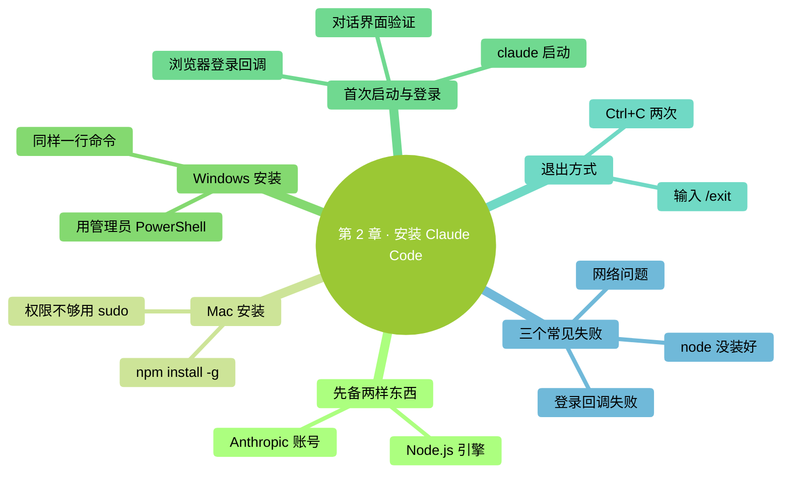

# 第 2 章：安装 Claude Code

> **本章在全书的位置**：第一部分 · 第 2 章 / 预估阅读+动手时长：**主线 30-40 分钟 + 支线 10-15 分钟**
>
> **前置章节**：**必须先完成第 1 章**——下面每一步都要在终端里操作。
>
> **学完能做什么（主线）**：你的电脑上已经装好 Claude Code，能用 `claude` 命令启动它，能登录自己的账号并看到它回话。

---

## 开场三问

- **你会遇到什么问题**：装不上、装上了但启动失败、账号登录一直转圈——这三类坑是新手装 Claude Code 最常见的。
- **不读这章会踩什么坑**：直接按网上教程敲命令，遇到报错不知道什么原因；装了一半放弃。
- **读完你会多会什么事**：能独立走完安装和登录的完整流程，遇到失败能判断是哪一步出问题。

### 本章地图（一眼看全貌）

<!-- diagram: MM-09 -->


---

> 🎯 **【主线】—— 本章必读核心**
>
> 下面 5 节 + 动手任务，走完你就能启动 Claude Code 了。预估 30-40 分钟。

---

## 2.1 装之前：两件事要先备好

装 Claude Code 之前，你需要**两样东西**准备好。我们先解释这两样是什么、为什么需要。

### ① 一个 Anthropic 账号

Anthropic 是做 Claude 的公司。**Claude Code 需要登录 Anthropic 账号才能用**——因为它每次对话都要把你说的话发到 Anthropic 的服务器，服务器处理完再返回，这就需要知道"是你在用"。

**注册方式**：浏览器打开 `https://claude.ai` → 点 "Sign up" → 用邮箱注册。如果你之前用过 Claude 的网页版、订阅过 Claude Pro/Max，那个账号就能直接用。

**付费问题的简短版**：Claude Code 有免费额度（对轻度使用够用），想用更多就订阅或者按 API 计费。新手先用免费额度试，**不会产生扣费**。深入的成本问题第 15 章专讲。

### ② Node.js（一个叫 "node" 的东西）

Claude Code 是一个**用 JavaScript 写的命令行程序**——JavaScript 这种程序在电脑上跑起来，需要一个叫 **Node.js**（或简称 node）的"引擎"。就像 Word 文档要 Word 打开、PDF 要 Acrobat 打开一样，JavaScript 程序要 Node.js 打开。

> 💡 **不用搞懂 Node.js 是啥**，只要知道它是"Claude Code 运行所需的引擎"。装一次就能一直用。

**怎么知道自己电脑有没有装 Node.js**？

打开终端（见第 1 章 1.2 节），输入：

```
node -v
```

按回车。

- **已经装了**：会显示类似 `v20.11.0` 的版本号——**版本号 18 或更高都可以**，跳到 2.2 节
- **没装**：会报 `command not found`（Mac）或 `不是内部或外部命令`（Windows）——需要先装 Node.js

**怎么装 Node.js**：浏览器打开 [nodejs.org](https://nodejs.org)，点**左边绿色的 "LTS" 按钮**（LTS = "长期支持版"，最稳定）下载安装包。下载完双击安装，一路点"下一步/继续"即可。

装完**关掉终端重新打开**（让新装的 node 生效），再打一次 `node -v`，看到版本号就说明成功了。

## 2.2 Mac 上安装 Claude Code

准备好 Node.js 和账号后，装 Claude Code 本体就很简单——**一行命令**。

### 安装

打开终端，输入：

```
npm install -g @anthropic-ai/claude-code
```

按回车。

**这行命令在做什么**：
- `npm` 是 Node.js 自带的"应用商店"（Node Package Manager，节点包管理器）
- `install` = 安装
- `-g` = global（全局），意思是装到全电脑都能用的位置，而不是只装到当前文件夹
- `@anthropic-ai/claude-code` = 要装的东西的名字

**你会看到**：终端里刷一串文字，可能会有一些黄色或绿色的进度条。这**正常**，说明它在下载。等它跑完——最后一行通常是 `added XXX packages in XXs` 之类。**时间约 30 秒到 2 分钟**，看网速。

### 可能遇到的权限问题

如果跑完后看到 `permission denied`（权限被拒绝），说明 `-g` 全局安装需要管理员权限。改用：

```
sudo npm install -g @anthropic-ai/claude-code
```

`sudo` = super user do（以管理员身份做），会弹出让你输 Mac 登录密码。**输入时屏幕上不会显示任何字符**（连 `*` 都不显示），这是故意的，正常打完密码回车就行。

## 2.3 Windows 上安装 Claude Code

同样一行命令，在 PowerShell 里：

```
npm install -g @anthropic-ai/claude-code
```

按回车。

**你会看到**：和 Mac 一样，终端里会刷一串文字显示下载进度。等跑完。

### 可能遇到的权限问题

Windows 上如果报权限错误，**不要用 sudo**（Windows 没有这个命令）。改为：

1. 关掉当前 PowerShell 窗口
2. 找到 Windows Terminal 或 PowerShell 的图标
3. **右键** → 选"**以管理员身份运行**"
4. 在新打开的管理员窗口里重新跑 `npm install -g @anthropic-ai/claude-code`

管理员 PowerShell 的标题栏会写"**管理员**"字样，辨认清楚。

## 2.4 登录并验证

装完后，Claude Code 已经在你电脑里了。启动它。

### 启动

在终端（Mac）或 PowerShell（Windows）里随便哪个位置，输入：

```
claude
```

按回车。

**第一次启动时**：Claude Code 会引导你登录 Anthropic 账号。会发生下面的事情：

1. 终端里显示一个欢迎信息和一个**登录链接**（URL）
2. 你的默认浏览器**自动打开**那个链接（或者终端提示你手动复制到浏览器）
3. 浏览器里，登录你的 Anthropic 账号
4. 登录成功后浏览器显示"You can close this window"（可以关闭此窗口）
5. **切回终端**——Claude Code 应该已经显示登录成功，进入对话界面

### Claude Code 界面长什么样

登录后，终端会变成 Claude Code 的对话界面，大致是这样：

```
╭───────────────────────────────────────╮
│ ✻ Welcome to Claude Code              │
│                                       │
│ /help for help, /status for status   │
╰───────────────────────────────────────╯

>
```

最下面那个 `>` 是 Claude Code 的**输入框**（和终端的提示符不是一回事）。光标在它后面闪，等你打话。

### 验证它能工作

打一句话进去：

```
你好，告诉我你能做什么
```

按回车。

**你会看到**：Claude 开始在你的终端里一行一行吐出回复，讲它自己。这就说明**装成功了、登录成功了、能正常用了**。

### 退出

按两次 `Ctrl + C`（同时按 Ctrl 和 C，按两次），或者输入 `/exit` 回车。

> 💡 **之后每次用 Claude Code**，直接在终端里 `cd` 到你的工作文件夹、`claude` 启动就行，不用重新登录（登录信息会保存一段时间）。

## 2.5 装不上？三个最常见的失败

如果上面某一步挂了，大概率是下面三种情况之一。

### 失败 1：`command not found: npm` 或 `command not found: node`

**意思**：Node.js 没装好，或装了但终端没找到。

**怎么办**：
- 确认你从 [nodejs.org](https://nodejs.org) 装的是 **LTS 版本**
- 装完后**彻底关掉终端窗口**（不是新开标签页，是关窗口），重新开终端
- 再试 `node -v` 和 `npm -v`，都应该显示版本号

### 失败 2：`npm install` 卡住不动或报 `network error`

**意思**：网络问题，连不上 npm 的服务器。

**怎么办**：
- 检查网络（能不能打开别的网站）
- 如果在中国大陆，可能需要切换 npm 源到国内镜像。PowerShell 或 Mac 终端里跑：
  ```
  npm config set registry https://registry.npmmirror.com
  ```
  再重新 `npm install -g @anthropic-ai/claude-code`
- 公司网有防火墙的话，问 IT 同事

### 失败 3：登录浏览器页面跳转失败 / 登录完终端没反应

**意思**：登录回调没成功关联回终端。

**怎么办**：
1. 终端里按 `Ctrl + C` 退出 Claude Code
2. 重新 `claude` 启动
3. 登录页面出现时，**注意看终端有没有显示"可以手动粘贴"的选项**——把浏览器登录成功后 URL 里的一段代码复制到终端

如果反复不行，登录官网 [claude.ai](https://claude.ai) 确认网页版自己能登进去（排除账号问题）。

---

## 本章小结

- 装 Claude Code 前要备好**两样**：**Anthropic 账号** + **Node.js 引擎**
- 装命令一行：`npm install -g @anthropic-ai/claude-code`（Mac 可能需要前面加 `sudo`）
- 启动命令：`claude`
- **第一次启动会自动引导浏览器登录**，登完切回终端
- 退出按 `Ctrl + C` 两次或 `/exit`
- **三个最常见失败**：Node.js 没装好、网络问题、登录回调失败

---

## 动手任务

### 任务 1：检查或安装 Node.js（5-10 分钟）

**步骤**：
1. 打开终端，输入 `node -v`
2. 看到版本号（18+）→ 跳过本任务
3. 报错 → 去 [nodejs.org](https://nodejs.org) 下 LTS 版本安装
4. 装完**关掉终端重开**，再 `node -v` 确认

**成功标志**：`node -v` 显示 `v18.x.x` 或更高。

### 任务 2：安装 Claude Code（2-5 分钟，看网速）

**步骤**：
1. 终端里跑 `npm install -g @anthropic-ai/claude-code`（报权限错误就 Mac 加 `sudo`、Windows 用管理员窗口重跑）
2. 等它跑完，看到 `added ... packages`

**成功标志**：无报错、最后一行显示成功安装。

### 任务 3：启动并发第一条消息（3-5 分钟）

**步骤**：
1. 终端里 `claude` 回车
2. 按提示完成浏览器登录
3. 回到终端，在 `>` 后面打 `你好` 回车
4. 看 Claude 回你话

**成功标志**：Claude 给出一段中文回复。做到这一步，你已经**成功用上 Claude Code**了 🎉

### 任务 4：干净退出（1 分钟）

**步骤**：按两次 `Ctrl + C`，或打 `/exit` 回车。

**成功标志**：回到你原来的终端提示符（`%` 或 `>`）。

---

## 如果你卡住了

**症状 A：`npm install` 跑到一半红字报一堆东西**
- 最可能原因：权限不够（Mac）或网络（两平台都可能）
- 解决：参考 2.5 节对应的失败 1 / 2

**症状 B：浏览器打开登录页后点同意但终端一直转圈**
- 最可能原因：登录回调没收到
- 解决：`Ctrl + C` 退出，重新 `claude`，看有没有手动粘贴代码的选项

**症状 C：打 `claude` 报 `command not found`，但 `npm install` 明明跑成功了**
- 最可能原因：npm 的全局安装路径没加进终端的"搜索路径"
- 解决：关掉终端重开；如果还不行，Google 搜 "npm global path not in PATH" + 你的系统名字

**还是不行？** → 见附录 G（常见报错自救），或查官方安装文档 [code.claude.com/docs](https://code.claude.com/docs)。

---

主线到这里结束。你的电脑上已经装好 Claude Code 了。下面两条支线讲计费/隐私的快问快答，以及除了 npm 之外的其他安装方式，想了解可以看看。

---

> 🌿 **【支线】—— 可选深入（学有余力再看）**

---

## 🌿 支线 2.A：计费和隐私——几个最关心的问题（简答版）

> **这段讲什么**：你现在最容易担心的几个问题的简短回答。
> **什么时候回头读**：装完开始用时脑子里冒出"这玩意儿会乱扣费吗 / 我的文件会不会被偷看"就回来看这段。深入的版本分别见第 11 章（隐私）和第 15 章（成本）。

**Q: 用 Claude Code 会不会乱扣我钱？**
A: 不会。免费额度用完它会提示你，不会偷偷扣。订阅了 Claude Pro/Max 的按套餐扣，用 API key 的按 token 扣——两种模式你都能看到明细。

**Q: 我打进去的话、让它看的文件，会被 Anthropic 偷看/用来训练模型吗？**
A: **不会用来训练模型**（Anthropic 官方承诺）。**会短暂存在服务器上用来响应你**，30 天后删除。传输全程加密。

**Q: 那 Anthropic 员工理论上能看到吗？**
A: 技术上有访问控制，但不是绝对不可能（极少数 abuse 检测场景）。**如果你的文件特别敏感（含银行卡、密码、未公开的机密），不要用 Claude Code 处理**。

**Q: 公司电脑上能用吗？**
A: 得看你公司政策。有些公司禁止用云端 AI 工具处理公司代码/数据。用之前问一下 IT。

更深入的版本见**第 11 章**（数据流与隐私）和**第 15 章**（模型与成本）。

---

## 🌿 支线 2.B：除了 npm 还有别的装法

> **这段讲什么**：Mac 的 Homebrew、Windows 的 winget、或者用 pnpm 等替代方式。
> **什么时候回头读**：你已经在用 Homebrew / winget / pnpm 管理其他工具，想统一。

### Mac：用 Homebrew

如果你已经装了 Homebrew（Mac 上的另一个"应用商店"），可以：

```
brew install anthropic/tap/claude-code
```

好处：Homebrew 会自动处理路径、升级更方便（`brew upgrade`）。

### Windows：用 winget

Windows 11 自带 winget（Windows 包管理器）：

```
winget install Anthropic.ClaudeCode
```

（命令名以官方最新为准，查 [code.claude.com/docs](https://code.claude.com/docs)）

### 其他 Node.js 包管理器

如果你用 `pnpm` 或 `yarn` 而不是 `npm`，对应命令：

```
pnpm install -g @anthropic-ai/claude-code
yarn global add @anthropic-ai/claude-code
```

效果一样。

⚠️ **不要同时用多种方式装**——会混乱。选一种坚持用。

---

装好了。下一章开始用——**你的第一次对话**。


---

<!-- chapter-nav -->

📖  [← 第 1 章 · 先把电脑准备好](01-先把电脑准备好.md)  ·  [📑 返回目录](../../README.md)  ·  [第 3 章 · 你的第一次对话 →](03-你的第一次对话.md)
