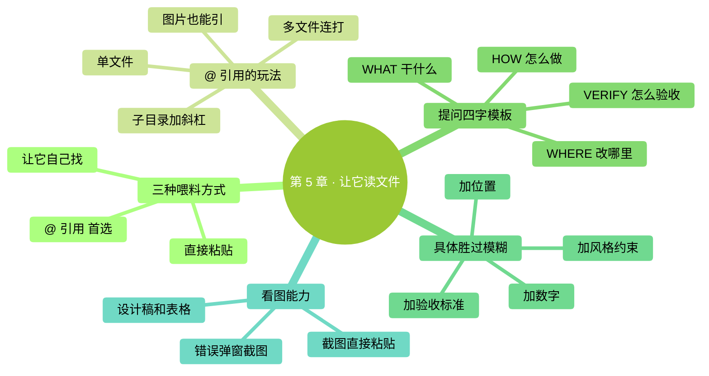

# 第 5 章：让它读文件

> **本章在全书的位置**：第二部分 · 第 5 章 / 预估阅读+动手时长：**主线 30-40 分钟 + 支线 10-15 分钟**
>
> **前置章节**：第 3 章（会启动和对话）
>
> **学完能做什么（主线）**：能用 `@` 引用让 Claude 精准读到你想让它看的文件、会用"WHAT/WHERE/HOW/VERIFY"模板提出清晰指令、让它看懂截图和多文件。

---

## 开场三问

- **你会遇到什么问题**：你让 Claude 做事，它做出来的不是你要的——十有八九是**你没让它"看到"你真正想让它处理的东西**。
- **不读这章会踩什么坑**：每次都要把文件内容复制粘贴到对话里（上下文爆炸）；问得模糊，Claude 瞎猜、结果不对。
- **读完你会多会什么事**：能精准让它读指定文件、用结构化模板问清楚需求、让它看图片和截图。

### 本章地图（一眼看全貌）

<!-- diagram: MM-12 -->


---

> 🎯 **【主线】—— 本章必读核心**

---

## 5.1 让 Claude "看到"内容的三种方式

要 Claude 处理什么，它得先"看到"。有三种方式：

| 方式 | 怎么用 | 适合什么场景 |
|------|-------|-----------|
| **① `@` 引用** | 输入框打 `@文件名` | 处理特定文件——**首选** |
| **② 直接粘贴** | Ctrl+V / Cmd+V 把内容贴进对话 | 短文本片段、从浏览器复制的一段话 |
| **③ 让它自己找** | "看看当前文件夹里有啥" | 你不确定要处理哪个文件，让它先探查 |

📌 **最重要的是掌握方式 ①**——它是 Claude Code 和 ChatGPT 的最大差异之一。

## 5.2 `@` 引用的具体用法

`@` 是 Claude Code 的"**精确指路**"符号。在输入框里打 `@`，会弹出一个**自动补全菜单**列出当前文件夹里的文件，用方向键选或者继续打字过滤。

### 单文件

```
@笔记.txt 总结一下这份内容
```

Claude 会先读 `笔记.txt`，再按你要求总结。

### 子文件夹里的文件

```
@Documents/周报.md 帮我改一下这份周报的语气
```

路径可以带子目录。

### 一个文件夹（让它看这里所有文件）

```
@会议纪要/ 里面每份笔记分别抓一个关键点
```

`@文件夹名/` 末尾带斜杠，Claude 会把这个文件夹里的文件都扫一遍。

> ⚠️ **大文件夹慎用**：如果里面有几十上百个文件，一次扫完**会消耗大量上下文**（下一章概念"上下文"详讲）。精准到具体文件比"扫一个文件夹"更好。

### 多个文件一起引

```
@第一章.md @第二章.md 把这两章合并成一份摘要
```

连续打几个 `@` 没问题。

### 图片（Mac 和 Windows 都行）

```
@设计稿.png 看这张图，帮我把布局描述成文字
```

Claude 能"看"截图、设计稿、流程图。这是个**很被低估**的能力。

💡 **让它看当前文件夹结构而不读具体内容** → 见 🌿 支线 5.A。

## 5.3 提问的"WHAT / WHERE / HOW / VERIFY"模板

新手最常见的毛病：**问得太笼统**。看两个例子：

### 模糊版 ❌

```
你：@周报.md 帮我改一下这份周报
```

Claude 会猜：你想改语气？改错别字？加内容？删内容？——猜中算你走运，猜偏你得反复纠正。

### 清晰版 ✅

```
你：@周报.md 
- WHAT: 把这份周报的语气从"严肃正式"改成"轻松简洁"
- WHERE: 只改正文部分，不动标题和日期
- HOW: 长句拆短；去掉"兹此"、"特此"之类的官话
- VERIFY: 改完后字数不超过 500 字，看起来像朋友之间汇报进度
```

Claude 一次就能做对。

### 模板解释

| 字段 | 含义 | 作用 |
|-----|------|-----|
| **WHAT** | 要干什么 | 定义目标 |
| **WHERE** | 改哪里 / 限制范围 | 防止它乱动 |
| **HOW** | 具体做法、风格 | 统一审美 |
| **VERIFY** | 怎么验证做对了 | 给出可检查的成果标准 |

> 💡 **不一定每次都要写这四项**——简单任务一句话就行（"把文件名里的空格换成下划线"）。但**任务越复杂，越要用这个模板**。

## 5.4 为什么"具体"永远比"模糊"好

再看两组对比：

### 整理文件

**模糊**：`帮我整理一下下载文件夹`
**具体**：`@Downloads/ 把里面的 PDF 按文件名里的年份分到 2024/、2025/、2026/ 三个子文件夹；没有年份的放到"待分类/"`

### 写东西

**模糊**：`帮我写个文案`
**具体**：`写一段 80 字朋友圈文案，宣传明天下午 3 点的免费书法公开课。风格亲切、口语化，带一个 call-to-action（比如"扫码预约"），不要用表情符号`

### 调代码

**模糊**：`帮我看看这代码哪里不对`
**具体**：`@app.py 运行到第 42 行 toggle_dark_mode 函数时报 AttributeError。帮我定位原因，给修改建议，但先不改——我要先看方案`

**规律**：
- **加数字**（80 字、3 点）
- **加位置**（第 42 行、哪个文件夹）
- **加风格约束**（亲切、不要表情）
- **加验收标准**（带 CTA、不要改动，先看方案）

每多一个具体限制，Claude 输出的"中签率"就高一截。

## 5.5 让它看图片：截图是你的好朋友

Claude 能**看懂图片**——截图、设计稿、手绘流程图、表格截图、错误界面……这个能力特别适合：

- **贴个错误弹窗截图**：`@error.png 这个报错是什么意思？怎么解决？`
- **贴个设计稿让它生成文字描述**：`@mockup.png 这个登录页要什么元素？给我列出来`
- **贴张手绘思维导图**：`@脑图.jpg 帮我把这张图整理成结构化大纲`
- **贴 Excel 截图让它分析**：`@sales.png 这张销售表里哪个季度最好？`

### 怎么把截图放进去

**方式 A（推荐，最快）**：在对话里**直接粘贴**——截图（Mac `Cmd+Shift+4` / Windows `Win+Shift+S`）截好后直接 `Cmd+V` / `Ctrl+V`，Claude Code 会把图片贴进对话。

**方式 B**：把图片文件保存到工作文件夹，然后 `@图片名.png` 引用。

**方式 C**：拖拽图片文件到 Claude Code 的终端窗口（某些终端支持）。

> 💡 **对零基础用户特别有用**：很多场景"用文字描述好累"——**截个图最快**。比如遇到奇怪的报错、想让它帮看看 Excel 某一列、想参考某个设计稿……

---

## 本章小结

- `@` 引用是**让 Claude 精准看到内容**的最重要方式（单文件、文件夹、图片都能引）
- **WHAT / WHERE / HOW / VERIFY** 四字提问模板——任务越复杂越要用
- **具体**永远比"模糊"好：加数字、加位置、加风格、加验收
- 图片截图直接粘贴进对话，Claude 能看懂——很多场景比文字描述快 10 倍

---

## 动手任务

### 任务 1：用 @ 引用读并总结（5 分钟）

**步骤**：
1. 进 `ccguide-练习` 文件夹，`claude` 启动
2. 输入 `@笔记.txt 用 3 条要点概括这份内容`，回车
3. 看结果

**成功标志**：Claude 输出的 3 条要点和文件内容对得上。

### 任务 2：用 WHAT/WHERE/HOW/VERIFY 改一份文件（10 分钟）

**步骤**：
1. 桌面建一个新文件 `草稿.md`，粘贴任意一段你写过的文字（周报、邮件、总结，200 字以上）
2. 把它复制到 `~/Desktop/ccguide-练习/` 里
3. Claude Code 里输入：
   ```
   @草稿.md
   - WHAT: 改进这段文字的可读性
   - WHERE: 只改正文，标题和签名不动
   - HOW: 长句拆短、去重复、关键词加粗
   - VERIFY: 改完看起来像适合手机阅读的简洁版
   ```
4. 审核 diff，选 Yes 或 No

**成功标志**：Claude 改出来的版本确实更好读，你基本认可。

### 任务 3：让它看截图（5 分钟）

**步骤**：
1. 截一张你电脑桌面的图（Mac `Cmd+Shift+4` / Windows `Win+Shift+S`）
2. 切到 Claude Code 输入框
3. 粘贴（`Cmd+V` / `Ctrl+V`）
4. 问："**这张图里有什么内容？**"

**成功标志**：Claude 能说出截图里有的东西（应用、文件夹、大概几个图标等）。

---

## 如果你卡住了

**症状 A：打 `@` 没有弹出文件列表**
- 原因：你不在一个有文件的文件夹，或那个文件夹里文件太多被限制了。
- 解决：`Ctrl+C` 两次退出 → `cd` 到目标文件夹 → 重新 `claude`

**症状 B：Claude 说找不到你引用的文件**
- 原因：文件名打错、扩展名少了（`.txt` 和 `.md` 区分）、或文件不在当前文件夹里
- 解决：退出 → `ls` 看文件夹里的准确名字 → 重新引

**症状 C：粘贴截图没反应**
- 原因：极少数老终端不支持。
- 解决：把截图保存成文件（`Cmd+Shift+4`/`Win+Shift+S` 后选保存到桌面），再 `@截图名.png` 引用

---

主线结束。下面支线讲让 Claude 浏览整个文件夹、以及让它读网页 URL 内容。

---

> 🌿 **【支线】—— 可选深入（学有余力再看）**

---

## 🌿 支线 5.A：让 Claude 浏览整个文件夹（不读内容只看结构）

> **这段讲什么**：你不确定要处理哪个文件，想让 Claude 先"扫一眼"整个文件夹的结构（不读内容）。
> **什么时候回头读**：你要让 Claude 处理一堆文件，但不想让它一次把内容全读进来（上下文爆炸）。

### 场景

你有个文件夹 `~/Documents/工作` 下面 30 多个 Word 和 PDF，想让 Claude 先告诉你每份文件大概是啥主题，再决定让它处理哪几个。

### 做法

```
帮我列出 ~/Documents/工作/ 里所有文件的文件名和大小，不要读内容。
```

Claude 会跑一个命令（比如 `ls -la`）列出来，不读文件内容，节省上下文。

然后你根据列表挑：

```
@季度报告Q1.pdf @季度报告Q2.pdf 把这两份的要点放到一张对比表里
```

> 💡 **原则**：**先浏览，再精读**——尤其文件夹里东西多时，这样能省大量上下文。

---

## 🌿 支线 5.B：让 Claude 读网页 / URL

> **这段讲什么**：Claude Code 能读网址里的内容（在你允许的情况下）。
> **什么时候回头读**：你想让 Claude 参考一篇博客、查一个文档、看一个产品页。

### 方式 A：直接贴 URL

```
读一下 https://example.com/xxx 这篇博客，帮我总结 5 个要点
```

Claude 会问你是否允许它上网，你选 Yes 它就会用内置工具去取内容。

### 方式 B：你自己用浏览器复制粘贴

简单粗暴但可靠——浏览器里全选复制，贴到对话里。适合：
- 页面需要登录才能看
- 页面有很多 JS 渲染（Claude 可能取不全）
- 你只想要某一段

### 注意

- **URL 取内容会消耗较多 token**（算在成本/上下文里）
- **敏感信息不要用 URL 方式**（会把 URL 传到云端）
- **局域网或需认证的网页**通常 Claude 取不到——用方式 B

---

下一章讲你已经初步体验过的——**让它改文件**，但会把 diff 审核、三档习惯、挽回机制讲透。


---

<!-- chapter-nav -->

📖  [← 第 4 章 · Claude Code 到底是什么](../part1-从零起步/04-Claude-Code到底是什么.md)  ·  [📑 返回目录](../../README.md)  ·  [第 6 章 · 让它改文件 →](06-让它改文件.md)
