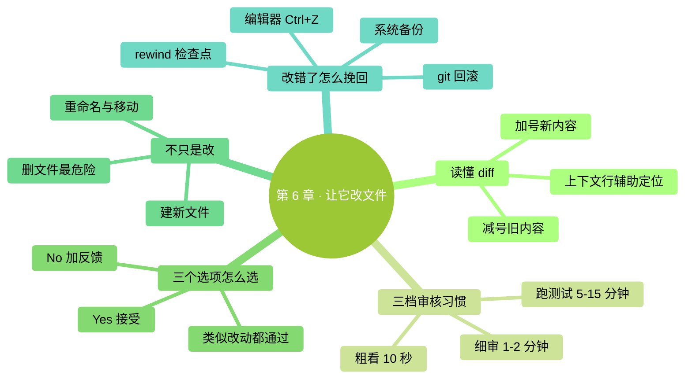

# 第 6 章：让它改文件

> **本章在全书的位置**：第二部分 · 第 6 章 / 预估阅读+动手时长：**主线 30-40 分钟 + 支线 10 分钟**
>
> **前置章节**：Ch 3（体验过一次改文件）+ Ch 5（会用 @ 引用）
>
> **学完能做什么（主线）**：看懂 diff（修改对比图）、养成三档审核习惯、用熟 Accept/Reject/Edit 三个选项、让它建/删/重命名文件、改错了知道怎么挽回。

---

## 开场三问

- **你会遇到什么问题**：Claude 弹出一堆红绿对比文字，你不知道看哪里、哪些是关键、哪些该警惕。
- **不读这章会踩什么坑**：不看 diff 直接 Yes——十次里有一次你会发现它顺便改了你不想改的地方。
- **读完你会多会什么事**：30 秒扫一个 diff 做出准确判断；知道什么时候必须细审、什么时候可以粗看；改错了不慌。

### 本章地图（一眼看全貌）

<!-- diagram: MM-13 -->


---

> 🎯 **【主线】—— 本章必读核心**

---

## 6.1 什么是 diff（修改对比图）

**diff** = difference 的缩写，意思是"**修改前后的对比**"。每次 Claude 要改文件，它都会先给你看 diff，让你确认后再真改。

### 一个简单 diff 长什么样

假设原文件 `笔记.txt` 内容是：

```
买菜
写周报
给妈打电话
```

你让 Claude "每行前加编号"。它生成的 diff 是：

```
Edit: 笔记.txt

-  买菜
-  写周报
-  给妈打电话
+  1. 买菜
+  2. 写周报
+  3. 给妈打电话
```

### 怎么读

- **红色 `-` 开头**的行：这行被**删除**或**替换**（旧内容）
- **绿色 `+` 开头**的行：这行是**新增**或**替换后**（新内容）
- 没 `-/+` 的行：没变，不用看

> 💡 **一句话记法**：减号是旧的、加号是新的。**你看到的是"文件即将变成的样子"**——绿色留下、红色消失。

### 复杂 diff 多一个上下文

文件很大时，Claude 只会显示改动附近的几行（叫"上下文行"），省屏幕：

```
Edit: config.txt
   ...
   port: 8080
-  debug: false
+  debug: true
   timeout: 30
   ...
```

中间的 `port` 和 `timeout` 行没动（没 `-/+`），显示是为了让你看到改动**在文件的什么位置**。

## 6.2 三档审核习惯——别每次都细读

不是所有 diff 都要逐字看。新手最常见的错误是两极化：**要么不看、要么纠结到看不完**。正确做法是**分三档**：

| 档 | 什么时候用 | 看什么 | 时间 |
|---|----------|-------|-----|
| **粗看**（扫 10 秒） | 小改动、低风险文件（笔记、草稿、自己写的说明） | 只看改动范围合不合理、有没有"意外加/删"的文件 | 10 秒 |
| **细审**（读 1-2 分钟） | 中等改动、涉及关键内容（简历、合同、代码） | 逐行读 `-/+`，确认每一处改动都是你要的 | 1-2 分钟 |
| **跑测试**（5-15 分钟） | 涉及正式数据、会被别人看到的内容、代码 | 接受后，**实际运行一遍**看效果；代码类的跑测试 | 5-15 分钟 |

> 📌 **关键判断**：**改坏了恢复成本多高**？恢复难的必须细审、要跑测试；恢复易的粗看就行。

### 三个典型例子

- **改草稿笔记**：粗看 → Yes
- **改你明天发给客户的邮件**：细审每一句
- **改生产环境的配置文件**：细审 + 跑测试 + 留备份

## 6.3 三个选项：Accept / Reject / Edit

每个 diff 弹出后，你有三个选项（方向键选、回车确认）：

```
Do you want to apply this change?
❯ Yes
  Yes, and allow similar changes for the rest of this session
  No, tell Claude what to do differently
```

### ① Yes（接受）

**选了就改**。文件立刻被写成新版本。适合你审核通过、没异议。

### ② Yes, and allow similar changes（这次对话里类似改动都通过）

**本次对话结束前，类似的改动 Claude 直接改不用再问**。

⚠️ **新手谨慎用这个**——如果任务有几十次类似改动（比如批量改所有文件里的一个词），用这个省事；但如果你不确定"类似"会扩散到哪，选普通 Yes 更稳。

### ③ No（拒绝 + 告诉它怎么改更好）

选了后 Claude 不会改，而是**等你说清楚**哪里不对。

常见用法：
- "这个改动范围太大了，只改 A 部分"
- "这种语气不对，太正式了，口语化一点"
- "保留原来的结构，只替换关键词"

Claude 会根据你的反馈**重新生成 diff** 给你看。不满意再 No，直到满意。

> 💡 **反复 No 并不'烦 Claude'**——它不会生气、不会累。反而比你将就接受然后再改回来**更省时间**。

### 有些版本还有 Edit 选项

一些 Claude Code 版本提供 `e` （Edit）——让你**手动编辑这个 diff**，改成你想要的样子，然后 Claude 按你的版本应用。适合你想**局部微调**而不是整体重做。

## 6.4 不只是改——让它建、删、重命名

Claude 能做的文件操作远不止改：

### 建新文件

```
在当前文件夹建一个 todo.md，里面写今天的三件事：买菜、写周报、打电话。
```

Claude 会显示"即将创建"的内容，你 Yes 它就真建。

### 删文件

```
删掉 ~/Downloads/ 里所有超过一年没动过的 .zip 文件。
```

⚠️ **删文件是最危险的操作**——一旦 Yes，恢复可能很麻烦（图形界面的"废纸篓"有时能救、终端删的**可能直接永久消失**）。

**做法**：
- **删之前让它先列出要删的清单**（"先给我看要删的文件名列表，别删")
- **确认清单没问题再让它删**
- 涉及重要文件前**先备份一份到其他文件夹**

### 重命名 / 移动

```
把这个文件夹里所有 "2024-" 开头的文件，改名把前缀去掉
```

改名也是先给 diff（新旧名对照），你 Yes 再执行。

## 6.5 改错了怎么挽回——四种路

改下去发现不对，有四种挽回方式，**按优先级从简单到麻烦**：

### 路 1：Ctrl + Z（如果文件还在编辑器里打开）

如果这个文件在 VS Code、Word、任何编辑器里打开着，**切到编辑器按撤销**——很多时候直接就回去了。

### 路 2：Claude Code 的 /rewind

在 Claude Code 里打：

```
/rewind
```

会列出对话中最近的几个**检查点**（checkpoints），你选一个回退到那个时刻——**对话历史 + 文件状态**都会恢复。

还有**快捷键**：按**两次 Esc 键**（Esc Esc），等于快速 `/rewind` 回到上一个检查点。

> 💡 这是 Claude Code 一个超好用的救命功能。**第 9 章会专门讲** `/rewind` 的细节。

### 路 3：用 git（如果你在用 git）

如果你的文件夹是一个 git 仓库，改坏了：

```
# 看看改了啥
git diff

# 回滚到上次 commit
git checkout 文件名

# 或者回滚全部
git reset --hard
```

⚠️ 这些 git 命令**会永久丢弃未 commit 的改动**——确定要回滚再用。

> 💡 不懂 git？第 25 章会简单讲。**最基础的做法：每次重要改动前 `git add . && git commit -m "备份"` 一下**，改坏了就 `git checkout .` 回滚。

### 路 4：从备份恢复

Mac 的 Time Machine、Windows 的文件历史记录、iCloud/Dropbox 的版本历史——这些都能恢复单个文件的旧版本。适合改动发生了一段时间才发现问题。

---

## 本章小结

- **diff** = 修改前后对比；**红色是旧**（消失）、**绿色是新**（留下）
- **三档审核**：粗看（10 秒）/ 细审（1-2 分钟）/ 跑测试（5-15 分钟）——**按恢复难度选档**
- **三个选项**：Yes（接受）/ Yes 类似改动都通过（谨慎用）/ No 告诉它哪里不对
- **删文件最危险**——先列清单确认再真删
- **改错了四种挽回**：Ctrl+Z（编辑器里）→ `/rewind` → git → 备份

---

## 动手任务

### 任务 1：体验完整改文件流程（8 分钟）

**步骤**：
1. 在 `ccguide-练习` 里新建文件 `日程.md`，写 3 条安排（比如 "9 点 meeting、11 点写稿、下午 review"）
2. 启动 Claude Code，输入：`@日程.md 把时间从 24 小时制改成 12 小时制并加 AM/PM`
3. 审核 diff，选 Yes
4. 切图形界面打开 `日程.md`，确认变化

**成功标志**：文件内容按要求改了，且图形界面能看到。

### 任务 2：主动用 No 纠正（8 分钟）

**步骤**：
1. Claude Code 里输入：`@日程.md 大幅精简一下，只保留核心关键词，20 字以内`
2. Claude 会生成 diff——**看完后故意选 No**
3. 在反馈里输入："**保留原来的时间格式，但把描述换成更简练的动词开头的短语**"
4. 看 Claude 重新给的 diff，这次 Yes

**成功标志**：体验到 No + 反馈是让 Claude 调整的正常路径。

### 任务 3：用 `/rewind` 回退（5 分钟）

**步骤**：
1. Claude Code 里输入 `/rewind`
2. 看弹出的检查点列表
3. 选"任务 2 开始之前"的那个检查点，确认
4. 切图形界面看 `日程.md` 是否回到任务 2 之前的状态

**成功标志**：文件回到之前的样子。

---

## 如果你卡住了

**症状 A：diff 很长看着眼花**
- 原因：改动范围大。
- 解决：先看有没有你**不想动的文件**出现在 diff 里（比如你让改 A，它顺便改了 B）；有就 No 让它只改 A。改动内容本身按三档原则办。

**症状 B：选 Yes 后文件没变**
- 原因：极少数文件被其他程序锁住（比如 Word 打开着正在编辑）。
- 解决：关掉那个程序再试。

**症状 C：想 /rewind 但说"没有可回退的检查点"**
- 原因：当前对话还没有"写文件"这种动作产生检查点，或上个检查点已经过期。
- 解决：改用 git、编辑器 Ctrl+Z、或从备份恢复。

---

主线结束。下面支线讲批量改多文件、和让它"改得更准"的技巧。

---

> 🌿 **【支线】—— 可选深入（学有余力再看）**

---

## 🌿 支线 6.A：批量改多个文件

> **这段讲什么**：一条命令改几个、几十个文件。
> **什么时候回头读**：你碰到"所有这些文件都要做类似改动"的场景。

### 让它同时改多文件

```
@第一章.md @第二章.md @第三章.md 
把这三章开头的"2024 年"都改成"2026 年"
```

Claude 会**依次对每个文件生成 diff**，你一个个审核。

### 三个 diff 都类似，简化审核

如果你已经看完第一个 diff 觉得很好、其余两个类似，选：

```
Yes, and allow similar changes for the rest of this session
```

就不会每个都弹。**但前提**：你真看清了模式，确信"类似改动都是安全的"。

### 更复杂：跑个脚本批量改

```
把 ~/Documents/会议/ 下所有 .md 文件的首行日期格式统一成 2026-04-19 这种
```

Claude 可能**不生成 50 个 diff**，而是跑一个脚本遍历改。这种情况下它会展示脚本让你审（变成 "权限-跑命令" 提示，见第 7 章）。

## 🌿 支线 6.B：让它改得更准的三个技巧

> **这段讲什么**：提高 Claude 改对率的三个习惯。
> **什么时候回头读**：你发现 Claude 经常改偏、需要反复纠正。

### 技巧 1：给一两个"期望的例子"

```
@章节列表.md 把每行末尾的字数统计格式从"(1200字)"改成"· 1.2k 字"
例子：原来 "第一章：开头 (1200字)" 改成 "第一章：开头 · 1.2k 字"
```

一个具体例子胜过十句解释。

### 技巧 2：明确"不要做什么"

```
帮我把这段英文翻译成中文。
⚠️ 不要改变段落结构，不要合并句子，不要意译——保持直译的节奏。
```

告诉 Claude**别做什么**和告诉它做什么一样重要。

### 技巧 3：要求它"先说计划再动手"

```
@大文件.md 我想把它拆成三个章节。
先告诉我你打算怎么拆（在哪里断开、各章标题是什么），我 OK 你再开始改。
```

Claude 会先说方案、等你同意后才生成 diff——省得方案错了改一半发现问题。（这种做法和 `/plan` 计划模式本质一样，第 9 章会详讲）

---

下一章讲 Claude Code 最重要的一个安全机制——**让它跑命令 + 权限系统**。


---

<!-- chapter-nav -->

📖  [← 第 5 章 · 让它读文件](05-让它读文件.md)  ·  [📑 返回目录](../../README.md)  ·  [第 7 章 · 跑命令与权限机制 →](07-让它跑命令加权限机制.md)
