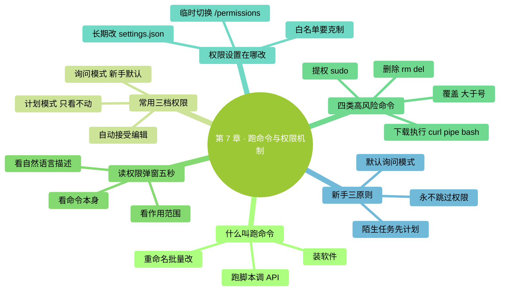
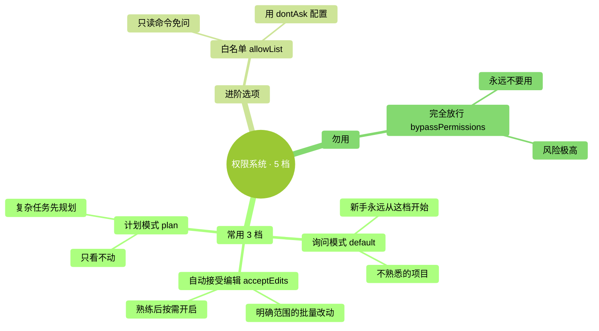

# 第 7 章：让它跑命令 + 权限机制

> **本章在全书的位置**：第二部分 · 第 7 章 / 预估阅读+动手时长：**主线 40-50 分钟 + 支线 15 分钟**
>
> **前置章节**：Ch 6（改文件的权限/审核概念已建立）
>
> **学完能做什么（主线）**：理解 Claude Code 的三档权限模式、看懂权限弹窗、识别危险命令、知道什么时候该选允许、什么时候该停下来。**这是 Claude Code 整个工具最重要的安全机制。**

---

## 开场三问

- **你会遇到什么问题**：Claude 弹一个权限框问你允不允许跑一条命令——命令里一堆英文单词和符号，你一脸懵："这是什么？我该点 Yes 吗？"
- **不读这章会踩什么坑**：闭眼 Yes 跑到危险命令（删文件、装奇怪的软件、修改系统设置）；或反过来——啥都 No 导致 Claude 根本干不了活。
- **读完你会多会什么事**：一眼识别命令类别和风险等级，该 Yes 果断 Yes、该 No 果断 No，还知道该用哪档权限模式最适合你当前场景。

### 本章地图（一眼看全貌）

<!-- diagram: MM-14 -->


---

> 🎯 **【主线】—— 本章必读核心**

---

## 7.1 "让它跑命令"是什么意思

前面几章 Claude 在干的都是**读文件、改文件**。但它还有一个更强的能力：**在你电脑上跑命令**。

"跑命令"就是让终端执行一条指令——你在第 1 章学过的 `ls` / `cd` 是命令；装软件的 `npm install` 是命令；重命名文件的 `mv`、删东西的 `rm`、下载的 `curl`、git 操作、跑 Python 脚本……**全都是命令**。

### 典型场景

- "把 ~/Downloads 里所有 PDF 重命名，前面加今天的日期" → Claude 会跑 `mv` 循环
- "统计这 30 个 Excel 里'已付款'多少条" → 跑 Python 脚本
- "压缩这张大图到 500KB 以下" → 跑 `sips` 或 `imagemagick`
- "把这个项目里的依赖都更新一下" → 跑 `npm update`
- "看看这个进程在占资源吗" → 跑 `ps` / `top`

**这个能力就是 Claude Code 和 ChatGPT 最大的区别之一**——但因为命令能真改动你电脑，**必须有权限机制**。

## 7.2 权限机制：5 档简化为 3 档

Claude Code 提供五档权限模式，但对零基础用户，**只需理解并用三档**：

| 档 | 官方名字 | 什么感觉 | 什么时候用 |
|---|---------|---------|----------|
| **1. 询问模式** | default（默认） | 每次改文件 / 跑命令都弹窗问你 | **新手永远从这档开始**；不熟悉的项目；重要文件 |
| **2. 自动接受编辑模式** | acceptEdits | 改文件不问（自动 Yes），跑命令仍问 | 你对这次任务很有把握，只是不想一直点 Yes |
| **3. 计划模式** | plan | 只读不写——Claude 只能看和分析，**不能改文件、不能跑命令** | 复杂任务想先让它规划，还没准备好让它动手 |

<!-- diagram: MM-03 -->


### 另外两档（简单了解）

- **dontAsk / allowList**（白名单）：把特定命令（比如 `ls`、`git status`）标记为"以后不用问"
- **bypassPermissions**（完全放行）：⚠️ **永远不要用**——所有权限都跳过，改文件删文件跑任何命令都不问

### 怎么切换权限模式

三种方式：

**方式 A：启动时指定**

```
claude                           # 默认询问模式
claude --permission-mode plan    # 计划模式启动（最安全的探索方式）
```

**方式 B：会话中切换**

在对话输入框里打：

```
/permissions
```

会弹出界面，让你选当前会话用哪档。

**方式 C：某次操作时临时选**

每个权限弹窗的第二个选项"**Yes, and allow similar changes...**"（见第 6 章）就是**把这类操作的权限升到"本次会话内自动允许"**。

### 新手的三原则

1. **默认用询问模式**——别图快一上来就自动接受
2. **探索新项目 / 复杂任务用计划模式**——先让 Claude 看和分析、规划好方案再改
3. **永远不要用 `--dangerously-skip-permissions`**——这是 `bypassPermissions` 的命令行开关，仅限机器之间自动化场景用

## 7.3 怎么读权限弹窗

看到 Claude 弹出这样的窗口时，你需要 3 秒做决定：

```
Claude wants to run:

    rm -rf ~/Downloads/*.zip

This will remove all .zip files in ~/Downloads.

❯ Allow once
  Allow always for this session
  Deny and tell Claude what to do differently
```

### 扫视顺序（5 秒做决定）

**Step 1：看命令本身**——最关键那一行是什么？
- `rm` = 删
- `mv` = 移动 / 重命名
- `cp` = 复制
- `curl` / `wget` = 下载
- `sudo ...` = 用管理员权限（**高度警惕**）
- `npm install` / `pip install` = 装 Node.js / Python 包
- `git commit` / `git push` = 提交代码 / 推送代码

**Step 2：看命令作用范围**——动的是你预期的文件/位置吗？
- `~/Downloads/*.zip` = 只动下载文件夹里的 zip ✅ 预期
- `~/*` 或 `/*` = 整个家目录/整个磁盘 ⚠️ 危险
- `.`（当前文件夹）= 当前位置 ✅ 通常安全

**Step 3：看描述**——Claude Code 通常会在命令下一行**用自然语言解释这条命令在做什么**，没看懂命令就读描述。

### 三个选项怎么选

| 选项 | 含义 | 什么时候 |
|------|-----|---------|
| **Allow once** | 允许一次，下次类似命令还会问 | 命令你看懂了、没问题 |
| **Allow always for this session** | 本次对话里**这类命令**以后不问 | 你确信这种命令接下来会反复出现且都安全 |
| **Deny** | 不允许 + 让 Claude 换个方法 | 看不懂、或这不是你想要的命令范围 |

**新手心法**：90% 的场景选 "Allow once"——对每一次命令保留判断权。

## 7.4 四类高风险命令——必须识别

有些命令**一旦跑错几乎救不回来**，必须学会一眼识别。

### 危险类 1：删除类

```
rm -rf 路径       # 强制递归删除（删文件夹和里面所有东西）
rm 文件           # 删单个文件
del 文件          # Windows 删
```

⚠️ **关键字**：`rm`、`del`、`-rf`（强制递归）

**看到就要思考**：**删的范围对吗？删错了能恢复吗？**

### 危险类 2：覆盖类

```
mv A B            # 如果 B 已存在，会被 A 覆盖
cp A B            # 同上（某些场景）
> 文件            # 把内容写到文件，会覆盖原内容
```

⚠️ **关键字**：`>` 单箭头（覆盖） vs `>>` 双箭头（追加）

### 危险类 3：提权类

```
sudo ...          # 用管理员权限跑（Mac）
Run as Admin ...  # Windows 提权
```

⚠️ `sudo` 开头的任何命令都要**高度警惕**——影响范围可能是整个操作系统。

### 危险类 4：下载 + 执行

```
curl https://xxx.com/script.sh | bash
wget xxx | sh
```

⚠️ 这种模式：**从网上下一段脚本直接执行**。风险极高——你不知道脚本里写了什么。

**原则**：看到 `curl ... | bash` 或 `wget ... | sh` **先 Deny**，要求 Claude 先把内容下下来让你看一遍再决定。

### 一个不完全清单（安全感参考）

| 命令 | 大致安全度 | 说明 |
|------|----------|-----|
| `ls` / `pwd` / `cat` / `head` / `tail` | ✅ 只读 | 看东西，不改 |
| `mkdir` / `touch` | ✅ 新建 | 新建文件夹/空文件 |
| `cd` | ✅ 切换 | 只改"当前位置" |
| `cp 到新位置` | 🟡 一般安全 | 复制通常无害，但目标存在会覆盖 |
| `mv` 到新位置 | 🟡 一般 | 移动，覆盖风险 |
| `git add` / `git commit` | 🟡 版本控制 | 改 git 状态但不丢数据 |
| `rm` / `del` | ⚠️ 高风险 | 永久删除 |
| `sudo` 开头 | ⚠️ 高风险 | 提权 |
| `curl xxx \| bash` | 🔴 极高风险 | 从网下载执行 |

## 7.5 权限设置在哪改

### 临时改（本次会话）

在 Claude Code 输入框打 `/permissions`，按指引选。

### 永久改（所有会话）

设置文件在 `~/.claude/settings.json`（Mac）或 `C:\Users\你的名字\.claude\settings.json`（Windows）。**不熟悉 JSON 格式就别手改**——容易写错一个逗号整个文件失效。

> 💡 **更安全的做法**：让 Claude 自己帮你改这个文件。你跟 Claude 说："帮我把 `ls` 命令加进自动允许的白名单"，它会按格式帮你改。

具体配置项第 18 章和第 25 章会讲。

### 常用白名单项

刚开始用时**可以**把这些命令加白名单省去不停确认：

- `ls`、`pwd`、`cat`、`head`、`tail`（只读）
- `git status`、`git diff`、`git log`（只读 git 操作）

**不要加白名单**：
- `rm`、`mv`、`cp` 等改动类
- `sudo` 开头任何
- `curl`、`wget` 下载类
- `git push`、`git reset`（影响版本历史或远程）

---

## 本章小结

- Claude Code 的"跑命令"能力是它和 ChatGPT 最大的差异之一，但**必须通过权限系统**
- **新手用三档**：询问模式（默认）/ 自动接受编辑模式 / 计划模式
- **永远不要用** `--dangerously-skip-permissions` / `bypassPermissions`
- 读权限弹窗：**命令 → 范围 → 描述**，5 秒做决定
- **四类高风险命令**：删除（`rm`）/ 覆盖（`>`）/ 提权（`sudo`）/ 下载执行（`curl | bash`）
- 新手心法：**90% 的场景选 "Allow once"**

---

## 动手任务

### 任务 1：体验询问模式的权限弹窗（5 分钟）

**步骤**：
1. `cd ~/Desktop/ccguide-练习`，`claude` 启动（默认询问模式）
2. 输入：`列出当前文件夹所有文件的大小，按大到小排`
3. Claude 会弹出权限框（它要跑 `ls -lS` 或类似命令）
4. 看清命令 → 选 **Allow once**
5. 看输出

**成功标志**：你成功决定了一次权限、看到了结果。

### 任务 2：切到计划模式探索（10 分钟）

**步骤**：
1. 退出当前 Claude Code（Ctrl+C 两次）
2. 重新启动：`claude --permission-mode plan`
3. 输入：`帮我整理一下当前文件夹——给出整理方案`
4. Claude 会分析并**用文字输出方案**，但**不会真的改任何东西**
5. 看方案 OK 后，`/permissions` 切回默认模式，让它执行

**成功标志**：计划模式下 Claude 不会动任何文件，只输出建议。

### 任务 3：故意 Deny 一次（5 分钟）

**步骤**：
1. 默认模式下，输入：`帮我清空下载文件夹，删掉所有内容`
2. Claude 弹出 `rm` 类命令的权限框
3. **看清命令 → 选 Deny** → 告诉它："**先列出要删的文件清单，别删**"
4. Claude 改为只跑 `ls` 列表

**成功标志**：你熟悉了 Deny + 反馈的流程；学会"先看清单、再决定删不删"的好习惯。

---

## 如果你卡住了

**症状 A：权限弹窗太频繁，每点几下就弹一次**
- 原因：询问模式对每个文件/命令独立问。
- 解决：
  - 如果这次任务确信都安全 → 选 `Yes, and allow similar for this session`
  - 任务结束后**不要保留**这种宽松模式进入下一个任务

**症状 B：命令看不懂，不知道选 Yes 还是 No**
- 原因：命令太长或不熟悉。
- 解决：选 **Deny**，告诉 Claude："**用自然语言描述一下你想做什么**"；它说人话解释后你再决定

**症状 C：不小心 Yes 了危险命令**
- 原因：手快或没看清。
- 解决：
  - **立即 Ctrl+C** 中断（来得及就能中断）
  - 中断后立刻检查：被改动的文件是否还在、git 能否回滚、备份能否恢复
  - 下次刻意放慢节奏

---

主线结束。下面支线讲自动接受模式的使用场景，和白名单的建立。

---

> 🌿 **【支线】—— 可选深入（学有余力再看）**

---

## 🌿 支线 7.A：什么时候值得用自动接受模式（acceptEdits）

> **这段讲什么**：`acceptEdits` 权限模式的合理使用场景——不是越早开越好，但确实有合适的时机。
> **什么时候回头读**：用熟了一两周、开始觉得反复点 Yes 很烦、能识别风险了。

### 开启方式

启动时：`claude --permission-mode acceptEdits`
会话中切换：`/permissions` → 选 accept edits

### 它做什么、不做什么

| 操作 | 默认模式 | 自动接受模式 |
|------|---------|----------|
| 改文件（Edit/Write） | 弹 diff 问 | **自动通过，不问** |
| 跑命令（Bash） | 弹权限框问 | **仍然问** |
| 建文件 / 删文件 | 弹权限框问 | **仍然问**（因为删是不可逆风险操作） |

### 适合的场景

- **重构 / 批量改文档**——你已经给了清晰指令，Claude 会改几十处，都是预期内的
- **明确范围的迭代**——"把这个文件里所有 'foo' 改成 'bar'"这类
- **你已经做了 git commit / 备份**——改坏了能快速回滚

### 不适合的场景

- ❌ **第一次用 Claude Code**——你不熟悉它的行为
- ❌ **重要项目第一次碰**——风险过高
- ❌ **你累了 / 分心了**——审核能力下降

⚠️ **切回默认模式的时机**：任务结束时**立刻切回**，别让 acceptEdits 跨会话存活。

---

## 🌿 支线 7.B：建一个私人白名单

> **这段讲什么**：把常用的只读命令加进"以后不问"的白名单，减少打断。
> **什么时候回头读**：你已经用了至少 1-2 周、识别命令风险有了直觉。

### 思路

`~/.claude/settings.json` 里有一个 `permissions` 块，可以定义"以后自动允许"的命令模式（叫 allowList）。

格式（示例，以 Claude Code 当前版本为准，查官方文档）：

```
"permissions": {
  "allow": [
    "Bash(ls:*)",
    "Bash(pwd)",
    "Bash(cat:*)",
    "Bash(git status)",
    "Bash(git diff:*)",
    "Bash(git log:*)"
  ]
}
```

`Bash(命令:参数模式)` 表示允许这条命令 + 参数匹配时自动通过。

### 我推荐的最小白名单（零基础版）

只加这 6 条，都是只读：

```
Bash(ls:*)
Bash(pwd)
Bash(cat:*)
Bash(head:*)
Bash(tail:*)
Bash(git status)
```

### 我强烈建议**不要**加入白名单的：

- ❌ `rm` / `del`（删）
- ❌ `mv` / `cp`（移动/复制——可能覆盖）
- ❌ 任何 `sudo` 开头
- ❌ `curl` / `wget`（下载）
- ❌ `npm install` / `pip install`（装包）
- ❌ `git push` / `git reset` / `git rebase`（影响历史或远程）

### 怎么改

**推荐方式**：让 Claude 帮你改。对 Claude 说：

```
帮我在 ~/.claude/settings.json 里加一个最小白名单，包括：
ls / pwd / cat / head / tail / git status。
加之前给我看改动 diff。
```

这样不会自己手改出 JSON 语法错误。

### 写在最后

**白名单省事但要克制**——哪怕每天少 20 次确认，一年也就少 7000 次确认；但只要有 1 次本来该 Deny 的你没看到，损失可能抵消一年的省时。**默认模式的"累"是一种保护**。

---

至此第 7 章完成。下一章讲**整个对话的工作节奏——交互循环七步法**，帮你把单点操作串成稳定的工作流。
