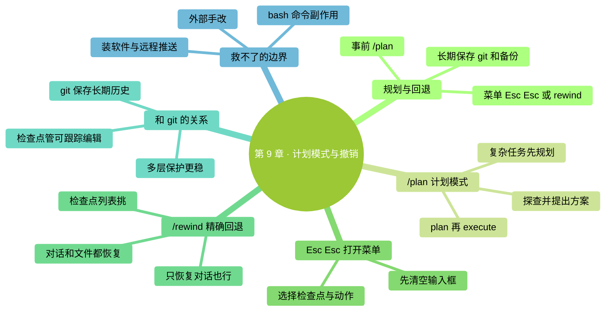

# 第 9 章：计划模式与撤销——先规划，再正确回退

> **本章在全书的位置**：第二部分 · 第 9 章 / 预估阅读+动手时长：**主线 25-30 分钟 + 支线 10 分钟**
>
> **前置章节**：Ch 7（权限）+ Ch 8（交互循环）
>
> **学完能做什么（主线）**：熟练使用 Claude Code 的规划与回退机制——`/plan`（先做方案）、Esc Esc / `/rewind`（打开同一个回退菜单）。改错了不慌，还能让复杂任务有计划地推进。

> **核验日期：2026-09-24。** 本章对话和界面文字均为教学示意；请以你的版本、账号和实际界面为准。

---

## 开场三问

- **你会遇到什么问题**：复杂任务不知道怎么下手——直接让 Claude 改怕改错；改到一半发现方向错了不知道怎么回到起点。
- **不读这章会踩什么坑**：走一步算一步，踩坑回不去——只能从头重做；或者害怕踩坑所以啥都不敢让它做。
- **读完你会多会什么事**：对复杂任务先做计划，方向错了再选择合适的检查点；知道哪些文件能恢复，哪些副作用必须另行处理。

### 本章地图（一眼看全貌）

<!-- diagram: MM-16 -->


---

> 🎯 **【主线】—— 本章必读核心**

---


## 9.1 先认清：规划、回退、备份

遇到改错，不要急着再补十个命令。先判断你现在需要的是哪一种帮助：

| 工具 | 什么时候用 | 你还要决定什么 |
|---|---|---|
| `/plan` | 范围或做法还没想清楚 | 批准哪一部分方案 |
| Esc Esc 或 `/rewind` | 想退回一次对话里的某个节点 | 选哪个点，恢复文件、对话还是两者 |
| Git 或文件备份 | 需要长期保存与恢复文件 | 哪些改动值得保存，恢复到哪版 |

**Esc Esc 和 `/rewind` 是同一个菜单的两个入口**，不是一套“快速撤销”和另一套“高级撤销”。这件事要先记住：打开菜单之后，文件还没有自动恢复。

这些工具帮你多留一个选择，但无法让所有错误消失。例如，已经发出去的邮件、已经扣掉的费用，都不会因为恢复对话而退回。操作前想清楚范围，仍然是最省事的一步。

## 9.2 /plan 计划模式——让 Claude 只看不动


### 是什么

`/plan` 让 Claude 先研究和提出方案，再进入修改阶段。它会读文件，可能跑探索命令，也可能保存计划；因此不能把它理解成“除了说话什么都不做”。

在本书不启用绕过权限的练习路径里，源文件编辑要等你批准计划。你也可以明确写：“先分析，不安装软件、不访问外部服务、不修改这些资料。”如果启用了绕过权限，或允许 Auto 在计划时审查命令，行为边界会变化；复杂环境按[官方 Plan 说明](https://code.claude.com/docs/en/permission-modes#analyze-before-you-edit-with-plan-mode)核对。

### 什么时候值得先 `/plan`

- **复杂任务**：涉及多文件、多步骤、你没有把握
- **陌生项目**：你自己都没看过的代码/文件夹，先让它探查
- **高风险改动**：改生产配置、动重要数据前
- **你拿不准方案**：不知道是方案 A 好还是方案 B 好，让它两个都分析

> 💡 **反面**：简单明确的改动（"把这个文件里'foo'全换成'bar'"）**不用 `/plan`**，直接做就行。

### 怎么用

**方式 A：启动时进入**

```
claude --permission-mode plan
```

会话从计划模式开始；你随后仍能切换。

**方式 B：会话中切换**

对话里打：

```
/plan
```

切进计划模式。


**方式 C：批准后执行**

计划完成时，读清批准选项。初学者可以选择**手动审核编辑**；也可按 Shift+Tab 切回 Manual，然后说清楚这次批准的范围。

不要只写一个含糊的“好”。如果只认可前两步，就说：“按前两步修改，第三步暂时不做。”同样，批准整理本地草稿，不自动意味着批准向外发布。

### 一个典型的 plan → execute 流程

```
（计划模式下）
你：@src/ 帮我看这个项目整体架构，分析一下如果我想加一个"用户反馈"功能，要改哪些文件
Claude：（读文件、分析）我看到这个项目是 ... 要加"用户反馈"，建议改以下文件：
  - A.tsx（新增表单）
  - B.ts（API 接口）
  - C.md（文档更新）
  步骤：...

你：方案看起来可行。把 A 和 B 按这个方案先做，C 我自己来。

（核对当前为 Manual 模式）
按 Shift+Tab 切到 Manual

你：按刚才的方案开始改 A 和 B
Claude：（生成 diff，正常审核循环）
```

这种"**先规划后执行**"的流程叫 **plan → execute**，本书后面多处推荐。


## 9.3 Esc Esc——先打开菜单，别急着恢复

Esc 是键盘上的 Escape 键。**输入框为空时连按两次 Esc**，会打开回退菜单；如果输入框还有没发出去的文字，两次 Esc 会先清掉输入，而不是恢复文件。怕记混时，直接输入 `/rewind`。

把它想成打开一个“回到哪里”的选择器。先找到造成问题的那条请求，再决定要恢复什么。刚按完快捷键就打开文件检查，会觉得“怎么没变化”，因为你还没有完成选择。

教学示例：你让 Claude 用文件编辑工具把 `笔记.txt` 的标题改掉，随后发现改错了。打开菜单，选中**提出改标题请求前的节点**，再选恢复文件。操作后打开文件，核对标题。这个练习只用复制出来的笔记，不拿唯一的原件尝试。

## 9.4 /rewind——选对检查点和恢复范围

在输入框运行：

```
/rewind
```

菜单中的节点对应启动一轮工作的用户请求，不是每个字符、每次工具调用都有一个节点。挑选后，常见动作如下：

| 动作 | 用途 |
|---|---|
| 恢复文件和对话 | 改动与讨论都退回所选节点 |
| 只恢复对话 | 保留当前文件，重新讨论方向 |
| 只恢复文件 | 保留讨论，恢复被跟踪的文件编辑 |
| 从这里摘要 / 摘要此前内容 | 整理上下文；不恢复磁盘文件 |
| 返回 | 暂时什么都不改 |

没有可跟踪的文件改动时，不一定显示恢复文件选项。**检查点主要记录 Claude 的文件编辑工具；shell 命令修改、外部程序修改和多数子代理修改不在同一恢复保证内。** 恢复旧会话后仍可能使用其检查点，但快照受保留期限影响。不要把它当长期备份。[检查点边界](https://code.claude.com/docs/en/checkpointing)

### 一个典型场景

你先让 Claude 修改 A、B、C，再让它处理 D、E、F。后来发现第二组任务方向错了，可以选择第二组请求前的节点。

这时先问自己：第一组结果是否保留？第二组里有没有你想留下的内容？如果有，先另存一份或保存 Git 版本，再恢复。菜单选择正确后，还要打开实际文件核对，不凭“恢复成功”几个字就继续往下做。

### 哪些事情不会跟着倒退

假如 Claude 跑命令发出了一封邮件，恢复到发信前的对话，只是让会话回到那个节点，收件人的邮箱没有变化。同理，删除云端文件、修改数据库、付费调用、安装软件，都需要各自的处理方式。

如果同一个文件也被你或另一个会话修改过，恢复旧快照还可能碰到这些新内容。先把仍需保留的版本另存，再回退，不要假设检查点会自动替你合并所有人的修改。

甚至在本地，`rm`、`mv` 或脚本生成文件，也不能默认由 `/rewind` 恢复。任务涉及这些操作时，先保留原件或使用适合的版本控制；如果已经发生错误，先停下来查明事实，再做恢复。

## 9.5 检查点和 Git 的关系

如果你已经在用 git（代码版本控制），可能会问：**“有 Git 了还需要检查点吗？”**

答案：**都要。它们是不同层级的保护**。

| 工具 | 作用范围 | 粒度 |
|------|---------|-----|
| **Claude Code 检查点** | 当前或恢复后的会话 | 按启动一轮工作的请求；并非所有中途补充消息都有节点 |
| **git** | 你整个项目的版本历史 | 按"提交级"——你 commit 一次就是一个节点 |
| **编辑器 Ctrl+Z** | 单个文件在单次编辑中的修改 | 字符级——最细 |
| **系统备份**（Time Machine / 文件历史） | 全盘 | 按天/小时的快照 |

**搭配建议**：

1. **开始任务前 `git commit` 一下** → 有个"干净基线"
2. **任务中用 `/plan` / Esc Esc / `/rewind`** → 在 Claude Code 会话内快速回退
3. **任务完成后 `git commit`** → 新的"干净基线"
4. **过几天回头看发现有问题** → `git revert` 或从备份恢复

多留几层恢复途径，能降低返工代价。仍要确认备份真的包含你关心的文件，尤其是未被 Git 跟踪的资料。

> 💡 **不懂 git 也没关系**——Ch 25（团队协作基础）会从零讲 git 基础。**现在记住**：Claude Code 的检查点便于恢复被跟踪的会话改动，git 是"跨会话的长期版本管理"。

---

## 本章小结

- **先规划，再回退**：`/plan` 帮你讨论方案；Esc Esc 和 `/rewind` 打开同一菜单
- **`/plan` 计划模式**：先探查和提出方案，适合复杂 / 陌生 / 高风险任务；plan → execute 是推荐流程
- **Esc Esc**：输入为空时打开菜单，之后还要选择检查点与动作
- **`/rewind`**：选择恢复对话、被跟踪的文件，或两者；命令和外部副作用不能靠它撤销
- **和 Git 配合**：检查点便于尝试，Git 和备份保存长期成果

---

## 动手任务

### 任务 1：用 plan 模式规划一个任务（10 分钟）

**步骤**：
1. 进 `ccguide-练习`，`claude --permission-mode plan` 启动
2. 输入：`@笔记.txt 我想把这份笔记改造成 GTD（Getting Things Done）风格的任务管理——规划一下改造方案，不要改文件`
3. Claude 会给你一个方案（只说不做）
4. 看方案：批准手动审核编辑，或用 Shift+Tab 切到 Manual
5. 说"OK，按方案开始"
6. 正常审核 diff

**成功标志**：你体验了"先规划再执行"的流程，并且计划模式下确实没动文件。

### 任务 2：体验 Esc Esc（5 分钟）

**步骤**：
1. Manual 模式下，请 Claude 用文件编辑工具修改 `笔记.txt`（比如"把标题改成大写"）
2. 审核 → Yes → 改完
3. 确认输入框为空，再按两次 Esc
4. 选改标题前的检查点，选择恢复文件；有确认提示时核对后再确认
5. 切图形界面打开 `笔记.txt` 确认回到了改之前

**成功标志**：Esc Esc 撤销成功，文件回到未改状态。

### 任务 3：用 /rewind 选一个更早的检查点（5 分钟）

**步骤**：
1. 在 Claude Code 里做 3-4 次改动（不用复杂，就是让它改几次文件）
2. 打 `/rewind`
3. 看检查点列表，按你每次提出的请求辨认节点
4. 选一个比"最近一次"更早的检查点（比如第 2 次改动之前的）
5. 选择恢复文件和对话，确认后打开文件核对

**成功标志**：被跟踪文件和对话都回到了所选节点。

---

## 如果你卡住了

**症状 A：`/plan` 模式下让它改东西它拒绝了**
- 原因：这是计划模式的预期行为，它就是"不给改"。
- 解决：先确认方案，再按 Shift+Tab 切到 Manual，或选择计划批准中的手动审核编辑

**症状 B：Esc Esc 按了没反应**
- 原因：输入框里有文字时，它可能只清掉输入；或者这次没有可恢复的文件编辑
- 解决：连续按快一点；或用 `/rewind` 从列表选

**症状 C：`/rewind` 恢复后文件还是错的**
- 原因：那个文件被你**在 Claude Code 外面**（图形界面、其他程序）改过——`/rewind` 不管外面的修改
- 解决：手动恢复，或从 git / 备份拿

**症状 D：`/rewind` 说没有检查点**
- 原因：刚开始对话没几步，还没生成足够多的检查点
- 解决：先检查是否打开了正确会话，再用 Git 或文件备份核对可恢复版本；不要反复尝试猜测节点

---

主线结束。下面支线讲 plan → execute 当默认工作流、以及 `/rewind` 的边界。

---

> 🌿 **【支线】—— 可选深入（学有余力再看）**

---

## 🌿 支线 9.A：把 plan → execute 当默认工作流

> **这段讲什么**：一个值得养成的习惯——几乎所有不那么简单的任务都先 `/plan`。
> **什么时候回头读**：你用了几周、开始做更复杂任务时。

### 我推荐的"默认升级"

早期（前 1-2 周）：大多数任务直接做，踩坑后学习。

中期（2-4 周）：**稍复杂任务（3 步以上、涉及多文件）默认先 `/plan`**：

```
（启动就进 plan 模式）
claude --permission-mode plan

然后：
@目标文件/文件夹 分析一下，告诉我要做 X 该怎么做

看 Claude 方案 → 不满意就让它调整方案 → 满意后：
批准手动审核编辑，或按 Shift+Tab 切到 Manual
开始做
```

### 好处

- **避免"做一半发现方案错了"的浪费**
- **你有机会中途纠偏**（用嘴改方案比用 diff 改实际文件快 10 倍）
- **复杂任务的"整体感"更强**

### 代价

- 多花 3-5 分钟讨论方案
- 简单任务走这一圈显冗余

> 💡 **判断标准**：任务预计需要 Claude 做 **3 步以上**（多次改文件或跑命令），先 `/plan`。1-2 步的直接做。

---

## 🌿 支线 9.B：`/rewind` 的边界——它能和不能救什么

> **这段讲什么**：`/rewind` 具体能恢复什么、不能恢复什么。
> **什么时候回头读**：你试图 `/rewind` 但发现没救回来想搞清楚原因。

### `/rewind` 能救的

- ✅ Claude Code 本次会话中**发出的消息**（回退到那个时刻）
- ✅ 本次会话中 **Claude 用 Edit/Write 工具改过的文件**（恢复到检查点的内容）
- ✅ 文件编辑工具创建且被检查点跟踪的文件；恢复后仍应核对实际文件状态

### `/rewind` 救不了的

- ❌ 你**在图形界面 / 其他终端** 改过的文件
- ❌ Claude **通过 `bash` 命令**改过的东西（因为 bash 命令的结果 Claude Code 不知道该怎么回退）——比如它跑了 `rm file.txt`，`/rewind` 不会把文件变回来
- ❌ Claude 安装的软件 / 改的系统设置
- ❌ 已经**被 git commit / push** 的东西（那是 git 的事）
- ❌ 快照已超过保留期限，或对应文件未被跟踪；正常恢复旧会话并不等于检查点必然丢失

### 边界清楚了怎么办

**高风险操作的保护策略**：

| 操作类型 | 保护方式 |
|---------|---------|
| Claude 改文件（Edit/Write） | 检查是否有对应快照，再用 `/rewind` 恢复 |
| Claude 跑 `rm`、`mv` 等命令 | **`/rewind` 救不了** → **操作前手动备份 / git commit** |
| 装软件、改系统设置 | 手动记录可逆的步骤 |
| 远程操作（git push、调 API） | **操作前就要特别小心**——发出去的不一定收得回 |

### 心法

`/rewind` 是**便利工具**而非**终极保险**。重要场景的终极保险永远是：

1. **预防**：`/plan` 模式先规划
2. **备份**：git commit / 手动复制一份
3. **分步小心**：一步一步做、每步验证——而不是一口气 10 步然后指望回退

---

下一章讲这一部分的最后一个话题——**信任校准**：什么时候该相信 Claude、什么时候必须深度审核。

<!-- studio:nav -->
← [第 8 章：交互循环七步法](08-%E4%BA%A4%E4%BA%92%E5%BE%AA%E7%8E%AF%E4%B8%83%E6%AD%A5%E6%B3%95.md) · [目录](../../README.md) · [第 10 章：信任校准——什么时候信，什么时候核对](10-%E4%BF%A1%E4%BB%BB%E6%A0%A1%E5%87%86.md) →
<!-- /studio:nav -->
