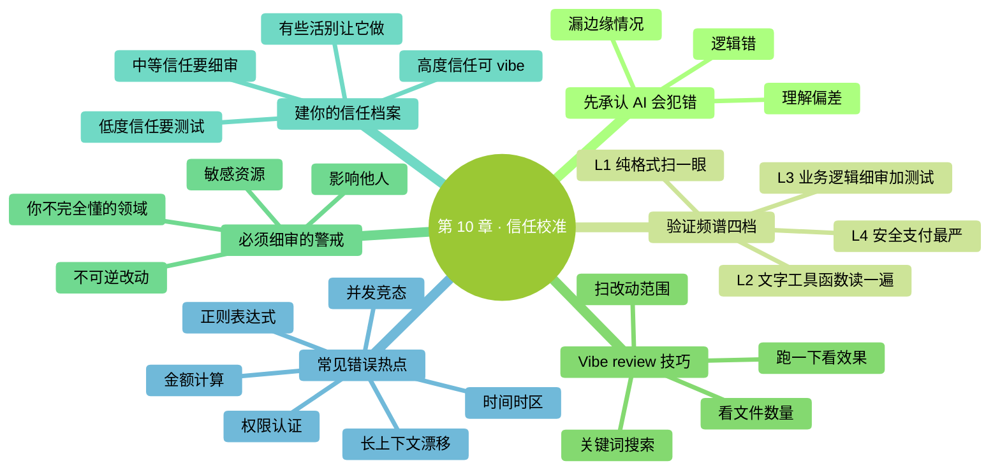

# 第 10 章：信任校准——什么时候信，什么时候核对

> **本章在全书的位置**：第二部分 · 第 10 章 / 预估阅读+动手时长：**主线 25-30 分钟 + 支线 10 分钟**
>
> **前置章节**：Ch 6（diff 审核）+ Ch 8（交互循环）
>
> **学完能做什么（主线）**：建立"**信任校准**"能力——面对不同类型的改动，能快速判断该用多深的审核、哪些必须逐字检查、哪些可以扫一眼通过。这是把 Claude Code 用熟、不翻车的核心判断力。

---

## 开场三问

- **你会遇到什么问题**：前几章让你"审核 diff、走完七步、用安全网"——但审核到什么程度才够？全部细读太累，全部粗看又怕翻车。
- **不读这章会踩什么坑**：两头极端——要么过度谨慎（每次都逐字审、累到不想用）、要么过度信任（盲目 Yes 然后翻车）。
- **读完你会多会什么事**：按改动风险分档检查，该粗看粗看、该细审细审、该跑测试跑测试——稳步用熟 Claude Code 且基本不翻车。

### 本章地图（一眼看全貌）

<!-- diagram: MM-17 -->


---

> 🎯 **【主线】—— 本章必读核心**

---

## 10.1 先承认一个事实：AI 确实会犯错

很多教程避开这个话题，本书正面讲清楚：

> 📌 **AI 生成的内容和改动，出错率比你熟练的人写的高**。

不是故意打击信心——而是你**必须建立正确预期**才能用好它。具体来说：

- **逻辑错误**：AI 写的代码里逻辑错误比人类写的多约 1.7 倍
- **安全漏洞**：涉及权限/认证/加密时，AI 代码出现漏洞的概率更高
- **边缘情况**：AI 容易漏处理"空输入"、"超长数据"、"特殊字符"这类边缘
- **理解偏差**：你说 A，它可能理解成 B，做出来是 C

> 💡 **但这不代表 AI 不能用**——只代表**你不能盲目信**。下一节讲怎么分情况校准信任。

## 10.2 验证频谱——按改动风险选检查深度

不是所有改动都要同样深度审核。用下面这个"频谱"决定：

| 改动类型 | 典型例子 | 建议深度 | 时间预算 |
|---------|---------|---------|---------|
| **L1 纯格式 / 配置** | 缩进、空行、JSON 字段排序、文件重命名 | 扫一眼 | 10-30 秒 |
| **L2 文字类 / 工具函数** | 改文案、重命名变量、小的帮手函数 | 读一遍 + 跑一下看效果 | 1-2 分钟 |
| **L3 业务逻辑** | 改功能、加判断条件、调接口参数、合并数据 | 细读 diff + 跑测试 + 想 3 个边缘情况 | 5-15 分钟 |
| **L4 安全 / 支付 / 权限相关** | 认证、加密、支付、用户权限、敏感数据处理 | **最严** + 静态检查工具（如有）+ 让第二个人 review | 15-30 分钟 |

### 怎么对号入座

面对一个 diff 或命令，先问自己两个问题：

1. **改的是什么类型**？参考上面的 L1-L4
2. **改坏了能不能快速恢复**？能（有 git commit、有备份、不影响别人）→ 可以降一档；不能（影响生产、发给了客户、改了用户数据）→ 升一档

## 10.3 Vibe review——中间策略

很多新手两极化：要么逐字检查，要么完全不看。**你需要学会 vibe review**（凭"感觉"快速审）——**不是偷懒，是高效**。

### vibe review 的动作

30 秒到 1 分钟的流程：

1. **瞄一眼 diff 有几个文件**——和你预期的范围一致吗？
2. **扫改动范围**——动的地方是你让它动的吗？有没有"额外惊喜"（它顺手改了别的）？
3. **关键词搜索**——如果是代码：有没有 `TODO`、`FIXME`、`any`、被注释掉的片段；如果是文档：有没有错别字、重复段落
4. **跑一下看效果**——打开文件快速浏览；跑个测试看有没有报错

**感觉都对 → Yes**
**有任何"怪怪的"感觉 → 升级到细审或 No 让它澄清**

### vibe review 能处理什么、不能处理什么

✅ **能处理**：80% 的日常任务——改文档、整理文件、重命名、加小功能
❌ **不能处理**：涉及安全、支付、用户数据的任务——**永远 L4 深度审核**

## 10.4 必须细审的几类场景（警戒清单）

看到下列情况时，**不能 vibe review**，必须细审：

### 警戒 1：触及敏感资源

- 密码、API key、证书、用户隐私信息
- 支付接口、账单、退款逻辑
- 权限判断（谁能看什么、谁能改什么）
- 数据库写入、删除、更新

### 警戒 2：不可逆的改动

- `rm` 删文件（尤其批量）
- `git push --force`、`git reset --hard`
- 覆盖性命令（`mv A B` 当 B 已存在）
- 数据库 `DROP`、`DELETE`

### 警戒 3：影响他人的改动

- 提交代码到团队共享仓库
- 改生产环境配置
- 发邮件、发 Slack 消息
- 对外发布内容

### 警戒 4：你不完全懂的领域

- 让 Claude 写一段你不懂语言的代码（比如你是 Python 用户，它给你生成 Bash 脚本）
- 改你没接触过的工具配置（比如 nginx、docker）
- 涉及你不熟悉的协议、API

📌 **警戒清单里的任何一条出现 → 强制升级到 L4**，哪怕任务看着简单。

## 10.5 建立你自己的"信任档案"

信任不是一个固定值。对不同类型的任务、不同的代码库，Claude 的靠谱度不同。**记下来**，形成你自己的信任档案：

### 怎么记

用一个简单的笔记文件（或记在 CLAUDE.md 里，第 14 章讲）：

```markdown
# 我对 Claude 的信任档案

## 高度信任（可 vibe review）
- 改文档文案、整理笔记
- 文件重命名、整理分类
- 简单的 Python / JavaScript 小脚本
- 生成 Markdown 表格

## 中等信任（细审）
- 修 bug（它容易改多余的地方）
- 加新功能（它容易漏边缘情况）
- 数据清洗（易出错，需跑样例验证）

## 低度信任（严审 + 测试）
- 认证 / 加密相关代码
- 数据库 schema 变更
- 正则表达式（经常写错）
- 金额 / 时间 / 时区处理

## 不用 Claude 做的
- 删除重要文件（宁可手动）
- 修改生产配置（Claude 给建议，我自己动手）
- 写法律 / 合同 / 医疗 / 金融专业内容
```

### 这个档案怎么更新

- **每次 Claude 犯错**，记下是哪类任务——下次降低信任
- **每次它表现很好**，也可以记下——以后类似任务可以省审核时间
- **每 2-3 个月回头看**，随着 Claude 版本升级、你自己熟悉度提升，重新评估

---

## 本章小结

- AI 会犯错，出错率比熟手高——**不能盲目信**
- **验证频谱 L1-L4**：按改动风险选审核深度（纯格式扫 10 秒、业务逻辑细审 15 分钟、安全相关更严）
- **Vibe review**：30-60 秒的"凭感觉快扫"——能处理 80% 日常任务
- **必须细审的四类警戒**：敏感资源 / 不可逆 / 影响他人 / 你不完全懂的领域
- **建你自己的信任档案**——哪类任务可以放手、哪类必须严审

---

## 动手任务

### 任务 1：给过去做过的改动分级（10 分钟）

回顾你前几章已经让 Claude 做过的改动，用 L1-L4 给每一件事打分：

- 改 `笔记.txt` 加编号 → L?
- `@日程.md` 改 12 小时制 → L?
- Ch 6 任务里让它精简文字 → L?

**成功标志**：你能对照 10.2 节的频谱表做出判断。

### 任务 2：实战一次"先判断后审核"（15 分钟）

**步骤**：
1. 找一个你真实想做的任务（任何类型）
2. **动手前**先想：这是 L 几？需要多深审核？
3. 用 Claude Code 做
4. 按你之前判断的档次审核
5. 做完后反思：档次判断对吗？如果重来，还是这个档吗？

**成功标志**：你开始**有意识地在"做"之前先"判断审核深度"**，而不是每次都一刀切。

### 任务 3：起草你的信任档案（10 分钟）

新建一个文件 `~/Desktop/ccguide-练习/信任档案.md`。照着 10.5 节的模板，写下你目前对 Claude 的信任分级——至少 3 项高度信任 + 3 项需要严审。

**成功标志**：你有了一份个人化的信任档案，以后做类似任务时能直接查。

---

## 如果你卡住了

**症状 A：判断不出改动是 L 几**
- 原因：前期对各类任务风险没经验。
- 解决：**新手倾向升一档**——L2 的东西当 L3 来审。踩几次坑后判断力会准。

**症状 B：vibe review 失误了，放走了错误**
- 原因：vibe 能力还没建立。
- 解决：记下这次失误的类型（比如"加条件语句类的 vibe 审漏了"），下次同类任务升级到细审 1-2 个月，直到 vibe 重新稳定。

**症状 C：对所有东西都想升档到最严，审不过来**
- 原因：过度谨慎。
- 解决：**量化风险**——改坏了影响是"我自己多花 5 分钟修" vs "客户损失 1 万块"？两个审核深度当然不同。

---

主线结束。下面两条支线讲"AI 最容易出错的典型场景"和"团队里怎么统一审核标准"。

---

> 🌿 **【支线】—— 可选深入（学有余力再看）**

---

## 🌿 支线 10.A：AI 最容易出错的几个典型场景

> **这段讲什么**：具体哪些情况下 AI 特别容易翻车，提前知道就能针对性防御。
> **什么时候回头读**：你踩过坑、好奇是不是有规律可循。

### 错误热点 1：时间和时区

- "今天" / "明天" / "三天后"——AI 有时不知道"今天"是几号
- 时区换算——UTC / 北京时间 / 纽约时间，经常算错
- 闰年、月底日期——`2024-02-29`、`1 月 31 日加一个月`

**防御**：给它一个明确的日期（"2026-04-19"），或让它先说今天是几号再算。

### 错误热点 2：金额和计算

- 浮点数精度（`0.1 + 0.2 !== 0.3`）
- 货币单位混淆（分 vs 元）
- 百分比 vs 小数
- 汇率换算

**防御**：给具体例子验证（`100.55 应该得出 150.82`），让它写测试跑一下。

### 错误热点 3：正则表达式

AI 写正则**经常漏边缘情况**。

**防御**：让它写正则时**必须附带测试用例**：能匹配的例子 + 不能匹配的例子，跑一下验证。

### 错误热点 4：权限 / 认证

- 谁能访问什么资源
- Token 刷新逻辑
- 多用户隔离

**防御**：这类**必须人类严审 + 专门的安全测试**，不要靠 vibe review。

### 错误热点 5：并发和竞态

- 同时改一个文件
- 异步操作的顺序
- 锁机制

**防御**：这是专业领域，普通用户碰到就 `/plan` + 找懂的人 review。

### 错误热点 6：长文档上下文遗忘

- 改长文档时，AI 可能忘记前面讨论过的约定
- 同一对话聊太久，前面的设定"漂移"

**防御**：关键设定**定期重申**；对话长了用 `/compact`（第 12 章讲）或 `/clear` 重启。

---

## 🌿 支线 10.B：团队里怎么统一审核标准

> **这段讲什么**：如果你要和同事一起用 Claude Code，怎么避免每个人标准不一致。
> **什么时候回头读**：你公司 / 团队开始大规模用 Claude Code 时。

### 问题

不同人的"什么该细审"不一样——马力觉得一眼过的东西，李四可能会翻车。

### 解决方案 1：写一份团队审核约定

放在项目 CLAUDE.md 或专门的文档里，例：

```markdown
# 团队 Claude Code 审核约定

## 必须细审（至少 L3）
- 任何涉及 `src/auth/` 目录的改动
- 任何涉及支付（`src/payment/`）、用户数据（`src/user/`）的改动
- 数据库迁移（`migrations/`）
- 对外 API 接口变更

## 可 vibe review（L1-L2）
- 改 README / 文档
- 前端样式调整
- 测试文件（已有测试的增补）

## 绝对不用 Claude 做的
- 数据库 DELETE / TRUNCATE
- 生产环境部署脚本
- 删除任何含有用户数据的文件
```

### 解决方案 2：强制 code review

Claude 生成的改动，在 git commit message 里标记（比如加 `[AI]` 前缀），团队成员 review 时格外留意。

### 解决方案 3：自动化检查

对高风险目录加 git hook / CI 检查——敏感目录改动必须多人 review、必须跑完整测试。

（这些都属于进阶团队协作，Ch 25 会再讲一些基础。）

---

**恭喜——你已经完成第二部分（日常使用）全部 6 章**。

你现在具备的能力：
- 读文件（@ 引用 + WHAT/WHERE/HOW/VERIFY 模板）
- 改文件（diff + 三档审核）
- 跑命令（权限机制 + 危险识别）
- 工作节奏（交互循环七步法）
- 安全网（/plan、Esc Esc、/rewind）
- 判断力（信任校准）

**下一部分（第三部分：深度概念）**开始：隐私与数据、上下文原理、三层记忆、CLAUDE.md、模型与成本——这些是让你从"会用"到"用得溜"的关键。

<!-- studio:nav -->
← [第 9 章：计划模式与撤销——先规划，再正确回退](09-%E8%AE%A1%E5%88%92%E6%A8%A1%E5%BC%8F%E4%B8%8E%E6%92%A4%E9%94%80.md) · [目录](../../README.md) · [第 11 章：你的数据去哪了——隐私与数据流](../part3-%E6%B7%B1%E5%BA%A6%E6%A6%82%E5%BF%B5/11-%E4%BD%A0%E7%9A%84%E6%95%B0%E6%8D%AE%E5%8E%BB%E5%93%AA%E4%BA%86.md) →
<!-- /studio:nav -->
