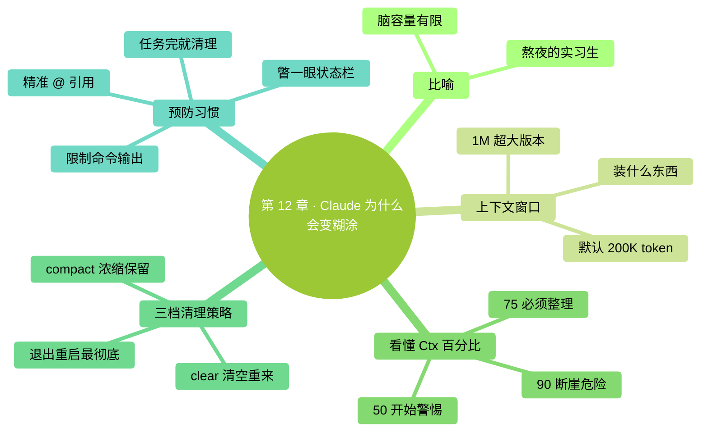

# 第 12 章：Claude 为什么会变糊涂——上下文原理

> **本章在全书的位置**：第三部分 · 第 12 章 / 预估阅读+动手时长：**主线 30-40 分钟 + 支线 15 分钟**
>
> **前置章节**：Ch 3（第一次对话）+ Ch 8（交互循环）
>
> **学完能做什么（主线）**：搞清楚"**上下文**（context）"是什么、为什么聊久了 Claude 会开始糊涂；学会读状态栏里的 **Ctx%**；掌握 `/compact`、`/clear`、新开一个会话的三档策略，把 Claude 的"脑容量"管理起来。

---

## 开场三问

- **你会遇到什么问题**：聊到后面 Claude 开始答非所问、忘掉你前面说的设定、反复改错同一个地方——感觉它"变笨了"。
- **不读这章会踩什么坑**：**硬往一个会话里塞东西**，越用越糟；或**乱 `/clear`**，把还需要的上下文也清掉了。
- **读完你会多会什么事**：看一眼状态栏就知道该不该整理记忆；知道什么时候用 `/compact`、什么时候 `/clear`、什么时候直接退出开新会话。

### 本章地图（一眼看全貌）

<!-- diagram: MM-19 -->


---

> 🎯 **【主线】—— 本章必读核心**

---

## 12.1 比喻先行：一个熬夜的人

想象你身边有一个很聪明的实习生，叫 Claude。他**脑容量有限**（就像人的短期记忆），能同时记住的事情大概相当于**一本小册子的内容**。

一天开始时（对话刚开启），他头脑清晰，读什么都记得。

你不停和他对话、让他读文件、让他跑命令——这些内容一条一条**堆进他脑子里**。小册子越写越满。

满了之后会发生什么：
- **想不清楚**：前面讲过的细节想不起来
- **答非所问**：问 A 回答 B，因为"B"刚好在记忆里更靠前
- **重复犯错**：你前面纠正过的事，他又犯一遍
- **任务漂移**：原本让他做 X，结果他做着做着变成做 Y

这**不是 Bug，不是 Claude 变蠢了**——是"脑容量"这个客观限制到头了。

学会管理这个容量，你就解锁了 Claude Code 的大半。

## 12.2 用技术名词说：上下文窗口（context window）

上面那本小册子，技术上叫**上下文窗口**。所有大模型都有这个限制，Claude 也不例外。

### 窗口里装了什么

- 你说的每一句话
- Claude 的每一句回复
- 你 `@` 引用的文件的**全部内容**（不是摘要，是原文）
- 你让它跑的命令的**完整输出**（`git log` 如果几千行，全都进去）
- CLAUDE.md 的内容（每次启动都加载）
- Claude 自己的"系统提示"（Anthropic 给它的内部指令）
- 工具描述（能用哪些工具）

### 这个窗口多大

Claude 各模型的上下文窗口（以 **token** 为单位，1 token ≈ 0.7 个汉字或 1 个英文单词）：

| 模型 | 窗口大小 | 大致相当于 |
|------|---------|---------|
| Sonnet 4.6 | 200,000 token | 约 15 万汉字 / 一本中篇小说 |
| Opus 4.7（默认） | 200,000 token | 同上 |
| Opus 4.7（1M 上下文版） | 1,000,000 token | 约 75 万汉字 / 一部长篇巨著 |
| Haiku 4.5 | 200,000 token | 约 15 万汉字 |

听起来好像很多？**别高兴太早**——

- 你 `@` 一个 50 万字的 PDF，**直接爆**
- 让它跑 `find / -name "*.md"`，几千个文件路径塞满
- 对话 3 小时不清理，来回几十条消息也满了

**容量限制是客观物理限制，不是 Anthropic 抠门**。

## 12.3 Claude Code 的状态栏：看懂 Ctx%

Claude Code 会在界面底下显示当前**上下文使用率**（简称 Ctx%）。

打开 Claude Code，注意看窗口底部状态栏（不同版本位置略有差异，但都能找到一个像 `Ctx: 34%` 或 `34%` 的数字）：

```
● Claude Opus 4.7    Ctx: 34%    ~/projects/...
```

这 34% 就是"小册子已经写了 34%，还剩 66% 空间"。

### 三档信号

| Ctx 范围 | 状态 | 建议动作 |
|---------|-----|--------|
| **0-50%** | 清醒 | 继续用，不用管 |
| **50-75%** | 开始满 | **准备整理思路**（`/compact` 或转折点收尾） |
| **75-90%** | 明显糊涂 | **立刻 /compact 或 /clear**——再往上性能断崖 |
| **90%+** | 危险区 | 模型开始"遗忘早期消息"、"答非所问"；**马上 /clear 或新开会话** |

### 不同任务消耗速度不同

- **纯对话**（只打字不读文件）：消耗最慢，可能聊几小时才到 50%
- **大量读文件** (`@` 多个大文件)：**消耗极快**，`@` 一个几万字的 PDF 就可能瞬间从 10% 跳到 60%
- **跑命令输出很长** (`git log -n 200`、`npm install` 的日志)：同样快速吃容量
- **上下文里存在一个长 diff**：持续占位

## 12.4 三种清理策略：/compact、/clear、新会话

当 Ctx 逼近警戒线，你有三个工具：

### 策略 A：`/compact`——让 Claude 自己整理思路

**做什么**：Claude 把当前对话**浓缩成关键要点**（去掉冗长的中间步骤和废话），然后用这个摘要替换掉原始对话。

**效果**：Ctx 大幅下降（比如 70% → 20%），**但保留核心共识和决策**。

**什么时候用**：
- 任务还在进行中，**你不想从头开始讲**
- 对话里有你反复纠正的设定、达成的共识——这些要保留

**怎么用**：
```
你：/compact
（Claude 花几秒生成摘要，你会看到一段"已压缩对话"的提示）
你：继续我们刚才的活
```

**注意**：
- `/compact` 是**有损压缩**——细节会丢。如果某个具体变量名、具体数字后面还要用，**最好自己在压缩前记下来**。
- 紧急情况下，`/compact` **只救你一次**。第二次又涨到 70% 时，建议直接 `/clear`。

### 策略 B：`/clear`——清空全部，从头开始

**做什么**：把当前对话**完全抹掉**，Claude 像刚启动一样。

**效果**：Ctx 回到接近 0%（只剩 CLAUDE.md 和系统提示）。

**什么时候用**：
- **任务已经做完**，开始下一个任务
- 对话已经严重跑偏，整理也救不回来
- 做的事和前面完全没关系

**怎么用**：
```
你：/clear
（Claude 重置，下一条消息开始就是全新对话）
```

**注意**：清掉就**拿不回来了**。如果对话里有重要的"不想重新讨论"的决策，要么先 `/compact`，要么在 CLAUDE.md 里记下来。

### 策略 C：退出 + 新会话

**做什么**：完全退出 Claude Code（Ctrl+C 两次 或 `/exit`），重新 `claude` 启动。

**效果**：比 `/clear` 更彻底——连临时文件、工具状态都重置。

**什么时候用**：
- 换了一个**完全不同的项目**（跨 workspace）
- Claude 出现诡异行为，`/clear` 也救不回来
- 一天结束，收工

### 三档速查表

| 情况 | 用哪个 |
|------|-------|
| 任务正干着，只是嫌 Ctx 高 | `/compact` |
| 任务告一段落，开始做下一件 | `/clear` |
| 换项目 / Claude 卡住了 | 退出 + 重启 |

## 12.5 预防比清理更重要：省 Ctx 的 5 个习惯

清理是"病了再治"。**预防**才能让你更久保持清爽状态。

### 习惯 1：@ 引用时用具体路径，不 `@` 整个文件夹

❌ `@整个项目/` → 可能上传几百个文件
✅ `@src/components/Button.tsx` → 只传你需要的

### 习惯 2：大文件先问"摘要"再决定要不要细看

对于可能很长的文件：

```
你：给我 @长文档.md 的 5 点摘要
Claude：（生成摘要）
你：第 3 点让我看看原文对应段落
```

比直接 `@长文档.md 帮我改某段` 省 Ctx。

### 习惯 3：跑命令限制输出

- `git log -n 10`（不是 `git log`，不设限制就全输出）
- `ls src/` （不是 `ls -R /` 递归列出整个目录）
- `cat 短文件.txt`（不是 `cat 一个 10MB 的日志`）

### 习惯 4：每个任务完成就 `/clear`

养成习惯：完成一件任务 → `/clear` → 开始下一件。**不要一个会话跨三天做十件事**。

### 习惯 5：定期检查 Ctx 数字

每几轮对话瞥一眼状态栏。**看到 > 50% 就开始想"这个任务还有多远"**，提前规划是 `/compact` 还是做完就 `/clear`。

---

## 本章小结

- 上下文 = Claude 的"短期工作记忆"，所有对话 / 文件 / 命令输出都占用它，满了会变糊涂
- Claude Code 状态栏的 **Ctx%** 实时显示使用率；**50%** 警惕、**75%** 必须整理、**90%** 断崖危险
- 三档清理：**`/compact`（浓缩保留）→ `/clear`（全清重来）→ 退出重启（最彻底）**
- 清理策略不对 → 要么还是糊涂（该清没清）、要么丢了重要共识（清过头）
- **预防 > 清理**：精准 `@`、限制命令输出、每个任务完成就 `/clear`

---

## 动手任务

### 任务 1：观察 Ctx 变化（10 分钟）

**步骤**：

1. 启动 Claude Code，记下启动时的 Ctx 值（通常 1-5%）
2. `@` 引用一个你手头的 Markdown 或 txt 文件（越长越好）→ 记下新的 Ctx
3. 让它跑一个 `!ls -la ~/Desktop` → 记下 Ctx
4. 来回聊 5-10 轮普通对话 → 记下 Ctx
5. 运行 `/compact` → 记下 Ctx
6. 运行 `/clear` → 记下 Ctx

**成功标志**：你现在直观感受到"什么操作消耗多、什么消耗少"。

### 任务 2：实战一次"长任务 + 主动压缩"（15 分钟）

**步骤**：

1. 找一个你真实想做的稍长任务（读 3-4 个文件 + 写一份报告）
2. 做到一半瞥一眼 Ctx——估计在 40%-60%？
3. **主动运行** `/compact`，观察 Claude 生成的摘要
4. 继续做完剩下的部分
5. 结束后 `/clear`

**成功标志**：你体验了"任务中段主动整理"的节奏，不再等到 90% 断崖才慌。

### 任务 3：建立你自己的 Ctx 纪律（5 分钟）

在你的**个人 Claude Code 使用笔记**（没有就建一个 `~/Desktop/ccguide-练习/我的使用笔记.md`）里写下：

```markdown
# 我的 Ctx 纪律

- [ ] 每次启动后先看一眼状态栏
- [ ] 做大于 3 个文件的任务前，估计是否要 /compact
- [ ] Ctx > 50% 开始"收尾"思考
- [ ] Ctx > 75% 强制 /compact 或 /clear
- [ ] 每完成一个独立任务就 /clear
```

**成功标志**：你有了一份能贴在工作流里的个人约定。

---

## 如果你卡住了

**症状 A：状态栏找不到 Ctx 数字**
- 原因：不同版本位置不同；或你的终端太窄，状态栏被截断。
- 解决：**把终端窗口拉宽**；或运行 `/status` 命令直接查看（会显示当前模型、Ctx、其他状态）。

**症状 B：/compact 后它忘了关键事情**
- 原因：压缩是有损的，关键细节可能没保留。
- 解决：**压缩前自己记下"绝不能丢的 3 件事"**（比如具体的路径、数字、约定），压缩后再把这 3 条贴回去告诉它。

**症状 C：对话没多久 Ctx 就到 70% 了**
- 原因：你 @ 了大文件或跑了长输出命令。
- 解决：**别让 Claude 读整个大文件**。改成：让它先看目录，你再 @ 具体哪一部分；命令加 `-n 20` 之类限量参数。

---

主线结束。下面支线讲"上下文的内部机制细节"和"长上下文模型（1M 窗口）的适用场景"。

---

> 🌿 **【支线】—— 可选深入（学有余力再看）**

---

## 🌿 支线 12.A：Token 是什么——再深一层

> **这段讲什么**：上文多次提到 token，这里说清楚 token 到底是什么、为什么不是"字符数"。
> **什么时候回头读**：好奇为什么一个汉字不等于一个字符、或想估算自己文件要多少 token 时。

### 什么是 token

Token 是模型处理文本的**最小单位**，但它不等于字符，也不等于单词。

大致规律：
- **英文**：约 1 个单词 = 1 token；`hello world` ≈ 2 token
- **汉字**：约 1 个汉字 = 1.5-2 token（Claude 的中文分词偏高）
- **代码 / 特殊符号**：变化很大，一段 JSON 常见的 `"key":` 可能占 3-4 token

### 实用估算

给你一个**拍脑袋公式**：

- 1,000 汉字 ≈ 1,500-2,000 token
- 10,000 英文单词 ≈ 12,000-14,000 token
- 一份 1 万字的 Markdown ≈ 15,000-20,000 token

所以 200K token 窗口：
- 纯中文——大概能塞 **10-12 万汉字**
- 纯英文——大概能塞 **14-16 万单词**

### 为什么在意 token

- **Ctx% 用的就是 token 比例**
- **Anthropic 按 token 计费**（见第 15 章）
- **`/compact` 的本质**：把原始几万 token 的对话**压缩成几千 token 的摘要**

### 怎么查一段文字多少 token

- Anthropic 有官方 [Token Counter](https://www.anthropic.com/pricing)
- 大多数情况不用精确算——**拍脑袋估就够**

---

## 🌿 支线 12.B：长上下文模型（1M 版本）什么时候值得用

> **这段讲什么**：Claude Opus 4.7 有一个**1M 上下文窗口**版本——5 倍于默认的 200K。什么时候值得切过去？
> **什么时候回头读**：你发现 200K 总不够用，在做超大任务时。

### 默认 200K 够不够用

对**大部分日常任务**：

- 改几个文件、读几个 PDF、写几篇文档——**200K 远超需求**
- 一个中等项目的全部代码——基本能塞进 200K

### 什么场景 200K 真不够

- **读整本书 / 整套财报**分析——一本 30 万字小说 = 约 50 万 token
- **跨整个大代码库**做重构分析（几百文件 + 历史日志）
- **长对话连续几小时**不想分段

这时 1M 版本有价值。

### 1M 版本的代价

- **慢**：上下文越长，每轮回复越慢
- **贵**：按 token 计费，用满 1M 一次对话的成本是默认版本的 5-10 倍（见 Ch 15）
- **注意力分布**：上下文太长时，模型**对中间部分的关注度会下降**——这叫 "lost in the middle"——所以 1M 不意味着"塞进去它就全记得"

### 切换办法

在 Claude Code 里运行：

```
/model
```

会弹出可选模型列表，其中有"Opus 4.7（1M context）"选项。点击切换。

**经验法则**：
- 日常任务用 **默认 Opus 或 Sonnet**（200K 够用、快、便宜）
- 偶尔遇到"就这一次需要特别大"的任务再**临时切 1M**，做完切回去

---

## 🌿 支线 12.C：/compact 的工作原理

> **这段讲什么**：`/compact` 到底是怎么压缩的？
> **什么时候回头读**：你想搞清楚它保留什么、丢什么时。

### 压缩过程

1. Claude 读完整个当前对话
2. 生成一个**结构化摘要**，大致包括：
   - 总目标是什么
   - 已完成的关键步骤
   - 重要的决策和约定
   - 还未完成的子任务
   - 关键文件路径和符号名
3. 用这个摘要**替换掉原始对话历史**
4. 上下文从"几万 token 长对话" → "几千 token 摘要" → Ctx% 大幅下降

### 保留什么、丢什么

✅ 通常**保留**：
- 最终决策和约定
- 你反复强调的要求
- 还没做完的事

❌ 通常**会丢**：
- 你纠正过程中的曲折细节
- 早期被否决的方案
- 冗长的命令输出
- 代码的完整内容（会变成"已读过 XX 文件"的记号）

### 怎么让压缩更聪明

压缩前对 Claude 说：

```
你：在 /compact 之前，请先列出你打算保留的 5 个关键点，
    让我确认有没有遗漏。
Claude：好的，我打算保留：
    1. ...
    2. ...
    ...
你：（检查） 2 点里别漏了 X 的决定。（确认后）OK，/compact
```

这样压缩质量高很多。

---

**下一章**：第 13 章"三层记忆"——会话记忆 / 自动记忆 / 项目记忆（CLAUDE.md），什么信息放哪层，怎么搭建一个让 Claude 越用越懂你的系统。
