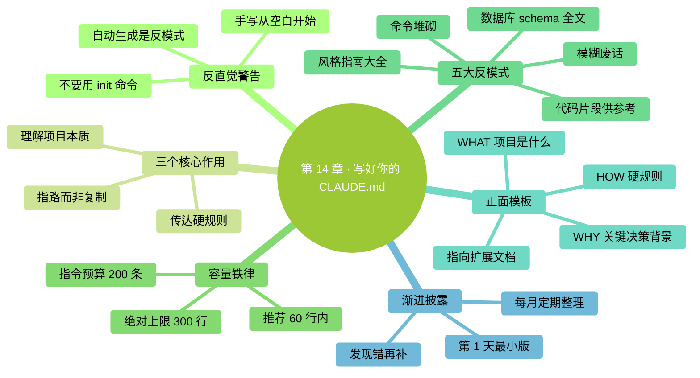

# 第 14 章：写好你的 CLAUDE.md——全书最高杠杆的一章

> **本章在全书的位置**：第三部分 · 第 14 章 / 预估阅读+动手时长：**主线 35-45 分钟 + 支线 15 分钟**
>
> **前置章节**：Ch 12（上下文原理）+ Ch 13（三层记忆）
>
> **学完能做什么（主线）**：学会写一份**精准有效的 CLAUDE.md**——不是越长越好、不是堆砌命令、不是 `/init` 一键生成。会挑内容、懂取舍、懂维护节奏。写出来的 CLAUDE.md 能让 Claude 在你的项目里**真的越用越准**。

---

## 开场三问

- **你会遇到什么问题**：Claude 每次在你的项目里回答都像"第一次听说"——同样的约定要反复讲。
- **不读这章会踩什么坑**：要么**根本不写 CLAUDE.md**（长期遭受重复回答折磨）；要么**乱写 CLAUDE.md**（写成 500 行巨型文档、实际效果反而下降）。
- **读完你会多会什么事**：能判断"哪条信息值得进 CLAUDE.md、哪条不值"；能写出 < 60 行就让 Claude 懂项目的说明书；能维护它不让它膨胀。

### 本章地图（一眼看全貌）

<!-- diagram: MM-21 -->


---

> 🎯 **【主线】—— 本章必读核心**

---

## 14.1 第一反直觉警告：**不要**用 `/init` 一键生成

Claude Code 自带一个命令：`/init`。

你在项目目录里跑 `/init`，Claude 会**自动扫描代码**，生成一份**巨型 CLAUDE.md**——列出所有文件、所有技术栈、所有命令、甚至一些无关的注释。

**听起来很方便**。99% 的博客、视频教程告诉你"装好 Claude Code 第一件事就跑 `/init`"。

**本书告诉你：别这么做。**

### 为什么 `/init` 是反模式

1. **膨胀**：自动生成的 CLAUDE.md 通常 300-1000 行——太长，Claude 注意力会分散
2. **堆垃圾**：它会把 `node_modules` 目录下的一些奇怪内容也写进去；把几十条可以用但没用的命令都列一遍
3. **没有"为什么"**：只有"是什么"——Claude 知道"项目用 Express"，但不知道"**为什么选 Express 而不是 Fastify**"——这才是判断力所在
4. **你不理解就不能维护**：自动生成的你自己都没通读过，之后更新怎么办？谁都不会改的 CLAUDE.md 几个月后就过时

### 正确做法

**手写**。从**一个几乎空白的 CLAUDE.md 开始**，**随着项目进展、随着你发现 Claude 反复犯同一错误**，再往里补内容。

每一条都是你**自己**觉得值得记的。这份文档是**活的**，跟着项目长大。

> 📌 **本书口号**："CLAUDE.md 是写出来的，不是生出来的。"

## 14.2 CLAUDE.md 的三个核心作用

先搞清楚这份文档到底要干什么：

### 作用 1：让 Claude 理解项目本质（WHAT + WHY）

**WHAT**：这个仓库做什么？核心概念是什么？
**WHY**：为什么这么设计？关键决策的背景是什么？

读完 CLAUDE.md，Claude 应该能**一句话说出"这个项目是什么"**。

### 作用 2：传达硬规则（HOW 的一部分）

**不可违反的硬约定**：
- 测试必须 100% 过才能 push
- 所有 API 必须有文档
- 不能直接改 main 分支

这些**不是建议，是红线**。

### 作用 3：路径地图（where to look）

**告诉 Claude 哪里去找更详细的信息**：
- "测试策略的完整规范见 `docs/testing.md`"
- "数据库 schema 在 `db/schema.sql`"

**不复制内容，只给指针**（Pointers > Copies）。

## 14.3 **容量铁律**：越短越好

容量越大 ≠ 效果越好。**反过来：容量越大，效果越差**。

### 为什么

- CLAUDE.md **每次启动都全量加载进上下文**（见 Ch 12）
- 越长，Claude 越难**抓住重点**
- 指令之间可能**互相冲突**或语义重叠，Claude 判断不出该听哪个
- 维护负担指数上升

### 三条硬线

- **绝对上限**：300 行。超过 300 行，**必然存在可以砍的**，本章教你怎么砍。
- **推荐上限**：60 行。小项目、个人项目，60 行能表达清楚。
- **指令预算**：150-200 个**指令性语句**（"必须..."、"不要..."、"优先..."）。超过这个数量，Claude 记不住，自己就会"取舍遗忘"。

### 这是反直觉的

很多人觉得"我把所有规矩都写进去才放心"。实际效果相反——**Claude 面对一份 500 行的文档，会抓住表面几条、忽略中间大部分**。

**写少 = 让重要的被看见**。

## 14.4 反模式清单：这些东西**不要**写进 CLAUDE.md

下面这些是最常见的"错误内容"。你的 CLAUDE.md 里**一条都不应该有**：

### 反模式 1：完整的代码风格指南

❌ 不要写：

```markdown
## 代码风格
- 变量名用 camelCase
- 函数名用动词开头
- 每个函数必须有 JSDoc
- 缩进用 2 空格
- 分号必须有
- 字符串用单引号
...（还有 30 条）
```

**为什么不好**：
- Claude 读代码就能看出风格
- 真正想强制，用 ESLint / Prettier 等工具
- 30 条风格规则会把重要指令淹没

✅ 改成：

```markdown
## 代码风格
- 跟项目现有风格（跑 `npm run lint` 自检）
- ESLint 配置在 `.eslintrc`
```

### 反模式 2：数据库 schema 全文

❌ 不要写：

```markdown
## 数据库表结构
users 表：
  id INTEGER PRIMARY KEY
  email VARCHAR(255) NOT NULL UNIQUE
  name VARCHAR(100)
  created_at TIMESTAMP
  updated_at TIMESTAMP
  ...（30 张表、500 行）
```

**为什么不好**：
- schema 会变，两个地方保持同步很难
- 这是**代码类数据**，应该从代码里读

✅ 改成：

```markdown
## 数据库
- schema 定义见 `db/schema.sql`
- 迁移用 alembic，迁移文件在 `alembic/versions/`
```

### 反模式 3：代码片段"仅供参考"

❌ 不要写：

```markdown
## 示例：创建用户

```python
def create_user(email, name):
    user = User(email=email, name=name)
    db.add(user)
    db.commit()
    return user
```

当你要创建时请照此风格。
```

**为什么不好**：
- 这**就是代码**——应该进代码，不是文档
- 代码改了，CLAUDE.md 还留着旧的

✅ 改成：

```markdown
## 创建新用户
- 参考 `src/services/user.py` 里现有的 create_user 函数
```

### 反模式 4：命令堆砌

❌ 不要写：

```markdown
## 常用命令
- 启动：npm run dev 或 npm start 或 yarn dev 或 yarn start
- 测试：npm test 或 npm run test 或 jest 或 jest --watch
- 构建：npm run build 或 npm run prod 或 webpack
```

**为什么不好**：
- 多个"或"让 Claude 猜——**给它一个推荐**
- 这些命令 Claude 看 `package.json` 就知道

✅ 改成：

```markdown
## 常用命令
- 启动开发：`npm run dev`
- 跑测试：`npm test`
- 构建生产版：`npm run build`
```

### 反模式 5：写进去谁也不看的规矩

❌ 不要写：

```markdown
## 提交规范
- 每次提交必须写清楚
- 要有意义
- 不要提交无关的内容
- 要检查代码质量
- 测试要跑过
```

**为什么不好**：
- 太模糊，Claude 根本无法判断"有意义"
- 是**给人看的废话**，不是给 AI 的指令

✅ 改成：

```markdown
## 提交规范
- 提交消息以 `feat:` `fix:` `docs:` `refactor:` `test:` 之一开头
- 单次提交改动 < 400 行（大改拆成多个）
```

**要点**：CLAUDE.md 里每一条都要**足够具体、机器可执行**——"< 400 行"是机器能检查的，"要有意义"不是。

## 14.5 正面模板：一个好的 CLAUDE.md 长什么样

下面是一份**真实能用**的 CLAUDE.md 模板（55 行）：

```markdown
# 项目：XXX 后端 API

## WHAT（这是什么）

一个为 XXX 产品的移动端提供数据的后端 API。Python 3.11 + FastAPI + PostgreSQL。
目前服务 10 万 DAU，核心模块是订单和推送。

## WHY（关键决策背景）

- **选 FastAPI 不选 Django**：团队偏好异步 IO；Django 的 ORM 对现有遗留 schema 不友好
- **暂不拆微服务**：规模没到，单体够用
- **用 Redis 不用 Memcached**：已经用 Redis 做队列，不想引入第二个缓存

## HOW（协作时的硬规则）

### 不能违反
- 任何改动必须跑 `pytest tests/` 全绿才能 push
- 数据库改动必须用 alembic 迁移，**禁止直接 SQL 改表**
- 新 API 必须放在 `src/api/v2/`，**不碰** `src/api/v1/`（遗留兼容）
- 涉及钱的逻辑（订单金额、退款）**必须写测试且让另一个人 review**

### 目录地图
- API 路由：`src/api/v2/`
- 业务逻辑：`src/services/`
- 数据模型：`src/models/`
- 测试：`tests/`，跟源码同结构

### 常用命令
- 起服务：`uvicorn src.main:app --reload`
- 跑测试：`pytest tests/ -v`
- 迁移生成：`alembic revision --autogenerate -m "xxx"`

## 扩展信息的位置（不复制在这里）

- 详细测试策略：`docs/testing.md`
- 部署流程：`docs/deployment.md`
- 数据库 schema：`db/schema.sql`
- API 接口文档：启动服务后访问 `/docs`

## 正在进行的阶段

**2026-04-19**：重构订单模块的并发处理，禁止对 `src/services/order.py`
做大重构（会有冲突）。小 bugfix 可以。
```

### 为什么这份模板有效

- **55 行，远低于 300 行上限**
- **WHAT / WHY / HOW 三段骨架**——清晰
- **WHY 讲"为什么这么选"**——Claude 能据此做判断，不只是"按规则做事"
- **硬规则用明确语言**（"必须"、"禁止"）——不给 Claude 解释空间
- **Pointers 指向详细文档**，不复制内容进来
- **"正在进行的阶段"告诉 Claude 当下的警戒线**——随项目更新

## 14.6 渐进披露原则：慢慢加、不要一次堆

**你的 CLAUDE.md 不是一次写完的**。正确节奏：

### 第 1 天：写最小版本

只写：
- 项目是什么（1-2 句）
- 3-5 条最硬的规矩
- 目录结构提要

总共 20-30 行。

### 第 1 周：补你观察到的

每次发现 Claude 犯错——**问自己**："这是不是因为我没告诉它？"

- 是 → 加一条到 CLAUDE.md
- 不是（它就是不懂 / 它粗心） → 不要加

### 第 1 个月：定期整理

- 扫一遍：有没有过时的条目？
- 扫一遍：有没有因项目演进变得错的条目？
- 扫一遍：能不能合并相似条目？

### 原则：**每加一条要能说清楚它解决了什么问题**

不能说清就不要加。很多 CLAUDE.md 越写越长，就是因为每条"万一有用"的都加进去。

---

## 本章小结

- **不要用 `/init`**——那会生成一份 300+ 行的垃圾文档。手写、从空白开始。
- **CLAUDE.md = WHAT + WHY + HOW + Pointers**（项目本质 + 关键决策 + 硬规则 + 指路）
- **容量铁律**：推荐 < 60 行，绝对不超过 300 行；< 200 条指令
- **五大反模式**：代码风格大全 / schema 全文 / 代码片段 / 命令堆砌 / 模糊废话——**一条都别写**
- **渐进披露**：从小版本开始，发现 Claude 犯错才补条目；每月整理；每条都要能说清解决了什么问题

---

## 动手任务

### 任务 1：评估一份 CLAUDE.md（可选找一个公开项目，10 分钟）

**步骤**：

1. 在 GitHub 随便搜 `filename:CLAUDE.md`，随便找一个看起来像模像样的项目
2. 打开它的 CLAUDE.md，用本章 14.4 的反模式清单对照扫一遍
3. 数：多少行？是否 < 300？有没有硬规则？有没有 WHY？

**成功标志**：你能准确指出这份 CLAUDE.md 的 3 个优点和 3 个可改进点。

### 任务 2：给你当前一个项目写 CLAUDE.md v0.1（30 分钟）

**步骤**：

1. 选一个你手头的项目（即使是"整理照片"这种非代码项目也行）
2. **不要用 `/init`**。新建 `CLAUDE.md`，复制 14.5 的模板
3. 填进你的项目信息：
   - WHAT：1-2 句
   - WHY：3 个关键决策 + 原因
   - HOW：5 条硬规则
   - Pointers：至少 2 个指路
4. **控制在 60 行内**
5. 保存、启动 Claude Code、问它一个项目相关的问题，看回答质量

**成功标志**：你有了一份**真正自己懂的** CLAUDE.md，Claude 的回答比之前更准。

### 任务 3：用 5 天养成"发现问题就改 CLAUDE.md"的习惯（跨天，持续 5 天）

**步骤**：

1. 连续 5 天，每天用 Claude Code 处理你的项目至少 15 分钟
2. 每次 Claude 犯错或让你重复解释时，**立刻**问自己："这是不是该进 CLAUDE.md？"
3. 是 → 立刻加一条（加完保存）
4. 5 天后回看 CLAUDE.md，看增加了多少条

**成功标志**：你的 CLAUDE.md **比 5 天前多了 3-8 条**——**每条都能说清当初为什么加**。这是 CLAUDE.md 正确的成长方式。

---

## 如果你卡住了

**症状 A：不知道项目的"WHY"该写什么**
- 原因：这是设计决策背景——你做项目时的考虑。
- 解决：问自己 3 个问题——"为什么选这个技术栈？为什么这么分目录？为什么有这些硬规则？"——答案就是 WHY。

**症状 B：我的项目是非编程项目（整理文件、写文档）**
- 原因：本章示例偏代码项目，但 CLAUDE.md 同样适用。
- 解决：WHAT = "这是什么项目、整理什么内容"、WHY = "为什么这么分类"、HOW = "命名规则、保存位置、不能碰的文件"。原理完全一样。

**症状 C：写完 CLAUDE.md，Claude 的表现没明显变好**
- 原因：要么条目太模糊 Claude 用不上，要么写的东西本来它就知道（读代码就懂）。
- 解决：**删一半**——只留 5 条最特殊、最违反直觉的规则。观察效果。**少而精 > 多而杂**。

---

主线结束。下面支线讲"团队场景的 CLAUDE.md"和"项目 CLAUDE.md 版本管理"。

---

> 🌿 **【支线】—— 可选深入（学有余力再看）**

---

## 🌿 支线 14.A：团队场景下的 CLAUDE.md

> **这段讲什么**：多人协作时 CLAUDE.md 的组织方式。
> **什么时候回头读**：你的项目开始有多个人用 Claude Code 时。

### 问题：不同人的习惯冲突

小明加一条"函数必须有文档字符串"，小红觉得"短函数没必要"。两个人来回改 CLAUDE.md 就打架了。

### 解决方案 1：CLAUDE.md 作为**团队共识**

把 CLAUDE.md **当作代码一样进 git**，改动走 PR review：

- 每次改 CLAUDE.md 都提 PR
- 至少 1 人 review + 讨论
- merge 之后**所有人 pull 下来就同步了**

这样 CLAUDE.md 成了团队**正式约定**，不是某个人的偏好。

### 解决方案 2：分层——全局 + 项目

- **项目 CLAUDE.md**（共享、进 git）：所有人必须遵守的硬规则
- **`~/.claude/CLAUDE.md`**（个人、不进 git）：每个人自己的偏好

这样个人偏好不污染团队约定。

### 解决方案 3：放在 CLAUDE.md 里的"团队规范"文件夹

有的项目会把 CLAUDE.md 拆成主文件 + 多个子文件（**当项目很复杂时才用**）：

```
CLAUDE.md                    # 入口，指向子文件
.claude/
  testing.md               # 测试规范
  api-design.md            # API 设计规范
  deployment.md            # 部署规范
```

CLAUDE.md 里写：

```markdown
## 深入话题（按需看）

- 测试规范：`.claude/testing.md`
- API 设计：`.claude/api-design.md`
```

Claude 会在需要时去读那些文件——但**不会一启动就全加载**（靠 Skills 机制实现按需加载）。

### 一个经验

**90% 的项目不需要分层**。一份 60-150 行的 CLAUDE.md 走完全程。只在**大型团队 + 复杂项目**才需要拆文件。

---

## 🌿 支线 14.B：CLAUDE.md 的版本管理

> **这段讲什么**：CLAUDE.md 作为"活文档"的演化怎么追踪。
> **什么时候回头读**：你想了解"这条规则是什么时候加的、当时为什么加"时。

### 把 CLAUDE.md 当作代码

- 进 git，提交时**附带说明**：
  ```
  git commit -m "CLAUDE.md: add rule against direct SQL migrations after incident with prod schema drift"
  ```
- 未来想改动时，看 `git log CLAUDE.md`——所有演化一目了然

### 删 vs 标记过时

有一条旧规则不再适用——直接删好，还是标记"已废除"好？

**一般直接删**——CLAUDE.md 是 Claude 的指令，**留着会让它混淆**。删除历史留在 git 里就好，不放到当前版本。

### 每条规则的"诞生故事"

理想情况下，每加一条规则都在 git 提交消息里写一句：**这条解决了什么具体事故或问题**。

半年后回来看，你一眼能想起"**哦，这条是当年 XX 事故后加的**"——还**有效就保留，已经不必要就删**。

### 和"渐进披露"原则配合

- 主线 14.6 讲"渐进加"——从小到大、按需增长
- 本支线讲"怎么追踪演化"——让每次增长都**可追溯、可回退**

两者结合：**CLAUDE.md 是一份活的、跟项目一起长的、可审计的团队共识**。

---

**下一章**：第 15 章"模型与成本"——讲 Sonnet / Opus / Haiku 怎么选、`/status` 怎么读、大致要花多少钱、怎么省——给你一份**可控的预算预期**。


---

<!-- chapter-nav -->

📖  [← 第 13 章 · 三层记忆](13-三层记忆.md)  ·  [📑 返回目录](../../README.md)  ·  [第 15 章 · 模型与成本 →](15-模型与成本.md)
