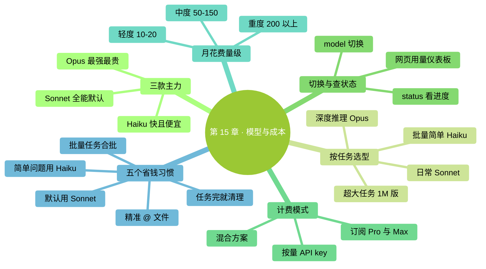
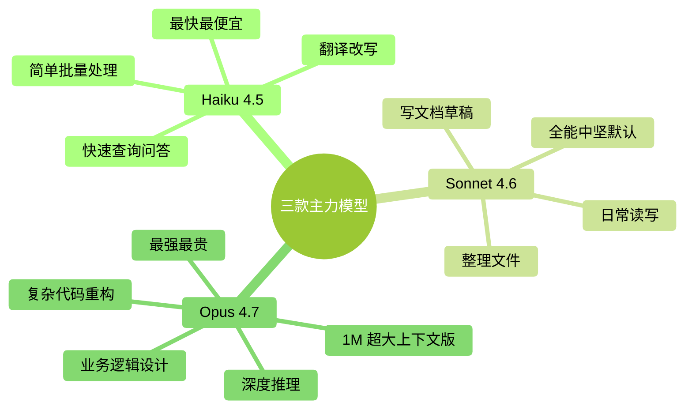

# 第 15 章：模型与成本——怎么选、怎么算、怎么省

> **本章在全书的位置**：第三部分 · 第 15 章 / 预估阅读+动手时长：**主线 25-30 分钟 + 支线 10 分钟**
>
> **前置章节**：Ch 12（上下文原理，搞懂 token）
>
> **学完能做什么（主线）**：知道 Claude 有**几款模型**（Haiku / Sonnet / Opus），各自擅长什么、贵多少；会读 `/status` 和使用量；知道**大致一个月要花多少钱**；掌握 5 个省钱的小习惯。

---

## 开场三问

- **你会遇到什么问题**：听说用 AI 会花不少钱，担心用着用着月底收到大账单；不知道什么场景该用贵模型、什么场景便宜的就够。
- **不读这章会踩什么坑**：一律用最贵的模型（浪费）；或一律用最便宜的（关键任务翻车）。
- **读完你会多会什么事**：对每个任务能快速判断"这个用哪款模型合适"；心里有一份月度预算预期，不会被账单吓到。

### 本章地图（一眼看全貌）

<!-- diagram: MM-22 -->


---

> 🎯 **【主线】—— 本章必读核心**

---

## 15.1 三款模型——一句话对比

Anthropic 目前主力三款模型，像三个不同岗位的实习生：

| 模型 | 比喻 | 速度 | 智力 | 价格 |
|------|------|-----|-----|------|
| **Haiku 4.5** | 干活很快的助理 | **最快** | 入门 | **最便宜** |
| **Sonnet 4.6** | 全能中坚 | 中等 | 强 | 中等 |
| **Opus 4.7** | 顶尖思考者 | **最慢** | **最强** | **最贵** |

<!-- diagram: MM-04 -->


**记住规律**：

> 🔑 **越智能 = 越慢 = 越贵**——三者是绑定的，没有"又聪明又便宜又快"的模型。

### Opus 4.7 和 Opus 4.7（1M 上下文版）

Opus 有两个版本：
- **默认 Opus 4.7**：200K 上下文窗口
- **Opus 4.7（1M）**：1M 上下文窗口（5 倍大），更贵

除非你真的在做超大项目（见 Ch 12 支线 B），**日常用默认版就够**。

## 15.2 怎么选——按任务类型

### 场景 A：日常读写、整理文件、写文档草稿

→ **Sonnet 4.6**

理由：够聪明 + 不慢 + 不贵。**大部分日常任务它就是最优解**。

### 场景 B：需要深度推理的复杂任务

例子：
- 大段代码重构，要一次性想清楚多文件的影响
- 复杂的业务逻辑设计
- 分析长文档、生成深度洞察

→ **Opus 4.7**

理由：这是它的强项。用 Sonnet 可能**似是而非**，用 Opus 能**真的理解**。

### 场景 C：简单批量处理、快速查询

例子：
- 批量改几十个文件的格式
- 简单的问答（"这个命令什么意思"）
- 翻译、简单改写

→ **Haiku 4.5**

理由：任务对智力要求不高，**选快的 + 便宜的**，体验更好。

### 场景 D：长文档 / 大项目

→ **Opus 4.7 (1M)**（仅在默认 200K 不够时）

### 新手最简经验

如果你不想记这么多：

- **默认用 Sonnet 4.6**——覆盖 80% 场景
- **遇到卡住或深度推理用 Opus 4.7**
- **简单速查用 Haiku**

## 15.3 怎么切换——`/model` 命令

在 Claude Code 里随时可以换模型：

```
/model
```

会弹出一个列表，显示可用模型（大致如下）：

```
Select a model:
  1. Claude Sonnet 4.6 (默认)
  2. Claude Opus 4.7
  3. Claude Opus 4.7 (1M context)
  4. Claude Haiku 4.5
```

选一个，后续对话就用新模型。

### 切换是**即时生效**的

- 不需要重启
- 不影响已有上下文——当前对话继续，只是"处理这句话的大脑"换了
- **可以中途切换**——任务前期用 Opus 想清楚策略，后期执行细节换 Sonnet

### 一个实用技巧：Opus 规划 → Sonnet 执行

```
（启动，默认 Sonnet）
/model → 选 Opus
你：分析 @这个项目/ 的代码结构，规划一个模块拆分方案
Opus：（给深度方案）
你：OK，方案我同意。

/model → 选 Sonnet
你：按刚才方案一步步执行，先改 src/foo.py
Sonnet：（执行）
```

**规划用 Opus**（深度思考，值回票价），**执行用 Sonnet**（快且便宜）。

## 15.4 怎么查用了多少——`/status` 和账单页

### 在 Claude Code 里查

```
/status
```

会显示：
- 当前模型
- 当前会话用了多少 token
- 当前 Ctx%
- 其他状态信息

这是**单次会话**的实时情况。

### 在网页后台查历史

Anthropic 官网 [console.anthropic.com](https://console.anthropic.com)（或 Claude.ai 账户设置）有**用量仪表板**：

- 按天的 token 消耗
- 按模型分的费用
- 订阅计划剩余额度

### 两种付费模式

Claude Code 目前有两种：

| 模式 | 怎么计费 | 适合谁 |
|-----|---------|------|
| **Claude Pro / Max 订阅** | **月费**，有每日用量上限 | 重度个人用户（20-200 美金/月级别） |
| **API Key 按量付费** | 按**每 1M token** 计价 | 轻度用户 / 公司 / 和别的工具共用 |

### 大致价格（2026 年水平，可能随时调整）

> 下面是按 API 算的大致单价，供参考。订阅制等于把这些用量打包成月费。

| 模型 | 输入（每 1M token） | 输出（每 1M token） |
|------|------------------|------------------|
| Haiku 4.5 | ~$1 | ~$5 |
| Sonnet 4.6 | ~$3 | ~$15 |
| Opus 4.7 | ~$15 | ~$75 |
| Opus 4.7 (1M) | ~$30 | ~$150 |

**官方最新价格请查**：[anthropic.com/pricing](https://www.anthropic.com/pricing)——本书出版后价格会变。

## 15.5 一个月大概要花多少——量级感

没做过 AI 工具的人对"一个月多少钱"没概念。给你三类参考：

### 轻度用户：每天 10-30 分钟

例子：偶尔整理文件、写几段文字

- 月均 token 消耗：**3-5M**（约 500 万 token）
- 费用：**$10-20 / 月**
- **建议方案**：Claude Pro（$20/月）或按量 API

### 中度用户：每天 1-2 小时

例子：日常工作里频繁用它整资料、改文档、做小脚本

- 月均 token 消耗：**30-50M**
- 费用：**$50-150 / 月**
- **建议方案**：Claude Max（更高限额，$100-200/月）或按量

### 重度用户：每天 3+ 小时的专业开发

例子：全职写代码、大量用 Opus 做复杂重构

- 月均 token 消耗：**100-300M**
- 费用：**$200-800 / 月**
- **建议方案**：Max 订阅 + 按量混用；或公司报销

### **注意：Ctx 爆满情况下费用翻倍**

上下文越长，每轮对话的"输入"部分越大。一个 180K 上下文的对话，每轮输入就**烧 18 万 token**，Opus 按 15 美元/1M 算——**每轮光输入就 2.7 美元**。

所以**管好上下文（/clear、/compact）直接就是省钱**。

## 15.6 五个省钱习惯

### 习惯 1：**默认 Sonnet，不默认 Opus**

很多新手一上来就切 Opus——**10 倍贵**，大部分任务没必要。

**规则**：用 Sonnet 试，**卡住了再切 Opus**。

### 习惯 2：**任务完成 `/clear`**

（Ch 12 已讲）每多一轮对话，之前的积累都要重新发一次。**清完重来比一直续着便宜**。

### 习惯 3：**精准 `@`，不 `@` 整目录**

- `@src/Button.tsx` → 可能 2K token
- `@src/` → 可能几十 K 甚至 100K+ token

**每次花 5 秒想清楚"真需要的是哪个文件"**。

### 习惯 4：**简单问题用 Haiku**

- "这个命令什么意思" → Haiku 够用
- "这段错误是什么原因" → Haiku 够用
- "翻译这段" → Haiku 够用

这类任务用 Sonnet 或 Opus 是浪费。

### 习惯 5：**批量任务合批**

不要一次性发 10 条"改一下这个文件的这段"。**合并成一次任务**：

❌ 差：
```
你：改 a.py 的 X
（Claude 回答）
你：改 b.py 的 Y
（Claude 回答）
你：改 c.py 的 Z
...
```

✅ 好：
```
你：我有三个改动要做，一次说完。@a.py 改 X；@b.py 改 Y；@c.py 改 Z。
```

第二种只用一次"大脑循环"，前者用三次，后者更便宜也更快。

---

## 本章小结

- Claude 有三款主力：**Haiku（快便宜）、Sonnet（中坚，日常默认）、Opus（最强最贵）**——越强越慢越贵
- **选择原则**：日常 Sonnet；深度推理或卡壳切 Opus；简单批量用 Haiku；超大任务 Opus (1M)
- `/model` 切换模型；`/status` 看当前会话；网页后台看历史用量
- 月花费量级：轻度 $10-20、中度 $50-150、重度 $200+——**订阅或按量二选一**
- **五个省钱习惯**：默认 Sonnet / 任务完成 /clear / 精准 @ / 简单问题用 Haiku / 合批

---

## 动手任务

### 任务 1：跑一次 `/status` 熟悉界面（3 分钟）

**步骤**：
1. 启动 Claude Code
2. 运行 `/status`
3. 记下你看到的所有信息——模型、Ctx%、本次用量

**成功标志**：你现在知道随时用 `/status` 查进度。

### 任务 2：用同一个问题对比 Sonnet 和 Opus（10 分钟）

**步骤**：
1. 准备一个**稍有深度**的问题（例："给我的 `@一个项目/` 提三个可以重构的点"）
2. 先用 Sonnet 问一遍，记录回答
3. `/model` 切 Opus，同一个问题再问一遍
4. 对比：Opus 的回答是不是**真的深一层**？速度慢了多少？

**成功标志**：你对"什么时候 Opus 值钱、什么时候不值"有了直觉。

### 任务 3：查你过去 30 天的用量（5 分钟，需要已用过几天）

**步骤**：
1. 打开 [console.anthropic.com](https://console.anthropic.com) 或 Claude.ai 账户页
2. 找到 "Usage" / "用量" 页
3. 看上月总花费

**成功标志**：你对自己的实际花费水平有了数字，不再凭感觉。

---

## 如果你卡住了

**症状 A：`/model` 列表里看不到 Opus 或 Haiku**
- 原因：(a) 账户没开对应权限；(b) Pro 用户某些高级模型要 Max 订阅。
- 解决：查账户订阅等级；或用 API key 用量付费模式（通常所有模型都可用）。

**症状 B：钱花得比预期快很多**
- 原因：(a) 一直用 Opus；(b) 上下文总是满的；(c) `@` 了大文件 / 大目录。
- 解决：(a) 切 Sonnet；(b) 养成 `/clear` 习惯；(c) 精准 `@`。

**症状 C：遇到 "rate limit" 报错**
- 原因：短时间内用太多——达到每分钟 / 每小时额度上限。
- 解决：等 1-5 分钟；或暂时切到 Haiku；或升订阅等级。

---

主线结束。下面支线讲"按量 vs 订阅怎么选"和"公司报销的一点建议"。

---

> 🌿 **【支线】—— 可选深入（学有余力再看）**

---

## 🌿 支线 15.A：按量付费 vs 订阅——怎么选

> **这段讲什么**：Claude Pro/Max 订阅 vs 自备 API key 按量计费，哪种更划算。
> **什么时候回头读**：你第一个月账单出来后想优化时。

### 订阅（Claude Pro / Max）

**优点**：
- **月费固定**，不担心突然大账单
- 额度用不完也不退，但心理负担小
- 升级模型选择方便（Max 能用最高档的）

**缺点**：
- **有每日额度**——用多了会被限速
- 额度用不完当月清零，**波动大的用户不划算**

**适合**：稳定高频用户（每天都用 1 小时以上）

### API key 按量

**优点**：
- **真正按量算钱**——用多少付多少
- 可以用第三方工具共享同一个 key
- 公司场景便于报销（拿到发票）

**缺点**：
- 有**月底大账单**的风险
- 每个模型的价格要自己比

**适合**：
- 用量波动大的用户（有时一天几小时，有时一周不用）
- 小团队共享
- 公司场景

### 混合方案

**高阶玩法**：**订阅 + API key 两份**，视情况切换：
- 日常用订阅（用额度）
- 订阅额度用完 / 特殊场景用 API key

这种配置复杂，一般人不需要。**先订阅一个月看看自己的模式**再决定。

---

## 🌿 支线 15.B：团队 / 公司场景的一点建议

> **这段讲什么**：打算给团队用、或公司报销时的几个注意点。
> **什么时候回头读**：你要为团队采购 Claude 时。

### 建议 1：查清楚公司 AI 政策

（Ch 11 讲过）很多公司对 AI 工具有**采购流程**，别自己买了之后报销碰钉子。

### 建议 2：选择 Claude for Work / Enterprise

如果规模大（10 人以上）：
- 支持 SSO 登录
- 可配置数据保留策略（0 天、30 天等）
- 团队统一计费
- 更严的合规约定

比每个员工自己买订阅规整得多。

### 建议 3：团队共享不共享？

**共享一个 API key**给所有人用：
- ✅ 省管理成本
- ❌ 用量监控困难，谁花多了看不清

**每人一个 key / 账号**：
- ✅ 用量清晰
- ✅ 方便审计
- ❌ 管理复杂

**推荐**：**每人一个账号**，但**统一结算**到公司（Anthropic 企业版就是这么设计的）。

### 建议 4：预算控制

- Anthropic 有**每月支出上限**可以设——防止爆单
- 建议公司级账户设 $X/月 上限，超了自动停
- 个人账户也可以设 $50 / $100 这种保护线

---

**第三部分（深度概念）到此完成**。

你现在已经掌握了：
- Claude Code 的数据去哪了、什么能发什么不能（Ch 11）
- 上下文为什么会满、三种清理策略（Ch 12）
- 三层记忆系统，每层放什么（Ch 13）
- 怎么写一份让 Claude 真的变准的 CLAUDE.md（Ch 14）
- 怎么选模型、怎么算成本、怎么省（Ch 15）

**下一部分（第四部分：避坑与判断力）**开始：10 大常见错误、什么时候该停下来、常用命令速览、输入技巧——**把你从"会用"推到"用得不踩坑"**。
