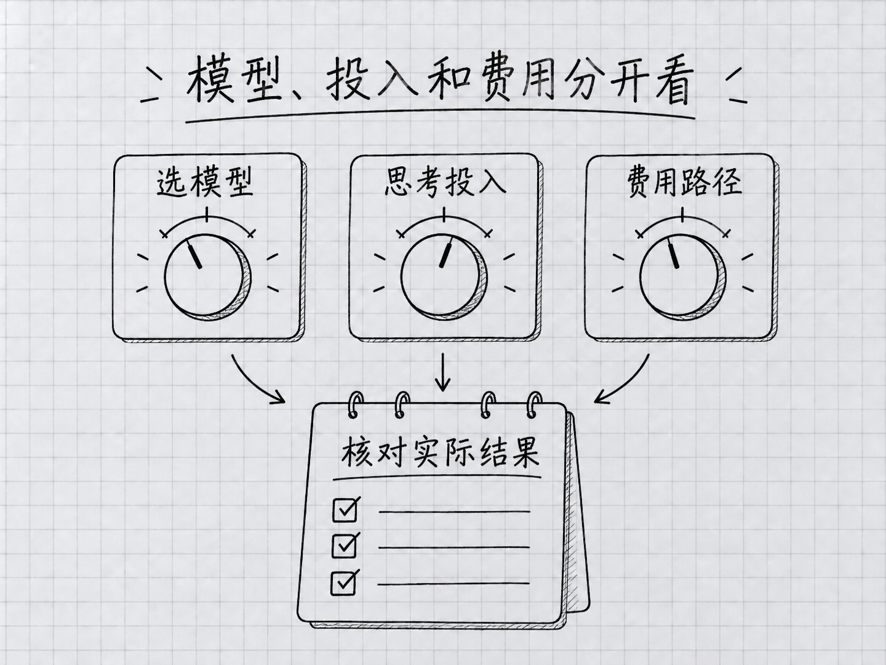

# 第 15 章：模型与成本——怎么选、怎么算、怎么省

> **本章在全书的位置**：第三部分 · 第 15 章 / 预估阅读与动手时长：主线 30 分钟，支线 10 分钟。
>
> **前置章节**：第 12 章（上下文——Claude 的短期工作记忆）。
>
> **学完能做什么**：选对模型，分清套餐额度与额外收费，查到自己的实际用量，给一个任务设定合理的开支边界。
>
> **核对日期：2026-09-24。** 本章按 Claude Code 命令行版本 2.1.280 或更新版本说明；模型、价格和套餐可能继续变化，购买前以账户页面为准。

---

## 开场三问

- **你会遇到什么问题**：菜单里多了 Fable 5.1 和 Opus 5.5。名字越新是不是越值得用？已经交了月费，为什么还会出现额外付费提示？
- **不读这章会踩什么坑**：把模型窗口当成免费额度，把界面的费用估算当成账单，或者为了省一点单价反复重做同一任务。
- **读完你会多会什么事**：先确认钱从哪里扣，再选模型；遇到限额时知道该查哪一项，而不是盲目升级。

### 本章地图（一眼看全貌）

本章图解：[模型、投入和费用分开看](#153-学会选模型别把三个开关混成一个)。

---

> 🎯 **【主线】—— 本章必读核心**
> 读完这部分并完成章末任务，就能进入下一章。

## 15.1 先看钱从哪里扣，再看模型叫什么

假设你买了一个月的 Claude Pro，然后打开 Claude Code。日常任务用了套餐中的额度；过一会儿，你选择 Fable，界面却提示需要 usage credits。这个英文指的是**额外付费用量**，不能理解成月费里又送了一份额度。

Claude Code 可以连接不同账户。对新手，先分清下面三种情况就够了。

| 当前付款方式 | 你付的是什么 | 应该去哪里核对 |
|---|---|---|
| Claude Pro、Max 等订阅 | 月费及套餐包含的使用额度 | Claude 网页账户的 Usage（用量）页面 |
| 订阅加 usage credits | 月费之外、按实际使用另付的钱 | 同一用量页面里的额外用量与支出上限 |
| Claude API 或云服务账户 | 按模型实际消耗计费；API 是程序连接模型的接口 | 对应服务的控制台账单 |

个人网页订阅目前是：Pro 月付 **20 美元**，年付 **200 美元**；Max 有 **100 美元/月**和 **200 美元/月**两档。这些不是“无限使用”的价格。税费、购买渠道及后续调整也会影响实付金额。[官方套餐页](https://claude.com/pricing)、[Max 方案说明](https://support.claude.com/en/articles/11049741-what-is-the-max-plan)

Fable 5.1 的区别尤其值得记住：**Pro 从开始使用 Fable 时就需要额外用量；Max 可在现有周额度中，拿出最多 50% 用于 Fable。** 它没有让周额度凭空增加一半，其他模型也会消耗同一份额度。Team 标准席位与高级席位也有区别，支线再说。[Fable 套餐说明](https://support.claude.com/en/articles/15424964-claude-fable-models-on-your-plan)

因此，“我有 Pro，所以模型菜单里所有选项都已包含”这个判断不成立。看到额外收费提示，先读清金额来源；你也可以取消，继续用已包含的模型。购买更贵的套餐同样不是本章动手任务的前提。

## 15.2 四个名字，先从自己的任务出发

**模型**是 Claude Code 用来理解、判断和生成内容的部分。它与能否读取文件、运行命令是两回事：换模型不会自动扩大操作权限。

截至核对日，当前常用系列可以这样认识。表里的“适合”是尝试方向，不是保证每次都能完成。

| 模型 | 你可以先拿什么任务试它 | 选择时留意什么 |
|---|---|---|
| **Opus 5.5** | 比较几份方案、修改跨多个文件的项目、整理有矛盾的资料 | 当前多数官方账户的默认起点；先用默认思考档位 |
| **Fable 5.1** | 较长、较难、需要持续调查和核验的任务 | 单价更高；先核对你的套餐是否包含 |
| **Sonnet 5** | 要求明确的日常处理、普通文档与代码修改 | 标准 API 单价低于 Opus；仍要检查结果 |
| **Haiku 4.5** | 短文本分类、格式转换、简单解释 | 任务若有复杂判断，不要只看速度和单价 |

官方模型总览建议，大多数工作先从 Opus 5.5 开始；对它仍完成不好的复杂推理和长任务，再考虑 Fable 5.1。旧版“日常一律 Sonnet、Opus 永远最贵最慢”的口诀已经不适合直接沿用。[当前模型总览](https://platform.claude.com/docs/en/models/overview)

本章图解：[模型、投入和费用分开看](#153-学会选模型别把三个开关混成一个)。

比如整理一份会议记录，成功标准是“找出决定、负责人、日期，并把没有说清的地方标出来”。先拿一个模型做一份，看看有没有漏项。如果换成更贵的模型只是多写了几段话，却没有减少错误，就没有必要为这项任务升级。

反过来，便宜模型反复漏掉关键约束，需要你来回纠正，也会消耗时间和用量。比较的是**把事情做对的总代价**，不只是价目表上的单价。也不要把一次成功当成模型能包办所有工作的证据。

## 15.3 学会选模型，别把三个开关混成一个

本章里的斜杠命令都输入在 **Claude Code 的对话框**，不是退出后那个普通终端提示符后面。先输入 `/model`，打开模型选择器，看清当前版本和是否有额外收费提示。

<!-- diagram: FIG-017 -->


*图：模型选择、思考投入和用量路径分别判断，不把名称当作固定价格或能力排名。*
<!-- /diagram: FIG-017 -->

如果你直接使用 Anthropic 服务，并希望确定选中本章介绍的版本，可以输入：

```text
/model claude-opus-5-5
```

需要 Fable 且已经确认付款方式时，再输入 `/model claude-fable-5-1`。这种完整名称比只记 `opus` 或 `fable` 更适合复现一次练习；简写会随着软件版本或服务提供方变化。升级和不同服务的差别见[附录 J](../附录/J-Opus-4.7新手指南.md)。

在当前版本里，直接用 `/model 名称` 切换会保存为以后会话的默认选择。只想试一次，就打开 `/model`，用上下方向键移到模型那一行，按字母 **s**，表示仅用于这次会话。按 Enter（回车键）则会保存选择。[模型配置说明](https://code.claude.com/docs/en/model-config)

第二个开关是 **effort（思考投入档位）**。用 `/effort` 可以查看和调整。Opus 5.5 默认是 `medium`，Fable 5.1 默认是 `high`；这不代表前者“只有中等智力”。档位表示同一模型如何安排思考投入，不是跨模型的分数。先保留默认值，发现任务确实需要更深入的判断时再比较其他档位。[effort 说明](https://platform.claude.com/docs/en/build-with-claude/effort)

第三个是 `/fast`，即快速模式。它改变响应速度和计费，不是更换成“小模型”。**Opus 5.5 的 fast 输入/输出价格为每百万 token 8/40 美元；订阅用户通过额外用量付费。** 初次练习不需要开启它。[快速模式说明](https://code.claude.com/docs/en/fast-mode)

## 15.4 空间、额度、费用，要到不同地方看

第 12 章说过，**上下文**是这次对话正在使用的工作记忆；**token**是模型处理文本的单位，不等于固定数量的汉字。你现在要再区分三个问题：

| 你想知道什么 | 先用什么查看 | 这个数字不代表什么 |
|---|---|---|
| 当前版本、模型、账户和配置是什么 | `/status` | 不是最终账单 |
| 本次消耗、套餐使用情况怎么样 | `/usage` | 其中的美元估算不等于订阅额外扣款 |
| 什么内容占着这次对话的空间 | `/context` | 不是本周还剩多少额度 |

这三个命令都可以直接在会话里输入，读完按 Esc（键盘左上角的退出键）关掉面板。具体显示项目随账户与版本而变，不必找一张与教程逐字一致的截图。[命令参考](https://code.claude.com/docs/en/commands)

新模型有 1M，也就是一百万 token 的模型上下文上限。它说明单次工作可处理的范围，**没有承诺送你一百万 token，也没有承诺永远记得对话中的每个细节**。实际会话还受部署方式与自动压缩设置影响。某次任务的上下文只占一小部分，你仍可能已经用完本周套餐额度；换个新会话也不会把周额度重置。

另外，`/usage` 的会话美元数是按 token 和价格计算的估算。对使用套餐内额度的 Pro、Max 用户，它不是一张待付款单；按量账户也应以对应控制台的记录核账。`/clear` 开始新会话后，屏幕上的会话累计数会重新计算，但已经发生的用量不会从账单里消失。[用量与费用说明](https://code.claude.com/docs/en/costs)

读面板的目的，是弄清“现在受什么限制”。不能把上下文变满、周额度用完、额外支出到上限，统一理解成“Claude 不够聪明，换一个模型试试”。

## 15.5 算一笔能核对的账，不猜每月要花多少钱

同样使用半小时，有人只改了三段文字，有人让多个任务反复读取上百份文件。两者不能用一个“每天几分钟对应多少美元”的表准确换算。因此，本书不再按使用时长给出月费预测。

下面是 **2026-09-24 核对的标准 API 美元单价**。1M token 代表一百万个处理单位；输入是交给模型处理的内容，输出是模型生成的内容。缓存读取指重复内容命中缓存后的读取，支线会解释。

| 模型 | 普通输入 / 1M token | 输出 / 1M token | 缓存读取 / 1M token |
|---|---:|---:|---:|
| Haiku 4.5 | $1 | $5 | $0.10 |
| Sonnet 5 | $2 | $10 | $0.20 |
| Opus 5.5 | $4 | $20 | $0.20 |
| Fable 5.1 | $10 | $50 | $0.25 |

缓存写入、快速模式、特定地域及供应商计费可能另有费率。这里不能拿“总输入数”全部乘缓存价，也不能把这张表当作订阅额度换算表。[官方详细价目表](https://platform.claude.com/docs/en/about-claude/pricing)

做一个**纯算术示例，不是真实测试账单**：假设某项任务恰好有 10 万个普通输入 token、1 万个输出 token，全部按标准费率，没有缓存写入等其他项目。那么 Opus 5.5 费用是 `0.1 × 4 + 0.01 × 20 = 0.60` 美元；Fable 5.1 是 `0.1 × 10 + 0.01 × 50 = 1.50` 美元。真实运行时，两个模型的消耗量也可能不同，不能据此断言 Fable 做任何事都贵 2.5 倍。

你更需要的是一份自己的小记录：任务是什么、用了哪个模型、有没有完成、花了多久、账户用量如何变化。先记录几次代表性任务，再决定是否升套餐或改用按量付款，比照着别人的“一个月只要几美元”下注可靠。

## 15.6 省钱从少返工开始，不从删掉所有上下文开始

第一件事是把交付物讲清楚。与其连续发送“再详细些”“不是这个意思”“你把原稿弄丢了”，不如一开始说明文件、保留内容和检查标准。

下面是**练习用输入示例，不是实测对话记录**：

> **你**：把 `@会议记录.md` 整理成行动清单，另存为新文件，保留原稿。每项包含负责人和截止日期；原文没写的填“待确认”，不要猜。完成后列出你找不到依据的项目。

其中 `@会议记录.md` 是在输入框提及文件，帮助 Claude 找到材料。实际练习时要换成你自己的文件名。这段输入不是因为字少才省钱，而是把“做好是什么样”提前讲明白了。

第二件事是只带上有关材料。整理会议记录，不必顺便把整个下载文件夹都交给它。任务完成后开始完全无关的新工作，可以另开会话；还在处理同一个任务时，保留有用决定往往比反复清空、重新解释更合适。`/compact` 是总结压缩旧对话，`/clear` 是开始新会话，二者都不是“退还额度”。

第三件事是一次改变一个变量。觉得慢，先看看是否设置了高 effort；觉得贵，先看看是否开了 fast 或额外用量；觉得答案差，先检查材料和要求。不要同时换模型、换档位、换提示词，否则你不知道哪项改变起了作用。

最后，把额外支出控制放到账户设置里。用自然语言说“别超过 10 美元”可以表达你的期望，却不能代替服务实际提供的支出控制。订阅用户可以从 `/usage-credits` 进入相关页面，核对是否开启、可用余额和月支出限制。[额外用量说明](https://support.claude.com/en/articles/12429409-manage-usage-credits-for-paid-claude-plans)

---

## 本章小结

- 先确认用的是套餐额度、额外用量，还是 API 账单。
- Opus 5.5 是当前常用起点；Fable 5.1 适合另行评估较难、较长的任务。
- `/model` 选模型，`/effort` 调思考投入，`/fast` 是单独计费的加速。
- `/status` 查配置，`/usage` 查用量，`/context` 查空间。
- 1M 上下文不等于免费额度；清空会话也不会清空账单。
- 看完成一个任务的总消耗和返工情况，再决定怎样省钱。

## 动手任务

### 任务 1：找到自己的三个数字（约 5 分钟）

1. 在当前 Claude Code 会话分别运行 `/status`、`/usage`、`/context`。
2. 记下当前模型、用量面板对应的账户类型，以及上下文占用情况。
3. 打开账户用量页面，确认有没有开启额外用量。只查看，不必开通。

**成功标志**：你能说清“我现在用谁、扣哪份额度、哪里看真正账单”。没有权限查看组织账单时，知道应找哪位管理员也算完成。

### 任务 2：做一个有上限的小比较（约 10 分钟，可选）

1. 选一段没有隐私的短会议记录，写明三项检查标准，例如“负责人不漏、日期不猜、原文保留”。
2. 用你已经可用的模型完成一次，保存结果；若想比较另一个模型，在新会话中给出同样材料和要求。
3. 核对两份结果，记录遗漏及用量。遇到额外付款提示可以取消，不为完成练习升级套餐。

**成功标志**：你能指出哪个结果更符合要求，而不只是哪个回复更长。只完成一轮并核验结果，也有价值。

## 如果你卡住了

**问题 A：选不到书里的模型。** 先核对 Claude Code 是否为 2.1.280 或更新版本，再看账户、组织和服务提供方是否开放该模型。参照[附录 J](../附录/J-Opus-4.7新手指南.md)排查；不要把换 API 账户当成一定可用的捷径。

**问题 B：`/usage` 显示美元，但我已经交了月费。** 先区分会话估算与 usage credits 的实际支出。去账户的用量和账单页核对；无法解释的扣费向官方支持提交日期、模型和账单项目，别公开账号密钥。

**问题 C：提示达到限制，换模型也没用。** 读清是本周额度、某模型额度、额外支出上限，还是请求太频繁。总额度用完不能靠换模型恢复，按界面显示的重置时间处理；不要照旧教程一律“等五分钟”。

---

> 🌿 **【支线】—— 可选深入**
> 下面解释缓存和团队账户。第一遍可以直接进入下一章。

## 🌿 支线 15.A：长上下文为什么不能按普通输入价直接相乘

**这段讲什么、什么时候读**：你看着很长的对话担心“每轮都要重新付一次原价”，或者账单与手算不一致时，回来读这一节。

**缓存**可以理解成服务对重复内容做的暂存。再次遇到相同、仍有效的一部分输入，可能按缓存读取价格处理；首次写入缓存又有自己的价格。有没有命中，不由你在提示词里说“缓存一下”决定，应该看服务返回的实际统计。[缓存原理与计费](https://platform.claude.com/docs/en/build-with-claude/prompt-caching)

所以，“这次对话有 18 万 token”不足以算出下一轮账单。你还需要知道新增多少输入、多少命中缓存、多少重新写入，以及模型生成多少输出。工具结果和模型的多步工作也会继续改变这些数。前面那道 0.60 美元的算术题，只适用于它明确给定的假设。

同样，频繁清空并不必然更便宜。若你每次清空后都让它重读同一批材料、重新总结已经做过的决定，可能增加准备工作。真正该清理的是与新任务无关的旧材料；真正该保留的是帮助完成当前任务的依据。把重要决定写进项目文件，再按任务边界安排会话，比盯着一个上下文百分比反复清空更有用。

## 🌿 支线 15.B：团队统一付钱，也要知道谁能使用什么

**这段讲什么、什么时候读**：你替团队采购，或发现自己的模型菜单与同事不同时，再看这一节。

同一组织里的“席位”就是分配给成员的账户名额，可能有不同档位。以 Fable 为例，Team Premium（高级席位）包含一定的 Fable 使用额度，Team Standard（标准席位）使用它需要额外用量。旧版按席位收费的 Enterprise 也区分标准与高级席位；按用量收费的 Enterprise 则按相应费率结算。套餐名称相同，并不能证明每个人都享有相同范围。[Fable 各类套餐说明](https://support.claude.com/en/articles/15424964-claude-fable-models-on-your-plan)

采购前，可以把四件事问清楚：每人分到什么席位，哪些模型可选，谁能批准额外开支，在哪里查看费用归属。管理员还可能限制可选模型；书中能运行的模型命令，在公司电脑上被拒绝，不一定是安装出错。

本书建议每位成员用自己的账户，再由组织管理结算，方便收回离职成员权限和追踪用量。不要为了“大家方便”，把一串 API 密钥发到群里。密钥相当于能代表账户发起请求的凭证，应该由组织的密钥管理方式处理。你也不需要为了读懂这一章配置企业系统：个人使用时，把付款账户和支出边界记清楚，就已经完成了最重要的一步。

---

第三部分到这里结束。你已经从“让 Claude 做事”，走到了“理解它用什么材料、怎样记忆、怎样消耗额度”。下一部分开始练习判断：什么时候可以继续，什么时候需要先检查结果。

> 想专门了解新模型的升级方法、effort 和长任务用法，读[附录 J · Fable 5.1 与 Opus 5.5 新手指南](../附录/J-Opus-4.7新手指南.md)。使用第三方服务前，则先看[附录 K](../附录/K-第三方模型接入.md)，单独核对兼容范围和收费方式。

<!-- studio:nav -->
← [第 14 章：写好你的 CLAUDE.md——全书最高杠杆的一章](14-%E5%86%99%E5%A5%BD%E4%BD%A0%E7%9A%84CLAUDE.md.md) · [目录](../../README.md) · [第 16 章：新手 10 大错误——看完能避开的坑](../part4-%E9%81%BF%E5%9D%91%E4%B8%8E%E5%88%A4%E6%96%AD%E5%8A%9B/16-%E6%96%B0%E6%89%8B10%E5%A4%A7%E9%94%99%E8%AF%AF.md) →
<!-- /studio:nav -->
