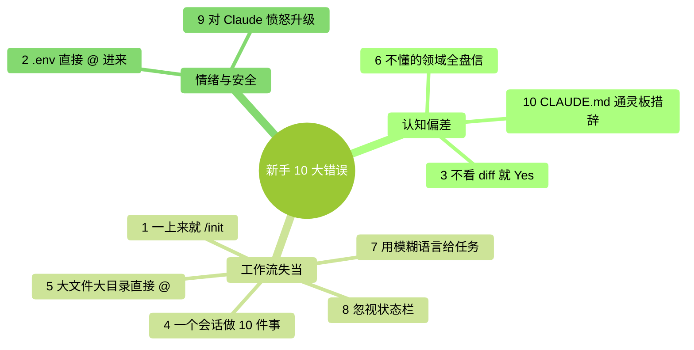

# 第 16 章：新手 10 大错误——看完能避开的坑

> **本章在全书的位置**：第四部分 · 第 16 章 / 预估阅读+动手时长：**主线 25-30 分钟 + 支线 10 分钟**
>
> **前置章节**：读过 Part 1-3 再看，代入感最强
>
> **学完能做什么（主线）**：对零基础用户最常犯的 10 个错误有免疫力。看见每个错就能联想起"本章讲过"——在踩之前先绕开。

---

## 开场三问

- **你会遇到什么问题**：按说该会用了，但总在同一些地方栽跟头；踩一次印象深，但下次又没防住同类。
- **不读这章会踩什么坑**：被动踩坑——只有事故发生后才学到。
- **读完你会多会什么事**：看到这 10 类情境就条件反射警觉——**踩过没踩过都能绕过去**。

---

> 🎯 **【主线】—— 本章必读核心**

---

## 16.1 错误 1：一来就跑 `/init`

**场景**：第一次打开 Claude Code，网上教程说"先 `/init` 生成项目说明书"。一跑，生成了一份 400 行的 CLAUDE.md。

**翻车**：
- 这份 CLAUDE.md 你自己没通读过
- 每次启动它都占你 Ctx
- Claude 抓不到重点——规则太多互相淹没

**正确做法**（详见 Ch 14）：
- **手写**，从空白或 20-30 行模板开始
- 发现 Claude 重复犯错时，**再**补条目
- 容量控制在 < 60 行

## 16.2 错误 2：把 `.env` 或密钥文件 `@` 进来

**场景**：想让 Claude 帮你加一个环境变量配置，直接 `@.env 帮我加一个 REDIS_URL`。

**翻车**：
- `.env` 里已有的密钥（数据库密码、API key）**全部上传到 Anthropic 服务器**（30 天暂存）
- 虽然不训练模型，但**密钥已经离开你的电脑**
- 补救：立刻去每个服务 **revoke** 那些密钥，重新签发

**正确做法**（详见 Ch 11）：
- `.env` 里放敏感值的文件**永远不 `@`**
- 想让它改，**复制一份脱敏版**（值改成 `<REDACTED>`），改完再把真值填回去
- 或**只告诉 Claude 字段名**，不给值

## 16.3 错误 3：不看 diff 就无脑 Yes

**场景**：让 Claude 改一个文件，它说"改好了"，你 Enter Enter 下去没细看。

**翻车**：
- 它**"顺手"多改了几个你没让它改的地方**——常见
- 新增了一段你不需要的"防御性代码"
- 删掉了你原来有意保留的注释

**正确做法**（详见 Ch 6、Ch 10）：
- 即使 vibe review，也要**扫一眼 diff 文件数 + 改动范围**
- 看到"顺手改了 X"立刻 No，让它只做你要求的事
- 高风险场景（auth / 支付 / 数据库）**强制细审**

## 16.4 错误 4：在一个会话里做 10 件不相关的事

**场景**：早上 9 点起一个 Claude Code 会话，整理照片；10 点改博客；11 点看代码；12 点写周报……全在同一个会话里。

**翻车**：
- Ctx 越来越高，到下午 Claude 答非所问
- 不同任务的上下文**互相干扰**（改博客时它还在聊早上的照片文件名）
- 你纠正一次、它好一会，**漂移不止**

**正确做法**（详见 Ch 12）：
- **每完成一件独立任务就 `/clear`**
- 关系近的连贯任务可以续着，**跨主题就清**
- 一个会话**聚焦一件事**

## 16.5 错误 5：文件太大 / 目录太大直接 @

**场景**：`@整个项目/ 帮我看看哪里可以优化`——整个项目几百个文件。

**翻车**：
- 几万 token 瞬间灌进上下文——Ctx 直接 80%+
- Claude 看得太杂，回答泛泛而谈
- **比你自己打开 IDE 看还低效**

**正确做法**（详见 Ch 5、Ch 12）：
- 先**让 Claude 看目录结构**（`ls` / `tree`），**再由你指定**具体哪个文件细看
- 一次 `@` 不超过 3-5 个文件
- 大文件先要摘要再细看关键段

## 16.6 错误 6：让 Claude 干完全不懂的活然后全盘信

**场景**：你是 Python 开发者，让 Claude 写一段 Bash / SQL / 正则——从没学过，看它写完就直接拿去用。

**翻车**：
- Claude 写这些领域**容易翻车**（尤其正则和 SQL）
- **你不懂 = 你检查不了** —— 出错了你都看不出
- 搞坏数据库 / 删错文件，事后才发现

**正确做法**（详见 Ch 10）：
- 跨自己不熟的领域 → **强制 L4 审核**
- 让 Claude **附带测试 / 样例验证**（正则给 3 个能匹配 + 3 个不能匹配的字符串）
- 或找一个懂的人 review
- **不要在"不熟 + 不可逆"的交集上让 Claude 出手**（例：直接改生产库）

## 16.7 错误 7：用模糊语言给任务

**场景**：`帮我优化一下这段代码`。什么叫优化？速度？可读性？内存？

**翻车**：
- Claude 猜一个方向去做，**通常不是你想要的**
- 它做完你说"不是这个意思"，重做一遍——**Ctx 双倍消耗，你也烦**

**正确做法**（详见 Ch 5 WHAT/WHERE/HOW/VERIFY）：
- **WHAT**：具体改什么
- **WHERE**：哪个文件哪段
- **HOW**：怎么改（如果能想到）
- **VERIFY**：怎么验证改对了

例：❌ "优化 `@util.py`" → ✅ "`@util.py` 里的 `parseDate` 函数太慢（测过 500ms），请改成不用正则的实现，改完我会跑 `pytest tests/test_util.py` 验证"

## 16.8 错误 8：忽视状态栏

**场景**：你根本没看过 Claude Code 状态栏——甚至不知道有 Ctx% 这个东西。

**翻车**：
- Ctx 90%+ 你没察觉，然后 Claude 开始"无中生有"（幻觉）
- 用的哪个模型自己都不知道——该用 Sonnet 时用了 Opus（贵）或反过来（笨）
- 账单超出预期

**正确做法**（详见 Ch 12、Ch 15）：
- **养成每几轮瞄一眼状态栏的习惯**
- 不清楚就 `/status` 看一眼
- Ctx > 50% 开始警觉、> 75% 主动整理

## 16.9 错误 9：对 Claude 的错误愤怒升级

**场景**：Claude 改错了，你生气："**我都说过多少次了**！"下一句 Claude 继续错。你更生气、措辞更重、加大写加感叹号。

**翻车**：
- 愤怒的提示词里**反而信息更少、更模糊**
- 你在和"一个没人格的语言模型"对话——它不会"改正态度"，只会继续按猜测做
- **越烦躁越出错**，掉进死循环

**正确做法**（详见 Ch 17）：
- 感觉到"第三次纠正同一个错"时——**停**
- `/clear` 重启；或`/rewind` 回到错之前
- 用更**具体 + 冷静**的语言重讲一遍："X 的要求是……，不是你理解的那样"
- **实在不行，自己动手**——AI 不是万能

## 16.10 错误 10：把 CLAUDE.md 当"通灵板"

**场景**：CLAUDE.md 里写"Claude 必须像资深工程师一样思考"、"优雅地处理所有边缘情况"、"写出高质量代码"。

**翻车**：
- 这些**对 Claude 没有任何意义**——它不知道"资深"、"优雅"、"高质量"具体什么标准
- 条目占位置但不 actionable
- 真正该写的具体规则被淹没

**正确做法**（详见 Ch 14）：
- 每条规则要**可机械判断**
- ❌ "写高质量代码" → ✅ "函数 < 50 行 / 单一职责 / 必须有测试"
- ❌ "处理好错误" → ✅ "每个外部调用必须 try/except，异常日志记到 logger.error"

---

## 本章小结

10 个错误归起来就 3 种模式：

<!-- diagram: MM-05 -->


- **认知偏差**：以为 AI 比实际更聪明 / 更可靠（错误 3、6、10）
- **工作流失当**：没管好上下文、没精准提问（错误 1、4、5、7、8）
- **情绪与安全**：愤怒重试 / 敏感信息上传 / 在不熟领域踩雷（错误 2、6、9）

治理这三类就用三个手段：
- **建立校准习惯**（Ch 10 信任档案 + L1-L4 审核）
- **纪律化工作流**（`/clear` / 精准 @ / WHAT-WHERE-HOW-VERIFY）
- **懂得停下**（下一章）

---

## 动手任务

### 任务 1：对号入座（10 分钟）

回想过去 1-2 周你用 Claude Code 踩过的坑。对照本章 10 条，**打勾你踩过的**。

**成功标志**：至少识别出自己踩过 3 条——不是攻击你，是**你现在有名字可用**，下次能警觉。

### 任务 2：建立"避坑自检清单"（15 分钟）

新建 `~/Desktop/ccguide-练习/避坑清单.md`：

```markdown
# 我的 Claude Code 避坑清单

## 动手前问自己
- [ ] 这个任务涉及敏感信息吗？需要脱敏吗？（错误 2）
- [ ] 我要 @ 的文件是精准的吗？（错误 5）
- [ ] 我的任务描述有 WHAT/WHERE/HOW/VERIFY 吗？（错误 7）
- [ ] 这是我熟悉的领域吗？不熟要升级审核档位（错误 6）

## 动手中警觉
- [ ] 状态栏 Ctx 多少？（错误 8）
- [ ] diff 改了哪些文件，和我预期一致吗？（错误 3）
- [ ] 跨任务了吗？该 /clear 了吗？（错误 4）

## 情绪信号
- [ ] 第三次纠正同一个错 → 停下来，/clear 或亲自动手（错误 9）
```

**成功标志**：这份清单贴你桌面 / 贴输入法候选 / 贴 CLAUDE.md 边上都行——**肉眼能看见**。

### 任务 3：给一个现成 CLAUDE.md 找错误 10（5 分钟）

打开你自己写过的或公开找的一份 CLAUDE.md，**找出所有"通灵板式"措辞**（"高质量"、"优雅"、"像专家"这类）。

**成功标志**：至少识别 3 条——把它们改成 actionable 的具体规则。

---

## 如果你卡住了

**症状 A：一条都没踩过，觉得本章没用**
- 原因：要么你用得还不够多、要么你已经很谨慎。
- 解决：**当作备忘留着**——用到 10 小时以上大概率会踩其中几条。

**症状 B：10 条都踩过，觉得自己是笨蛋**
- 原因：正常人的学习曲线就是这样。
- 解决：**踩过不代表永远踩**——踩过而能命名的错误，下次会本能警觉。

**症状 C：不确定自己踩了哪一条**
- 原因：错误之间有时重叠（错误 4 + 5 常一起发生）。
- 解决：**不用精确归类**——重要的是**认出类型**，能对照到本章的建议即可。

---

主线结束。下面支线讲"两个进阶错误（错误 11-12）"和"如何把这份清单当项目持续迭代"。

---

> 🌿 **【支线】—— 可选深入（学有余力再看）**

---

## 🌿 支线 16.A：两个进阶错误

> **这段讲什么**：不在主线 10 条里，但用一阵子后容易遇到的两个坑。
> **什么时候回头读**：你已经用 Claude Code 超过一个月时。

### 错误 11：工具链成瘾——什么都想 Skill 化

用熟了之后开始疯狂写 custom Skills、Hooks、Subagents——每件小事都做一个工具。

**翻车**：
- 时间都花在建工具上，反而**真正的工作没做**
- 工具之间打架（Hook 触发了 Skill，Skill 又调 Subagent……）
- 维护负担指数上升

**正确做法**：
- **一个任务做过 5 次以上**再考虑工具化
- 工具链**先求少**，每个工具独立可验证
- 定期砍掉不常用的工具

### 错误 12：迷信长 CLAUDE.md

做了一阵开始**觉得 CLAUDE.md 越全越好**——加到 500 行、1000 行，觉得这样 Claude 就肯定懂项目了。

**翻车**：
- Ch 14 讲过——长 CLAUDE.md **效果反而变差**
- 注意力分散、规则冲突
- 每次启动慢

**正确做法**：
- 记住 60 / 300 行两条线
- 长了就**砍**：砍可 pointer 化的、砍含糊的、砍早已默认的
- CLAUDE.md 不是"保险"——**不是条数越多越保险**

---

## 🌿 支线 16.B：把错误清单当项目迭代

> **这段讲什么**：本章 10 条是通用清单，但你有**个人化的错误模式**。
> **什么时候回头读**：踩过本章 10 条的大部分后。

### 建立"我的个人错误日志"

新建 `~/Desktop/ccguide-练习/个人错误日志.md`：

```markdown
# 我在 Claude Code 上犯过的错

## 2026-04-15：周报被 Claude "优化"掉了关键数据
- 原因：无脑 Yes，没审 diff
- 教训：vibe review 时至少扫一遍数字字段有没有动
- 类型：错误 3（无脑 Yes）

## 2026-04-18：老板问我 Claude 花了多少钱，答不上来
- 原因：从没查过用量页
- 教训：每月 1 号看一次 console
- 类型：错误 8（忽视状态）
```

### 每月回顾

- **本月犯过哪些错**
- **哪几类重复发生**（对应本章哪一条）
- **针对高频错误加一条硬规矩到 CLAUDE.md 或避坑清单**

### 这份日志的两个好处

1. **给自己留记忆**——错过的不再错第二次
2. **如果团队用 Claude Code**——汇总大家日志，形成团队规范

---

**下一章**：第 17 章"什么时候该停下来"——最务实的判断力训练。AI 不是什么都能做，不是多给几次提示就能解决。**知道什么时候停、改用别的方法，才是真正的熟手**。
