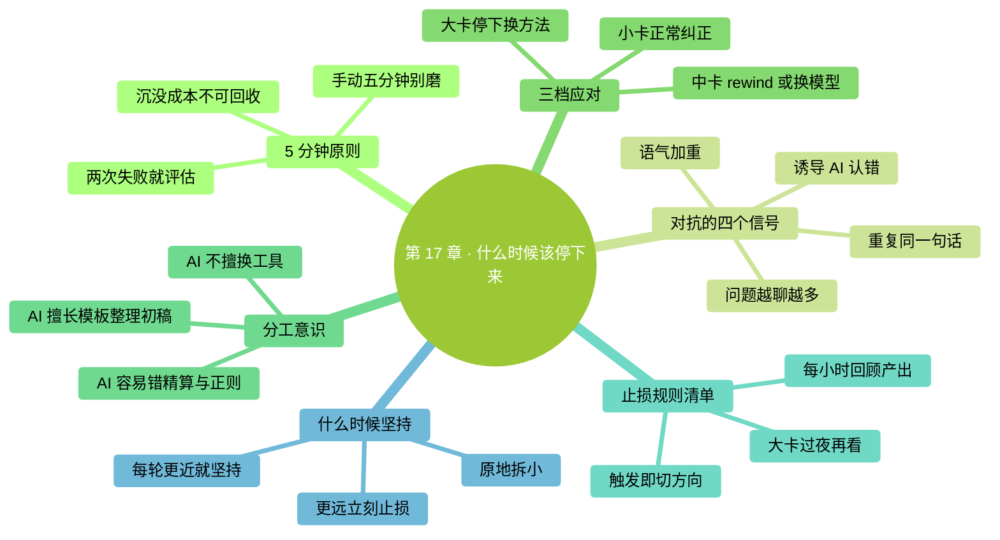

# 第 17 章：什么时候该停下来——不要和 AI 对抗

> **本章在全书的位置**：第四部分 · 第 17 章 / 预估阅读+动手时长：**主线 20-25 分钟 + 支线 8 分钟**
>
> **前置章节**：Ch 10（信任校准）+ Ch 16（10 大错误）
>
> **学完能做什么（主线）**：掌握**"停"的判断力**——知道什么时候该放弃当前尝试、换方向、甚至放下 Claude 自己动手。这是区分"新手"和"熟手"的核心能力。

---

## 开场三问

- **你会遇到什么问题**：陷入"再提示一次就行"的死循环——花 40 分钟修一个本来手动 5 分钟能完成的事。
- **不读这章会踩什么坑**：沉没成本陷阱——已经和 Claude 来回 10 轮，不甘心放弃，继续下去更慢更贵。
- **读完你会多会什么事**：给自己设"止损规则"，过线就**强制切方向**——该手动就手动、该重启就重启、该放下就放下。

### 本章地图（一眼看全貌）

<!-- diagram: MM-24 -->


---

> 🎯 **【主线】—— 本章必读核心**

---

## 17.1 核心原则：5 分钟原则

这是从老手社区里总结出来的一条铁律：

> 🔑 **一个任务原以为 AI 能搞定，结果花了 30 分钟还没对——比你手动做慢**。

具体规则：

### 5 分钟原则

- **第 1 次尝试**不成功 → 调整提示词，再来 1 次
- **第 2 次**还不成功 → **停下来**：问自己"手动做要多久？"
- 手动 < 5 分钟 → **关掉 Claude 自己做**
- 手动 > 20 分钟 → 继续用 AI 但**换方向**（换模型 / `/clear` / `/plan` / 拆小）

### 为什么是 5 分钟

- 手动做 5 分钟以内的事，你自己做**确定可控**——不会像 Claude 那样"顺手错改"
- **机会成本**：再和 Claude 磨 10 分钟 = 你已经手动做了 2 次

### 一个真实场景

```
（任务：把 20 张截图按时间重命名）

第 1 次：你：给 ~/Desktop/截图/ 的文件按修改时间排序重命名为 01-20
        Claude：（生成一个脚本，跑错，部分文件名乱了）
        你：回退

第 2 次：你：@截图/ 列出来，然后按顺序重命名
        Claude：（这次命名对了，但漏了 3 个隐藏文件）
        你：…… 还是不对

【5 分钟原则触发】
手动做要多久？我自己用 Finder 点一下排序、右键批量重命名，2 分钟。

→ 关掉 Claude，自己做，2 分钟搞定。
```

## 17.2 "和 AI 对抗"的四个信号

你正在和 AI 对抗时，会出现以下信号。看到**任何一个**就要警觉：

### 信号 1：你开始用加重语气

"**不是**那样"、"**我已经说了**"、"**为什么**还错"——语气升级但信息没升级。

**背后**：你以为 AI 会因为你"生气"而改正。**它不会**——它只是个语言模型，没有"被骂会认真"的反射。

**对策**：深呼吸。**换冷静+具体的语言重说一遍**，或者直接 `/clear` 重新开。

### 信号 2：你在第 N 次说同样的话

"再说一次——X 需要..."。你意识到自己在重复，Claude 没吸收。

**背后**：
- 可能 Ctx 爆了（Ch 12）——前几轮已被"挤掉"
- 可能提示词本身模糊——它每次理解都不同
- 可能是领域 Claude 处理不好（参见 10.A 错误热点）

**对策**：
- Ctx 高 → `/compact` 或 `/clear`
- 提示词模糊 → **把关键要求写进 CLAUDE.md 或提示词最前面的加粗段**
- 领域困难 → **换方法**（换模型 / 分解任务 / 人工介入）

### 信号 3：问题越聊越多

原来是 1 个 bug，修到第 5 轮变成 3 个 bug。Claude 在"修"的过程中**引入了新问题**。

**背后**：
- 它改了你没让它改的地方（常见）
- Ctx 里前后要求冲突，它"把旧要求忘了"

**对策**：
- **`/rewind`** 回到最早那个状态
- 重新开始，这次**只让它做一件事**
- 或者 `/clear` + 重新描述需求

### 信号 4：你在"诱导" AI 说出你想要的

"你**确定**这段没问题？"、"这样真的对吗？"——你希望它自己发现错误。

**背后**：你其实心里已经觉得有问题，但不想自己分析。

**对策**：
- **你自己审一遍代码/结果**——比让 AI 自省更准
- 或直接描述你担心的点："这段并发安全吗？如果两个请求同时 ... 会怎样"——**具体质疑，不是笼统怀疑**

## 17.3 卡住时的三档应对

不同程度的"卡住"用不同招。

### 第 1 档：小卡（< 3 轮重试解决）

**表现**：Claude 小错一下，你纠正一下就对。

**对策**：
- 正常纠正、继续
- 不用动任何"大招"

### 第 2 档：中卡（3-5 轮还在同一个坎）

**表现**：反复错在同一个点，你感觉"绕不过去"。

**对策**（按顺序试）：

1. **/rewind** 回到错之前，换种提示方式重做
2. `/compact` 压一下——有时是 Ctx 满了让它糊涂
3. **换模型**：用 Opus 重新想一次（可能是 Sonnet 这种特殊任务确实吃力）
4. **拆小任务**：大步改小步——"先只做 A"、"做完再做 B"
5. **切 /plan 模式**：让它先出方案你审，审过了再动手

### 第 3 档：大卡（5 轮以上没有进展）

**表现**：你已经调整了好几次提示词、换了模型，还是不对。

**对策**：

1. **停下 Claude Code**——不要再试
2. **问自己 3 个问题**：
   - 这个任务真的适合 AI 做吗？（有没有碰到 Claude 薄弱环节）
   - 我自己手动要多久？
   - 如果换一个不用 AI 的工具 / 方法，会不会更简单？
3. **给出三选一**：
   - **亲自动手**（如果手动 < 30 分钟）
   - **分阶段：AI 辅助 + 人工把关**（AI 做大体，关键步骤人工亲自做）
   - **先放下，明天再说**（有时睡一觉换个角度就解了）

## 17.4 人和 AI 各自擅长什么

搞清楚分工，才不会在 AI 短板上死磕。

### AI 擅长（放手让它干）

- **模板化的大量工作**：改 50 个文件的 import 语句、批量改变量名、统一格式
- **信息整理**：整理笔记、提取要点、做摘要
- **写初稿**：博客草稿、邮件草稿、文档大纲
- **翻译、改写、润色**
- **你懂大意但懒得动手的小脚本**
- **语法 / 语言错误检查**

### AI 容易出错（要严审）

- **精确数字 / 日期 / 货币计算**（参见 10.A 错误热点 1-2）
- **正则表达式**
- **并发 / 竞态条件**
- **安全 / 加密**
- **长文档前后一致性**（第 100 页忘了第 1 页的设定）
- **极新的技术栈**（训练数据里没见过的新版本）

### AI 不擅长（换工具）

- **精确数值计算** → 用 Excel / Python 计算
- **大批量文件操作** → 直接用 Finder / 命令
- **实时数据 / 网络查询** → 用浏览器 / API
- **图片深度编辑** → 用 Photoshop / 专业工具
- **复杂的 GUI 操作** → 自己动手
- **需要物理世界反馈的任务** → 亲自来

记住：**Claude 是你的助手，不是你的替身**。助手干不了的事，你接回来干。

## 17.5 建立你自己的"止损规则"

把"什么时候停"变成一张清单，**减少现场判断的负担**。

### 推荐起始版（新建 `~/Desktop/ccguide-练习/止损规则.md`）：

```markdown
# 我的 Claude Code 止损规则

## 必须停的时刻（任何一条触发都停）
- 同一个错被纠正超过 3 次 → /clear 或亲自动手
- 第 2 次尝试仍失败 → 评估"手动多久"
- 手动 < 5 分钟的任务 → 根本别上 AI
- Ctx > 85% → 强制整理或 /clear
- 自己开始用加重语气 → 深呼吸 + 切方向
- 做到一半出现新 bug → /rewind 回去

## 每小时给自己一个"回顾点"
- 这小时实际产出了什么？
- 花在 AI 上的时间值得吗？
- 要不要换方法？

## 兜底招
- 大卡超过 15 分钟 → 今天不做了，明天再说
```

把这份规则**打印贴在电脑旁**，或用一个贴纸提醒自己。

---

## 本章小结

- **5 分钟原则**：手动 < 5 分钟的事别磨 AI；AI 尝试 > 2 次不成功就评估
- **对抗信号**：加重语气 / 重复说同话 / 问题越聊越多 / 诱导回答——任一出现就警觉
- **三档应对**：小卡（纠正继续）→ 中卡（rewind / compact / 换模型 / 拆小 / plan）→ 大卡（停下评估换方法）
- **分工意识**：AI 擅长模板化、整理、初稿；不擅长精算、并发、安全、实时数据
- **建一份止损规则**：让"什么时候停"变成自动触发，不靠现场判断

---

## 动手任务

### 任务 1：回顾过去一周最浪费时间的一次对话（10 分钟）

找出你最近一次"花了很久没搞定"的 Claude Code 尝试。复盘：

- 我在第几轮时应该停？
- 停了之后该换什么方法？（亲自动手 / 换模型 / /plan ...）
- 这次总共浪费了多少时间？
- 如果当时知道本章内容，会省多少？

**成功标志**：你找到了自己的"典型浪费模式"——下次能认出来。

### 任务 2：建立你的止损规则（10 分钟）

按 17.5 的模板建 `~/Desktop/ccguide-练习/止损规则.md`。**照抄也行**，但要加**至少 1 条你自己的个性化规则**（根据任务 1 的复盘）。

**成功标志**：你有了一份属于你自己的止损清单。

### 任务 3：在下一个任务里真的执行"5 分钟原则"（下次做任务时）

**步骤**：
1. 下次用 Claude Code 时，**出声念一遍**：5 分钟原则
2. 第 2 次失败时，**强制**问自己"手动多久"
3. 真的手动做（哪怕你觉得"再来一次能行"）
4. 事后对比：手动 vs 继续磨，哪个更快

**成功标志**：你亲身体验一次"停下来自己做"更划算——把这个体验印进肌肉记忆。

---

## 如果你卡住了

**症状 A：每次都想"再来一次就行"，停不下来**
- 原因：沉没成本偏见——已经投入 10 分钟，不想白费。
- 解决：**沉没成本是不可回收的**——和"再花多久"无关。**默念：已经花的钱不会因为再花一些就回来**。

**症状 B：不知道怎么判断"手动要多久"**
- 原因：对手动流程不熟。
- 解决：估不准就**强制试 1 分钟**——如果 1 分钟内自己能跑出一半，说明手动快；跑不出来再回 AI。

**症状 C：止损规则写了但没执行**
- 原因：规则没有"可见性"——写完放文件夹里就忘了。
- 解决：**贴在显示器边上**；或用手机定 30 分钟倒计时闹钟——响了就回顾进度。

---

主线结束。下面支线讲"什么时候坚持"（反面教材避免误杀）和"多人场景的止损"。

---

> 🌿 **【支线】—— 可选深入（学有余力再看）**

---

## 🌿 支线 17.A：什么时候坚持——避免过度止损

> **这段讲什么**：主线讲的是"什么时候停"，但也有"该坚持"的场景——不然会误杀好任务。
> **什么时候回头读**：你感觉"我是不是太快放弃了"时。

### 值得多试几次的场景

1. **第一次尝试**——没有充分尝试前别下结论
2. **你自己描述不够具体**——换一个精准提示词还没试过
3. **任务本身复杂** —— 5-10 轮循环本来就正常
4. **Claude 给的方向有希望**——只是细节没对准
5. **你确实不会手动**——止损成本为负（比 AI 还慢或根本不会做）

### 区别"坚持"和"对抗"

- **坚持**：方向对、细节调、进度有（每轮离目标更近一点）
- **对抗**：方向错 / 细节反复错 / 每次都"前进两步退三步"

**判断标准**：**每轮过后离目标更近还是更远**？

- 更近 → 坚持
- 原地 → 拆小 / 换方法
- 更远 → 立刻 `/rewind` 或 `/clear`

### 一个简单计时器

做任务时心里默数"进展感觉"：
- 第 1 轮：基线
- 第 3 轮：比第 1 轮近了吗？
- 第 5 轮：比第 3 轮近了吗？

**如果第 5 轮比第 3 轮还远——止损信号确认，不是错觉**。

---

## 🌿 支线 17.B：团队 / pair programming 场景

> **这段讲什么**：两个人一起用 Claude Code 时，"停"的判断要怎么协作。
> **什么时候回头读**：你和同事一起用 Claude Code 时。

### 两个人一起更容易陷入"对抗"

- 两人都不想先喊停，以免显得"没耐心"
- 轮流提示，各自都有"这一次应该行"的乐观预期
- 时间不知不觉更长

### 建议规则

**约定止损信号**：

- 明确的止损触发器——比如"两人加起来尝试 3 次还不对就停"
- **一个人打开计时器**——15 分钟闹钟
- 响了就**强制**讨论"继续还是换方法"

### 分工也要明

不要两个人都抢着敲提示词。约定：

- A 负责提示（主笔）
- B 负责审核 + 判断止损（旁观者视角）

**旁观者更容易看出**"我们陷进去了"——A 沉浸在提示词里，看不出整体。

---

**下一章**：第 18 章"常用快捷命令全览"——整本书出现过的各种斜杠命令（`/clear` `/compact` `/model` `/status` `/plan` `/rewind`...）一次梳理，带使用场景。**速查手册级别**。


---

<!-- chapter-nav -->

📖  [← 第 16 章 · 新手 10 大错误](16-新手10大错误.md)  ·  [📑 返回目录](../../README.md)  ·  [第 18 章 · 常用快捷命令全览 →](18-常用快捷命令全览.md)
