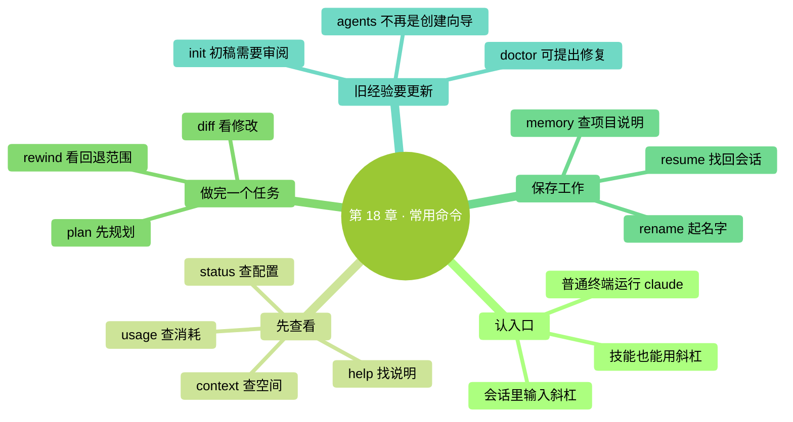
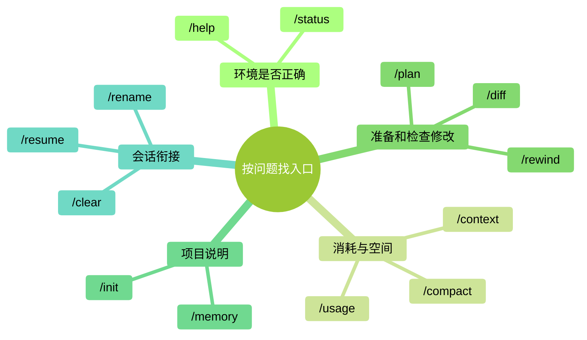

# 第 18 章：常用快捷命令全览——按场景找到入口

> **本章在全书的位置**：第四部分 · 第 18 章 / 预估阅读与动手时长：主线 25 分钟，支线 10 分钟。
>
> **前置章节**：前面学过的会话、权限、记忆和模型操作，在这里串起来。
>
> **学完能做什么**：知道命令该输在哪里，分清查看、改设置和让 Claude 开工三类入口，遇到问题时找到合适操作。
>
> **核对日期：2026-09-24；操作基线：Claude Code 2.1.280 或更新版本。** 这是一份常用入口指南，实际菜单会随账户、平台和已安装能力变化。

---

## 开场三问

- **你会遇到什么问题**：记得有一个斜杠命令能解决眼前的问题，却想不起名字；或者按旧教程操作，发现入口变了。
- **不读这章会踩什么坑**：以为所有斜杠命令都只是查看；为了熟悉菜单，把会改文件、改设置的项目也逐个执行。
- **读完你会多会什么事**：从“我现在要做什么”反推命令，先确认作用，再运行。

### 本章地图（一眼看全貌）

<!-- diagram: MM-25 -->

---

> 🎯 **【主线】—— 本章必读核心**

## 18.1 同一个斜杠，后面可能是不同的工作

在 **Claude Code 的输入框**里，以 `/` 开头输入命令。先打一个斜杠，菜单会列出当前可见的选项；继续打字，就会筛选。用上下方向键选中，再按 Enter（回车键）执行。想取消时，按 Esc（键盘左上角的退出键）。

这里有一个需要更新的认识：**不能把所有斜杠命令都理解成“不经过模型、不会做事”的本地按钮。** 有些命令显示面板，有些修改设置，还有些启动 Skill（技能，一组让 Claude 按特定方法工作的说明）。技能可能读取文件、生成内容、运行工具，也会使用模型额度。[命令入口说明](https://code.claude.com/docs/en/commands)、[技能说明](https://code.claude.com/docs/en/skills)

先用三个例子体会区别：

| 输入 | 你应把它当成什么 |
|---|---|
| `/status` | 打开状态面板，查看当前环境 |
| `/model` | 打开模型选择器；确认选择可能影响以后会话 |
| `/doctor` | 让 Claude 做一轮设置体检，可能提出修复方案 |

不知道某项会做什么，就看说明，不要用“执行看看”代替理解。尤其不要为了练习，把生成文件、修改配置、安装扩展的命令一次跑完。`/help` 是常用帮助入口，`/` 菜单适合寻找当前可见选项；它们也不意味着能列出所有隐藏入口和所有账户才有的功能。

另外，`claude --version` 这一类命令要输在**普通终端**，不是 Claude Code 对话里。反过来，在普通终端输入 `/model`，也不会打开模型菜单。命令名称记得不全，通常不如“现在在哪个输入框”重要。

## 18.2 先查清：我在哪、用了多少、什么占着空间

学过第 12、15 章后，你已经见过几种面板。这里把它们并排放一次，避免发生“想查余额，却盯着上下文百分比”的混淆。

| 当前问题 | 入口 | 看什么 |
|---|---|---|
| 软件和账户是否是预期的 | `/status` | 版本、模型、账户、连接状态 |
| 本次和套餐消耗怎样 | `/usage` | 会话估算、套餐使用情况与活动统计 |
| 这次对话带了哪些材料 | `/context` | 上下文空间及占用组成 |
| 记不清入口叫什么 | `/help` | 可用帮助与命令说明 |

当前 `/cost` 是 `/usage` 的另一个名字，叫做**别名**；不必把它们当成两套账单。`/stats` 也通向用量界面，只是打开统计页。费用估算与实际扣款的关系，仍按[第 15 章](../part3-深度概念/15-模型与成本.md)核对。[用量官方说明](https://code.claude.com/docs/en/costs)

例如，你让 Claude 整理一份文件，它提示额度不足。先看 `/usage` 和提示里的限制类型；不要因为 `/context` 还有空位，就认定系统出了错。上下文是工作空间，套餐额度是可用消耗，两者不是同一个量。

再比如，它开始忘记前面确定的格式。先看看重要要求是不是还在材料里，是否需要重申；对话很长时，可以考虑 `/compact` 总结已有内容。**本章不把 50%、75% 这类数字设成固定操作开关。** 要不要整理，取决于任务、材料与当前提示，不是见到某个百分比就必须执行一个命令。

<!-- diagram: MM-06 -->

## 18.3 把一次修改走完整，比背下命令表更有用

你准备修改几份文件，又想先确定范围。这时 `/plan` 可以切到计划模式；它的用途是先了解和规划，具体权限边界见[第 9 章](../part2-日常使用/09-计划模式与撤销.md)。不要把“先规划”理解成“后面的任何执行都已授权”。

下面是**练习步骤示意，不是一次真实运行记录**：

1. 在会话输入 `/plan`，说明：“请先列出把两份活动安排合成清单的方案，保留原文件。”
2. 阅读方案，确认输入材料、输出文件和检查方法。
3. 通过界面的模式切换离开计划模式，明确让它按确认的范围执行。
4. 检查生成的文件；如果项目使用 Git（保存文件版本的工具），可以用 `/diff` 查看修改前后的对比。

**diff** 就是前后差异。它能帮助你看见增删，但“看见差异”还不是“证明正确”。一行数字从 20 变成 30，你仍要对照原材料确认该不该变。[查看修改的官方说明](https://code.claude.com/docs/en/interactive-mode#review-changes-with-diff)

改错之后可以输入 `/rewind`，查看能恢复到哪些检查点——程序记录的先前状态。先读清恢复的是对话、文件，还是两者。它不能撤销所有外部行为，也不记录通过 shell（终端命令）造成的全部文件变化；已发送消息、已发布内容也不是靠回退对话就能收回的。[检查点与限制](https://code.claude.com/docs/en/checkpointing)

因此，不存在“Claude 一做错，就无条件 rewind”的规则。一个错别字可以直接改；修改方向走偏且存在合适检查点时，回退可能更方便。找不到恢复点时，先保留当前文件并确认影响范围，**不要再用 `/clear` 试图撤销修改**。清空会话只会让继续说明问题更费劲。

## 18.4 留住工作进度，也留住你真正想长期保留的规则

一次任务可能跨几天。收工前，用 `/rename 活动安排核对` 给当前会话起个名字，之后通过 `/resume` 的选择器找到它。比起记住“前天第三个窗口”，清楚的名字更方便。恢复会话不表示电脑里的文件会自动回到当时版本，继续前仍要检查现在的文件。

如果下一项工作与当前任务无关，可以用 `/clear` 开始新会话；如果只是想停止普通前台会话，可以用 `/exit`。已经被你移到后台、还在运行的任务是另一种情况，支线会解释。别把关闭当前输入窗口等同于“所有工作都停止”。

另一些信息不该只留在聊天记录里。例如，团队约定的输出文件夹、保留原稿的要求，可以写进 `CLAUDE.md`——项目给 Claude 的工作说明。`/memory` 能帮助你查看和编辑说明文件、查看自动记忆及相关开关；它不是一个只管理单独 `MEMORY.md` 文件的入口。[项目记忆说明](https://code.claude.com/docs/en/memory)

新项目也可以运行 `/init`，让 Claude 先生成说明初稿，再由你审阅。已有 `CLAUDE.md` 时，它会提出改进建议，不是要求你先删掉。你要核对文件里写的事实与操作是否真的适用，删去猜测和不需要的规则。自动生成是一个起点，手写也是一个起点，关键都在内容是否准确。

本章不会要求你“把所有命令跑一遍，再删掉产物”。你只需要在真的想建立项目说明时使用初始化，并保留有价值的结果。

## 18.5 调整设置之前，弄清它会影响多久

你可能只是想试一个模型，却发现明天启动也换了。这不是程序随意改变习惯：当前 `/model` 的正常确认会保存默认选择。如果只想在本次会话使用，在选择器移到相应模型行，按字母 **s**；按 Enter 则保存。模型与思考投入的详细关系见[第 15 章](../part3-深度概念/15-模型与成本.md)。

`/config` 打开设置；`/permissions` 管理操作的允许、询问和拒绝规则，不能只把它当“白名单”。改规则会影响 Claude 后面的行动，所以先弄清它属于当前项目、个人还是组织。仅想知道为什么某一步被拦住时，先查看，不必为了减少提示把规则全部放开。[权限规则说明](https://code.claude.com/docs/en/permissions)

排查问题时，还有一个很容易混淆的名称：

| 输入位置 | 命令 | 作用边界 |
|---|---|---|
| 普通终端 | `claude doctor` | 输出只读安装诊断，不启动一轮会话修复 |
| Claude Code 会话 | `/doctor` | 体检技能：分析问题，并在你确认后实施提出的修复 |

当前 `/doctor` 可能建议整理说明文件、修改配置等，不再只是旧版的只读面板。把它当成“请 Claude 诊断”，读清修复计划后再决定；若 Claude Code 根本启动不了，就从终端的 `claude doctor` 开始。[故障排查说明](https://code.claude.com/docs/en/troubleshooting)

最后，旧教程中用 `/agents` 打开创建向导的步骤已经过时。当前应让 Claude 创建或编辑子代理定义，详见[第 22 章](../part5-扩展能力/22-Subagents入门.md)。这类改变也提醒我们：记住用途，遇到入口变化查当前说明，比死记菜单顺序有效。

---

## 本章小结

- 斜杠命令输入在 Claude Code 会话里，普通终端命令在会话外。
- 有些入口只是查看，有些改设置，有些启动会工作的技能。
- `/status`、`/usage`、`/context` 分别看环境、消耗、空间。
- 修改前规划，修改后检查；`/rewind` 有恢复范围，`/clear` 不能撤销文件。
- `/init` 可以生成说明初稿，`/memory` 帮助管理说明与记忆。
- 不需要把所有命令逐个执行，先用与当前问题有关的入口。

## 动手任务

### 任务 1：做一张自己的查看卡（约 5 分钟）

1. 在会话里依次打开 `/help`、`/status`、`/usage`、`/context`，看完一个再关闭。
2. 每项记一句话：“我以后遇到什么问题会用它。”
3. 对未显示的信息记“当前账户未显示”，不要照书编造数值。

**成功标志**：你能区分配置、消耗和空间，不需要修改任何文件或付费设置。

### 任务 2：给练习会话起名字，再找回来（约 5 分钟）

1. 在没有后台任务的练习会话里运行 `/rename 命令入门练习`。
2. 用 `/exit` 退出，再在普通终端运行 `claude`。
3. 输入 `/resume`，从选择器找到刚才的名字并恢复。

**成功标志**：你能认出同一段练习记录。文件是否保持原样，另外在文件夹中检查，不把恢复会话当成恢复文件。

## 如果你卡住了

**问题 A：输入斜杠后没有菜单。** 先确认你在 Claude Code 的输入框里。使用英文半角 `/`，不要用全角 `／`；普通终端不会因为输入斜杠就变成 Claude 菜单。

**问题 B：书里写的命令找不到。** 核对版本、平台、账户和是否安装相关技能；看 `/help` 与官方说明。没有出现不一定是安装失败，某些命令只在特定会话或账户上可用。

**问题 C：回退后还有文件变化。** 先停止继续修改，确认变化来自哪种工具或外部程序。检查点不能覆盖所有终端操作和外部变化，详见[第 9 章](../part2-日常使用/09-计划模式与撤销.md)。不要再清空会话来碰运气。

---

> 🌿 **【支线】—— 可选深入**
> 下面介绍输入前缀与后台工作。第一遍可继续第 19 章。

## 🌿 支线 18.A：感叹号、文件提及和自己的快捷入口

**这段讲什么、什么时候读**：你已经会基本对话，想少重复输入时，再读这一节。

`@` 用来提及文件。输入 `@` 后开始写文件名，从候选项里选中，可以减少路径输错。例如，练习输入“比较 `@方案一.md` 和 `@方案二.md` 的日期安排”，比只说“看那两个文件”更明确。这里只展示你可以发送的要求，没有预设 Claude 一定会给出什么答案。

`!` 则表示直接执行 shell 命令，并把输出带进对话。例如 `!git status` 是让 Git 报告文件版本状态，前提是你已经安装 Git 且当前文件夹是 Git 项目。你直接输入的命令不需要模型替你判断后再选择是否运行；所以不要把不理解的删除、下载执行命令加上感叹号就照做。当前版本通常还会让 Claude 对命令输出作出响应，可能使用模型额度。[特殊输入说明](https://code.claude.com/docs/en/interactive-mode)

重复使用的工作说明可以做成技能，再通过斜杠主动触发。技能既可能由你选择，也可能按配置由 Claude 判断使用；“技能只自动调用、命令只手动调用”的旧区分已经不准确。怎样创建和控制触发范围，留到[第 20 章](../part5-扩展能力/20-Skills入门.md)与[第 21 章](../part5-扩展能力/21-自定义Slash命令.md)，不需要现在一次配置完。

## 🌿 支线 18.B：看见后台任务后，退出不一定代表停止

**这段讲什么、什么时候读**：你开始使用子代理或后台会话，想确认哪些工作还在运行时，再看这一节。

子代理是分担一部分工作的助手，后台会话则是可以独立继续的一场工作。它们在界面上可能都表现为“别处还有任务”，但不是同一个东西。`/tasks` 用于查看当前会话的后台工作；不要因为主对话已经说完，就默认派出的任务都结束了。

当前 `/agents` 已不再打开旧的子代理创建向导。想创建助手，可以向 Claude 说明它负责什么、能用什么工具，再检查生成的定义；创建步骤见[官方子代理说明](https://code.claude.com/docs/en/sub-agents)。普通终端里的 `claude agents` 则是另一个入口，用于观察后台会话，不要因为单词相似就混用。

后台会话中，`/exit` 可能只是断开当前连接，工作仍继续；停止与断开应按后台界面和命令提示区分。你暂时不使用后台工作，就不需要为此增加操作。开始使用时，先拿小任务练习一次“启动、查看、停止”，确认没有遗留运行任务，再交给它更长的工作。

更完整的后台和并行用法见[第 26 章](../part6-融入日常/26-进阶能力速览.md)。日常需要查命令时，直接打开[附录 C · 常用 Slash 命令速查](../附录/C-Slash命令全表.md)。

<!-- studio:nav -->
← [第 17 章：什么时候该停下来——不要和 AI 对抗](17-%E4%BB%80%E4%B9%88%E6%97%B6%E5%80%99%E8%AF%A5%E5%81%9C%E4%B8%8B%E6%9D%A5.md) · [目录](../../README.md) · [第 19 章：输入技巧——把效率榨干](19-%E8%BE%93%E5%85%A5%E6%8A%80%E5%B7%A7.md) →
<!-- /studio:nav -->
