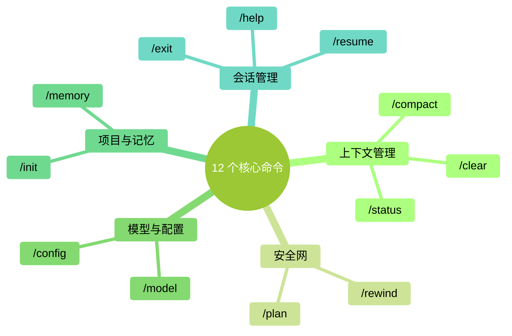

# 第 18 章：常用快捷命令全览——斜杠命令速查

> **本章在全书的位置**：第四部分 · 第 18 章 / 预估阅读+动手时长：**主线 20-25 分钟 + 支线 5 分钟**
>
> **前置章节**：前面章节已出现的命令在这里统一整理
>
> **学完能做什么（主线）**：一张图 + 一张表记住所有常用斜杠命令，**按场景**知道该用哪个。以后遇到新情境能直接反应出合适命令。

---

## 开场三问

- **你会遇到什么问题**：命令散落在各章，记不全；遇到情境不知道有没有现成命令对应。
- **不读这章会踩什么坑**：不知道工具箱里有什么工具 → 硬凑 → 费时。
- **读完你会多会什么事**：看到情境能条件反射想到命令——效率翻倍的关键。

---

> 🎯 **【主线】—— 本章必读核心**

---

## 18.1 斜杠命令是什么

在 Claude Code 里，**以 `/` 开头**的一行就是斜杠命令（slash command）——不是提示词、不传给大模型，而是**直接对 Claude Code 这个工具**的指令。

### 怎么用

1. 在 prompt 提示符处直接敲 `/`
2. 会出现候选列表，打字筛选
3. 回车执行

### 怎么查全量

任何时候跑 `/help`，能看到当前版本**所有可用命令**（含自定义命令）。

## 18.2 核心 12 个命令——按场景分组

所有命令按用途分成 5 组。**这 12 个覆盖 95% 的日常需要**。

<!-- diagram: MM-06 -->



### 组 1：上下文管理（Ch 12）

| 命令 | 作用 | 什么时候用 |
|-----|------|---------|
| `/clear` | 清空当前会话 | 任务做完、切新任务 |
| `/compact` | 压缩当前会话成摘要 | Ctx > 50% 但任务未完 |
| `/status` | 看当前状态（模型、Ctx%、用量） | 任何时候想查进度 |

### 组 2：安全网（Ch 9）

| 命令 | 作用 | 什么时候用 |
|-----|------|---------|
| `/plan` | 进入计划模式（只出方案不动手） | 开始一个**需要先想清楚的任务** |
| `/rewind` | 精确回退到之前某个状态 | 走错一段后想回到分叉点 |

### 组 3：模型与配置（Ch 15）

| 命令 | 作用 | 什么时候用 |
|-----|------|---------|
| `/model` | 切换模型（Sonnet / Opus / Haiku） | 任务难度变了、想省钱 / 求准 |
| `/config` | 看 / 改 Claude Code 配置 | 调偏好（主题、自动保存等） |

### 组 4：项目与记忆

| 命令 | 作用 | 什么时候用 |
|-----|------|---------|
| `/init` | 自动扫描项目生成 CLAUDE.md | **不推荐**（见 Ch 14），建议手写 |
| `/memory` | 打开记忆管理界面 | 想查 / 改 MEMORY.md 里 Claude 对你的记忆 |

### 组 5：会话管理

| 命令 | 作用 | 什么时候用 |
|-----|------|---------|
| `/exit` | 退出 Claude Code | 关掉 |
| `/resume` | 恢复上次会话 | 不小心退了想回到前一次状态 |
| `/help` | 查看所有命令的说明 | 记不清用法时 |

## 18.3 一图看懂：什么情境用什么命令

```
┌─────────────────────────────────────────────────────┐
│                 遇到情境 → 用什么命令                │
└─────────────────────────────────────────────────────┘

【开始任务】
│
├─ 需要先想清楚策略     → /plan
├─ 想换模型               → /model
└─ 看看当前状态           → /status

【做任务中】
│
├─ Ctx 快满了（> 50%）    → /compact
├─ 做错了一步             → /rewind
├─ 想查 Claude 记得我什么 → /memory
└─ 想改偏好               → /config

【结束任务】
│
├─ 任务完成，下一件       → /clear
├─ 关闭 Claude Code       → /exit
└─ 明天想回到现在状态     → （退出即可）次日跑 /resume

【记不清命令时】
│
└─ /help
```

## 18.4 命令组合使用——"套路"

单个命令有用，**组合起来威力更大**。几个高频套路：

### 套路 1：plan → 审核 → execute

```
你：/plan
    我要给 @项目/ 加一个批量处理功能，先出方案。
Claude：（给计划）

你：（审计划，OK）
    退出 plan 模式，按方案走。
Claude：（执行）
```

**适合**：任何"动手前应该想想"的任务。

### 套路 2：Opus 规划 + Sonnet 执行

```
你：/model → Opus
    深度分析 @this_project/，规划重构策略。
Opus：（给深度方案）

你：/model → Sonnet
    按刚才方案一步步做，先改 src/foo.py。
Sonnet：（执行）
```

**适合**：复杂任务，想省 Opus 钱又想要深度思考。

### 套路 3：中段 compact 保持思路

```
（聊了 10 轮，Ctx 65%）
你：/compact
Claude：（压缩成摘要）

（Ctx 降到 15%，继续）
你：继续刚才的任务
```

**适合**：任务还要继续、但不想丢前面的共识。

### 套路 4：rewind 而不是补救

```
（Claude 改错了一个文件）

❌ 差做法：
你：不对，你改多了，把 X 和 Y 改回来
（Claude 再改一轮，可能又多错一个）

✅ 好做法：
你：/rewind
（直接回到出错前）
你：换种方式：只改 X 的 foo 函数，不动其他
```

**适合**：任何 Claude 动作出错后的回退——**比让它自己"修复"更干净**。

## 18.5 `!` 和 `@` —— 严格来说不是斜杠命令，但属于本章

这两个前缀不以 `/` 开头，但同样是 Claude Code 的"特殊输入"——效率关键。

### `!` 快速跑 shell 命令

在 prompt 里**以 `!` 开头**的那一行，Claude Code 会**直接跑为终端命令**，输出给 Claude 看。

**最常用场景**：
- `!ls` 看当前文件夹
- `!git status` 看 git 状态
- `!pwd` 看当前工作目录

**和"让 Claude 跑命令"的区别**：
- `!command`：**你主动让它执行**，绕过 Claude 判断，直接跑
- 不加 `!` 说"请跑 X 命令"：Claude 会在权限模式里判断是否安全再决定是否执行

**什么时候用 `!`**：
- 明确知道命令安全
- 快速补一句上下文（"这是我的 git status 给你看"）

### `@` 引用文件

这是 Ch 5 的主角——`@文件路径` 让 Claude 读这个文件。

**小提示**：

- `@` 之后**按 Tab 会自动补全**——不必手打完整路径
- **支持多个** `@`：`@a.md @b.md 对比这两份`

## 18.6 自定义命令的一个预告

除了系统内置命令，你也可以**自己定义** slash 命令——例如 `/lint` 帮你跑代码检查、`/review` 帮你走一遍 review 流程。

具体怎么建第 21 章讲。本章只要知道：**自定义命令和内置命令一样用，都以 `/` 开头**。

---

## 本章小结

- 斜杠命令 = 对 Claude Code 这个工具的指令（不是给大模型的 prompt）
- **12 个核心命令**按 5 组分：上下文管理 / 安全网 / 模型配置 / 项目记忆 / 会话管理
- **组合套路威力最大**：plan→execute / Opus 规划→Sonnet 执行 / 中段 compact / 用 rewind 而不是补救
- `!` 跑 shell 命令、`@` 引用文件——最常用的两个"特殊前缀"
- **记不清时跑 `/help`** —— 永远能查全

---

## 动手任务

### 任务 1：把 12 个命令都跑一遍（15 分钟）

**步骤**：

1. 启动 Claude Code
2. 按 18.2 表格**每个命令都跑一次**，观察效果（`/init` 跑完**删掉**生成的 CLAUDE.md，别保留）
3. 每个命令写 1 行自己的备注：这个干什么、我什么时候会用

**成功标志**：12 行备注——你对工具箱有了肌肉记忆。

### 任务 2：完整走一次"套路 1"（10 分钟）

**步骤**：

1. 选一个真实想做的小任务（5-10 分钟能完成的）
2. 执行：`/plan` → 描述任务 → 让 Claude 出方案 → 审 → 退出 plan → 让它执行 → 审 diff → Yes
3. 全程留意：**你多感觉踏实了？**

**成功标志**：你体验了 plan-first 工作流和之前"直接动手"的区别。

### 任务 3：贴一张"命令速查卡"（5 分钟）

把 18.3 的 ASCII 图（或你自己整理的版本）**复制到你的日常笔记 / 显示器边的便签**。

**成功标志**：眼睛扫一下就能找到对应情境的命令。

---

## 如果你卡住了

**症状 A：斜杠命令敲不出来 / 没提示**
- 原因：有的终端里 `/` 需要特殊处理；或你在提示符之外打字。
- 解决：确认**在 Claude Code 的输入框内**（不是在外面的终端）；逐字符敲，别粘贴。

**症状 B：某个命令找不到**
- 原因：Claude Code 版本不同，个别命令可能名字变了。
- 解决：先跑 `/help` 看当前版本全量列表；对不上就按 `/help` 给的为准。

**症状 C：/rewind 没有"我想回到的点"**
- 原因：`/rewind` 的粒度是**按消息**，不是按字符；回得太远可能丢别的共识。
- 解决：把 `/rewind` 和 `/clear` **组合用**——大问题先 /clear；小问题用 /rewind。

---

主线结束。下面支线讲"配置文件与个性化命令别名"。

---

> 🌿 **【支线】—— 可选深入（学有余力再看）**

---

## 🌿 支线 18.A：自定义"常用套路"为一键命令

> **这段讲什么**：如果你发现自己反复用同一种"套路"（比如 plan 开头 + 特定提示词），可以把它做成自定义命令。
> **什么时候回头读**：某个组合你用了 10 次以上。

### 一个简单例子

你发现自己经常这样开启一个任务：

```
/plan
需求：...
请严格遵守：
- 不改 src/legacy/
- 要用 pytest 做测试
- 最后给出 diff 摘要
```

这段开场白每次都一样——**做成命令**，以后只要打：

```
/start-task
```

就自动插入这段模板，你只要填需求。

### 怎么建

（详见第 21 章）简要：在 `~/.claude/commands/` 或 `.claude/commands/`（项目级）里放一个 markdown 文件 `start-task.md`，内容就是你的套路模板。

### 哪些套路值得做成命令

- **你反复写一样的开头**
- **启动任务前的检查清单**
- **完成任务后的收尾**（清理、commit、记录）
- **团队里大家都用的工作流**

### 和 Skill 的区别

- **Skill**：**给 Claude 的指令**——"遇到 X 类任务用 Y 方法"；Claude 判断调用
- **Custom command**：**给你自己的快捷键**——主动敲触发

两者可以组合：命令触发、命令内容里调用 Skill。

---

**下一章**：第 19 章"输入技巧"——`!` 和 `@` 之外的效率技巧：截图输入、多行输入、历史、粘贴大段文字的正确方式。把输入效率榨干。
