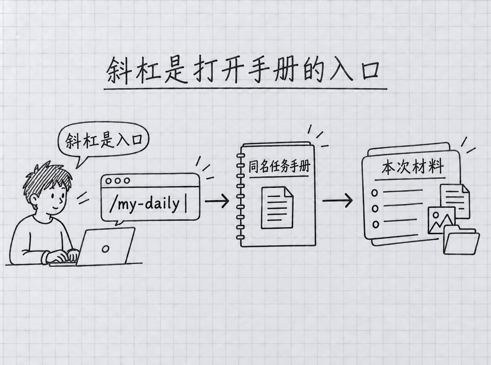

# 第 21 章：自定义 Slash 命令——主动启动一份技能

> **本章在全书的位置**：第五部分 · 第 21 章 / 主线 20–25 分钟，支线 8 分钟
>
> **前置章节**：第 18 章（常用命令）+ 第 20 章（Skills）
>
> **学完能做什么**：创建 `/my-daily`，向它传入今天的任务，并从旧命令格式平稳迁移。
>
> **核验日期**：2026-09-24。

---

## 开场三问

- **你会遇到什么问题**：流程已经写好，但你希望自己决定什么时候执行。
- **不读这章会踩什么坑**：把技能和自定义命令分别维护两份，相同规则改了一处、漏了一处。
- **读完你会多会什么事**：让一个技能通过 `/名字` 启动，连同本次材料一起传给 Claude。

### 本章地图（一眼看全貌）

本章图解：[斜杠是打开手册的入口](#211-斜杠是入口不是另一种智能)。

---

> 🎯 **【主线】—— 本章必读核心**

## 21.1 斜杠是入口，不是另一种智能

**Slash 就是斜杠 `/`**。第 18 章的 `/clear` 是内置命令；上一章的 `/meeting-notes` 是你安装的技能入口。二者看起来都以斜杠开始，但前者由产品提供，后者承载你自己的任务要求。

<!-- diagram: FIG-024 -->


*图：自定义命令提供入口，技能说明承载具体工作方法。*
<!-- /diagram: FIG-024 -->

新版 Claude Code 已把自定义命令和技能放到同一套机制里。旧的 `.claude/commands/daily.md` 仍可使用；新建流程优先采用 `.claude/skills/my-daily/SKILL.md`，方便把模板和示例放在一起。**不能再用“技能只能自动触发、命令只能手动触发”来区分它们。**[官方说明](https://code.claude.com/docs/en/skills#where-skills-live)

想让一个技能只在你明确启动时运行，可以在文件开头的说明标签中加入 `disable-model-invocation: true`。它的含义是阻止 Claude 自行调用这份技能。名字很长，首次使用只要记住“这份流程由我来启动”。这项设置并不会自动给后续操作开权限，更不是“输入命令就同意发布、付款或删除”。

本章做 `/my-daily`：你给出今天的事项，它帮你列计划。名称加上 `my-`，是为了少和现有内置命令或别人安装的技能撞名。不要把自定义流程叫 `/focus`、`/review` 之后，又以为它会改变产品本身的对应功能。

## 21.2 创建你的开工清单入口

仍在练习项目中操作。按第 20 章的方法，新建 `.claude/skills/my-daily/SKILL.md`。如果需要再看一次具体操作，下面列出了两种系统各自的命令；每组都在系统终端里输入。

**Mac：**

```bash
mkdir -p .claude/skills/my-daily
touch .claude/skills/my-daily/SKILL.md
open -e .claude/skills/my-daily/SKILL.md
```

**Windows PowerShell：**

```powershell
New-Item -ItemType Directory -Force .claude\skills\my-daily
New-Item -ItemType File .claude\skills\my-daily\SKILL.md
notepad .claude\skills\my-daily\SKILL.md
```

把下面这份技能文本保存进去。`$ARGUMENTS` 是**参数占位符**，意思是“把命令名后面这次输入的文字放到这里”。它不是你要设置的环境变量，也不需要另建一个同名文件。

```markdown
---
name: my-daily
description: 根据本次提供的事项和可用时间整理今日开工清单
disable-model-invocation: true
---
本次材料：$ARGUMENTS
仅使用本次材料，输出“必须完成 / 可以推进 / 暂缓”三组，合计最多五项。
每项写下一步动作和估计用时；估时是建议，不是假装知道的事实。
没有事项或可用时间时先询问，不扫描桌面、不读取其它账户、不创建日历事件。
```

这份清单没有偷偷扫描你的桌面，也没有把“昨天提交过什么”当作“今天必须做什么”。我们把信息来源限定在你提供的内容，是为了让第一次试验可检查。以后确实需要读项目待办，再明确增加一个文件路径即可，没必要一开始就连接所有资料。

## 21.3 传入材料，检查计划是否有依据

保存后回到 Claude Code。输入下面的命令，观察结果：

```text
/my-daily 今天有两小时。必须回复客户关于报价范围的三条问题；还想整理昨天的会议记录和试一个新工具。客户回复最晚今天下午发。
```

成功的计划应当把客户回复放在最前面，并考虑两小时的总预算。它可以建议把试工具暂缓，但不能擅自给客户发消息，也不能给会议记录补出一个你未提供的截止日期。你是在让它整理计划，是否执行每个事项仍取决于实际任务。

再做一个失败测试：只输入 `/my-daily`，什么材料也不附。它应该先问今天有哪些事项、能投入多久，而不是编一份看起来完整的日程。如果它直接生成内容，就把缺失输入的处理规则写清楚，再试一次。命令里的步骤是模型要理解的要求，不是普通程序那样逐行必然执行的代码。

这里也要区分两种感受：“结果看着不错”和“流程可重复”。后者需要你用不同材料重试。例如把可用时间改成三十分钟，看看它会不会删减任务，而不是照搬两小时版。能随输入合理调整，才值得作为你的日常入口。

## 21.4 旧命令怎样处理，怎样避免误改设置

如果你已经有 `.claude/commands/daily.md`，不必先把它删掉。先打开看清内容，再决定继续使用还是迁移。对本书这种纯文本清单，迁移主要是把提示词移到技能目录的 `SKILL.md`，补上描述，并测试新的斜杠名字；存在脚本、文件引用或参数时，需要逐项验证，不能只改扩展名。

建议一次迁移一个命令。先给新版临时起一个不同名字，用同一份虚构材料比较旧版与新版；确认新版本工作正常后，再移除旧入口。否则两份同名配置同时存在时，你可能一直在修改未被实际调用的那份。想知道这次用的是谁，查看菜单中的来源和会话里的调用记录。

在 Windows PowerShell 中，个人目录写成 `$HOME\.claude\skills`；`%USERPROFILE%` 是另一种命令环境常见的变量写法，不应直接塞进本章的 PowerShell 指令。最初用项目相对路径还有一个好处：你能在练习文件夹内看到全部变化，删除练习技能也不会碰到别的项目。

最后区分“生成计划”和“改变软件状态”。一个名叫 `/my-focus` 的技能可以给出专注建议，却不会仅凭这个名字关闭通知。要改变设置，必须实际调用对应能力，并遵守其权限要求。给流程起名字，并不会创造产品没有提供的功能。

## 本章小结

- 自定义斜杠命令现在可以直接由技能提供。
- 新流程优先放在 `.claude/skills/`，旧 `.claude/commands/` 格式仍兼容。
- `disable-model-invocation: true` 让你决定启动时机。
- `$ARGUMENTS` 接收命令名后面的本次材料。
- 测试正常输入、缺失输入和边界输入，比多建十个命令更有用。

## 动手任务

**任务 1，约 15 分钟：**创建 `/my-daily`，分别给它两小时和三十分钟的计划材料。成功标志是任务总量随时间调整，而且没有凭空增加你的日程。

**任务 2，约 10 分钟：**不传材料调用一次，再传一段互相冲突的要求。成功标志是它能指出缺失或冲突，你也知道该修改哪条规则。

## 如果你卡住了

**系统终端提示找不到命令：**`/my-daily` 要输入在 Claude Code 的对话框；建文件夹的命令才在系统终端里运行。

**修改后效果没变：**检查是否调用了同名的另一来源，确认保存的是正确项目下的 `SKILL.md`；必要时重开会话，再查看技能列表。

**输出出现原样的 `$ARGUMENTS`：**核对大小写和美元符号，检查文件是否作为技能加载。如果你只是把技能正文粘进普通聊天，它不一定按技能占位符规则处理。

---

> 🌿 **【支线】—— 可选深入（学有余力再看）**

## 🌿 支线 21.A：共享流程时，先共享输入约定

这段讲团队怎样使用同一入口；当你准备把技能交给同事时回来读。

把技能放进项目版本记录只是第一步。另一个人还需要知道：应该在哪个目录启动 Claude Code，命令后面该传什么，输出保存在哪里，以及哪些动作会改变外部状态。给 `/my-daily` 附一段不含私人信息的示例输入，往往比列出十个“适用场景”更有帮助。

团队规则变化时，也不要只在聊天群里说一句“新版改了”。把变化写进项目说明，再用原来的示例复验。比如有人要求输出“负责人”，要同时决定缺少负责人时怎么办；否则模型可能为了补齐格式而猜一个人名。共享流程的目的，是让相同要求被稳定执行，不是让大家的输出机械地看上去一样。

## 🌿 支线 21.B：文件引用和预先执行命令

这段讲技能怎样收集额外材料；等本章的纯文本清单已经够用，再考虑它。

技能支持引用文件，也有先执行命令、再把结果交给模型的写法。后者与正文里普通的“请运行某命令”不同；真实执行会消耗时间，也可能访问网络、读取凭证或修改文件。本书的开工清单不需要这些能力，因此没有给出让你照抄的动态执行片段。需要时先查[官方参数与动态上下文说明](https://code.claude.com/docs/en/skills#pass-arguments-to-skills)。

如果想根据项目待办生成计划，优先从一个明确的 `TODO.md` 开始：告诉技能只读这个文件，把其中未完成事项和本次输入一起整理。先检查能否找到文件、文件不存在时怎样提示，再考虑更多来源。这种小步扩展让失败原因容易定位：是资料没读到，还是计划逻辑不合理，不会混成一个“命令不好用”。

**下一章**：当材料太多时，让一个子智能体独立完成专项工作。

<!-- studio:nav -->
← [第 20 章：Skills 入门——把常用流程写成任务手册](20-Skills%E5%85%A5%E9%97%A8.md) · [目录](../../README.md) · [第 22 章：Subagents 入门——把专项工作交给独立助手](22-Subagents%E5%85%A5%E9%97%A8.md) →
<!-- /studio:nav -->
