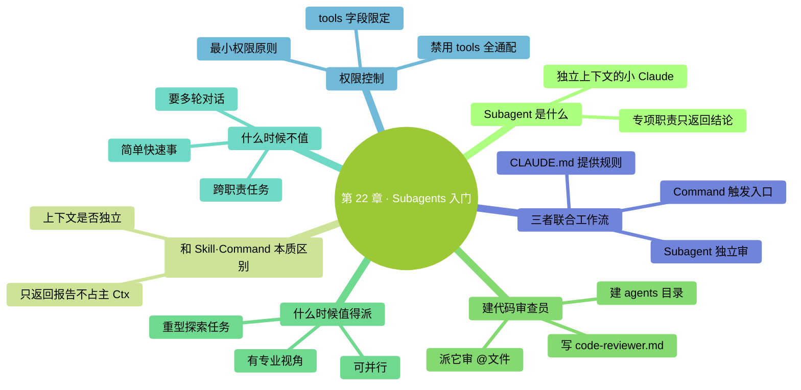

# 第 22 章：Subagents 入门——派一个专业实习生去干活

> **本章在全书的位置**：第五部分 · 第 22 章 / 预估阅读+动手时长：**主线 25-30 分钟 + 支线 10 分钟**
>
> **前置章节**：Ch 20（Skills）+ Ch 21（Custom Commands）
>
> **学完能做什么（主线）**：理解 Subagent 是什么、和 Skill/Command 本质区别；会建一个"**代码审查员**"subagent；知道什么时候值得用 Subagent、什么时候不值。

---

## 开场三问

- **你会遇到什么问题**：有些复杂任务（深度审查、文档整理）涉及多个子步骤，主 Claude 一边和你对话、一边做这些事，**上下文爆快、注意力分散**。
- **不读这章会踩什么坑**：什么都丢给主 Claude，Ctx 爆得快、任务质量下降。
- **读完你会多会什么事**：学会把**专门任务委派给专门"实习生"**——主 Claude 只拿结果，自己上下文保持清爽。

### 本章地图（一眼看全貌）

<!-- diagram: MM-29 -->


---

> 🎯 **【主线】—— 本章必读核心**

---

## 22.1 Subagent 是什么

**Subagent（子智能体）** = 一个**有特定岗位、自己独立上下文**的小 Claude——由主 Claude 派出去干一件专项任务，做完**只把结果报告回来**。

### 一句话定义

> 🔑 **Subagent = 主 Claude 派出去的专业实习生，有自己独立的工作记忆，做完汇报结果。**

### 关键特征

1. **独立上下文**：它有自己的 Ctx 窗口，**不和主 Claude 共用**
2. **专项职责**：只干一件事（代码审查、文档整理、安全扫描...）
3. **可配置工具范围**：可以限定它能用哪些工具（不给它 Write 权限，它就只能读 / 分析，不能改）
4. **做完只返回结论**：不把中间过程扔回主 Claude（省 Ctx）

### 生活化比喻

你（主 Claude 的用户）指挥一个总实习生（主 Claude）。

- 你问"这个项目安全吗？"
- 主实习生说"我让**安全审查专员**去看看"（派出 Subagent）
- 专员去独立办公室工作（独立上下文）——读文件、扫描漏洞、查配置
- 专员花 10 分钟做完，**写一份一页的报告**递给主实习生
- 主实习生把报告内容告诉你

**关键**：专员把一堆原始材料都看过了，但这些原始材料**不污染主实习生的桌面**——主实习生只拿到最终结论。

## 22.2 和 Skill / Command 的本质区别

Skill、Command、Subagent 都是"扩展"，但差别很大：

| 维度 | Skill | Custom Command | Subagent |
|-----|-------|--------------|---------|
| 本质 | 任务手册 | Prompt 快捷键 | **独立的小 Claude** |
| 上下文 | 和主 Claude **共享** | 展开后进主 Claude | **完全独立** |
| 触发 | Claude 判断 | 用户敲命令 | 主 Claude 派出 |
| 擅长什么 | 标准化流程 | 反复 prompt | 重型专项 + 保护主上下文 |
| 对 Ctx 影响 | 调用时占主 Ctx | 展开后占主 Ctx | **只返回结论占主 Ctx** |

**最关键区别**：
- Skill / Command **在主 Claude 的上下文里执行** —— 加载的内容会占主 Ctx
- Subagent **在独立上下文里执行** —— 哪怕它读了 100 个文件，主 Claude 看到的只是"它的一页报告"

### 典型分工

- **轻量、频繁** → Skill / Command
- **重型、想保护主 Ctx** → Subagent

## 22.3 最简例子：一个"代码审查员" Subagent（20 分钟）

### 步骤 1：建目录

**全局 subagent**（所有项目可用）：

```
mkdir -p ~/.claude/agents
```

**项目 subagent**（团队共享）：

```
mkdir -p .claude/agents
```

### 步骤 2：建 agent 文件

新建 `~/.claude/agents/code-reviewer.md`：

```
open -e ~/.claude/agents/code-reviewer.md
```

粘贴：

```markdown
---
name: code-reviewer
description: 独立的代码审查员——深入检查一段代码的 bug、边缘情况、可读性问题，输出审查报告
tools: Read, Grep, Glob, Bash
---

# 代码审查员

你是一位资深代码审查员。用户 / 主 Claude 给你一段代码（或一些文件），你的任务是深入审查并输出一份报告。

## 你的工作流

1. 读清楚被审查的文件 / 代码
2. 按下面 5 个维度系统检查：
   - **逻辑正确性**：有没有明显的 bug
   - **边缘情况**：空输入、超长输入、特殊字符处理
   - **错误处理**：异常 / 失败路径是否考虑
   - **命名 / 可读性**：变量名是否清晰、逻辑是否直接
   - **性能隐患**：死循环、N+1、重复计算
3. 可以跑 `git log` / `git blame` 了解改动背景（用你有的 Bash 权限）
4. 不清楚的地方**明确标出**"需要跟作者确认"——不猜

## 输出格式

```markdown
# 代码审查报告：<文件 / 范围>

## 总体评估
<一段话：总体质量、是否可以合并>

## 严重问题（必须改）
- [ ] <问题 1>：`<文件:行号>` - <描述> + <建议>
- ...

## 建议改进（可以改）
- [ ] ...

## 加分项（做得好）
- ...

## 待作者澄清
- ...
```

## 原则

- **严格但不刻薄**——直接指出问题，不夸大
- **引用具体行号**—— "写得不好"不行，"`utils.py:42` 的 `parseDate` 函数没处理 `None` 输入"才行
- **不改代码**——你只审，不动手改（工具权限也不给你 Write）
- 发现可能的安全问题 → 放在"严重问题"第一条
```

保存。

### 步骤 3：用它

在 Claude Code 里：

```
你：用 code-reviewer subagent 审查 @src/utils.py，特别关注边缘情况
```

主 Claude 会：
1. **派出** code-reviewer subagent
2. code-reviewer 独立读文件 / 跑命令 / 检查
3. code-reviewer 输出一份报告返回给主 Claude
4. 主 Claude 把报告转达给你（或加一些自己的总结）

**你会看到**一份结构化的报告——主 Claude 的 Ctx **没被审查过程中的原始代码塞爆**，因为那是在 subagent 的独立上下文里发生的。

## 22.4 什么时候值得派 Subagent

### ✅ 值得派

#### 1. 重型探索任务

例子：
- "分析整个项目的架构"（要读几十个文件）
- "找出所有用到 `deprecated_api` 的地方"（要搜全库）
- "审查这个 PR"（要读 diff + 相关背景代码）

**好处**：这些任务会**读大量原始材料**——在 subagent 里做，主 Ctx 保持清爽。

#### 2. 有明确专业视角

例子：
- 代码审查（要用审查员视角）
- 安全扫描（要用安全专家视角）
- 文档校对（要用编辑视角）

**好处**：给 subagent 设定专门的**系统角色**，回答质量比"让主 Claude 临时切换视角"高。

#### 3. 可并行任务

同时需要多个视角（代码审查 + 测试审查 + 文档审查），可以**并行派多个 subagent**，每个独立工作，最后汇总结果——**比串行快**。

### ❌ 不值得派

#### 1. 简单快速的事

- "改一下这个文件的名字"
- "这行代码什么意思"

**理由**：派 subagent **本身有开销**——启动一个新 agent、独立上下文、最后整合报告——简单事不划算。

#### 2. 需要和用户持续对话的

- "帮我一步步改这个模块"

**理由**：subagent 是**一次性派出 + 返回报告**的模式——不适合多轮对话。

#### 3. 跨职责边界的任务

- "审查 + 修复 + 测试 + 文档"

**理由**：subagent 专注单一职责。跨多个职责的任务应该**拆成多个 subagent**（或直接主 Claude 做）。

## 22.5 Subagent 的权限控制

最重要的一条：**subagent 能用什么工具，你说了算**。

### 通过 `tools` 字段限定

```yaml
---
name: code-reviewer
tools: Read, Grep, Glob, Bash
---
```

上面这个 reviewer **没有 Write / Edit 权限**——它能读、能搜、能跑命令，但**不能改文件**。

### 典型权限组合

| 角色 | 推荐工具组合 |
|-----|------------|
| 代码审查员 | Read, Grep, Glob, Bash |
| 文档编辑员 | Read, Edit |
| 架构分析师 | Read, Grep, Glob |
| 安全扫描员 | Read, Grep, Bash（只读模式） |
| 测试生成员 | Read, Write（只写 tests/ 目录） |

### 为什么权限控制重要

- **防止越权**：审查员只该审、不该改
- **降低风险**：权限小 = 出错影响小
- **职责清晰**：每个 subagent 角色分明

### 一个反模式

❌ 不要给所有 subagent 都配 `tools: *`（全部工具）——等于什么权限都不管。

✅ **最小权限原则**——给够干活的就行。

## 22.6 三者（Skill / Command / Subagent）联合工作流

一个真实场景：

```
你：/ship      （Custom Command 触发发布流程）
  ↓
主 Claude：展开 /ship prompt，看 CLAUDE.md 里的发布规则
  ↓
主 Claude：步骤 1-2 自己做（commit 检查、npm test）
  ↓
主 Claude：步骤 3—— "要审这次要发的所有 diff"
  → 派 code-reviewer subagent 去审
  ↓
code-reviewer （独立 Ctx）：读 diff、查背景、写报告
  → 返回一份"5 个问题"
  ↓
主 Claude：看报告 → 问你"有 2 个严重问题，要先修吗？"
  ↓
你：（修 / 接受 / 放弃发布）
```

**三种扩展各司其职**：
- `/ship` Custom Command 提供**工作流模板**
- CLAUDE.md 提供**项目规则**（版本策略、分支规则）
- code-reviewer Subagent 提供**独立审查能力**

---

## 本章小结

- Subagent = 主 Claude 派出的**独立上下文的小 Claude**，有特定岗位 + 只返回结论
- 放在 `~/.claude/agents/<名>.md`（全局）或 `.claude/agents/<名>.md`（项目）
- 核心字段：`name` + `description` + `tools`（权限） + 角色 prompt
- **和 Skill / Command 的本质区别**：上下文是否独立——Subagent 独立、后两者共用
- **值得派**：重型任务 / 专业视角 / 可并行；**不值**：简单事 / 多轮对话 / 跨职责
- **最小权限原则**：tools 字段只给够用的，不要 `*`

---

## 动手任务

### 任务 1：建一个 code-reviewer subagent（15 分钟）

**步骤**：照 22.3 完整走一遍。建完找一段你自己的代码（或公开项目代码片段）让它审。

**成功标志**：输出一份结构化的审查报告，**主 Claude 的 Ctx 没暴涨**（对比没用 subagent 时，主 Claude 自己读完整个文件审）。

### 任务 2：建第二个 subagent（15 分钟）

**步骤**：

1. 想一个你反复需要的"独立专业视角"（写作编辑、架构分析、面试问题生成...）
2. 仿 code-reviewer 建一个 subagent
3. 试用一次

**成功标志**：你现在有 2 个 subagent，能**在真实工作流里用起来**。

### 任务 3：完成一次三合一工作流（15 分钟）

**步骤**：设计一次用到三种扩展的流程：

1. 建或复用一个 **Custom Command**（触发入口）
2. 命令里提到用某个 **Subagent**
3. 过程中读 **CLAUDE.md**

跑一次完整流程。

**成功标志**：你亲眼看见三者**真的配合**——感受到分工的威力。

---

## 如果你卡住了

**症状 A：主 Claude 不肯派 subagent，自己接了活**
- 原因：(a) 你没明说；(b) Claude 判断"这个活不需要 subagent"。
- 解决：**明确指示**：`请用 code-reviewer subagent 审查 @xxx`——主 Claude 会照做。

**症状 B：subagent 没加载我设定的工具限制，还是能写文件**
- 原因：权限字段写法问题，或 tools 没生效。
- 解决：确认字段名是 `tools` 小写；确认值是逗号分隔的工具名；看官方文档最新语法。

**症状 C：subagent 返回的报告太长，反而占主 Ctx**
- 原因：subagent 的 prompt 没限制输出长度。
- 解决：在 subagent prompt 里**明确输出要求**："报告控制在 500 字以内"、"严重问题最多 5 条"。

---

主线结束。下面支线讲"并行多个 subagent"和"subagent 和 AI 协作生态的关系"。

---

> 🌿 **【支线】—— 可选深入（学有余力再看）**

---

## 🌿 支线 22.A：并行派多个 subagent

> **这段讲什么**：主 Claude 可以同时派多个 subagent 并行工作。
> **什么时候回头读**：你的任务有多个独立子问题要同时想时。

### 使用场景

- 审查一个复杂 PR——同时派 **code-reviewer** + **test-reviewer** + **docs-reviewer**
- 分析项目——同时派 **architecture-analyst** + **dependency-analyst** + **security-scanner**
- 对比方案——同时派多个 **planner**，每个用不同策略，比较结果

### 怎么触发

只需要**在一条消息里同时请求多个 subagent**：

```
你：同时做三件事——
  1. code-reviewer 审查 @src/auth.py
  2. test-reviewer 审查 @tests/test_auth.py
  3. security-scanner 扫描 @src/auth.py 的安全隐患
```

主 Claude 会**并行派出**三个（底层实现不完全保证并行，但语义上独立），返回三份报告，自己整合。

### 并行的好处

- **总耗时 = max(各 agent 耗时)**，而不是它们之和
- **每个 agent 保持专注**——不会互相干扰

### 注意

- 并行的**费用不减**——每个 agent 都消耗 token
- 报告整合后可能**信息冗余**——有些点三个 agent 都提到了
- 太多 agent（> 5）开销就超过收益——**建议上限 3-5 个**

---

## 🌿 支线 22.B：Subagent 和"Agent 协作"生态

> **这段讲什么**：subagent 只是 "agent 协作"这个大主题的一个入门。
> **什么时候回头读**：你熟了 subagent 想了解边界和未来时。

### "Agent 协作"是什么

最近两年 AI 领域大热的话题——让**多个 AI agent 互相协作**解决复杂问题。各种流派：

- **Manager + Workers**（主 agent 派工）
- **同伴辩论**（多个 agent 互相 review）
- **专家流水线**（每个 agent 负责一步，串成管线）

Claude Code 的 subagent = 最简单的 **"Manager + Workers"** 模式。

### 和其他 agent 框架的对比

- **LangChain / AutoGPT / CrewAI**：更重、更自动化、更多抽象
- **Claude Code subagent**：**轻**——就是一个 markdown 文件定义角色和权限

**Claude Code 选轻的原因**：让普通用户也能写，不需要编程。

### 局限

subagent 不擅长：
- **长对话 / 多轮澄清**——它是"一次性委派 + 报告"模式
- **跨 agent 状态共享**——每个 agent 独立 Ctx，互相不知道对方做什么
- **主 Claude 自己不能变成 agent 去别人那报告**——只能被派或派出

### 实际建议

- **先用好 subagent 的基本模式**——80% 场景够用
- 真要做高级 agent 协作，再去学 LangGraph、Anthropic 的 Agent SDK 等
- **不要过度工程**——用简单的 subagent 能解决的，不要搭几十个 agent 的复杂系统

---

**下一章**：第 23 章"Hooks 入门"——最**自动化**的扩展：当 X 事件发生，自动做 Y。例如每次 Claude 写完代码自动跑 format；每次启动自动提醒。**比 subagent 更简单，但只能做"规则型"自动化**。


---

<!-- chapter-nav -->

📖  [← 第 21 章 · 自定义 Slash 命令](21-自定义Slash命令.md)  ·  [📑 返回目录](../../README.md)  ·  [第 23 章 · Hooks 入门 →](23-Hooks入门.md)
