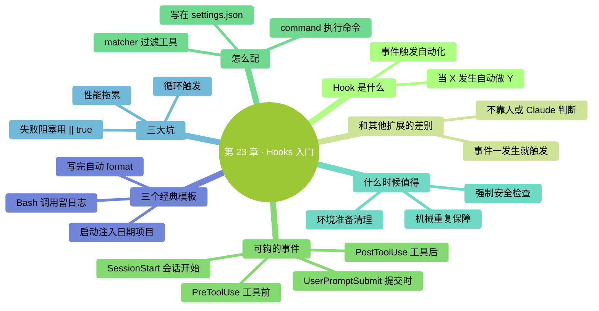

# 第 23 章：Hooks 入门——事件触发的自动化

> **本章在全书的位置**：第五部分 · 第 23 章 / 预估阅读+动手时长：**主线 20-25 分钟 + 支线 8 分钟**
>
> **前置章节**：前面 3 章扩展（Skills / Commands / Subagents）
>
> **学完能做什么（主线）**：理解 Hooks 是什么、和前三种扩展的分工；会配置一个**最简单的 Hook**（每次 Claude 写完文件自动跑 format）；知道什么时候值得用 Hook、什么时候容易踩坑。

---

## 开场三问

- **你会遇到什么问题**：每次 Claude 改完代码你都要手动跑 lint / format / 测试——机械、忘事、没意思。
- **不读这章会踩什么坑**：这些"机械重复"本可以自动触发，你还在手点，浪费时间。
- **读完你会多会什么事**：配一个"Claude 每次 Write 之后自动跑 `prettier`"——从此再不用手动 format。

### 本章地图（一眼看全貌）

<!-- diagram: MM-30 -->


---

> 🎯 **【主线】—— 本章必读核心**

---

## 23.1 Hook 是什么

**Hook** = **"当 X 事件发生，自动执行 Y"** 的规则。

### 一句话定义

> 🔑 **Hook = Claude Code 的"事件→动作"自动触发器。**

### 和前三种扩展的区别

| | 触发者 | 典型场景 |
|--|------|--------|
| Skill | Claude 自己判断需要 | 任务手册 |
| Custom Command | **你敲** `/xxx` | Prompt 快捷键 |
| Subagent | 主 Claude 派 | 专项委派 |
| **Hook** | **事件自动** | **规则化自动响应** |

**最关键差别**：Hook 不靠"谁决定"——**事件一发生就自动触发**，不问 Claude 也不问你。

### 能钩什么事件

Claude Code 支持的事件类型（具体名字以官方文档为准，这里是主要几个）：

| 事件 | 什么时候触发 |
|-----|------------|
| **PreToolUse** | Claude 要用某个工具（Write / Edit / Bash）之**前** |
| **PostToolUse** | Claude 用完某个工具之**后** |
| **SessionStart** | 会话开始 |
| **UserPromptSubmit** | 用户发送 prompt 时 |
| **SessionEnd** / 其他 | 会话结束等 |

每个事件都可以配**多条 hook**——像一串过滤器，一一跑过。

## 23.2 一个 Hook 长什么样

Hook 是**一条 shell 命令**或一条**简单规则**，配在 `settings.json` 里。

### 最简例子：Claude 写完 .py 文件自动跑 black 格式化

配置（放在 `~/.claude/settings.json`）：

```json
{
  "hooks": {
    "PostToolUse": [
      {
        "matcher": "Write|Edit",
        "hooks": [
          {
            "type": "command",
            "command": "black \"$CLAUDE_FILE_PATH\" || true"
          }
        ]
      }
    ]
  }
}
```

含义：
- **事件**：`PostToolUse`（Claude 用完工具后）
- **匹配**：工具是 `Write` 或 `Edit` 时
- **做什么**：跑 `black` 格式化那个文件
- **`|| true`**：即使 black 报错，也不让 Claude Code 觉得 hook 失败（不阻塞流程）

### 另一个例子：启动时提醒今天日期

```json
{
  "hooks": {
    "SessionStart": [
      {
        "hooks": [
          {
            "type": "command",
            "command": "echo '今天是 $(date +%Y-%m-%d)'"
          }
        ]
      }
    ]
  }
}
```

会话启动时自动把日期喂进 Claude 的上下文——**省得它对"今天是几号"猜来猜去**。

### 字段简要解释

- `matcher`：匹配哪些工具（可选，不写就匹配全部）
- `type`：目前主要支持 `command`（跑 shell 命令）
- `command`：具体要跑的命令

**具体字段可能随版本微调**——打 `/help hooks` 或官方文档查你这版语法。

## 23.3 建你的第一个 Hook（15 分钟）

我们建一个"Claude 写 Markdown 文件后自动跑 markdownlint"。

### 步骤 1：找到 settings.json

```
open ~/.claude/settings.json
```

如果文件不存在：

```
mkdir -p ~/.claude && echo '{}' > ~/.claude/settings.json && open ~/.claude/settings.json
```

### 步骤 2：确认前置条件

确认你电脑上装了 `markdownlint-cli`：

```
!npm install -g markdownlint-cli
```

（如果不装也行，换成别的 lint 工具，或者改成 `echo "written: $CLAUDE_FILE_PATH"` 纯提示）

### 步骤 3：编辑 settings.json

粘贴：

```json
{
  "hooks": {
    "PostToolUse": [
      {
        "matcher": "Write|Edit",
        "hooks": [
          {
            "type": "command",
            "command": "[[ \"$CLAUDE_FILE_PATH\" == *.md ]] && markdownlint \"$CLAUDE_FILE_PATH\" || true"
          }
        ]
      }
    ]
  }
}
```

这条 hook 的意思：
- Claude 每次 Write / Edit 文件后触发
- 如果改的是 `.md` 结尾的文件 → 跑 `markdownlint` 检查
- 否则忽略

### 步骤 4：重启 Claude Code，测试

让 Claude 写一个 markdown 文件：

```
你：建一个 ~/Desktop/test.md，内容是一个简单的 Markdown 列表。
```

它改完后，你会在 Claude Code 的输出里看到 markdownlint 的结果（如果有警告会列出来）。

### 成功标志

- Claude 写 `.md` 文件时，hook 自动触发 lint
- 写 `.py` 或 `.txt` 文件时，hook 不触发（因为 matcher 过滤了）

## 23.4 什么时候值得用 Hook

### ✅ 值得做 Hook

#### 1. 机械重复的保障动作

- 每次写代码自动 format
- 每次改完自动跑特定测试
- 每次 commit 前自动检查某些规则

**特征**：**规则固定、每次都要做、人做容易忘**。

#### 2. 强制性的安全检查

- 每次 Claude 想跑 `rm -rf` 时先询问再放行（**PreToolUse 拦截**）
- 每次 Write 到敏感目录时记录日志

**特征**：安全兜底、不能遗漏的。

#### 3. 环境准备 / 清理

- SessionStart 时自动 `!cd 到项目目录` / `!git pull`
- SessionEnd 时自动 `!git status`，提醒有没有未提交的改动

### ❌ 不值得做 Hook

#### 1. 偶尔才做的事

一个月做一次的流程——**做成 Custom Command 即可**，不值得 hook。

#### 2. 和"任务是什么"有关的逻辑

例如"Claude 写测试时要用 pytest 风格"——这属于**任务内容**，该放 CLAUDE.md / Skill，不是 hook。

#### 3. 需要人判断的决策

"Claude 要改生产配置时问一下我"——这种**交给权限系统**（Ch 7）做，不是 hook。

## 23.5 Hook 的三大坑

### 坑 1：Hook 失败阻塞 Claude

默认情况下，**hook 命令报错 = Claude Code 流程中断**。

**解决**：加 `|| true`——即使命令失败也返回成功。除非你**就是想让它失败时阻塞**（比如 lint 不通过就不让提交）。

### 坑 2：循环触发

一个典型陷阱：

```json
{
  "PostToolUse": [
    {
      "matcher": "Write",
      "hooks": [{
        "type": "command",
        "command": "echo '已写入' >> log.txt"   # ← 这一句再次触发 Write，又触发 hook
      }]
    }
  ]
}
```

**解决**：
- hook 命令**不要操作会再次触发 hook 的事**
- 或加明确的**排除条件**（`[[ "$CLAUDE_FILE_PATH" != "log.txt" ]]`）

### 坑 3：Hook 吃性能

每次 Write 都跑一次 lint——如果 lint 慢（5 秒），每次 Claude 写文件你就等 5 秒。

**解决**：
- hook 做的事要**快**（< 1 秒最好）
- 慢的任务改成**后台**或**定期**，不放 hook

## 23.6 Hook 的三个经典模板

给你**可以直接用的三个最常见 hook**：

### 模板 1：每次写完 Python 文件 auto-format

```json
{
  "hooks": {
    "PostToolUse": [{
      "matcher": "Write|Edit",
      "hooks": [{
        "type": "command",
        "command": "[[ \"$CLAUDE_FILE_PATH\" == *.py ]] && black \"$CLAUDE_FILE_PATH\" || true"
      }]
    }]
  }
}
```

### 模板 2：SessionStart 注入日期和项目状态

```json
{
  "hooks": {
    "SessionStart": [{
      "hooks": [{
        "type": "command",
        "command": "echo '今天: '$(date +%Y-%m-%d)' | 目录: '$(pwd)' | 分支: '$(git branch --show-current 2>/dev/null || echo 'not a git repo')"
      }]
    }]
  }
}
```

（这段文字会作为系统消息喂给 Claude，相当于每次启动时自动"报个家门"。）

### 模板 3：Claude 想跑高危命令时先 log

```json
{
  "hooks": {
    "PreToolUse": [{
      "matcher": "Bash",
      "hooks": [{
        "type": "command",
        "command": "echo '[$(date)] attempting: ${CLAUDE_TOOL_ARG:-no args}' >> ~/claude-bash.log"
      }]
    }]
  }
}
```

每次 Claude 要跑 Bash 命令时，先记一行日志到 `~/claude-bash.log`——审计用。

---

## 本章小结

- Hook = 事件触发的自动化 —— "当 X 发生，自动做 Y"
- 配置在 `~/.claude/settings.json`（全局）或项目级设置里
- 常用事件：**PreToolUse / PostToolUse / SessionStart / UserPromptSubmit**
- **值得做**：机械重复保障动作 / 强制安全检查 / 环境准备清理
- **不值得**：偶尔做的事（Command）/ 任务内容（CLAUDE.md/Skill）/ 需要人决策的（权限系统）
- **三大坑**：失败阻塞（`|| true` 兜底） / 循环触发 / 性能拖累

---

## 动手任务

### 任务 1：配第一个 hook（15 分钟）

**步骤**：照 23.3 完整走一遍。装不了 markdownlint 的话改成简单命令（比如 `echo "写入了: $CLAUDE_FILE_PATH"`）。

**成功标志**：你看见 hook **真的触发了**，在 Claude 写文件后自动执行你定义的命令。

### 任务 2：配 SessionStart 报告（10 分钟）

**步骤**：按模板 2 配一个 SessionStart hook。每次重启 Claude Code 应该自动显示日期、目录、分支。

**成功标志**：启动就看到这行"报家门"——Claude 也拿到了这些信息。

### 任务 3：尝试 PreToolUse 审计日志（10 分钟）

**步骤**：按模板 3 配。让 Claude 跑几次 `ls` / `pwd` 等命令，然后查 `~/claude-bash.log`：

```
!cat ~/claude-bash.log
```

**成功标志**：日志文件里**真的记下了**每次 Bash 调用。

---

## 如果你卡住了

**症状 A：hook 配完没触发**
- 原因：(a) settings.json 格式错（缺逗号 / 引号不对）；(b) 需要重启 Claude Code。
- 解决：(a) 用 JSON 校验工具验一下（在线 JSONLint）；(b) 退出 Claude Code 重新 `claude` 启动。

**症状 B：hook 触发但命令跑错**
- 原因：路径变量可能名字不同（`$CLAUDE_FILE_PATH` vs `$FILE_PATH` 等）。
- 解决：**先把命令里变量换成 echo**——`echo "path=$CLAUDE_FILE_PATH"`，看实际展开后是什么，再调整。

**症状 C：hook 让 Claude 卡住 / 很慢**
- 原因：hook 命令本身太慢。
- 解决：**在 hook 命令末尾加 `&`** 让它后台跑（慎用，有时会被 kill）；或**改成定期任务**（用系统 cron）不放 hook。

---

主线结束。下面支线讲"高级 hook：条件判断和阻塞"。

---

> 🌿 **【支线】—— 可选深入（学有余力再看）**

---

## 🌿 支线 23.A：阻塞型 Hook 和条件判断

> **这段讲什么**：Hook 不只是"事后被动跑"——可以**主动阻止** Claude 的动作。
> **什么时候回头读**：你想用 hook 做安全检查时。

### 阻塞 vs 非阻塞

**非阻塞**：hook 跑什么都不影响 Claude（默认或加 `|| true`）。

**阻塞**：hook **返回非 0 退出码 → Claude Code 判定"hook 失败"→ 停止那个工具调用**。

### 一个阻塞 hook 例子：禁止 Claude 改 .env

```json
{
  "hooks": {
    "PreToolUse": [{
      "matcher": "Write|Edit",
      "hooks": [{
        "type": "command",
        "command": "[[ \"$CLAUDE_FILE_PATH\" != *\".env\"* ]] || { echo 'ERROR: 不允许改 .env 文件'; exit 1; }"
      }]
    }]
  }
}
```

含义：
- Claude 想 Write / Edit 时触发
- 如果目标文件名含 `.env` → 报错 exit 1 → **Claude 的写入被拒绝**
- 否则返回 0，放行

这比**单纯叮嘱 Claude "不要改 .env"**更可靠——**直接在工具层拦截**。

### 更复杂的条件判断

```json
{
  "command": "python3 ~/.claude/hooks/guard.py \"$CLAUDE_TOOL\" \"$CLAUDE_FILE_PATH\""
}
```

把逻辑写进一个脚本 `~/.claude/hooks/guard.py`——里面自由判断（更复杂条件、读配置、写日志）。返回 0 = 放行、非 0 = 阻塞。

### 什么时候值得用阻塞 hook

- **硬性安全红线**：永远不能改的目录 / 文件 / 命令
- **项目合规**：某些文件必须走特定流程，不能直接改
- **防呆**：Claude 可能执行错误但你没审到的情境

**注意**：阻塞 hook 是**硬拦截**——用错了会把正常操作也挡掉。**上线前充分测试**。

### 和权限系统的关系

- **权限系统**（Ch 7）：Claude 要跑高危命令时**问你**，你人工决策
- **阻塞 hook**：**无需人工**，按规则自动阻塞

两者互补：
- 人工判断的 → 权限系统
- 规则明确的 → 阻塞 hook

---

**下一章**：第 24 章"MCP 入门"——**扩展能力的最后一章**。MCP 让 Claude 能连到外部工具（Google Drive、Notion、文件系统等），是让 Claude 成为真正生产力工具的关键。
