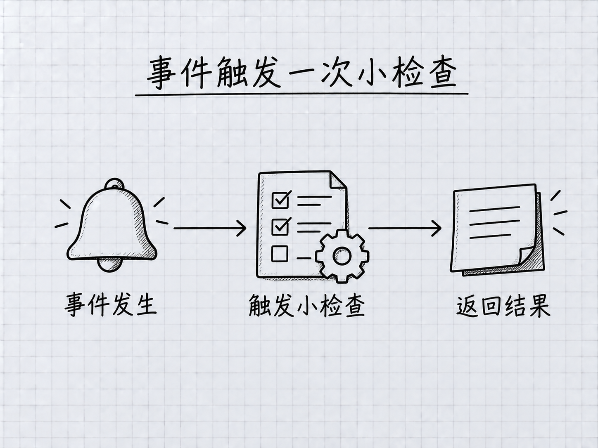

# 第 23 章：Hooks 入门——事件发生时，自动做一个小检查

> **本章在全书的位置**：第五部分 · 第 23 章 / 主线 25–30 分钟，支线 10 分钟
>
> **前置章节**：第 7 章（权限）+ 第 20–22 章（扩展）
>
> **学完能做什么**：理解事件与动作的关系，使用配套的只读检查脚本，并分清事前拦截和事后反馈。
>
> **核验日期**：2026-09-24。完整配置放在配套目录，正文不要求你手写大段配置。

---

## 开场三问

- **你会遇到什么问题**：某个固定检查每次都该做，你却总要重复提醒 Claude。
- **不读这章会踩什么坑**：把普通报错当成拦截成功，或者复制了一个根本拿不到文件路径的命令。
- **读完你会多会什么事**：让“写完练习文档”触发一个小检查，并验证它真的执行了。

### 本章地图（一眼看全貌）

本章图解：[事件触发一次小检查](#231-先决定在哪个时刻做什么)。

---

> 🎯 **【主线】—— 本章必读核心**

## 23.1 先决定在哪个时刻做什么

**Hook（钩子）**可以理解为“事件发生时，自动执行预先配置的动作”。例如 Claude 用编辑工具成功改完文件，这个事件发生后，执行一个检查标题是否存在的小程序。触发时机是固定的，不需要你每次再输入“请检查”。

<!-- diagram: FIG-026 -->

*图：Hook 围绕特定事件运行检查，结果如何使用取决于配置。*
<!-- /diagram: FIG-026 -->

本章只讨论运行本地脚本的 command Hook。脚本是电脑按既定规则执行的小程序；它不像技能那样主要依靠模型理解一段说明。Hook 本身也不是万能保护罩：动作是否正确，取决于脚本检查了什么、是否匹配了本次事件。

| 事件 | 你可以怎样理解 | 本章要记住的边界 |
|---|---|---|
| `PreToolUse` | 使用工具之前 | 可在符合规则时阻止尚未执行的调用 |
| `PostToolUse` | 工具成功完成之后 | 适合检查结果；动作已经发生 |
| `SessionStart` | 会话开始或相应恢复时 | 可提供环境提示 |
| `UserPromptSubmit` | 你提交消息时 | 可检查或补充本次输入 |

第一次练习选事后、只读的小检查，容易看出因果：文件出现了，检查读它，反馈说明哪里不合要求。等这个过程跑通，再考虑自动格式化或复杂阻塞。[Hook 入门](https://code.claude.com/docs/en/hooks-guide)

## 23.2 本章样例：检查一份 Markdown 文件

本书提供了[配套脚本和完整配置](../../templates/hooks/README.md)。它只检查项目根目录 `hook-demo/` 下的 Markdown 练习文件，看看有没有一级标题、文件末尾有没有换行。一级标题就是以 `# ` 开始的标题行。程序不会自动改内容，也不会读取整个项目、下载软件或上传结果。

这里有个旧教程常写错的关键点：文件路径来自 Claude Code 交给 Hook 的**结构化输入**，其中字段叫 `tool_input.file_path`；不是一个约定俗成的 `CLAUDE_FILE_PATH` 环境变量。配套 Python 脚本读取这份输入，再把检查结果按约定格式返回。你无需先学会写 Python，只要能分清“配置负责什么时候运行，脚本负责具体检查”即可。

配置中的 `Write|Edit` 表示匹配 Write 或 Edit 两种工具。它过滤的是**工具名**，不是文件扩展名；是否为 `.md`，由脚本继续判断。如果 Claude 用 Bash 或 PowerShell 命令写文件，这个匹配不会触发。它也不会因为你用系统编辑器保存一次，就自动捕捉那次保存。[事件输入与匹配规则](https://code.claude.com/docs/en/hooks)

这个小范围是刻意设计的。你可以拿同一个文件做成功、失败和修复试验，而不会让一次试学影响整本书或工作资料。

## 23.3 分两步验收：脚本能跑，事件也要能触发

先按[配套说明](../../templates/hooks/README.md)检查 Python 3 是否可用，并把脚本放到练习项目指定位置。Python 3 是运行该脚本的工具，并不是安装 Claude Code 的必需条件。若这台电脑还没有它，可以先理解本章，等有合适环境再做操作。

第一步是**手工测试脚本**。建一份带标题的练习文档，再给程序喂入一份虚构事件。检查应该通过；去掉标题再运行，应提示缺少标题。两次都打开原文件确认没有被脚本修改。这样可以单独证明脚本的规则有效，不会把“Claude 没触发事件”和“程序写错”混为一谈。

第二步是**连接真实事件**。把配套配置合并到项目 `.claude/settings.local.json`，保留该文件里原有的其它设置。退出并重开 Claude Code，用 `/hooks` 查看条目。然后明确让 Claude 使用 Write 或 Edit 修改 `hook-demo/notes.md`，观察反馈；有疑问时按配套说明检查调试日志。结构化反馈可能供 Claude 阅读，而不是独立显示成一条聊天消息，不能仅凭“屏幕没弹一个框”判定失败。

**这两步是不同的验收。**运行本书自动测试，只能证明样例处理给定输入的行为；亲自完成第二步，才证明你的安装、设置与会话事件也连通了。完成练习后，按配套说明只移除新增条目，保留其它项目设置。

## 23.4 失败时保留线索，不要先把错误藏起来

旧教程常建议在末尾加 `|| true`，这样即使检查失败，命令也返回成功。它确实能掩盖报错，但会让“程序没有跑起来”看起来像“检查通过”。本章样例不会这样处理：输入不合法、文件读不到，都保留错误信号；发现缺少标题，则正常返回“检查发现问题”的反馈。这两种情况应分开。

**事后反馈不能阻止刚才那次写入。**你在 PostToolUse 中发现内容不对，文件已经写了；应让 Claude 或你在后续步骤修正，而不是宣称写入已被撤销。需要事前阻止某个工具动作时，才研究 PreToolUse 的决策机制。

退出码也不能统称为“非零就拦截”。对于本章涉及的 command Hook，`0` 通常表示正常返回；用于阻塞的 `2` 有按事件规定的含义；其它报错不能简单当成阻塞成功。事前 Hook 返回正常状态，也不等于自动授予工具权限，原有权限流程仍需执行。[退出码与决策说明](https://code.claude.com/docs/en/hooks-guide#read-input-and-return-output)

检查很慢时，先缩小范围、确认命令独立运行多快，再考虑受支持的异步方式。不要随手在命令尾部加一个 `&`，就假定后台任务一定活着、结果一定会返回。一个能解释失败的小检查，比十条时有时无的自动化更有价值。

## 本章小结

- Hook 把明确的事件与预先配置的动作连接起来。
- 本章样例只读检查 `hook-demo/` 中的 Markdown 文件。
- 目标路径从结构化事件输入读取，不能猜环境变量名称。
- `Write|Edit` 匹配工具，文件类型由脚本判断。
- 分别验证脚本行为和真实会话触发；事后反馈不等于撤销。

## 动手任务

**任务 1，约 15 分钟：**照配套说明完成一次有效文档和一次缺少标题文档的手工输入测试。成功标志是反馈改变，原文件没有被脚本改写。

**任务 2，约 15 分钟：**在练习项目接上 Hook，让 Claude 用 Write 或 Edit 改文件。成功标志是会话或调试日志中能确认本次脚本执行；随后按说明撤销样例设置。

## 如果你卡住了

**Python 命令找不到：**按配套说明检查运行器，别把这误判成 Claude Code 没装好。先保留练习文件，不必继续改设置。

**手工测试通过但会话不触发：**核对项目、事件、实际工具名和设置是否生效。shell 写文件不会自动匹配 Write。

**报错但不知道哪里错：**先单独运行脚本，看错误类型；再看调试日志。不要上传含私人内容的完整设置或日志到在线校验网站。

---

> 🌿 **【支线】—— 可选深入（学有余力再看）**

## 🌿 支线 23.A：自动格式化与文件变更事件

这段讲如何从检查过渡到修改；当你已在项目中使用格式化工具时再读。

自动格式化意味着 Hook 会实际修改文件，因此需要比本章更多准备：明确支持的文件类型，确认格式化工具已安装，保留失败输出，并知道这些变化怎样保存或回退。不要在每次文件修改后临时从网络安装“最新版”，否则同一个项目不同日期可能跑出不同结果。

也不要把所有再次修改都叫“无限递归”。Hook 脚本通过系统命令写文件，并不因此变成一次 Claude 的 Write 工具调用。不同事件的触发规则不同；新的文件变更类事件又有自己的行为。真正需要防止的是你的自动化互相反复触发，或者模型收到同一条永远无法满足的反馈而不断重试。先画清楚“谁改文件、谁收到事件、谁再修改”，再决定停止条件。

## 🌿 支线 23.B：事前拦截不能替代完整权限边界

这段讲安全型 Hook 的边界；当你准备保护敏感目录时回来读。

假设你拦截了 Write 工具写入某个文件，但同一会话仍允许 shell 命令或外部服务修改它，这个 Hook 就没有覆盖所有路径。仅匹配命令里某个词也容易误报或漏报。不要因为演示成功阻止一次操作，就宣称项目已具备完整的安全隔离。

需要严格保护时，应结合权限规则、受限运行环境和服务端权限来设计；Hook 适合补充明确、可测试的项目规则。还要给自己留恢复办法：保留设置副本，只改新增条目，记录怎样关闭失效规则。和技能不同，command Hook 是会自动运行的程序，复制陌生项目的配置前必须读懂它实际要执行什么。

**下一章**：连接外部服务，理解 MCP 的安装、授权与权限边界。

<!-- studio:nav -->
← [第 22 章：Subagents 入门——把专项工作交给独立助手](22-Subagents%E5%85%A5%E9%97%A8.md) · [目录](../../README.md) · [第 24 章：MCP 入门——连接一个确实需要的外部服务](24-MCP%E5%85%A5%E9%97%A8.md) →
<!-- /studio:nav -->
