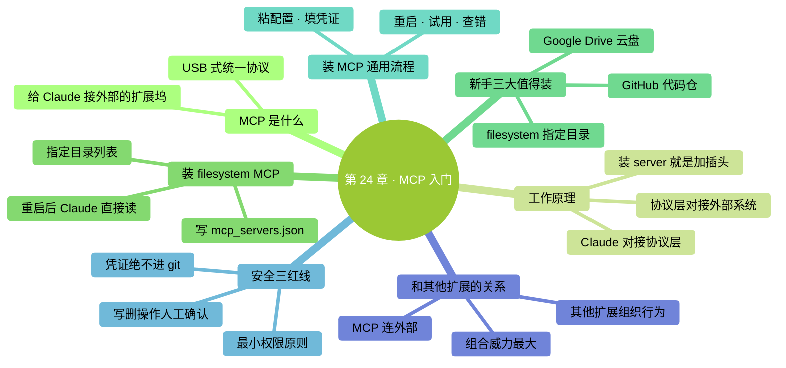

# 第 24 章：MCP 入门——给 Claude 接外部工具

> **本章在全书的位置**：第五部分 · 第 24 章 / 预估阅读+动手时长：**主线 25-30 分钟 + 支线 10 分钟**
>
> **前置章节**：前面 4 章扩展（Skills / Commands / Subagents / Hooks）
>
> **学完能做什么（主线）**：理解 MCP 是什么、为什么重要；会**装一个最简单的 MCP**（文件系统）；知道新手最有用的 3 个 MCP 是哪些；掌握装 MCP 的通用步骤。

---

## 开场三问

- **你会遇到什么问题**：Claude 只能读你电脑上的文件——想让它帮你整理 Google Drive 的文档、或者调出 Notion 里的会议纪要，**做不到**。
- **不读这章会踩什么坑**：Claude 永远被困在本地——**手动导出 / 导入**成为瓶颈。
- **读完你会多会什么事**：给 Claude **接上外部工具的"插座"**——它可以直接读你的云盘、Notion、GitHub、数据库——办公效率真正起飞。

### 本章地图（一眼看全貌）

<!-- diagram: MM-31 -->


---

> 🎯 **【主线】—— 本章必读核心**

---

## 24.1 MCP 是什么

**MCP（Model Context Protocol，模型上下文协议）** = Anthropic 推出的**统一接口标准**——让大模型能连接各种外部工具。

### 比喻先行

想象你的 Claude 是一个智能实习生，坐在电脑前只能**看自己电脑里的文件**、**跑命令**。

MCP 像**USB 接口**—— 给电脑加一个**扩展坞**，插上不同的插头就能连：
- 插 Google Drive 插头 → Claude 能读 / 写你的云盘
- 插 Notion 插头 → Claude 能看你的 Notion 页面
- 插 GitHub 插头 → Claude 能看你所有 repo、提 PR
- 插数据库插头 → Claude 能直接查你的 PostgreSQL

### 一句话定义

> 🔑 **MCP = 给 Claude 接外部世界的"扩展坞"。**

### 为什么 MCP 这么重要

没有 MCP：
- 想让 Claude 看云盘 → 手动下载到本地 → 本地 `@` 给 Claude
- 想让 Claude 改 Notion → 从 Notion 复制 → 贴进 Claude → 改完再复制回 Notion
- **所有外部系统的数据都要人肉搬运**

有了 MCP：
- Claude **直接读写**外部系统
- 你只需一句"把云盘里的 Q1 报表总结成月报发到我 Notion 的周报页"——它一气呵成

**这是 AI 工具从"聊天机器人"变成"真正助手"的关键一步**。

## 24.2 MCP 的工作原理（概念）

不需要懂技术细节——**能读懂这张图就够**：

```
┌──────────┐        ┌──────────┐        ┌──────────┐
│  Claude  │ ◄──►   │ MCP 接口 │ ◄──►   │ 外部系统  │
│   Code   │        │  (协议)  │        │ (GDrive, │
│          │        │          │        │  Notion, │
│          │        │          │        │   DB...) │
└──────────┘        └──────────┘        └──────────┘
```

- 左边 **Claude Code**：你一直在用的
- 中间 **MCP 接口**：标准协议层
- 右边 **外部系统**：云盘 / Notion / 数据库 / 任何能实现 MCP 的服务

**装一个 "MCP server"** = 往中间"协议层"插一个插头，让 Claude 能和对应外部系统说话。

### 每个 MCP server 能干的事

- **读数据**：列文件、读内容、查表
- **写数据**：新建文件、改内容、发消息
- **调用工具**：执行特定操作（提交 PR、发邮件等）

**具体能干什么看那个 server 实现了什么**——和装一个插件一样。

## 24.3 装一个最简单的 MCP：文件系统（15 分钟）

从最简单的 **filesystem MCP** 开始——它让 Claude 能访问**你指定目录**（比默认只能看当前项目更灵活）。

### 步骤 1：确认前置条件

你的电脑需要装 Node.js（Ch 2 装 Claude Code 时可能已经装好了）。

确认：

```
!node --version
```

能看见版本号（例 `v20.x.x`）就行。

### 步骤 2：编辑 MCP 配置

MCP 配置放在 Claude Code 的设置文件里：

```
open ~/.claude/mcp_servers.json
```

（文件名和路径以你这版 Claude Code 为准——打 `/help mcp` 或文档查。）

不存在就先建：

```
mkdir -p ~/.claude && echo '{}' > ~/.claude/mcp_servers.json && open ~/.claude/mcp_servers.json
```

### 步骤 3：加一段 filesystem 配置

```json
{
  "mcpServers": {
    "filesystem": {
      "command": "npx",
      "args": [
        "-y",
        "@modelcontextprotocol/server-filesystem",
        "/Users/你的用户名/Desktop",
        "/Users/你的用户名/Documents"
      ]
    }
  }
}
```

把 `/Users/你的用户名/...` 换成你真实的路径。这配置让 Claude 能访问**桌面 + 文档**两个目录。

### 步骤 4：重启 Claude Code

```
/exit
```

重新启动：

```
claude
```

### 步骤 5：试用

现在 Claude 能直接读写你**桌面和文档文件夹下**的文件（包括你启动时不在的目录）：

```
你：列一下我桌面上所有 .md 文件。
Claude：（用 filesystem MCP 的工具）
        找到 5 个：
        - todo.md
        - 周报.md
        - 会议纪要.md
        ...
```

**关键**：Claude 用的不是 `!ls` 命令，而是 MCP 协议—— 对它来说这是一个"工具"，和内置的 Read / Write 地位一样。

### 成功标志

Claude 能在**没用 `@` 引用也没 `!` 跑命令**的情况下，直接告诉你你桌面上有什么。

## 24.4 新手最有用的三个 MCP

### 推荐 1：filesystem（你已经装了）

**做什么**：访问指定目录
**什么时候值**：你工作文件散落在多个目录，不想每次都 `cd` 切换

### 推荐 2：Google Drive

**做什么**：读写你的 Google Drive 文件
**什么时候值**：用 GDocs / GSheets 存资料，想让 Claude 整理或更新

**装法**：在 mcp_servers.json 加：

```json
"gdrive": {
  "command": "npx",
  "args": ["-y", "@modelcontextprotocol/server-gdrive"]
}
```

第一次跑时会弹出 OAuth 授权——登录你的 Google 账户，**审一下权限**（只授予"读"还是包括"写"）。

### 推荐 3：GitHub

**做什么**：读写 GitHub repo、查 issue、提 PR
**什么时候值**：你参与开源 / 公司代码在 GitHub

**装法**：

```json
"github": {
  "command": "npx",
  "args": ["-y", "@modelcontextprotocol/server-github"],
  "env": {
    "GITHUB_PERSONAL_ACCESS_TOKEN": "ghp_xxxxxxxxxxxx"
  }
}
```

需要先去 GitHub 设置里**创建 Personal Access Token**，粘贴到 `env` 里。**注意这里有密钥——配置文件要保密**。

### 还有哪些 MCP

官方 + 社区有几十个 MCP——常见的：

- **Notion**：读 / 写 Notion 页面
- **Slack**：发消息、读频道
- **PostgreSQL / SQLite / Supabase**：直接查数据库
- **Puppeteer**：让 Claude 控制浏览器
- **Linear / Jira**：工单系统
- **Brave Search / Serper**：网络搜索

搜 `awesome-mcp-servers` 能看到完整列表。

## 24.5 装 MCP 的通用步骤（适用所有）

不管装哪个 MCP，**流程都一样**：

```
1. 找到你要装的 MCP 的"安装说明"（官方文档 / README）
2. 把配置段粘到 ~/.claude/mcp_servers.json 的 "mcpServers" 里
3. 如果需要认证（token / OAuth）→ 按说明拿到凭证，填进 env
4. 重启 Claude Code
5. 试用
6. 问题排查 → 看 Claude Code 的启动日志，一般会显示 MCP 加载错误
```

**一个你装会的 MCP，意味着你以后能装任何 MCP**——流程迁移。

## 24.6 MCP 的安全红线

MCP 让 Claude 接外部系统——**权限越大、风险越大**。三条红线必须守：

### 红线 1：不要给 MCP 过大权限

装 GDrive MCP 时——问自己"要给 Claude 只读还是读写"？

- **只读**（list, read）：安全
- **读写**（还能 modify, delete）：一个错误的 prompt 就可能删掉你重要文件

**最小权限原则**：默认只读。**只有实际需要写**时才加写权限。

### 红线 2：MCP 配置里的凭证算高敏感

`mcp_servers.json` 里的 token、API key 是**全权凭证**——泄露等于账号被接管。

- **不要进 git**（`.gitignore` 里加 `mcp_servers.json`）
- **不要截图 / 分享配置文件**
- 疑似泄露 → **立即 revoke** 并重新生成

### 红线 3：MCP 调用也会过 Claude 的权限系统

Claude 通过 MCP 调用"删除文件"时，**仍会走权限弹窗**（Ch 7）——你会被问是否同意。

**但**：如果你用 `/permissions` 把 MCP 工具加进白名单，或用了 acceptEdits 模式——**弹窗会被跳过**。

**建议**：
- MCP 工具默认走权限弹窗
- 只对**明确安全**的只读工具加白名单
- **写 / 删操作永远人工确认**

## 24.7 和其他扩展的关系

MCP 是**给 Claude 接外部系统**，其他扩展是**组织 Claude 自己的行为**：

| 扩展 | 作用 |
|-----|------|
| CLAUDE.md | 让 Claude **懂项目** |
| Skill | 让 Claude **会某类任务** |
| Command | 让**你**有快捷键 |
| Subagent | 让 Claude **派独立专员** |
| Hook | 让**事件自动触发动作** |
| **MCP** | 让 Claude **连外部系统** |

五者可以**任意组合**。典型高端玩法：

```
/my-weekly      （Custom Command 触发）
  → 主 Claude 读 CLAUDE.md（项目背景）
  → 用 GDrive MCP 拉本周文档
  → 派 summarizer subagent 总结各文档
  → 调用 weekly-report Skill 生成周报
  → 用 Notion MCP 发到你的周报页面
  → PostToolUse Hook 自动 log 到本地审计文件
```

**看起来复杂**——但每一步是一个小组件。**堆叠的能力就是这样来的**。

---

## 本章小结

- MCP = 给 Claude 接外部工具的"扩展坞"——USB 式的统一协议
- 配置在 `~/.claude/mcp_servers.json`；每个 server 一段配置
- 新手 3 个最值得装：**filesystem / Google Drive / GitHub**
- **安装通用步骤**：配置 → 填凭证 → 重启 → 试用
- **三条红线**：最小权限 / 凭证保密 / 写 & 删走人工确认
- 和其他扩展**组合威力最大**：MCP 连系统、Skill 做任务、Command 快捷触发、Subagent 派专员、Hook 自动审计

---

## 动手任务

### 任务 1：装 filesystem MCP（20 分钟）

**步骤**：照 24.3 完整走一遍。试让 Claude 列桌面文件、读某个文件。

**成功标志**：Claude 能**无需 `@`** 就访问你桌面 / 文档——确认 MCP 真的生效。

### 任务 2：装你工作里最需要的 MCP（30 分钟）

**步骤**：

1. 想清楚"我最常从哪个外部系统搬数据"（GDrive？Notion？GitHub？）
2. 搜对应的 MCP 官方安装指南
3. 按 24.5 的通用流程装
4. **先只授读权限**（保守）
5. 试一次真实任务

**成功标志**：你真实省了一次"手动搬运"——把 Claude 和外部系统打通。

### 任务 3：做一个安全检查（10 分钟）

打开你的 `mcp_servers.json`：

- [ ] 是否进了 git？（不能！加到 .gitignore）
- [ ] 每个 token 是不是**最小权限**？
- [ ] 你知不知道每个 MCP 能干什么？（不知道的就卸掉）

**成功标志**：你 100% 掌握自己装了哪些 MCP、各自权限、凭证在哪。

---

## 如果你卡住了

**症状 A：配置后 Claude 找不到 MCP**
- 原因：(a) json 格式错；(b) 没重启；(c) MCP server 本身装失败。
- 解决：(a) 用 JSONLint 校验；(b) 完全退出 Claude Code 再重启；(c) 手动跑一下 `npx -y @modelcontextprotocol/server-xxx` 看是否能启动。

**症状 B：OAuth 授权循环 / 失败**
- 原因：浏览器拦截、端口占用、账号权限不够。
- 解决：看 Claude Code 启动输出里的错误链接、按提示 pass；或换到官方 Wiki / Troubleshooting 页面对照。

**症状 C：MCP 工作但 Claude 说"没有权限"**
- 原因：(a) token 权限范围不够；(b) 你装的 MCP 没给 Claude Code 开对应工具。
- 解决：去对应服务重新生成 token 给更大范围；或看 MCP server 的文档确认它默认开放哪些工具。

---

主线结束。下面支线讲"自己写 MCP server"的概念和"MCP 的未来"。

---

> 🌿 **【支线】—— 可选深入（学有余力再看）**

---

## 🌿 支线 24.A：自己写一个 MCP server 的概念

> **这段讲什么**：市面没现成的 MCP，你可以自己写。
> **什么时候回头读**：你有独特的内部系统要接 Claude 时。

### 不用吓到

MCP server **本质就是一个小程序**——实现一套标准接口（协议里定义的）。各种语言都能写：

- **TypeScript / Node.js**（官方最推荐，SDK 最全）
- **Python**（Anthropic 出了 Python SDK）
- 其他语言也行（协议开放）

### 写一个最简 MCP 需要做什么

1. 安装 SDK（npm 或 pip）
2. 定义你的 **tools（工具）**：比如 `list_my_products`、`search_orders`、`create_ticket`
3. 实现每个 tool 的具体逻辑（访问你的数据库 / API）
4. 把程序跑起来，Claude Code 通过配置连上

**5-10 行骨架就能跑起来**——官方文档有最简 hello-world 示例。

### 典型场景

- **公司内网系统**（没有公开 MCP，得自己写）：让 Claude 连你们的工单系统、CRM、OA
- **个人工具链**：你的本地数据库、某个没 MCP 的 SaaS

### 学习资源

- 官方 MCP SDK 文档
- GitHub 上的 reference 实现（`modelcontextprotocol/servers`）
- 各种社区示例

**零基础读者这部分先不深入**——等你真的需要时再学，有 SDK 和示例在，不会太难。

---

## 🌿 支线 24.B：MCP 生态的现状和未来

> **这段讲什么**：为什么 MCP 是 AI 工具大变革的一步。
> **什么时候回头读**：好奇"我学的这东西有没有前途"时。

### 为什么 MCP 是"突破"

在 MCP 之前，**每个 AI 产品接外部工具都自己发明一套接口**——Anthropic 一套、OpenAI 一套、Google 一套，互相不通。

**MCP 是第一个开放标准**——理论上，**任何 AI 产品 + 任何外部工具**都能在 MCP 下互通。

这像 HTTP 诞生前的互联网和诞生后——**从"封闭孤岛"到"互联互通"**。

### 现在谁在用 MCP

- **Claude Code**（Anthropic 自己的工具，MCP 一等公民）
- **Cursor / Windsurf / Cline** 等 AI 编程工具都在接入
- **很多企业内部工具**开始开发 MCP 适配

### 未来趋势（预测）

- **公司提供 MCP server 成为标配**——就像现在的"REST API"
- **MCP 的"App Store"出现**——装 MCP 像装手机 App
- **Claude 之外的大模型**（OpenAI、Gemini 等）也逐渐原生支持 MCP

### 学 MCP 的价值

- **现在**：让 Claude Code 用得更顺
- **中期**：学会了就能接任何新出的 MCP
- **远期**：在"AI + 外部工具"这个未来趋势上**抢占了两步**

所以本章不只是"多一个技巧"——是**把你接入未来 AI 生产力的主干道**。

---

**第五部分（扩展能力）到此完成**。

你现在掌握的五种扩展：
- **Skills**（Ch 20）——按需加载的任务手册
- **Custom Commands**（Ch 21）——你自己的 prompt 快捷键
- **Subagents**（Ch 22）——独立上下文的专业实习生
- **Hooks**（Ch 23）——事件触发的自动化
- **MCP**（Ch 24）——接外部工具的扩展坞

**下一部分（第六部分：融入日常）**开始：团队协作、进阶速览、下一步——把 Claude Code **真正融进你的工作流**，而不是偶尔用一下的玩具。


---

<!-- chapter-nav -->

📖  [← 第 23 章 · Hooks 入门](23-Hooks入门.md)  ·  [📑 返回目录](../../README.md)  ·  [第 25 章 · 团队协作基础 →](../part6-融入日常/25-团队协作基础.md)
