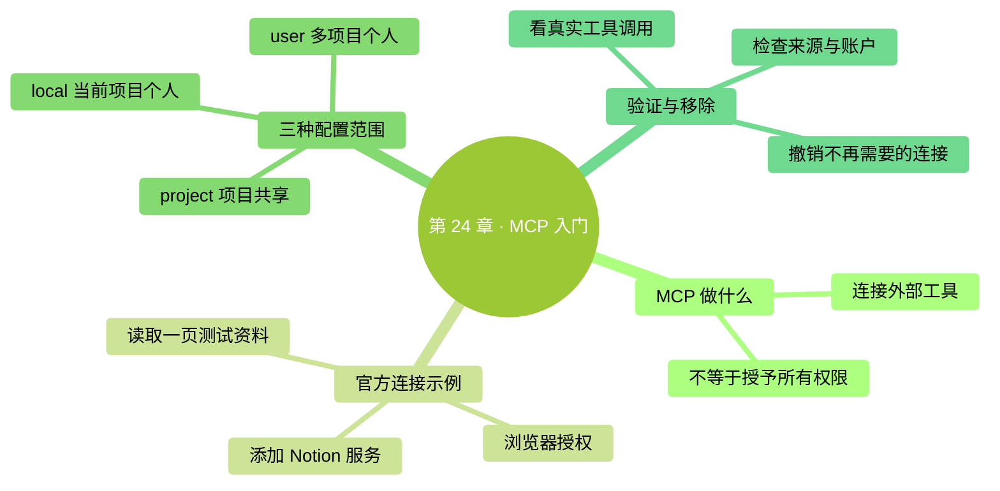

# 第 24 章：MCP 入门——连接一个确实需要的外部服务

> **本章在全书的位置**：第五部分 · 第 24 章 / 主线 25–30 分钟，支线 10 分钟
>
> **前置章节**：第 7 章（权限）+ 第 20–23 章（扩展）
>
> **学完能做什么**：分清连接配置、账户授权和工具许可，用官方说明接入一个服务，并知道怎样移除。
>
> **核验日期**：2026-09-24。示例选用 Notion 官方远程 MCP；有该服务账户时再操作。

---

## 开场三问

- **你会遇到什么问题**：任务需要云端资料，你总在手动下载、复制和上传。
- **不读这章会踩什么坑**：以为连上服务就获得全部权限，或照旧教程把密钥写进公开项目。
- **读完你会多会什么事**：用一个小的读取任务验证连接，再判断是否值得扩大使用。

### 本章地图（一眼看全貌）

<!-- diagram: MM-31 -->


---

> 🎯 **【主线】—— 本章必读核心**

## 24.1 它是接口，不是让助手变聪明的开关

**MCP（Model Context Protocol，模型上下文协议）**是一套让 AI 工具与外部服务对接的约定。你可以把它理解为扩展坞：Claude Code 负责理解任务，一个 MCP 服务负责提供“搜索页面”“读取工单”等实际能力，外部系统仍负责保存数据和管理账户权限。

连接后能做什么，取决于服务提供哪些工具、你的账户能访问什么，以及本次调用是否获准。安装一个 GitHub 连接，不等于它能看所有私有仓库；连接 Notion，也不意味着你可以越过同事设置的页面权限。MCP 不会替服务发明它没有开放的功能。

Claude Code 本来就有本地文件与命令能力，也能通过其它方式使用网络服务。**为了读当前项目文件，不必先装 filesystem MCP。**只是想访问另一个自己的目录时，可以先了解 `/add-dir`；真正需要 MCP 的理由通常是“这个服务提供了我现在缺少的接口”，而不是“所有教程都建议装”。[Claude Code 的目录与权限](https://code.claude.com/docs/en/permissions#working-directories)

本章选一个现成服务做练习，而不是列出“人人必装的三个”。你工作中不用 Notion，也可以先读懂流程，之后用自己服务商的官方说明替换它。不要为了完成一个练习专门购买不需要的产品。

## 24.2 先把三层权限分开

接入外部服务时，至少有三件不同的事：

| 层次 | 解决的问题 | 你应该检查什么 |
|---|---|---|
| 连接配置 | 去哪里找这个 MCP 服务 | 地址是否来自服务商官方说明 |
| 账户授权 | 外部系统允许访问哪些资源 | 登录的账户、工作区、允许范围 |
| 工具许可 | Claude 这次可否执行某个动作 | 调用的是读取、修改还是发送 |

例如连接地址写对了，但账户没授权，就可能显示需要登录；登录成功了，但页面不属于这个账户，又可能找不到；页面能读，也不代表你已经同意向其中发布新内容。遇到错误时按这三层排查，比一看到“权限不足”就扩大所有权限有效。

`OAuth` 是一种通过浏览器登录并确认访问范围的授权方式。你不必把密码复制给 Claude。若某个服务只支持令牌，那是一段代表访问权的秘密字符串，要按服务商说明保管，不能放进公开仓库，也不要作为聊天材料发给模型。[官方 MCP 鉴权说明](https://code.claude.com/docs/en/mcp#authenticate-with-remote-mcp-servers)

最后纠正一个旧说法：`acceptEdits` 主要处理本地文件编辑和相应文件操作，**不是给所有 MCP 工具免确认的总开关**。实际调用还受工具规则、所选模式和组织策略影响。也不能承诺每次外部写入必然弹框；如果曾经授予广泛许可，需要重新查看权限配置。[权限模式](https://code.claude.com/docs/en/permissions#permission-modes)

## 24.3 接上 Notion，再只读一页练习资料

如果你已经使用 Notion，先建一页不含私人信息的“Claude 连接练习”，写三条虚构待办。确认你知道页面属于哪个工作区，并阅读授权页将授予的范围。官方 Notion MCP 可以读取和更新账户有权访问的内容，不能假定浏览器一定提供“只读”选项；不能接受其授权范围时就取消，不影响继续阅读本章。

在**系统终端**里进入练习项目，然后执行下面一行。Mac 与 Windows PowerShell 都使用这条命令：

```bash
claude mcp add --transport http --scope local book-notion https://mcp.notion.com/mcp
```

`book-notion` 是我们给连接起的本地名字；`http` 表示通过网址连接远程服务；`local` 表示只对当前项目中的你可用。命令写入的是连接定义，**执行成功还不等于已经登录、更不等于工具调用成功**。

重新进入 Claude Code，输入 `/mcp`，找到 `book-notion`，按界面提示完成浏览器授权。核对账户与工作区，不要一路点击到最后才发现登录错了。这个流程与地址可在 [Notion 官方接入指南](https://developers.notion.com/guides/mcp/get-started-with-mcp#claude-code)对照。

然后提出一个边界明确的任务：

```text
请通过 book-notion 读取“Claude 连接练习”页面，告诉我三条待办是什么，并给出原页面链接。只读取，不修改、不创建页面。
```

核对返回的三条内容和链接，并查看实际的 MCP 工具调用记录。仅仅得到一个看起来像总结的答案不算连通证据：它也可能依据你贴在对话里的文字回答。完成读取之后，本章任务已经结束，不需要顺手试删除、批量修改或发布。

## 24.4 配置放在哪里，哪些可以共享

Claude Code 会根据安装时的 `scope`，也就是**配置范围**，把信息放到对应位置：

| 范围 | 谁在什么地方使用 | 存储位置 |
|---|---|---|
| `local` | 当前项目中的你；默认范围 | 用户主目录 `~/.claude.json` 中该项目的记录 |
| `project` | 项目成员共享连接定义 | 项目根目录 `.mcp.json` |
| `user` | 你在这台电脑的多个项目 | 用户主目录 `~/.claude.json` |

不要再按旧版示例创建 `~/.claude/mcp_servers.json`，那不是这里的配置入口。也不要把 MCP 的 local 范围，与一般本地设置文件 `.claude/settings.local.json` 混为一谈。[配置范围说明](https://code.claude.com/docs/en/mcp#choose-the-right-scope)

项目的 `.mcp.json` 可以用于共享**不含秘密的连接定义**，每个人仍需完成自己账户的授权。并不是所有 MCP 配置都禁止提交，也不是只要叫项目配置就能放心公开。分享前打开文件检查：如果里面直接写了令牌、密码或个人内部地址，先处理这些内容。

平时优先通过命令管理，不必手改用户配置大文件。可以在系统终端运行 `claude mcp get book-notion` 查看定义；练习结束要移除本次 local 连接，运行：

```bash
claude mcp remove book-notion --scope local
```

清理之后再看 `/mcp` 是否还存在；若来自账户同步或其它范围，那是另一份来源，不能以为本次命令会把所有同名来源都删掉。外部账户的授权记录也可以到服务端连接设置中核对与撤销。

## 24.5 根据实际任务选择连接，而不是收集连接

选下一个服务时，先写一句具体需求：“读取我负责项目最近十条工单，整理阻塞原因”，比“接上所有办公工具”更容易判断是否值得。然后找该服务商当前维护的 MCP 或连接器说明，确认是否支持目标动作、需要什么账户、是否有管理员限制。

**远程服务**通常使用网址和浏览器授权；**本地 stdio 服务**则由电脑启动一个程序，通过输入输出通信。stdio 可以理解为“本地两个程序之间传消息”。后者可能需要 Node.js 或其它运行器，那是该连接自己的依赖，不是 Claude Code 安装一律要求 Node.js。

不要照抄旧教程里的第三方包名就运行，尤其是早期示例仓库中已归档的 Google Drive、GitHub 等实现。服务商可能已经提供了新的官方远程入口。查说明时要看维护主体、日期和实际端点，并读清连接能改什么。支持某个开放协议，不等于每个实现都同样可靠。

接好一个连接后，先用测试资料完成一次读取，并记录成功的提示词和权限范围。之后真的需要写入，再用明确页面、明确改动做一次小操作。访问被拒绝时先查账户和目标资源，不要用“给更大的令牌权限”作为通用修复。你需要的是完成工作所需的能力，不是工具列表越来越长。

## 本章小结

- MCP 提供外部接口，具体能力由服务和账户权限决定。
- 连接定义、账户授权、本次工具许可是三层不同问题。
- 首次练习使用 local 范围，先验证一次有来源的读取。
- 共享配置用 `.mcp.json`，秘密不能跟着共享。
- `acceptEdits` 不会自动放行所有 MCP 工具。

## 动手任务

**任务 1，约 20 分钟：**有 Notion 账户时，按本章连接并读取一页虚构资料。成功标志是内容正确、原链接可打开，并能看到工具调用；无相应账户可换服务商官方练习，或先完成任务 2。

**任务 2，约 10 分钟：**给你最需要的一个服务写一张接入卡：任务、官方说明、配置范围、需要的授权、如何移除。成功标志是这些问题都有明确答案，而不是只收藏了一个包名。

## 如果你卡住了

**同名服务已经存在：**先查看既有来源和定义。不要为跑通示例覆盖工作中正在用的连接；换一个练习名，或确认它就是你要用的服务。

**授权完成却看不到页面：**核对登录账户、工作区和页面原有权限，再看服务是否已连接。不要直接把账户升成管理员。

**答案有内容却没有调用记录：**要求提供原页面链接并明确通过该连接读取；在 `/mcp` 查看状态。连接失败就记录失败，不能用模型猜出的总结代替验收。

---

> 🌿 **【支线】—— 可选深入（学有余力再看）**

## 🌿 支线 24.A：和技能、子智能体组合

这段讲组合时的顺序；当单独连接已经稳定可用时再读。

可以让技能规定报告格式，通过 MCP 读取资料，再把大量阅读工作交给子智能体。这样每个组件承担一个清楚的职责：技能写流程，MCP 提供服务工具，子智能体组织独立处理。斜杠入口则让你主动启动整套任务，不是又增加一份相同流程。

组合时先保留中间结果。例如生成周报之前，列出实际读到哪些页面和日期范围；发现漏页就先补资料，不急着润色报告。最后若要发回外部服务，把待发布内容和目标页面写清楚，再按真实授权执行。不要把“帮我整理”自动扩大成“替我通知团队”。组件越多，越需要清楚知道在哪一步发生了读取、修改或发送。

## 🌿 支线 24.B：没有现成连接时怎么办

这段讲自建服务的边界；只有工作确实受限于内部系统接口时才值得深入。

自己实现 MCP 服务是一项开发工作：不仅要提供几个工具，还要处理账户鉴权、输入检查、错误返回、访问范围和日志。演示程序能跑，不代表它能安全连接真实业务数据。零基础阶段可以先请熟悉系统的同事确认是否已有维护中的接口；没有时，再讨论是否值得投入。

学习资料从 [MCP 官方文档](https://modelcontextprotocol.io/docs/getting-started/intro)开始。社区清单适合发现候选，具体安装仍回到项目维护者或服务商的说明。协议让对接方式更统一，但不会消除服务差异：两个都叫“搜索”的工具，覆盖范围和返回资料仍可能不同。选工具始终围绕真实任务，而不是因为某种协议正流行。

**第五部分到此完成。**你已经认识任务手册、手动入口、专项助手、事件自动化和外部接口。下一部分把这些能力放进可持续的日常工作中。

<!-- studio:nav -->
← [第 23 章：Hooks 入门——事件发生时，自动做一个小检查](23-Hooks%E5%85%A5%E9%97%A8.md) · [目录](../../README.md) · [第 25 章：团队协作基础——和同事一起用 Claude Code](../part6-%E8%9E%8D%E5%85%A5%E6%97%A5%E5%B8%B8/25-%E5%9B%A2%E9%98%9F%E5%8D%8F%E4%BD%9C%E5%9F%BA%E7%A1%80.md) →
<!-- /studio:nav -->
