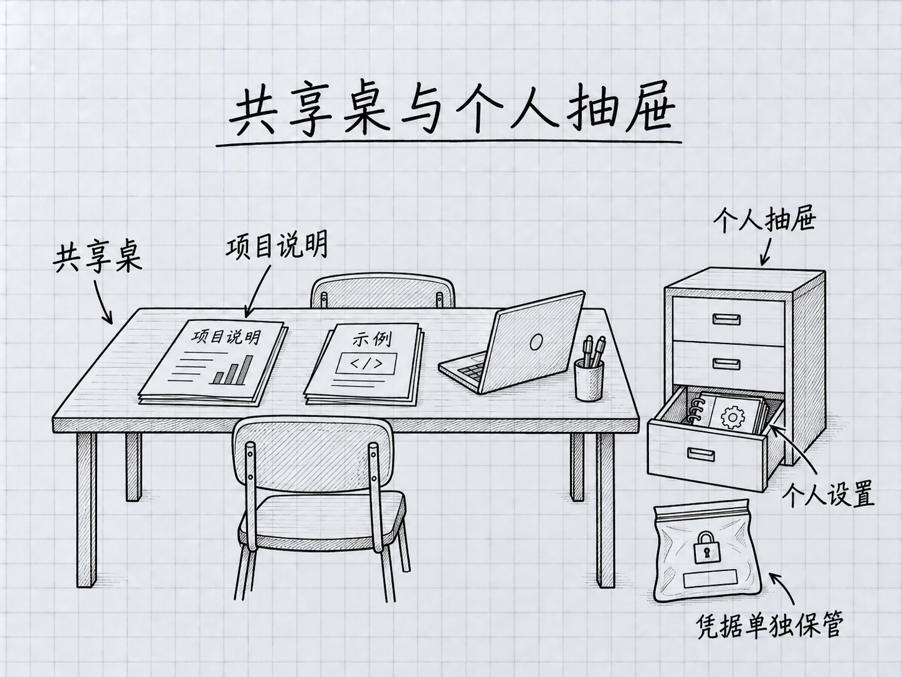

# 第 25 章：团队协作基础——和同事一起用 Claude Code

> **本章在全书的位置**：第六部分 · 第 25 章 / 预估阅读+动手时长：**主线 25-35 分钟 + 支线 8 分钟**
>
> **前置章节**：Ch 14（CLAUDE.md）+ Ch 20-24（五种扩展）
>
> **学完能做什么（主线）**：知道**团队一起用** Claude Code 时哪些共享、哪些不共享；学会用 git 管理 Claude 的配置；避开团队场景最容易踩的三个坑。

---

## 开场三问

- **你会遇到什么问题**：同事也想用 Claude Code——每个人重新摸索一遍？CLAUDE.md 谁改了就乱套？
- **不读这章会踩什么坑**：配置不共享（每个人单独摸索）、密钥意外进 git、团队标准不一致。
- **读完你会多会什么事**：知道哪些该共享（进 git）哪些不该、知道团队约定怎么定、避开密钥泄露。

### 本章地图（一眼看全貌）

本章图解：[共享桌与个人抽屉](#251-共享什么不共享什么一张表)。

---

> 🎯 **【主线】—— 本章必读核心**

---

## 25.1 共享什么、不共享什么——一张表

团队场景下，**哪些跟项目走（共享）、哪些个人私有**？先看文件的作用，再看内容。下面的“进 Git”都以经过审核、不含凭据或个人材料为前提，不能因为放进项目目录就直接公开。

<!-- diagram: FIG-028 -->


*图：团队共享工作约定，个人偏好与私密材料另行管理。*
<!-- /diagram: FIG-028 -->

| 文件 / 目录 | 共享（进 git） | 个人（不进 git） |
|------------|-------------|---------------|
| 项目 `CLAUDE.md` | ✅ 进 | |
| `.claude/commands/`（项目级命令） | ✅ 进 | |
| `.claude/skills/`（项目级 Skills） | ✅ 进 | |
| `.claude/agents/`（项目级 Subagents） | ✅ 进 | |
| `.claude/settings.json`（项目共用设置，例如 Hooks） | ✅ 审核后进 | |
| **`.claude/settings.local.json`（个人覆盖）** | | ✅ 不进 |
| **`~/.claude/CLAUDE.md`（全局个人偏好）** | | ✅ 不进 |
| **`~/.claude/commands/`（个人命令）** | | ✅ 不进 |
| 项目 `.mcp.json`（已检查不含凭据的共享定义） | ✅ 经审核后进 | |
| 用户或本地 MCP 凭据 | | ✅ 不进 |
| **任何包含 token / API key 的文件** | | ✅ 绝不进 |

### 典型 `.gitignore` 示例

在项目根目录的 `.gitignore` 里加下面这些规则。**注释要单独一行**，不能放到文件模式后面：

```gitignore
# Claude Code 的个人设置
.claude/settings.local.json

# 本地环境与凭据文件
.env
.env.*

# 本项目生成在此处的本地日志
.claude/*.log
```

这里没有把整个 `.claude/` 忽略掉，因为团队的 Skills、Agents 和共同设置还需要共享。若使用不含真实凭据的 `.env.example` 模板，可以审核内容后再添加对应的例外规则。其他位置的日志或凭据，也应按实际路径单独处理。

还有一个容易误会的地方：**`.gitignore` 只影响尚未被跟踪的文件，不会让已经提交过的文件从 Git 中消失**。而 `git status` 主要显示变动；已跟踪且没有变化的凭据文件可能根本不出现在结果里。[Git 忽略规则说明](https://git-scm.com/docs/gitignore)

下面是两个不同检查，在**项目根目录的普通终端**分别运行：

```sh
git check-ignore --no-index -v -- .env .claude/settings.local.json
```

这条检查这些路径会匹配哪一条忽略规则。随后运行：

```sh
git ls-files -- .env '.env.*' .claude/settings.local.json
```

第二条查看这些路径是否已在 Git 的跟踪列表里；有输出就需要逐项检查。两条命令检查的是指定路径，不是给整个项目颁发“无密钥证明”。[Git 跟踪文件查询](https://git-scm.com/docs/git-ls-files)

### 为什么这样分

- **共享**的是**团队共同的工作方式**——便于成员用相同标准开始；实际可用性还取决于版本、依赖、个人授权与组织设置
- **个人**的是**你自己的偏好或敏感凭证**——别人不需要、也不该看到

## 25.2 团队 CLAUDE.md 的维护节奏

### 初版怎么起

**第一个人建**：按 Ch 14 的模板，先写一个**最小版本**（20-30 行）。提 PR。

### 修改走 PR

之后任何人想改 CLAUDE.md——**走正常 PR 流程**：

- 通过分支和 PR 修改，按团队分支保护规则合并
- 改动**附带为什么**（"因为 2 月 15 日生产事故，以后禁止直接改 migration 文件"）
- 至少 1 人 review 同意

### 定期整理

**每季度**或**版本节点**：

- 扫一遍——有没有过时条目？
- 有没有重复 / 冲突？
- 能不能合并 / 砍短？

### 防止膨胀的硬线

团队 CLAUDE.md 比个人项目**更容易膨胀**——每个人都想加自己关心的规则。

**对抗方法**：
- 硬性上限（团队商量定，比如 < 150 行）
- 达到上限后**新加一条必须删一条**
- 争议大的放到专门文档（`docs/testing.md` 等），CLAUDE.md 只保留必要说明与准确路径

CLAUDE.md 用来向模型说明约定，不能代替权限配置、分支保护或人工审核要求。需要强制执行的边界，应由相应系统落实。

## 25.3 三个团队场景容易踩的坑

### 坑 1：密钥进了 git

**典型场景**：某人装了 GitHub MCP，配置文件里有 token，手滑 `git add .` 加上，push 了。

**后果**：拿到有效 token 的人可能以它的权限访问仓库或其他服务。GitHub 的密钥扫描可以发现部分凭据，但覆盖范围取决于密钥类型、仓库与配置，不能等待通知后再处理。

**预防与处理**：

- 提前配置 `.gitignore`，并用上一节的两种检查区分“规则匹配”与“已经跟踪”。
- 每次提交前审核暂存内容，尤其是新增配置文件；不要依赖一次 `git add .` 自动分清共享与私有。
- 若密钥已经进入共享历史，**先到提供方撤销或轮换这把密钥**，再检查其使用记录，并让维护者按仓库情况处理历史、缓存、PR 与克隆。删除当前文件或换一个新仓库，都不会清掉其他副本。

涉及共享仓库的历史改写，要与维护者协调，不能独自强推覆盖团队历史。具体步骤以 [GitHub 敏感数据处理说明](https://docs.github.com/en/authentication/keeping-your-account-and-data-secure/removing-sensitive-data-from-a-repository)为准。

### 坑 2：每个人标准不一致

**典型场景**：马力觉得"vibe review 就够"，小红每次都细审——同一段 PR，两人给的反馈完全不同步。

**后果**：
- 评审结论不统一
- 团队质量波动

**预防**（参见 Ch 10 支线 B）：
- **团队审核约定**——哪些类型的改动必须 L3 / L4（写进项目 CLAUDE.md）
- **定期 calibration 会议**——大家一起评一个真实 PR，对比标准差异
- **新成员入职**——把团队 CLAUDE.md + 审核约定作为必读

### 坑 3：成员各自装的扩展互不知道

**典型场景**：小明配了一个 Skill 帮他写测试，小红不知道——自己重头摸一遍。

**后果**：
- 重复劳动
- Skill 质量参差不齐（每个人自己维护）

**预防**：
- **团队 skills 进项目级 `.claude/skills/`**——进 git 共享
- 专门一个 channel / 文档**登记**谁加了什么 Skill / Command
- 新加的扩展要 PR review——让其他人知道

## 25.4 和 git 工作流的配合

Claude Code 和 git 是**天然搭档**——一些最佳实践：

### 实践 1：先审核，再保存一个可恢复版本

想让 Claude 重构几个文件，可以先这样交代。下面是**教学示意**，实际文件名换成自己的：

```
先查看 git status 和本轮相关差异。
列出建议保存的文件，包括尚未被 Git 跟踪的新文件。
请先不要提交；我确认文件清单和暂存内容后，再创建一次本地提交。
```

如果自己操作，基本顺序是：查看状态 → 选择需要保存的具体文件 → 暂存 → 检查暂存差异 → 本地提交。不要把“一次提交”理解为整个目录都备份了；Git 只保存实际进入该提交的内容。`git commit -am` 也不会自动纳入尚未被跟踪的新文件。[Git 提交说明](https://git-scm.com/docs/git-commit)

保存后记下提交号。需要恢复时，先比较当前差异，再选择具体文件或适合项目的恢复方式；`git reset` 的不同模式影响不同，不能当成一句不带条件的通用撤销。还不会 Git，就先复制一份练习资料，并按第 6 章的恢复说明操作。

### 实践 2：用分支探索，分清它与工作区

分支用来组织提交历史。开始探索前先查看状态，把已有改动保存或明确分开，再要求：

```
请确认当前分支和未提交改动。
在不丢失现有工作的前提下，新建 claude-exploration 分支，
只尝试我们刚讨论的方案；先不要合并或发布。
```

试完后查看差异与验证结果。方案可用，就按团队 PR 流程合并；方案不合适，先确认哪些改动已提交、哪些还在工作区，以及哪些需要保留，再处理恢复。

**删除分支不会自动撤销工作区改动，也不会撤销已产生的外部操作。** 在同一目录切换分支时，部分未提交改动还可能随之保留。需要并行隔离文件时，可进一步学习独立 worktree；它也不能隔离外部数据库或服务的副作用。[Git 分支说明](https://git-scm.com/docs/git-branch)

### 实践 3：让 Claude 看到准确的 Git 状态

可以直接用自然语言让它查看，也可以自己输入 shell 模式命令。后者每次**单独提交一条**：

```
!git status
```

检查回应后，再提交：

```
!git log -n 5 --oneline
```

然后用普通消息说明接下来的任务。不要在一段普通提示中间加 `!`，就以为每一行都会被当成 shell 命令。`!` 的权限与费用行为见第 19 章。

### 实践 4：让 Claude 起草提交说明

文件修改完成后，可以要求：

```
请查看这次准备提交的差异，为它起草一条提交说明。
先区分暂存、未暂存和未跟踪文件，只描述我已确认要提交的部分。
先不要提交或推送。沿用项目现有的提交说明格式。
```

审核时，提交说明要能解释**为什么改、结果有什么变化**。一句漂亮的说明不能证明代码或文档已经检查过；验证结果仍需单独确认。

### 实践 5：标记 AI 参与的 commit

有些团队约定——AI 生成或深度修改的 commit 加**特殊标记**：

```
feat: add user batch import [AI-assisted]
```

或在消息里加：

```
Co-authored-by: Claude <claude@anthropic.com>
```

好处：**review 时旁人知道要多留意**。

## 25.5 团队第一次用的"30 天接入路线"

给刚要引入 Claude Code 的团队一个推荐节奏：

### 第 1 周：小范围试点

- 选 1-2 个 "**AI 好感度高 + 项目不太敏感**" 的成员
- 他们各自按本书 Part 1-2 上手
- **不动项目 CLAUDE.md**，先各自体验

### 第 2 周：建项目 CLAUDE.md v0.1

- 试点成员讨论出初版 CLAUDE.md（20-30 行）
- 提 PR，全员 review
- **不建议一次性把团队所有规矩都塞进去**——先最硬的几条

### 第 3 周：建团队审核约定

- 讨论哪些目录 / 文件 必须 L3 / L4 审核
- 哪些绝不能让 AI 动
- 写进 CLAUDE.md 或单独文档

### 第 4 周：扩展 + 共享

- 试点成员把已经好用的 Custom Commands / Skills 放到 `.claude/commands/` `.claude/skills/`（项目级）
- 其他成员拉取后，先核对所需依赖、权限和个人凭据，再在练习任务中验证
- 收集反馈、微调

### 30 天后的常态

- 按试点结果决定哪些场景继续推广
- 每月收集使用反馈，按季度或版本节点整理 CLAUDE.md
- 新 Skill / Command 走 PR
- 月度回顾："哪些用得好、哪些没人用、CLAUDE.md 要不要砍"

---

## 本章小结

- **共享 vs 私有**：项目规则和扩展经审核后共享；个人设置、凭据与任务材料按实际内容区分
- **`.gitignore`** 先排除 `.claude/settings.local.json` 与本地凭据；`.mcp.json` 共享前检查是否含密钥
- **CLAUDE.md 走 PR**，每季度整理，硬性上限防膨胀
- **三个典型坑**：密钥进 git / 标准不一致 / 扩展不共享——各有预防方法
- **Git 和 Claude 搭档**：先检查并保存需要的版本；分支组织历史，不能代替工作区恢复；提交和发布分别确认
- **30 天接入路线**：第 1 周试点、第 2 周初版 CLAUDE.md、第 3 周审核约定、第 4 周扩展共享

---

## 动手任务

### 任务 1：验证忽略规则与已跟踪文件（10 分钟）

先进入你有权维护的 Git 项目。本节在**普通终端**操作；没有 Git 基础时请先在练习仓库完成。

1. 打开项目根目录的 `.gitignore`，按 25.1 加规则，保持注释独占一行。
2. 运行 `git check-ignore --no-index -v -- .env .claude/settings.local.json`，确认目标路径命中预期规则。
3. 运行 `git ls-files -- .env '.env.*' .claude/settings.local.json`，检查这些路径是否已经被跟踪。若有输出，先核对内容与团队需要，不要直接删除本地文件。
4. 若某个个人文件确实不应被跟踪，先备份本地副本、确认忽略规则，再用 `git rm --cached -- "实际文件路径"` 将它移出跟踪。引号中的文字必须换成刚确认的具体路径；不要加 `-f` 强行继续。这个动作还需要随下一次提交生效，也可能影响同事下次更新时的文件，团队成员应提前保留自己的副本。
5. 查看 `git diff --cached --stat` 和具体暂存差异，按项目流程处理这次变更。只移出跟踪**不会删除旧提交中的内容**；如果旧内容含已泄露密钥，按 25.3 先撤销或轮换。

**成功标志**：你能区分“忽略规则匹配”“当前是否被跟踪”“历史是否曾保存”三个问题，并知道本次检查覆盖了哪些路径。

### 任务 2：排查一组已知配置路径的历史（10 分钟）

这只是缩小排查范围的练习，不能代替完整的凭据扫描。在项目根目录的普通终端运行：

```sh
git log --all --name-only --format=oneline -- .env '.env.*' .claude/ .mcp.json
```

如果打开分页器，按 q 退出。结果显示这些路径涉及的提交和文件名，**并没有检验文件内容是否含密钥**。先定位可疑提交，再在本地或维护者协助下核对内容；不要把可能含凭据的完整差异贴到公开聊天里。

发现仍有效且已暴露的密钥，先撤销或轮换，再处理历史。如果没有结果，只能说“这次选定路径没有查到”，不能据此断言仓库其他目录、远端或已删除历史没有泄露。

**成功标志**：记录本次查看的路径、发现与未覆盖范围；有发现时，知道该交给哪位维护者继续处理。

### 任务 3：写一份团队 30 天接入计划（15 分钟，如你要给团队引入）

**步骤**：照 25.5 的路线图，**具体到人、具体到日期**写出你团队的计划：

```markdown
# 团队 Claude Code 接入计划

## 第 1 周（4/22-4/28）试点
- 试点成员：马力、李四
- 他们各自读本书 Part 1-2

## 第 2 周（4/29-5/5）CLAUDE.md v0.1
- 5/2 前出初版 PR（马力负责起草）
- 全员 5/4 前 review + 合并

...
```

**成功标志**：你有了一份**能给老板看的**接入路线，不是空喊"我们要用 AI"。

---

## 如果你卡住了

**症状 A：同事不愿意用，觉得 AI 靠不住**
- 原因：合理——AI 有出错案例、别人可能听说过。
- 解决：**低风险任务起步**——让他们先用在"写周报草稿"这种最安全的任务，建立信任后再扩大。**不要强推**。

**症状 B：团队 CLAUDE.md 改动总是引起争吵**
- 原因：规则背后的价值观分歧。
- 解决：争议大的条目**先不进**——放到专门文档（`docs/style.md`）讨论，达成共识再移回 CLAUDE.md。

**症状 C：密钥已经 push 了怎么办**
- 原因：手滑或 `.gitignore` 晚了。
- 解决：先撤销或轮换泄露凭据，再联系维护者检查访问记录与处理历史。不要把删除文件、清空分支或新建仓库当成清除了所有副本；具体步骤见 25.3 的官方说明。

---

主线结束。下面支线讲"Claude Code 和 CI/CD 的配合"。

---

> 🌿 **【支线】—— 可选深入（学有余力再看）**

---

## 🌿 支线 25.A：Claude Code 和 CI/CD 的边界

> **这段讲什么**：有人问"能不能把 Claude 接到 GitHub Action 里自动审 PR"——能，但有边界。
> **什么时候回头读**：你的团队想把 AI 深度集成进自动化流水线时。

### 能做什么

- **PR 自动审核**：每次开 PR 触发一次 Claude 审查，结果评论到 PR
- **自动生成 CHANGELOG**：每次打 tag 让 Claude 生成发版说明
- **自动回复 issue**：常见问题 Claude 先答，人工 review

**具体怎么做**：先查看 [Claude Code 的 GitHub Actions 集成](https://code.claude.com/docs/en/github-actions)及其授权配置，也可以学习非交互模式（`claude -p "..."`）。这些任务会使用模型服务，调用权限和预算需要单独配置。

### 本书建议的起步边界

零基础团队先把自动化范围放在生成草稿、总结差异和辅助检查上。合并 PR、部署与生产配置修改，按团队现有的审核、测试和发布权限执行；不要因为接入 Claude 就绕过这些控制。

合并提交通常可以通过后续提交撤销部分代码变化，但发布、数据迁移或外部调用的影响未必一同逆转。因此，“可以 Git 回退”不代表整项操作没有代价。这里是本书对入门流程的建议，不是声称 Claude Code 无法参与更成熟的自动化系统。

### 一个踏实的入口

从**低风险 + 易观察**的开始：

- Claude 自动给 PR 打 summary 评论（只说看到了什么，不给评判）
- 观察几周，调整 prompt
- 质量稳定后再加审查评判
- 每次扩大自动化范围，都补上对应验证、授权与失败处理

### 和本书定位的关系

本书是**零基础入门**——CI/CD 集成是**进阶话题**。先把交互式的 Claude Code 用熟、团队协作建好，再考虑 CI。

---

**下一章**：第 26 章"进阶能力速览"——指路牌性质。告诉你"还有这些更深的东西存在"，但不教——你已经有了继续学习所需的基础，可以根据实际任务选择下一条路线。

<!-- studio:nav -->
← [第 24 章：MCP 入门——连接一个确实需要的外部服务](../part5-%E6%89%A9%E5%B1%95%E8%83%BD%E5%8A%9B/24-MCP%E5%85%A5%E9%97%A8.md) · [目录](../../README.md) · [第 26 章：进阶能力速览——按工作需要选路线](26-%E8%BF%9B%E9%98%B6%E8%83%BD%E5%8A%9B%E9%80%9F%E8%A7%88.md) →
<!-- /studio:nav -->
