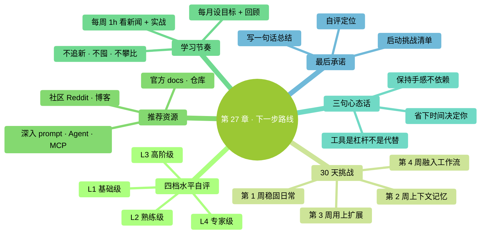

# 第 27 章：下一步路线——读完书只是起点

> **本章在全书的位置**：第六部分 · 第 27 章 / 预估阅读+动手时长：**主线 15-20 分钟 + 支线 5 分钟**
>
> **前置章节**：读完整本书
>
> **学完能做什么（主线）**：拿到一份可落地的**持续成长路线图**——30 天挑战清单 + 推荐资源 + 学习节奏——让你读完不会"不知道怎么继续"。

---

## 开场三问

- **你会遇到什么问题**：书读完了、技巧都会了，但**真正习惯**没养成——用一阵又回到旧工作方式。
- **不读这章会踩什么坑**：所学知识没机会"生根"——3 个月后忘光。
- **读完你会多会什么事**：**30 天让 Claude Code 变成习惯**——从"每次要想起来用"到"不用就不自在"。

### 本章地图（一眼看全貌）

<!-- diagram: MM-34 -->

---

> 🎯 **【主线】—— 本章必读核心**

---

## 27.1 先认识自己现在的水平

把本书知识转化成"能力档"，简单自评：

### L1：基础级（读完 Part 1-2 + 少量动手任务）

- 能独立启动 Claude Code
- 会 `@` 引用文件、审 diff、基本权限决策
- 会 `/clear`、`/compact`

### L2：熟练级（完成大部分动手任务 + 日常使用 2 周以上）

- 能主动用 `/plan` `/rewind`
- 有自己的信任档案 + 止损规则
- 写过至少一版可用的 CLAUDE.md
- 有模型切换意识（Sonnet / Opus）

### L3：高阶级（读完全书 + 扩展能力实际用起来）

- 至少用过 1 个 Skill / Command / Subagent 之一
- 装过至少一个 MCP
- 已经为团队或个人工作流**节省了时间**

### L4：专家级（用 Claude Code 改变了工作方式）

- Claude Code 嵌到每日节奏里
- 已经**帮别人入门**或**主导团队接入**
- 对扩展 / 定制有深度实践

**你现在大概在哪一档？** 这决定了下面挑战清单怎么用。

## 27.2 30 天挑战清单

**目标**：30 天后达到 L3（高阶级）。

### 第 1 周：稳固日常（L1 → L2 过渡）

每天 20-40 分钟，连续 7 天：

- [ ] **Day 1**：早上用 `/daily` 命令列今日任务
- [ ] **Day 2**：让 Claude 整理至少 5 个文件（重命名 / 归档）
- [ ] **Day 3**：让 Claude 写一份会议纪要
- [ ] **Day 4**：改一个真实文档（日报 / 邮件 / 博客）
- [ ] **Day 5**：用 `/plan` 做一个稍大的任务
- [ ] **Day 6**：遇到错误时用 `/rewind` 而不是手动修
- [ ] **Day 7**：**回顾一周——哪件事最省时？哪件事最卡？**

### 第 2 周：管理好上下文和记忆

- [ ] **Day 8**：写你的第一版 CLAUDE.md（< 40 行）
- [ ] **Day 9**：用了 `@` Tab 自动补全至少 5 次
- [ ] **Day 10**：主动 `/compact` 了至少 2 次
- [ ] **Day 11**：每次完成任务就 `/clear`，养成习惯
- [ ] **Day 12**：截图给 Claude 解读一次
- [ ] **Day 13**：查一次 `/status` 和用量页，看自己花多少钱
- [ ] **Day 14**：**回顾——CLAUDE.md 有没有改进空间？**

### 第 3 周：用上扩展

- [ ] **Day 15**：装一个现成 Skill（本书 20.3 的 meeting-notes 或你找的别的）
- [ ] **Day 16**：写一个你自己的 Custom Command
- [ ] **Day 17**：写你的第二个 Command（已经找到规律了）
- [ ] **Day 18**：建一个最简 Subagent（按 Ch 22.3）
- [ ] **Day 19**：配一个 hook（按 Ch 23.6 模板）
- [ ] **Day 20**：装一个 MCP（filesystem / GDrive / GitHub 择一）
- [ ] **Day 21**：**回顾——这周哪个扩展最值？哪个没用上？**

### 第 4 周：融入工作流

- [ ] **Day 22**：把本周至少 3 个重复任务做成模板（prompt 或 Command）
- [ ] **Day 23**：用 Claude Code 做一件"平常不会用 AI 做"的事
- [ ] **Day 24**：教一个朋友 / 同事启动 Claude Code
- [ ] **Day 25**：在团队群或朋友圈分享一次你的使用经验
- [ ] **Day 26**：写一篇自己的"Claude Code 使用心得"（200 字也行）
- [ ] **Day 27**：整理你的 CLAUDE.md、Skills、Commands——**砍掉不用的**
- [ ] **Day 28**：**大回顾——30 天用了多少次？节省了多少时间？**
- [ ] **Day 29**：设定下 30 天的**一个主目标**（进一步精通某领域 / 推广给团队 / 做特定工具）
- [ ] **Day 30**：**休息 + 准备下一阶段**

### 回顾的三个关键问题

1. **这 30 天，Claude Code 帮我做成了哪件之前做不好 / 做不了的事？**
2. **还有哪类任务我没让 AI 碰？为什么？**（判断是合理 vs 是惯性）
3. **下 30 天我要在哪个方向进一步？**

## 27.3 推荐资源

### 官方

1. **Anthropic 官方文档**：[docs.anthropic.com](https://docs.anthropic.com)
   - 最权威、更新最及时
   - 英文为主，浏览器自带翻译能看懂

2. **Claude Code 官方仓库**（GitHub）：
   - 搜 "claude-code"
   - Issue + Discussion 区有大量真实问题解答

3. **Anthropic 官方 Blog / Cookbook**：
   - Blog：产品重大更新
   - Cookbook：具体用法示例

### 社区资源

1. **英文**：
   - **Reddit r/ClaudeAI**：用户社区、经验分享
   - **HumanLayer 的 CLAUDE.md 文章**（本书 Ch 14 很多原则来自这里）
   - **awesome-claude-code** 类 GitHub 仓库：工具 / Skill / Command 合集

2. **中文**：
   - 国内开发者博客里的 Claude Code 实践
   - B 站 / 微信公众号的入门教程（注意时效——Claude Code 迭代快）
   - 群 / Discord：各大 AI 社区都有 Claude Code 相关讨论

### 深入学习

1. **prompt engineering**：
   - Anthropic 官方 prompt engineering 指南
   - [learnprompting.org](https://learnprompting.org)

2. **Agent SDK**（若你想自己构建）：
   - Anthropic Agent SDK 文档
   - Tool use 示例

3. **MCP**：
   - MCP 官方文档（[modelcontextprotocol.io](https://modelcontextprotocol.io)）
   - awesome-mcp-servers

### 本书未涵盖但值得知道

- **Claude Cowork**（如果你是非编程工作者，反而更适合）
- **Claude 桌面应用**（本书附录 H 有简介）
- **Anthropic 商业产品线**（企业版 / Enterprise）

## 27.4 学习节奏建议

### 每周节奏

- **1 小时**：刷最近一周 Anthropic 产品更新 + 1-2 个社区帖子
- **3-5 小时**：真实项目里用 Claude Code
- **偶尔**：试一个新扩展 / 新 MCP

### 每月节奏

- **月初**：设一个"本月想提升哪方面"的目标
- **月末**：回顾——做到了吗？用量如何？
- **季度**：整理 CLAUDE.md、清理不用的扩展

### 不要做的

- ❌ **每天刷最新功能**——工具迭代太快，天天追会焦虑
- ❌ **囤工具不用**——装了 10 个 MCP 平时只用 1 个
- ❌ **追"最 pro"设定**——你用得顺比配置好看更重要
- ❌ **和别人比**——不同角色、不同需求，不可比

## 27.5 关于 AI 时代的工作心态

最后给你三句话——超越 Claude Code 本身：

### 1. 工具是杠杆，不是代替

Claude Code 让你做得更快更多——但**做什么**、**要达到什么目的**、**质量标准**仍然是你的事。

**AI 不会替你思考人生目标**。别指望工具回答"我该做什么人"。

### 2. 保持手感

**太依赖 AI 会让基础能力生锈**：
- 写作能力
- 思考能力
- 动手的耐心

建议：**每周至少一项工作完全不用 AI**。保持"没工具也能做"的手感。

### 3. AI 帮你省时间——但省下的时间**你怎么用**决定你成为什么样的人

省下 2 小时你拿去刷短视频 → 你是"刷短视频更多的人"
省下 2 小时你拿去学习 / 锻炼 / 陪家人 → 你是"**更丰富**的人"

**工具放大一切**——放大你的好习惯和坏习惯。

---

## 本章小结

- 4 档水平：L1 基础 / L2 熟练 / L3 高阶 / L4 专家——**自评你现在在哪**
- **30 天挑战清单**：第 1 周稳固日常 → 第 2 周管理上下文记忆 → 第 3 周用扩展 → 第 4 周融入工作流
- 推荐资源：**官方优先 + 社区补充**；中文资源注意时效
- 学习节奏：每周 1 小时看新闻 + 3-5 小时实战；每月目标 + 回顾；不要追最新 / 囤工具 / 和人比
- **工具是杠杆不是代替**；**保持手感**；**省下的时间怎么用决定你成为什么样的人**

---

## 动手任务（最后一个！）

### 任务 1：自评 + 定位（5 分钟）

照 27.1 四档判断你现在在哪：__________

### 任务 2：启动 30 天挑战（5 分钟）

**步骤**：

1. 在日历上标 30 天后的日期
2. 把 27.2 的 30 个 Day 任务贴到备忘录 / Notion / 任何你每天都看的地方
3. **从明天开始**，每完成一个打勾
4. 30 天后**回来回顾**

**成功标志**：你有了一份**可打勾**的挑战清单——不是空喊。

### 任务 3：写一句话总结（10 分钟）

**步骤**：写下一句话——

> **"我读完这本书后，打算用 Claude Code 改变的一件事是：__________"**

可以写得很小（"每天用它写日报"）也可以写得远（"帮团队全面接入 AI")——**只要是具体的**。

**成功标志**：你有了一句**清晰的承诺**。每次打开 Claude Code 前默念一次。

---

## 如果你卡住了

**症状 A：30 天清单做不完，觉得挫败**
- 原因：你的节奏比清单慢——**正常**。
- 解决：**延长到 60 天甚至 90 天**——重要的是每天进步一点，不是赶进度。

**症状 B：读完书但没感觉"真的学到了"**
- 原因：读和做之间有鸿沟，你可能没真的做动手任务。
- 解决：**回头补动手任务**——哪怕只做每章的第一个。读 10 章不如做 3 章。

**症状 C：工作中没机会用**
- 原因：工作内容没什么"AI 能帮上的"。
- 解决：**从个人生活开始用**——整理照片、写旅行日记、规划周末、改私人博客。熟了再用到工作上。

---

## 写在最后

你从**不知道终端是什么**读到**能用扩展 + MCP 打造自己的 AI 工作流**——这一路不容易。

- 你建立了一整套对**新工具的判断力**：怎么信、怎么验证、怎么止损
- 你学会了和 AI 协作的**基本礼仪**：给上下文、审改动、管权限、防泄密
- 你有了一份**活的 CLAUDE.md、一个信任档案、一个止损规则**——这些是你的财富

**这本书的使命到这里结束了，你的使命正式开始**。

去做你想做的事吧——现在你有了一个永不疲倦、愿意学习任何任务、每天变更聪明的伙伴。

好好用它。

---

> 🌿 **【支线】—— 可选深入（学有余力再看）**

---

## 🌿 支线 27.A：书没写的那些

> **这段讲什么**：本书有意没写的东西，以及为什么。
> **什么时候回头读**：你好奇"本书是不是避开了某些话题"时。

### 1. 没深入 Linux

覆盖 Mac + Windows，但**Linux 用户必须自行类推**。原因：
- 零基础读者基本没人只用 Linux
- Linux 用户通常有较强自学能力
- 省篇幅和认知负担

### 2. 没详细讲编程

本书假设**读者不会编程**。所以：
- 示例偏日常（整理文件、写文档）
- 涉及代码的章节（Ch 22 代码审查 subagent）只做演示
- 不教 Python / JavaScript 任何语言

想学编程 → 另找教程（本书不替代）。

### 3. 没写 Linux / Android / iOS 平台

只覆盖主力桌面系统。移动端 Claude 有独立产品线（Claude.ai App、Cowork），不在本书范围。

### 4. 没深入"AI 伦理"

没展开讨论：
- AI 会抢工作吗
- AI 的偏见和公平性
- AGI / 超级智能

这些重要，但**和"入门 Claude Code"关系不大**。想深入这些话题，去看专门的书（如《AI 超级大陆》《超越人类》等）。

### 5. 没给"完整作业"

没有 "用 Claude Code 做一个 Todo App" 这种端到端作业。原因：
- 零基础读者目标多样，一个示例作业满足不了所有人
- 本书重**心智模型 + 判断力**，而不是"照抄一个项目"
- 真正的作业是**你自己的生活 / 工作任务**

### 6. 没推荐具体付费订阅

模糊说了"Pro / Max / API"——没给"你应该买 X"。原因：
- 价格 / 套餐会变
- 每个人需求不同
- 本书不接受广告，不做购买引导

---

**附录开始**——下一部分是 9 个附录，查阅型内容：Mac/Windows 速查、slash 命令全表、决策流程图、FAQ、术语表、报错自救、桌面应用导览、延伸阅读。用到的时候翻。

**祝你用得愉快**。
