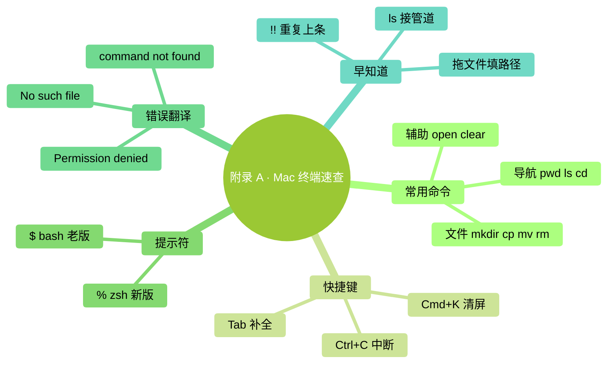

# 附录 A：Mac 终端速查

> 用法：打开 终端.app（Spotlight 搜 "终端"），按速查表敲命令。

### 本章地图（一眼看全貌）

<!-- diagram: MM-35 -->

## 最常用 15 个命令

| 命令 | 干什么 | 例 |
|-----|-------|---|
| `pwd` | 看我现在在哪个文件夹 | `pwd` |
| `ls` | 列当前文件夹里的东西 | `ls` |
| `ls -la` | 连隐藏文件和详细信息都列 | `ls -la` |
| `cd 文件夹名` | 进入某个文件夹 | `cd Documents` |
| `cd ..` | 上一层文件夹 | `cd ..` |
| `cd ~` | 回自己的用户文件夹（家） | `cd ~` |
| `cd -` | 回上次那个文件夹 | `cd -` |
| `mkdir 名字` | 建一个新文件夹 | `mkdir notes` |
| `touch 名字` | 建一个空文件 | `touch todo.md` |
| `cp 源 目标` | 复制 | `cp a.txt b.txt` |
| `mv 源 目标` | 移动 / 重命名 | `mv a.txt b.txt` |
| `rm 文件` | 删除（**小心**，不进回收站） | `rm old.txt` |
| `rm -rf 文件夹` | 删文件夹及里面所有内容（**最危险**，再三确认） | `rm -rf temp/` |
| `open .` | 在 Finder 打开当前文件夹 | `open .` |
| `clear` | 清屏 | `clear` |

## 最常用快捷键

| 快捷键 | 作用 |
|-------|------|
| `Tab` | 自动补全文件名 / 命令 |
| `↑` / `↓` | 翻命令历史 |
| `Ctrl+A` | 光标跳到行首 |
| `Ctrl+E` | 光标跳到行尾 |
| `Ctrl+C` | 中断当前运行的命令 |
| `Ctrl+D` | 退出当前 shell |
| `Ctrl+L` | 清屏（等同 `clear`） |
| `Cmd+T` | 新标签页 |
| `Cmd+N` | 新窗口 |
| `Cmd+K` | 清屏并清历史（彻底清） |
| `Cmd+加号 / 减号` | 字号变大 / 变小 |

## 提示符符号速读

- `%`（zsh，新版 Mac 默认）：等着你打字
- `$`（bash，老 Mac）：一样意思
- 看到 `~` = 你在自己的用户文件夹

## 常见错误翻译

| 看到 | 意思 | 怎么办 |
|-----|-----|-------|
| `command not found: xxx` | 没装 xxx 这个程序 | 先装（比如 `brew install xxx`） |
| `No such file or directory` | 找不到这个文件 / 文件夹 | `pwd` 看你在哪、`ls` 看有没有 |
| `Permission denied` | 权限不够 | 加 `sudo`（**慎用**）；或 `chmod +x 文件` |
| `zsh: parse error` | 命令打错了（缺引号 / 括号） | 仔细看命令，重新敲 |
| `Operation not permitted` | Mac 的 SIP 保护拦的 | 该目录是系统目录，别动 |

## 一些"我希望早点知道"

- **拖文件进终端** → 自动填入完整路径（省去手打）
- **`ls | less`**（带竖线）→ 列表太长时分页看，按 `q` 退出
- **`!!`** → 重复上一条命令（装完 `sudo` 忘了加，敲 `sudo !!` 直接补）
- **`cd`** 单独一个 → 等同 `cd ~`
- **`open 文件.pdf`** → 用默认程序打开这个文件
