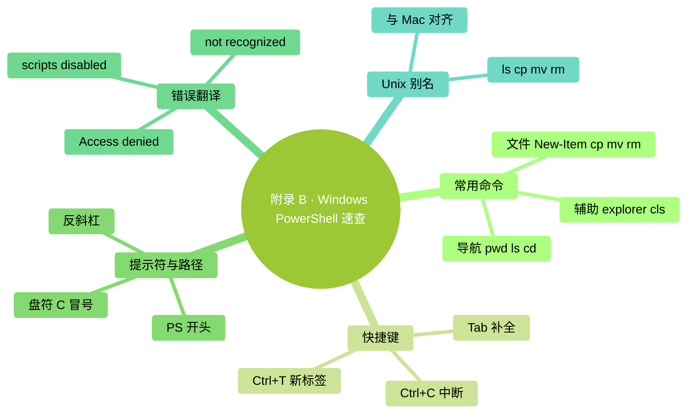

# 附录 B：Windows PowerShell 速查

> 用法：按 `Win + X` 选 "终端"（Windows 11）或 "PowerShell"。**本书不推荐 WSL / CMD——统一用 PowerShell**。

### 本章地图（一眼看全貌）

<!-- diagram: MM-36 -->

## 最常用 15 个命令

| 命令 | 干什么 | 例 |
|-----|-------|---|
| `pwd` | 看我在哪个文件夹 | `pwd` |
| `ls` | 列当前文件夹 | `ls` |
| `ls -Force` | 连隐藏文件都列 | `ls -Force` |
| `cd 文件夹名` | 进去 | `cd Documents` |
| `cd ..` | 上一层 | `cd ..` |
| `cd ~` | 回用户文件夹 | `cd ~` |
| `mkdir 名字` | 建文件夹 | `mkdir notes` |
| `New-Item 名字` | 建空文件 | `New-Item todo.md` |
| `cp 源 目标` | 复制 | `cp a.txt b.txt` |
| `mv 源 目标` | 移动 / 重命名 | `mv a.txt b.txt` |
| `rm 文件` | 删除（**小心**，不进回收站） | `rm old.txt` |
| `rm -r 文件夹` | 删文件夹及内容 | `rm -r temp` |
| `explorer .` | 在资源管理器打开当前 | `explorer .` |
| `cls` | 清屏 | `cls` |
| `notepad 文件` | 用记事本打开 | `notepad todo.md` |

## 最常用快捷键

| 快捷键 | 作用 |
|-------|------|
| `Tab` | 自动补全 |
| `↑` / `↓` | 翻历史 |
| `Home` | 光标跳行首 |
| `End` | 光标跳行尾 |
| `Ctrl+C` | 中断 |
| `Ctrl+L` 或 `cls` | 清屏 |
| `Ctrl+T` | 新标签页（Windows Terminal） |
| `Ctrl+Shift+N` | 新窗口 |
| `Ctrl+加号 / 减号` | 字号 |

## 提示符符号速读

- `>`（如 `PS C:\Users\你>`）：PowerShell 等你打字
- `PS` = PowerShell
- 路径用**反斜杠 `\`**（和 Mac 的 `/` 不一样）

## 常见错误翻译

| 看到 | 意思 | 怎么办 |
|-----|-----|-------|
| `The term 'xxx' is not recognized` | 没装或没在 PATH 里 | 先装；重开终端 |
| `Cannot find path 'xxx' because it does not exist` | 路径错 | `pwd` 和 `ls` 核查 |
| `Access to the path 'xxx' is denied` | 权限不够 | **以管理员身份**运行 PowerShell |
| `... is currently disabled on this system` | 脚本执行政策限制 | 管理员 PowerShell 跑 `Set-ExecutionPolicy RemoteSigned`（理解后再做） |
| `... cannot be loaded because running scripts is disabled` | 同上 | 同上 |

## Windows 特别要注意的路径差异

- **反斜杠** `\`（不是 `/`）
- 盘符 `C:\` `D:\`——Mac/Linux 没有
- **空格路径用引号**：`cd "Program Files"`
- **用户文件夹**：`C:\Users\你的名字`（不是 `/Users/...`）

## PowerShell 的"别名"

很多 PowerShell 原本的命令有 Unix 风格别名，方便跨平台用户：

| PowerShell 原生 | 别名（Mac / Unix 风格） |
|---------------|----------------------|
| `Get-ChildItem` | `ls`（也支持 `dir`） |
| `Set-Location` | `cd` |
| `Copy-Item` | `cp`（也支持 `copy`） |
| `Move-Item` | `mv`（也支持 `move`） |
| `Remove-Item` | `rm`（也支持 `del`） |

**本书统一用 Unix 风格别名**——和 Mac 版速查表对应一致。

## 一些"我希望早点知道"

- **拖文件进终端** → 自动填路径（和 Mac 一样）
- **以管理员身份运行**：右键 PowerShell 图标 → "以管理员身份运行"——某些系统命令需要
- **`dir`** 也能用（老 CMD 风格，PowerShell 兼容）
- **`clip`** 命令 → `echo "hello" | clip` 把输出复制到剪贴板

---

<!-- chapter-nav -->

📖  [← 附录 A · Mac 终端速查](A-Mac终端速查.md)  ·  [📑 返回目录](../../README.md)  ·  [附录 C · Slash 命令全表 →](C-Slash命令全表.md)
