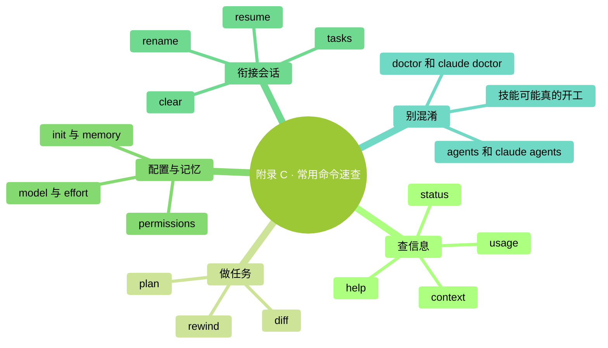

# 附录 C：常用 Slash 命令速查

> **怎么用**：先看左列“我想做什么”，再选择命令。Slash 就是斜杠；以下以 `/` 开头的命令输入在 **Claude Code 会话里**。
>
> **核对日期：2026-09-24；操作基线：2.1.280 或更新版本。** 本页选择本书常用入口，不承诺列尽每个动态命令。账户、平台、组织配置和已安装技能会影响你看到的选项。
>
> 需要逐步练习时，先读[第 18 章](../part4-避坑与判断力/18-常用快捷命令全览.md)。

### 本章地图（一眼看全貌）

<!-- diagram: MM-37 -->

---

> 🎯 **【主线】—— 先找当前需要的入口**
> 不必把表中每一项执行一遍。查看面板、修改设置和启动工作，是不同的操作。

## C.1 查状态、保留进度与管理上下文

| 我想做什么 | 命令 | 读结果时记住 |
|---|---|---|
| 查帮助 | `/help` | 结合当前 `/` 菜单找入口，不保证列出全部隐藏命令 |
| 确认版本、模型和账户 | `/status` | 看环境配置，不是看最终账单 |
| 看当前消耗和套餐用量 | `/usage` | 会话费用是估算，实际账单到付款账户核对 |
| 旧教程让查 cost | `/cost` | 当前是 `/usage` 的别名 |
| 看统计页 | `/stats` | 同属用量界面，打开统计页 |
| 看上下文空间 | `/context` | 空间占用与套餐剩余额度不同 |
| 总结长对话再继续 | `/compact` | 可附上要保留的重点，不保证保留每个细节 |
| 开始无关的新任务 | `/clear` | 开新会话，不撤销文件，也不退还已发生用量 |
| 给这场工作起名字 | `/rename 名称` | 例如“活动安排核对”，方便以后寻找 |
| 找回一场会话 | `/resume` | 选择会话；不是把所有文件恢复到旧状态 |

“名称”表示你要自己填写的文字，使用时不要连“名称”两字照抄。如果想留下长任务的重要决定，应该同时写进项目文件；命令能帮你找回会话，不能代替对文件本身的保存与核对。上下文操作见[第 12 章](../part3-深度概念/12-Claude为什么会变糊涂.md)，用量见[第 15 章](../part3-深度概念/15-模型与成本.md)。[官方命令参考](https://code.claude.com/docs/en/commands)、[用量说明](https://code.claude.com/docs/en/costs)

## C.2 准备修改、检查结果与调整模型

| 我想做什么 | 命令 | 操作边界 |
|---|---|---|
| 先讨论怎么做 | `/plan` | 进入计划模式；可在后面写任务描述 |
| 看文件前后变化 | `/diff` | 查看工作区差异；还要判断变化是否正确 |
| 查可用回退点 | `/rewind` | 先看恢复范围，不覆盖所有终端或外部操作 |
| 选择模型 | `/model` | 正常确认会保存默认；选择器按 `s` 仅用于本次 |
| 调整思考投入 | `/effort` | 默认值因模型而异，详见第 15 章 |
| 使用付费加速 | `/fast` | 不是小模型；先确认额外用量及价格 |
| 查看或调整偏好 | `/config` | 改动可能保存，先读清选项 |
| 查看操作规则 | `/permissions` | 包含允许、询问、拒绝规则，不只是白名单 |
| 核对额外用量设置 | `/usage-credits` | 个人账户打开相关网页；组织成员可能需向管理员提出请求 |

`/rewind` 是恢复入口，`/clear` 是开始新会话，两者不要互换。比如 Claude 通过终端命令移动了文件，清空聊天并不能把文件搬回去；检查点也未必记录那次操作。先确认变化来源，再按[第 9 章](../part2-日常使用/09-计划模式与撤销.md)处理。[检查点范围](https://code.claude.com/docs/en/checkpointing)

如果只是想看看模型列表，打开后按 Esc 退出即可，不必选一个收费项目。模型选择与 effort 见[模型配置](https://code.claude.com/docs/en/model-config)，fast 见[快速模式](https://code.claude.com/docs/en/fast-mode)，规则含义见[权限说明](https://code.claude.com/docs/en/permissions)。

## C.3 整理项目说明、排查问题和结束会话

| 我想做什么 | 入口 | 你需要知道的区别 |
|---|---|---|
| 建立项目说明初稿 | `/init` | 生成或建议改进 `CLAUDE.md`，之后要审阅 |
| 查看说明与自动记忆 | `/memory` | 不只管理一个 `MEMORY.md` 文件 |
| 查看可用技能 | `/skills` | 同时有技能可见性设置，查看时别随手改 |
| 查看外接工具连接 | `/mcp` | MCP 是连接外部工具的方式；连接状态与操作权限不同 |
| 诊断配置并讨论修复 | `/doctor` | 当前是技能，可提出并在确认后实施修复 |
| 只做安装诊断 | 普通终端 `claude doctor` | 不在会话里输入，输出只读诊断 |
| 看当前会话的后台工作 | `/tasks` | 子任务可能仍在运行，别仅看主对话是否结束 |
| 退出普通前台会话 | `/exit` | 在已连接的后台会话中可能只断开连接 |
| 登录或退出账户 | `/login` / `/logout` | 会改变认证状态，不是无影响的查看操作 |

`/init` 不是必须避开的命令，也不是自动生成后必须删掉的文件。你可以拿它做起点，核对哪些约定准确，再删掉猜测或不适用的内容。记忆和说明的关系见[第 13 章](../part3-深度概念/13-三层记忆.md)、[第 14 章](../part3-深度概念/14-写好你的CLAUDE.md.md)。[官方记忆说明](https://code.claude.com/docs/en/memory)

`/doctor` 与 `claude doctor` 的区别值得单独记住：前者是一项可以帮助修复的工作，后者是终端诊断。不要把旧版“doctor 只会读”的经验套给现在的斜杠入口。[故障排查说明](https://code.claude.com/docs/en/troubleshooting)

---

## 本章小结

- 从当前问题找命令，不必背完整张表。
- 配置、用量、空间分别看 `/status`、`/usage`、`/context`。
- 恢复会话、恢复文件、停止后台任务是不同事情。
- 修改设置和启动技能之前，先读清会影响什么。
- 当前菜单、官方说明与本书操作基线一起核对。

## 动手任务

### 做一张三行速查卡（约 3 分钟）

1. 选出你最常遇到的三个问题，例如“看额度、找旧会话、看修改”。
2. 从表里找到对应命令，各写一句用途。
3. 只打开其中的查看面板验证一次；不要为了练习开通付费功能或修改权限。

**成功标志**：以后你能从问题找到入口，而不需要每次翻整张表。

## 如果你卡住了

**找不到命令。** 先核对版本和当前输入位置；技能、平台或账户条件也可能造成差异。以当前说明为准，不要猜一个相近名称直接执行。

**界面不像书里说的。** 看清是普通终端、Claude Code 会话，还是桌面应用；不同入口的名称和可用范围可能不同。

**误改了设置或文件。** 先看改动发生在哪里，不要用 `/clear` 当撤销键；记录改动并按对应章节恢复。

---

> 🌿 **【支线】—— 旧教程对照与扩展入口**

## 🌿 支线 C.A：旧名字还在，行为可能已经不同

**什么时候查这段**：你正照一份旧教程操作，但它让你找的菜单已经不见了。

| 旧教程常见说法 | 当前应怎样理解 |
|---|---|
| `/agents` 打开子代理创建向导 | 从 2.1.198 起不再打开该向导；让 Claude 创建或编辑定义 |
| `/doctor` 是只读面板 | 当前是体检技能；只读终端诊断用 `claude doctor` |
| `/model` 只换本次模型 | 正常确认会保存；选择器按 `s` 才仅本次 |
| `/memory` 只打开自动记忆文件 | 还管理 `CLAUDE.md` 与自动记忆开关 |
| 所有斜杠命令都不消耗模型 | 技能与工作流会让 Claude 实际工作 |
| `/help` 一定展示一切 | 可用性、隐藏入口和已安装技能会影响菜单 |

子代理是分担任务的助手，创建方式见[官方子代理说明](https://code.claude.com/docs/en/sub-agents)；技能的两种触发方式见[技能说明](https://code.claude.com/docs/en/skills)。遇到名称变化，先确定你要完成的动作，再查新入口，不必为了复现旧菜单降级软件。

## 🌿 支线 C.B：进阶入口先知道用途，不急着全部打开

**什么时候查这段**：你已经有一个稳定的小流程，准备让它持续、并行或从其他设备继续时。

| 入口 | 用途与边界 | 本书入口 |
|---|---|---|
| `/goal` | 给持续工作设完成条件；也要了解怎样停止 | 第 26 章 |
| `/loop` | 在会话保持打开时重复执行提示，运行会消耗用量 | 第 26 章 |
| `/schedule` | 云端例行任务，与本机会话循环不同 | 第 26 章 |
| `/background` | 把当前会话放到后台继续 | 第 26 章 |
| `/remote-control` | 从其他设备连接当前会话，受账户条件限制 | 第 26 章 |
| `/plugin` | 管理插件，可能安装或启用额外能力 | 第 20—24 章 |
| `/reload-skills` | 重新发现磁盘上新增或改过的技能 | 第 20、21 章 |

这些入口不是“越多越好”的清单。先明确任务、文件范围和结束条件，再去[第 26 章](../part6-融入日常/26-进阶能力速览.md)学习对应流程。当前功能名、限制及新变化统一到[官方命令参考](https://code.claude.com/docs/en/commands)核对；本页不替你开启后台执行或定时任务。

<!-- studio:nav -->
← [附录 B：Windows PowerShell 速查](B-Windows-PowerShell%E9%80%9F%E6%9F%A5.md) · [目录](../../README.md) · [附录 D：决策流程图](D-%E5%86%B3%E7%AD%96%E6%B5%81%E7%A8%8B%E5%9B%BE.md) →
<!-- /studio:nav -->
