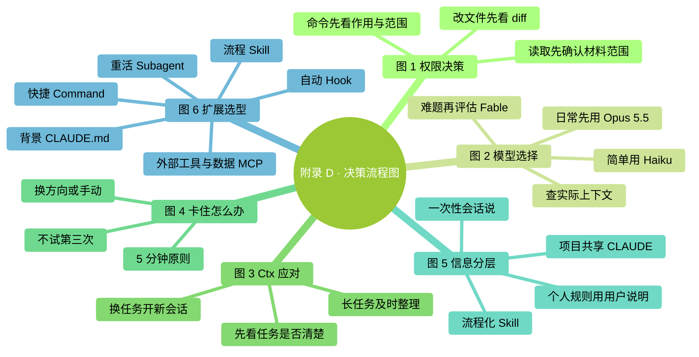
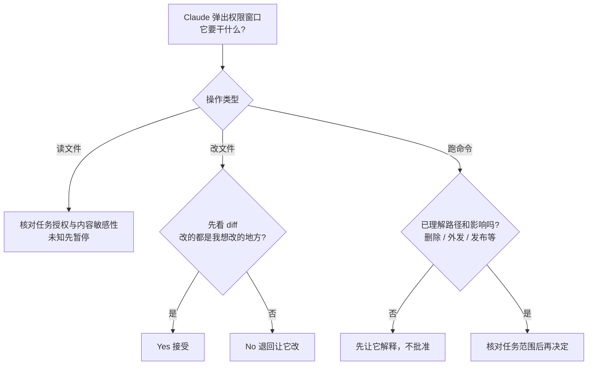
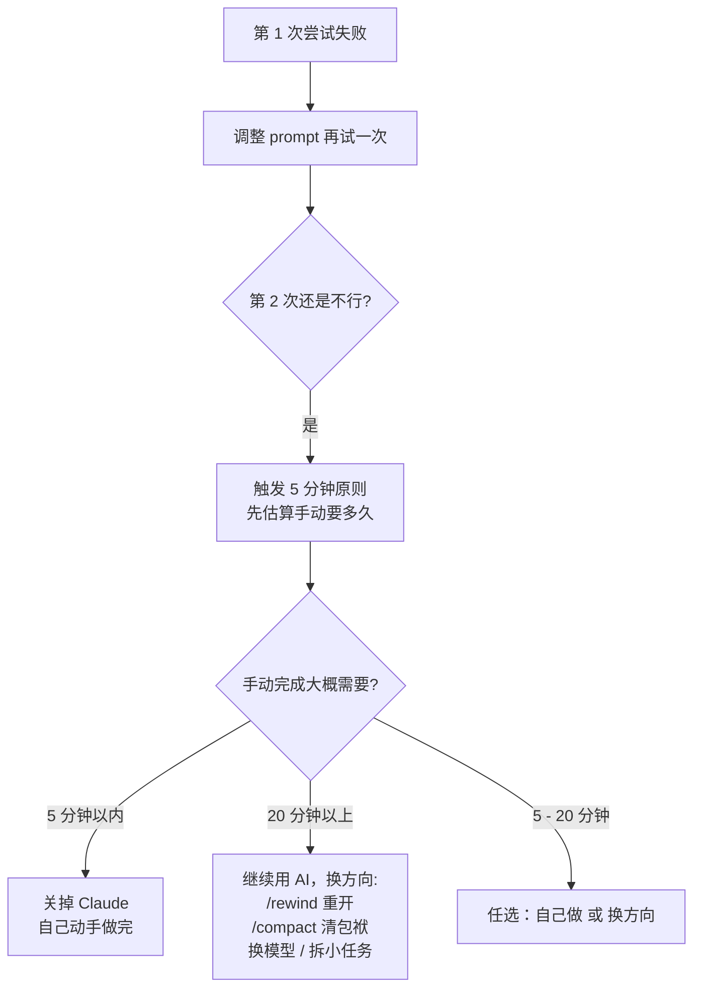
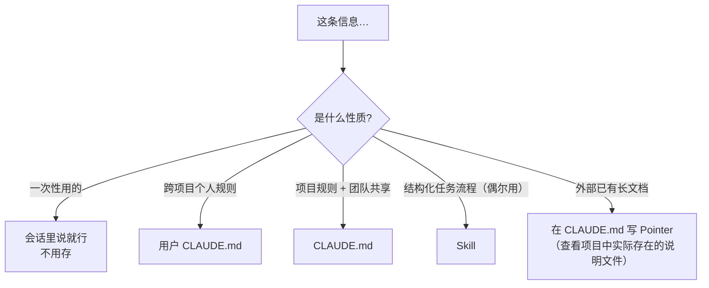
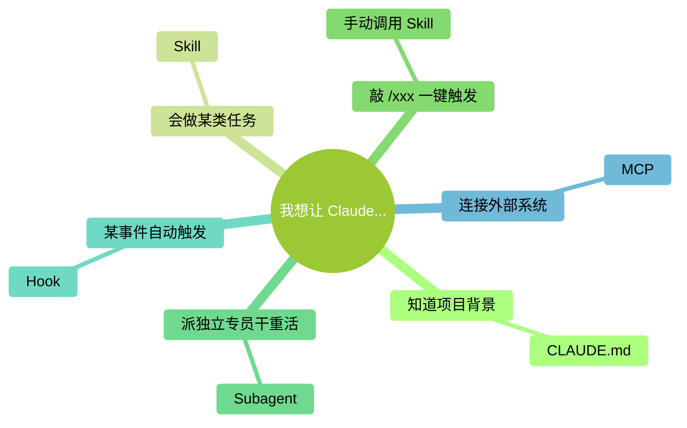

# 附录 D：决策流程图

> 本附录把书里反复出现的几个"该怎么选"汇总成流程图。图全部用 Mermaid 手绘风格绘制，GitHub 上直接渲染，可以直接右键保存图片或截图打印。

### 本章地图（一眼看全貌）

<!-- diagram: MM-38 -->

## 图 1：权限决策流程（遇到弹窗怎么选）

<!-- diagram: FC-legacy-01 -->

**口诀**：

- 读文件 → 确认属于本次任务材料，且内容适合交给所连接的服务
- 改文件 → **永远看 diff**，多改了就 No
- 跑命令 → 先理解路径、作用范围与外部影响，不因“没在黑名单”就批准
- 这张图用于出现询问时；预先允许或自动执行的结果也要检查

## 图 2：模型选择，先看任务结果与预算

| 现在遇到什么 | 下一步 |
|---|---|
| 刚开始一个日常任务 | 从账户提供的 Opus 5.5 等日常模型开始 |
| 结果不对 | 先检查材料、目标、验证标准，必要时调整 effort |
| 已说明清楚，任务仍很复杂 | 核对 Fable 5.1 的访问资格和费用，再比较实际效果 |
| 更在意响应速度或成本 | 在可用模型中比较 Sonnet / Haiku，不假定低价必然够用 |
| 材料很长 | 用 `/context` 看实际使用情况，整理材料；不要只根据宣传窗口大小做决定 |

详细定价和切换行为见第 15 章。`/fast` 是单独的速度与费用选项，不等于换成小模型。

## 图 3：上下文管理，先问“还在做同一件事吗”

| 当前情况 | 处理方式 |
|---|---|
| 任务清楚、材料够用、结果正确 | 继续，不必为了某个百分比打断工作 |
| 同一长任务需要减轻上下文 | 先保存目标、进展和待办，再用 `/compact` 整理 |
| 要开始不相关的新任务 | 保存成果后用 `/clear` 开新对话 |
| 已出现遗漏或自相矛盾 | 先核对来源和关键条件，必要时重新提供任务摘要 |

没有“90% 一定变笨”的统一规则。自动压缩时点也会受模型与配置影响；第 12 章解释这些差别。

## 图 4：卡住了怎么办（5 分钟原则）

<!-- diagram: FC-legacy-02 -->

这里的两次尝试与五分钟是作者的时间管理建议，不是产品限制。若失败涉及外部副作用，先核对现状再决定恢复方式。

## 图 5：信息分层决策（该放在哪一层）

<!-- diagram: FC-legacy-03 -->

项目自动记忆默认按项目保存，不是天然的跨项目偏好库。个人规则与团队共享规则分开维护，任务流程放进 Skill。

## 图 6：扩展机制选型

<!-- diagram: MM-01 -->

**口诀**：**CLAUDE.md 讲背景，Skill 讲流程，Slash 调用 Skill，Subagent 派替身，Hook 搞自动，MCP 连接外部工具和数据源**。

<!-- studio:nav -->
← [附录 C：常用 Slash 命令速查](C-Slash%E5%91%BD%E4%BB%A4%E5%85%A8%E8%A1%A8.md) · [目录](../../README.md) · [附录 E：FAQ（常见问题 10 问）](E-FAQ.md) →
<!-- /studio:nav -->
