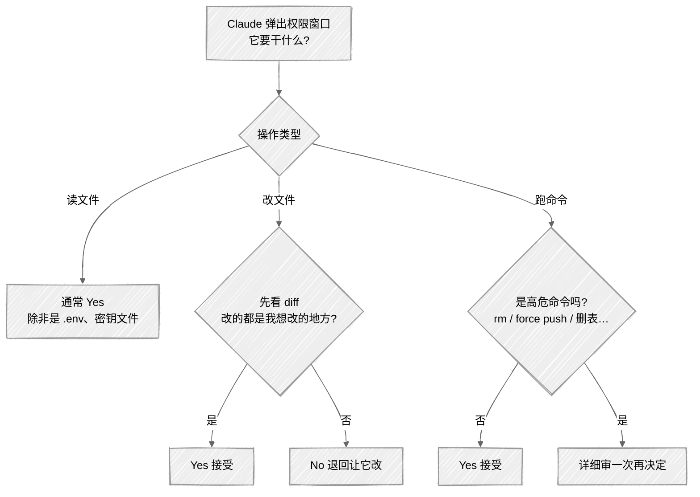
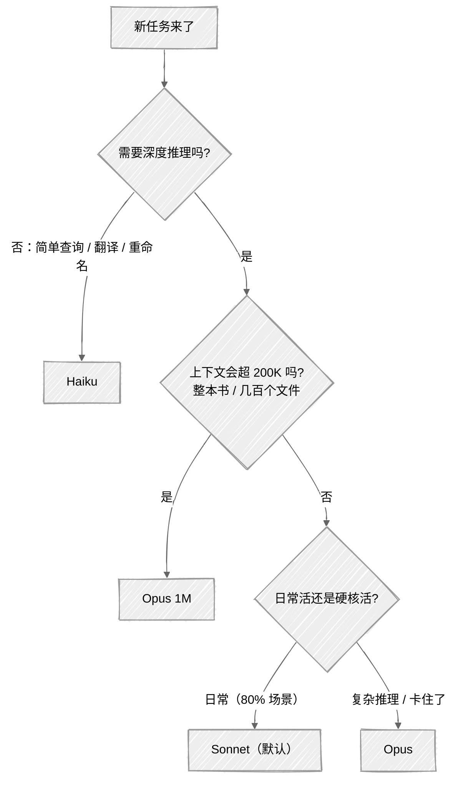
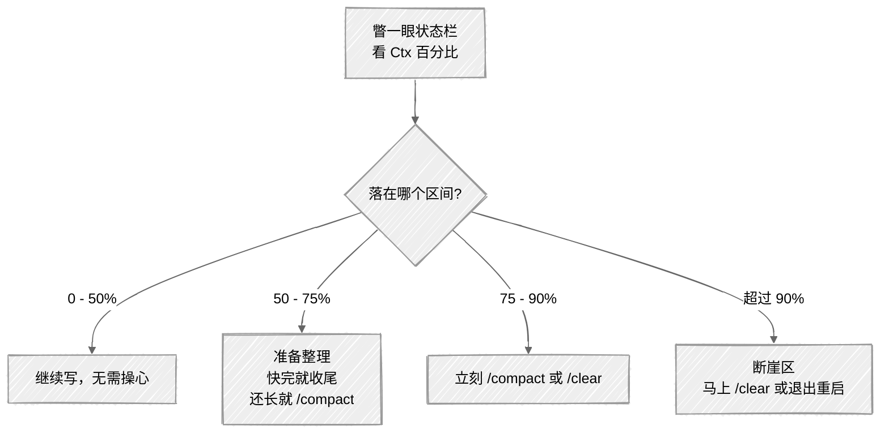
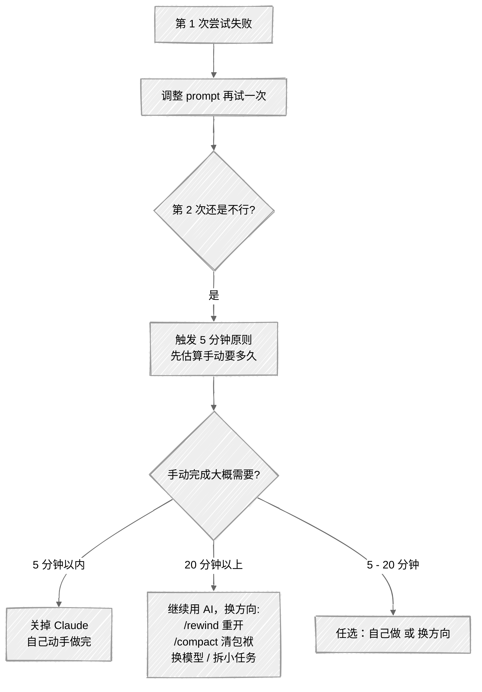
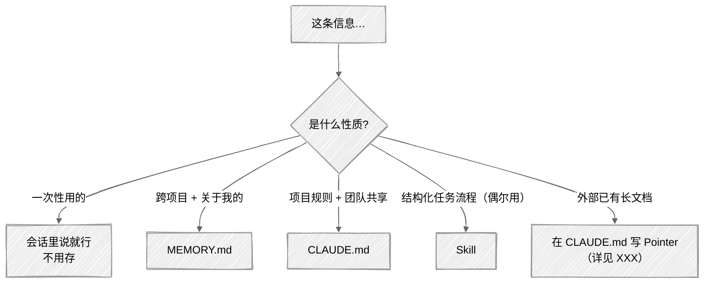
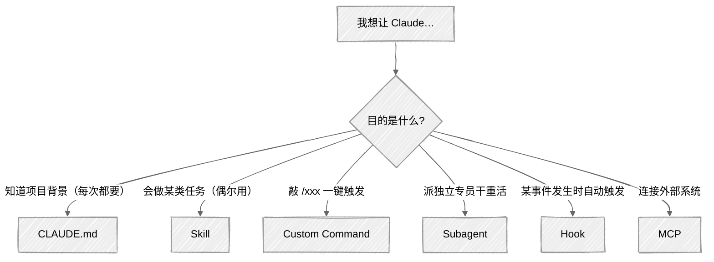

# 附录 D：决策流程图

> 本附录把书里反复出现的几个"该怎么选"汇总成流程图。图全部用 Mermaid 手绘风格绘制，GitHub 上直接渲染，可以直接右键保存图片或截图打印。

## 图 1：权限决策流程（遇到弹窗怎么选）

**口诀**：

- 读文件 → 一般 Yes（除非是 `.env`、密钥文件）
- 改文件 → **永远看 diff**，多改了就 No
- 跑命令 → **高危必退**（详见附录 G）

## 图 2：模型选择流程（任务来了用哪个）

**新手一句话**：**默认 Sonnet，卡住切 Opus，简单事用 Haiku**。

## 图 3：Ctx% 使用率应对流程

**口诀**：**看到 75% 就动手，别等 90%**。

## 图 4：卡住了怎么办（5 分钟原则）

**口诀**：**同一个 prompt 不要试第三次**。

## 图 5：信息分层决策（该放在哪一层）

**口诀**：**越私人越往 MEMORY，越团队越往 CLAUDE，越流程化越往 Skill**。

## 图 6：扩展机制选型

**口诀**：**CLAUDE.md 讲背景，Skill 讲流程，Command 给快捷键，Subagent 派替身，Hook 搞自动，MCP 接外网**。
