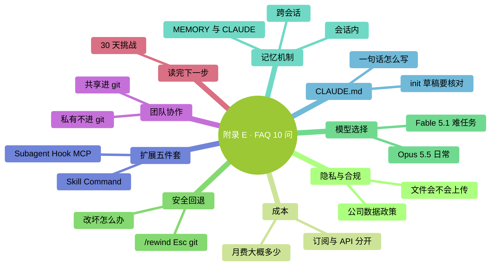

# 附录 E：FAQ（常见问题 10 问）

> **核验日期：2026-09-24。** 快问快答对应本版正文；账号可用性与界面以实际为准。

### 本章地图（一眼看全貌）

<!-- diagram: MM-39 -->

## 1. Claude 会偷看我的文件吗？

它会使用可用工具读取完成任务所需的文件，**不只限于你用 `@` 点名的那一个**。读取范围受工具、设置和权限约束；其中的内容可能进入发给模型服务的请求。

个人订阅是否允许训练，要看隐私开关；商业/API 有不同条款。保留也不是所有路径一律“30 天后必删”。第三方后端按实际服务商核对。不要用 `/clear` 当删除数据或撤回资料的办法。

详见第 11 章及[官方数据说明](https://code.claude.com/docs/en/data-usage)。

## 2. 用 Claude Code 大概多少钱一个月？

先分清**订阅月费**和**API 按量费用**。每天使用多少分钟，无法直接换算成账单：读取资料多少、输出长度、模型和额外服务都会影响消耗。

截至 2026-09-24，官方 API 标准价按每百万 token 计算：Opus 5.5 输入 **$4**、输出 **$20**；Fable 5.1 输入 **$10**、输出 **$50**。这是标准输入输出单价，不是“每月价格”，也没把缓存、加速等项目混在一起。[官方价格](https://platform.claude.com/docs/en/about-claude/pricing)

先用能完成你任务的账号与模型，小范围试做后查实际消耗。订阅用量看 `/usage` 和账号页面，API 看费用统计及账单。详见第 15 章。

## 3. 它改坏我的文件了怎么办？

先停止继续改，检查哪些文件受影响。输入 `/rewind`，或在输入为空时按两次 Esc，**都会打开回退菜单**；选检查点和恢复范围后，才会恢复被跟踪的文件编辑。

shell 命令修改、外部操作和多数子代理改动，不保证在这条恢复路径内。邮件已发、软件已装、云端内容已删，都需要另外处理。

重要任务前，先复制原件或保存一个经过检查的 Git 版本。不要照抄一条会覆盖当前内容的 Git 命令来“试试能不能恢复”。详见第 9 章。

## 4. 我在公司用会不会违反数据政策？

**先查公司 AI 政策**。没有明文政策就发邮件问 IT / 合规。

**永远别发**：
- 密钥、token、密码
- 未脱敏的客户 / 员工信息
- NDA 覆盖的文档

企业账号不自动等于零保留，也不自动等于模型在公司内部运行。确认管理员批准的服务路径和数据范围，再开始处理。详见第 11 章。

## 5. 有哪些模型？怎么选？

本版的起步思路是：

- **Opus 5.5**：先用于日常资料处理、编码和需要连续执行的任务。
- **Fable 5.1**：更难的推理或长任务值得尝试，但先核对可用性与额外额度。
- **Sonnet 5 / Haiku 4.5**：在账号可用且测试结果够好的情况下，用于更看重速度和成本的任务。

在 `/model` 里确认你实际选中的名称。模型、思考投入、快速模式和权限模式是不同的控制项，不要把“选更强模型”理解成“让它随意操作”。具体比较见第 15 章和附录 J。

## 6. Claude 会记住我上次说的话吗？

有三种情况要分清：

- **继续旧会话**：用 `claude --continue`、`claude --resume` 或 `/resume` 找保存过的记录；退出不等于所有对话消失。
- **开新会话**：不会自动带上所有旧对话，但会按配置加载说明和记忆。
- **自动记忆**：默认按项目存放在本机；MEMORY.md 是索引，详细笔记可能另放文件，不自动跨项目或跨电脑共享。

需要团队长期遵守的约定，放项目说明；只想让当前任务知道的细节，先放会话或任务笔记。详见第 13 章。

## 7. 一句话：CLAUDE.md 怎么写？

写清楚四件事：**项目是什么、为什么这样做、合作要求、详细资料在哪**。

可以手写，也可以让 `/init` 起草。关键是核对生成内容、补上无法从文件推断的约定，并持续清理重复与过期规则。几十行通常足够起步，行数不是质量保证。

已有 AGENTS.md 的项目，先检查当前版本与加载设置，避免维护互相冲突的两份规则。用 `/context` 确认实际加载的说明。详见第 14 章。

## 8. Skill / Command / Subagent / Hook / MCP 怎么分？

- **Skill**：Claude 按需加载的任务手册
- **自定义斜杠入口**：你主动敲 `/xxx` 使用技能；旧 `.claude/commands/` 文件仍兼容，不必把它当另一套完全独立的能力
- **Subagent**：派独立小 Claude 干重活
- **Hook**：特定事件发生时执行预设逻辑
- **MCP**：接外部工具（GDrive / Notion / DB）

这些能力可组合使用，先从一个最小例子开始。详见第五部分（第 20–24 章）。

## 9. 我可以和同事一起用吗？

可以。原则：
- **共享**：项目 `CLAUDE.md`、`.claude/commands/`、`.claude/skills/`、`.claude/agents/` → 进 git
- **私有**：个人设置、凭证、含敏感值的配置不要进公开仓库；经检查的项目 MCP 配置可以共享，密钥另行提供
- **走 PR**：CLAUDE.md 改动都走 PR review

详见 Ch 25。

## 10. 读完书了，接下来干嘛？

**30 天挑战清单**：
- 第 1 周：稳固日常用法
- 第 2 周：管理上下文和 CLAUDE.md
- 第 3 周：用上扩展（至少一个 Skill / Command / MCP）
- 第 4 周：融入工作流 + 清理

**核心原则**：**选 1-2 个方向深入，不要追最新 / 囤工具 / 和人比**。详见 Ch 27。

<!-- studio:nav -->
← [附录 D：决策流程图](D-%E5%86%B3%E7%AD%96%E6%B5%81%E7%A8%8B%E5%9B%BE.md) · [目录](../../README.md) · [附录 F：术语表](F-%E6%9C%AF%E8%AF%AD%E8%A1%A8.md) →
<!-- /studio:nav -->
