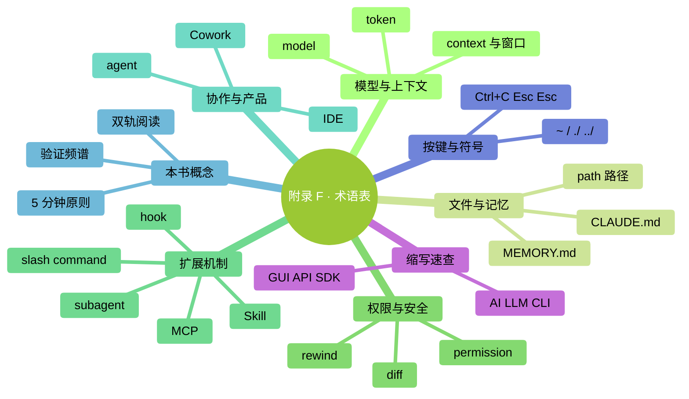

# 附录 F：术语表

> 本书出现的所有 Claude Code / AI / 终端相关术语。跨章节查阅用。

### 本章地图（一眼看全貌）

<!-- diagram: MM-40 -->

## A-Z 英文术语

| 术语 | 生活化翻译 | 本书出处 |
|-----|---------|--------|
| **agent** | 有特定岗位的 Claude 实习生 | Ch 4, 22 |
| **agentic coding** | AI 主动执行任务的编程方式 | Ch 4 支线 |
| **API** | 应用程序接口——程序之间说话的约定 | Ch 24, 26 |
| **CLI** | 命令行工具——只能打字（不能点）的工具 | Ch 1 |
| **CLAUDE.md** | 项目说明书——Claude 每次启动先读 | Ch 13, 14 |
| **command** | 命令——给电脑或 Claude 下的一条指令 | Ch 18, 21 |
| **context** | 短期工作记忆——这次对话能记住的总量 | Ch 12 |
| **context window** | 上下文窗口——context 的容量上限 | Ch 12 |
| **Cowork** | Anthropic 面向非编程用户的 GUI 产品 | Ch 4 |
| **diff** | 修改对比图——文件改前改后两栏 | Ch 6 |
| **directory / folder** | 文件夹（本书统一用"文件夹"） | Ch 1 |
| **hook** | 自动触发规则——事件→动作 | Ch 23 |
| **IDE** | 代码编辑器 | Ch 4 |
| **install** | 安装 | Ch 2 |
| **JSON** | 一种结构化文本格式 | Ch 23, 24 |
| **MCP** | 外接工具插座——连外部系统的协议 | Ch 24 |
| **MEMORY.md** | 自动记忆文件——Claude 自己记的你的偏好 | Ch 13 |
| **model** | 大模型——Claude 背后的大脑 | Ch 15 |
| **OAuth** | 一种第三方登录授权协议 | Ch 24 |
| **pane** | 分屏区域 | Ch 2 |
| **path** | 路径——文件在电脑里的地址 | Ch 1 |
| **permission** | 权限 | Ch 7 |
| **PowerShell** | Windows 自带的命令行 | Ch 1, 附录 B |
| **prompt** | 提示词——你说给 AI 的话 | Ch 5, 19 |
| **prompt engineering** | 提示词工程——怎么写好提示词 | Ch 26 |
| **Pro / Max（Claude）** | 订阅级别 | Ch 15 |
| **rewind** | 回退——回到之前某个状态 | Ch 9 |
| **session** | 会话——一次启动到关闭的完整对话 | Ch 3 |
| **shell** | 命令行——能打命令的窗口 | Ch 1 |
| **Skill** | 技能包——按需加载的任务手册 | Ch 20 |
| **slash command** | 斜杠命令——`/` 开头的快捷指令 | Ch 18, 21, 附录 C |
| **subagent** | 子智能体——派出去的专业实习生 | Ch 22 |
| **terminal** | 终端——Mac/Linux 的命令行窗口 | Ch 1 |
| **token** | 字数计费单位——约 1 个英文单词或 0.7 汉字 | Ch 12, 15 |
| **tool use** | 工具调用——AI 使用外部工具的能力 | Ch 22, 26 |
| **vibe review** | 凭感觉快速审（30-60 秒） | Ch 10 |
| **workspace** | 工作区——一个工作环境 / 项目文件夹 | Ch 3 |
| **worktree** | 并行工作副本——git 的功能 | Ch 26, 附录 H |

## 本书内置概念

| 概念 | 定义 | 本书出处 |
|-----|------|--------|
| **双轨阅读** | 🎯 主线（必读）+ 🌿 支线（选读） | Ch 0 |
| **WHAT-WHERE-HOW-VERIFY** | 提示词结构模板 | Ch 5 |
| **验证频谱 L1-L4** | 按风险分档的审核深度 | Ch 10 |
| **信任档案** | 你个人的"Claude 靠谱度"分级记录 | Ch 10 |
| **止损规则** | 预设的"什么时候该停"判断 | Ch 17 |
| **5 分钟原则** | 手动 < 5 分钟就别磨 AI | Ch 17 |
| **渐进披露** | CLAUDE.md 慢慢加、不一次堆 | Ch 14 |
| **Pointers > Copies** | CLAUDE.md 里指路优于复制内容 | Ch 14 |
| **最小权限原则** | 扩展 / Subagent / MCP 只给够用的权限 | Ch 22, 24 |
| **三件套**（章末） | 小结 / 动手任务 / 卡住了 | Ch 0 |

## 按键与符号

| 符号 | 读法 | 说明 |
|-----|-----|-----|
| `~` | 波浪号 | 用户文件夹 |
| `~/` | 波浪号斜杠 | 从用户文件夹开始的路径 |
| `./` | 点斜杠 | 当前文件夹 |
| `../` | 双点斜杠 | 上层文件夹 |
| `/` | 正斜杠 | Mac/Linux 路径分隔 |
| `\` | 反斜杠 | Windows 路径分隔 |
| `$` `%` | 美元 / 百分号 | Mac 终端提示符 |
| `>` | 大于号 | Windows PowerShell 提示符 |
| `|` | 竖线 / 管道符 | 命令输出接给下一个 |
| `Ctrl+C` | — | 中断运行 |
| `Cmd+C` | — | Mac 复制（= Windows Ctrl+C） |
| `Esc Esc` | — | Claude Code 快速撤销 |

## 缩写速查

| 缩写 | 全称 | 翻译 |
|-----|------|-----|
| **AI** | Artificial Intelligence | 人工智能 |
| **API** | Application Programming Interface | 应用程序接口 |
| **CI/CD** | Continuous Integration / Continuous Deployment | 持续集成 / 持续部署 |
| **CLI** | Command Line Interface | 命令行界面 |
| **Ctx** | Context | 上下文（Claude Code 状态栏缩写） |
| **DAU** | Daily Active Users | 日活用户 |
| **GUI** | Graphical User Interface | 图形界面 |
| **IDE** | Integrated Development Environment | 集成开发环境 |
| **LLM** | Large Language Model | 大语言模型 |
| **MCP** | Model Context Protocol | 模型上下文协议 |
| **NDA** | Non-Disclosure Agreement | 保密协议 |
| **OS** | Operating System | 操作系统 |
| **PR** | Pull Request | 合并请求 |
| **SaaS** | Software as a Service | 软件即服务 |
| **SDK** | Software Development Kit | 软件开发工具包 |
| **SSO** | Single Sign-On | 单点登录 |
| **VPC** | Virtual Private Cloud | 虚拟私有云 |
