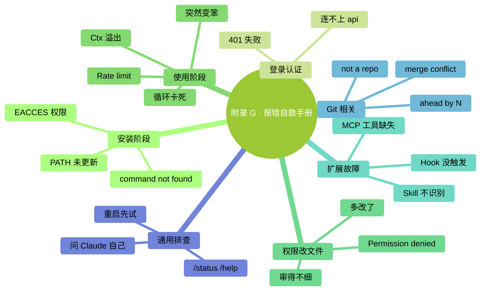

# 附录 G：常见报错与自救手册

> 按关键词搜。每条格式：**看到什么 → 最可能原因 → 怎么办**。

### 本章地图（一眼看全貌）

<!-- diagram: MM-41 -->

## 安装阶段

### `command not found: claude`

**原因**：Claude Code 没装；或装了但 PATH 没更新。
**怎么办**：
- 先回第 2 章确认原来的安装方式，不要混装；原生安装不需要 Node.js
- 关掉终端重开（让 PATH 生效）
- 确认 `which claude`（Mac）/ `Get-Command claude`（Windows PowerShell）能找到

### `EACCES: permission denied`（安装时）

**原因**：npm 全局安装时权限不够。
**怎么办**：
- 不要补 `sudo` 重跑 npm 安装；官方不建议这样做
- 若 `claude` 已能运行，用 `claude doctor` 检查；程序不存在时，先按安装器报错与第 2 章修复

### `node: command not found`

**原因**：你运行的是依赖 Node.js 的额外程序。
**怎么办**：原生 Claude Code 不要求先装 Node.js；若确实采用 npm 安装，当前包要求 Node.js 22 或更高版本。若错误来自 MCP 服务器，则查该服务器的运行要求。

### `npm WARN deprecated`（装的时候一堆警告）

**原因**：依赖库版本提示，通常不影响功能。
**怎么办**：区分 warning（警告）和 error（失败）；记录警告所属包，确认版本与维护状态，不把所有黄色字一概忽略。

---

## 登录 / 认证

### `Authentication failed` / 401

**原因**：token 过期 / 输错 / 没权限。
**怎么办**：
- `/logout` 然后 `/login` 重新登录
- 订阅用户确认计划有效；API 或网关用户核对实际提供方、凭据状态与模型权限，不用购买聊天订阅解决 API 鉴权问题

### `Unable to connect to api.anthropic.com`

**原因**：网络问题（防火墙 / 代理 / 梯子）。
**怎么办**：
- 确认你能在浏览器访问 https://anthropic.com
- 公司网络 → 问 IT 是否需要配代理
- 确认所在地区在服务支持范围；访问介绍网站成功不证明模型请求端点可用

---

## 使用阶段

### `Context window exceeded` / 上下文溢出

**原因**：Ctx 爆了。
**怎么办**：
- 先保留任务目标、进展与待办，再按任务是否连续选择 `/compact` 或 `/clear`；后者不撤销文件
- 下次避免一次 @ 太多文件

### `Rate limit exceeded`

**原因**：短时间请求过多。
**怎么办**：
- 看错误说明和实际重置时间，使用 `/usage` 或服务控制台查额度
- 区分短时间速率限制、订阅使用窗口与 API 余额
- 换模型不保证恢复所有额度，不要连续重试或轮换密钥来碰运气

### Claude 回答突然变笨 / 答非所问

**可能原因 A**：任务材料过多、目标混杂或关键条件未被保留；没有通用的 80% 失效线
**办法**：先保存关键状态，再整理材料；同一任务可 `/compact`，不相关新任务才 `/clear`

**可能原因 B**：模型换错了（你上次切到 Haiku 忘了切回）
**办法**：`/status` 看当前模型，`/model` 切回合适的

**可能原因 C**：prompt 太模糊
**办法**：按 Ch 5 的 WHAT-WHERE-HOW-VERIFY 重构提示

### Claude 一直执行错误命令 / 循环中

**原因**：陷入局部最优。
**怎么办**：
- 先中断，检查是否还有后台任务在运行
- 核对已经执行的命令、文件变化与外部影响
- 受跟踪的编辑可用 `/rewind` 选择恢复文件；命令和外部副作用按实际状态恢复
- 保存状态与待办后，再决定继续或 `/clear` 开新会话

---

## 权限 / 改文件

### `Permission denied`（Claude 想动某文件时）

**原因**：系统级权限不够。
**怎么办**：
- 先核对目标路径与当前用户是否有权处理它；不要直接对整目录执行 `chmod` / `chown`
- 系统保护目录？→ **不要改**

### diff 看着对，但改完发现错了

**原因**：你 vibe review 不够细。
**怎么办**：
- 打开 `/rewind` 并确认该改动可恢复，再选恢复文件
- 重新走，这次**细审**或 `/plan` 先

### 改完文件后发现多改了很多

**原因**：Claude "顺手"多动
**怎么办**：
- 打开 `/rewind` 核对恢复范围；不在跟踪范围内的改动从备份或相应系统恢复
- 重讲："只改 A，不动 B、C"

---

## Hooks / 扩展

### Hook 没触发

**原因 A**：`settings.json` 格式错
**办法**：用本地编辑器或 `claude doctor` 检查格式；含凭据的配置不要粘到在线校验网站

**原因 B**：需要重启
**办法**：完全退出 Claude Code 重开

**原因 C**：matcher 匹配不上
**办法**：核对事件、工具名和匹配规则，先在练习目录测试限定的工具；不要把有副作用的 Hook 扩大到全部事件

### Hook 让 Claude Code 卡住

**原因**：hook 命令慢 / 卡住。
**怎么办**：
- 按官方 Hook 配置设置超时；不要假定 Mac 自带 GNU `timeout` 命令
- 先保存配置副本，再移除相应 Hook 条目排查；JSON 不能随意插入注释

### Skill / Command 没被识别

**原因 A**：文件路径错
**办法**：确认在 `~/.claude/skills/<名>/SKILL.md` 或 `.claude/commands/<名>.md`

**原因 B**：frontmatter 格式错
**办法**：若使用 frontmatter，检查 `---` 开闭和 YAML 格式；旧命令也可以只有 Markdown，路径与发现规则见第 20、21 章

**原因 C**：需要重启
**办法**：退出 Claude Code 重开

### MCP 装了但 Claude 说没有这个工具

**原因 A**：配置作用域、地址或鉴权不对
**办法**：在终端用 `claude mcp list` / `claude mcp get 名称` 核对，会话内用 `/mcp` 看连接与登录。项目共享配置为 `.mcp.json`；不要寻找旧稿写错的 `mcp_servers.json`。

**原因 B**：服务器未启动或缺少依赖
**办法**：按该服务器的官方说明检查启动命令与日志。`server-xxx` 只是占位名，不是该安装的软件包。

---

## Git 相关

### `fatal: not a git repository`

**原因**：当前目录不是 git 项目。
**怎么办**：先确认是否进入了错误目录。只有确实要为新项目启用版本管理时才 `git init`，不要在任意位置初始化。

### `Your branch is ahead of 'origin/main' by N commits`

**原因**：本地比远程新。
**怎么办**：这只是状态提示，可以保持本地；只有确实要发布并核对远端、分支与待发提交时才按项目流程推送。

### `Merge conflict`

**原因**：你和别人改了同文件。
**怎么办**：
- **不要乱删**——打开冲突文件看 `<<<<<<<` `=======` `>>>>>>>` 标记
- 理解双方变更与共同目标，保留需要的内容
- 可让 Claude 提合并方案和理由，审核差异后运行相关检查，不默认丢弃任意一边

---

## 通用排查顺序

遇到任何问题按这个顺序试：

1. **记录错误、版本和触发步骤**，保存未完成工作
2. **`/status` 看配置，`/context` 看上下文，`/usage` 看用量**
3. **`/help` 看命令说明**
4. **看启动时的日志输出**（有错误提示吗？）
5. **搜关键词**（GitHub issues / Reddit）
6. **问 Claude Code 自己**："我遇到 XXX 错误，怎么办？"（把建议当排查线索，执行前仍核对官方说明）

---

## 还是解决不了？

- 官方 GitHub 开 issue 时提供脱敏错误、版本与系统；不公开密钥、完整会话或私人路径
- Reddit r/ClaudeAI 发帖
- 在普通终端用 `claude --version` 查看版本；按原安装方式更新

官方入口：[安装与排错](https://code.claude.com/docs/en/troubleshooting)、[命令表](https://code.claude.com/docs/en/commands)。

撤销提示：本附录提到 `/rewind` 时，都指打开检查点菜单、确认恢复范围；它不会逆转任意命令、数据库改动或外部操作。

<!-- studio:nav -->
← [附录 F：术语表](F-%E6%9C%AF%E8%AF%AD%E8%A1%A8.md) · [目录](../../README.md) · [附录 H：Claude Code 桌面应用简明导览](H-%E6%A1%8C%E9%9D%A2%E5%BA%94%E7%94%A8%E5%AF%BC%E8%A7%88.md) →
<!-- /studio:nav -->
