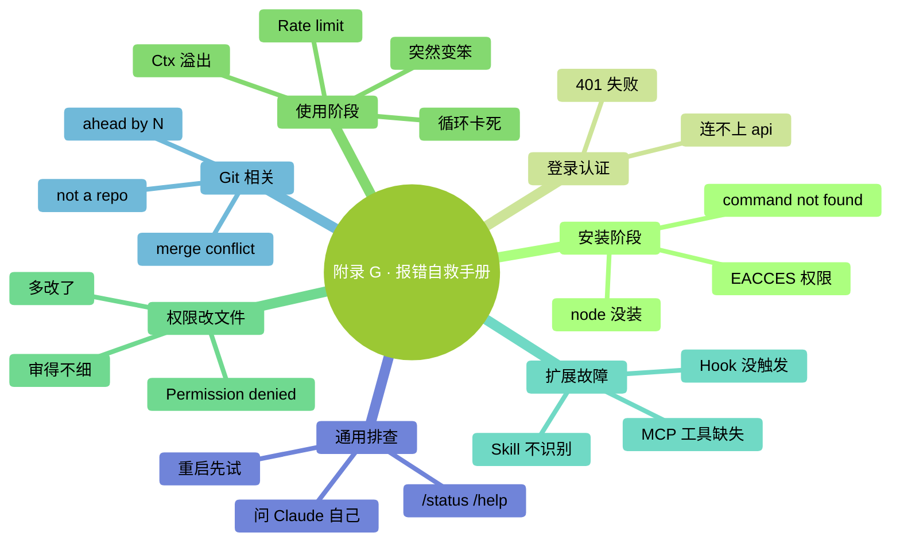

# 附录 G：常见报错与自救手册

> 按关键词搜。每条格式：**看到什么 → 最可能原因 → 怎么办**。

### 本章地图（一眼看全貌）

<!-- diagram: MM-41 -->

## 安装阶段

### `command not found: claude`

**原因**：Claude Code 没装；或装了但 PATH 没更新。
**怎么办**：
- 重装：`npm install -g @anthropic-ai/claude-code`
- 关掉终端重开（让 PATH 生效）
- 确认 `which claude`（Mac）/ `where claude`（Windows）能找到

### `EACCES: permission denied`（安装时）

**原因**：npm 全局安装时权限不够。
**怎么办**：
- Mac：用 `sudo npm install -g ...`（输入 Mac 密码）
- 更好：改 npm 前缀到用户目录（避免 sudo）

### `node: command not found`

**原因**：Node.js 没装。
**怎么办**：去 [nodejs.org](https://nodejs.org) 下载 LTS 版本装。

### `npm WARN deprecated`（装的时候一堆警告）

**原因**：依赖库版本提示，通常不影响功能。
**怎么办**：**忽略**，装完能跑就行。

---

## 登录 / 认证

### `Authentication failed` / 401

**原因**：token 过期 / 输错 / 没权限。
**怎么办**：
- `/logout` 然后 `/login` 重新登录
- 确认订阅仍在有效期

### `Unable to connect to api.anthropic.com`

**原因**：网络问题（防火墙 / 代理 / 梯子）。
**怎么办**：
- 确认你能在浏览器访问 https://anthropic.com
- 公司网络 → 问 IT 是否需要配代理
- 国内用户可能需要特殊网络

---

## 使用阶段

### `Context window exceeded` / 上下文溢出

**原因**：Ctx 爆了。
**怎么办**：
- `/compact` 压缩；或 `/clear` 重启
- 下次避免一次 @ 太多文件

### `Rate limit exceeded`

**原因**：短时间请求过多。
**怎么办**：
- 等 1-5 分钟
- 或切到 Haiku（额度独立）
- 重度用户 → 升 Max / 换 API key

### Claude 回答突然变笨 / 答非所问

**可能原因 A**：Ctx > 80%，模型开始糊涂
**办法**：`/compact` 或 `/clear`

**可能原因 B**：模型换错了（你上次切到 Haiku 忘了切回）
**办法**：`/status` 看当前模型，`/model` 切回合适的

**可能原因 C**：prompt 太模糊
**办法**：按 Ch 5 的 WHAT-WHERE-HOW-VERIFY 重构提示

### Claude 一直执行错误命令 / 循环中

**原因**：陷入局部最优。
**怎么办**：
- **立刻 Ctrl+C 中断**
- `/rewind` 或 `/clear`
- 用更具体的提示重来

---

## 权限 / 改文件

### `Permission denied`（Claude 想动某文件时）

**原因**：系统级权限不够。
**怎么办**：
- 文件 owner 是 root？→ `chmod` / `chown` 改权限（小心）
- 系统保护目录？→ **不要改**

### diff 看着对，但改完发现错了

**原因**：你 vibe review 不够细。
**怎么办**：
- `/rewind` 回到改之前
- 重新走，这次**细审**或 `/plan` 先

### 改完文件后发现多改了很多

**原因**：Claude "顺手"多动
**怎么办**：
- `/rewind` 回到改前
- 重讲："只改 A，不动 B、C"

---

## Hooks / 扩展

### Hook 没触发

**原因 A**：`settings.json` 格式错
**办法**：用 JSONLint 校验

**原因 B**：需要重启
**办法**：完全退出 Claude Code 重开

**原因 C**：matcher 匹配不上
**办法**：先用 `"matcher": "*"` 匹配全部试，再缩小

### Hook 让 Claude Code 卡住

**原因**：hook 命令慢 / 卡住。
**怎么办**：
- hook 里的命令加 `timeout 5` 限时（Mac/Linux）
- 暂时注释掉 hook 看是不是它的问题

### Skill / Command 没被识别

**原因 A**：文件路径错
**办法**：确认在 `~/.claude/skills/<名>/SKILL.md` 或 `.claude/commands/<名>.md`

**原因 B**：frontmatter 格式错
**办法**：确认有三条横线包围的 `---` 块

**原因 C**：需要重启
**办法**：退出 Claude Code 重开

### MCP 装了但 Claude 说没有这个工具

**原因 A**：mcp_servers.json 格式错 / 路径错
**办法**：JSON 校验 + 看启动输出有没有报错

**原因 B**：MCP server 本身没跑起来
**办法**：手动跑一次 `npx -y @modelcontextprotocol/server-xxx`

---

## Git 相关

### `fatal: not a git repository`

**原因**：当前目录不是 git 项目。
**怎么办**：`git init` 初始化；或 `cd` 到正确的项目目录。

### `Your branch is ahead of 'origin/main' by N commits`

**原因**：本地比远程新。
**怎么办**：`git push` 推到远程（注意确认要不要）。

### `Merge conflict`

**原因**：你和别人改了同文件。
**怎么办**：
- **不要乱删**——打开冲突文件看 `<<<<<<<` `=======` `>>>>>>>` 标记
- 手动选择保留哪边
- 或让 Claude 帮你："@<冲突文件> 解决这里的 merge conflict，优先保留我们本地的业务逻辑"

---

## 通用排查顺序

遇到任何问题按这个顺序试：

1. **重启 Claude Code**（解决 50% 的问题）
2. **`/status` 看状态**（模型对吗？Ctx 高吗？）
3. **`/help` 看命令说明**
4. **看启动时的日志输出**（有错误提示吗？）
5. **搜关键词**（GitHub issues / Reddit）
6. **问 Claude Code 自己**："我遇到 XXX 错误，怎么办？"（Claude 知道自己的错误！）

---

## 还是解决不了？

- 官方 GitHub 开 issue（附**完整错误信息** + **你的版本 + OS**）
- Reddit r/ClaudeAI 发帖
- 发 `/version` 看你的版本——升级到最新版可能就好了

---

<!-- chapter-nav -->

📖  [← 附录 F · 术语表](F-术语表.md)  ·  [📑 返回目录](../../README.md)  ·  [附录 H · 桌面应用导览 →](H-桌面应用导览.md)
