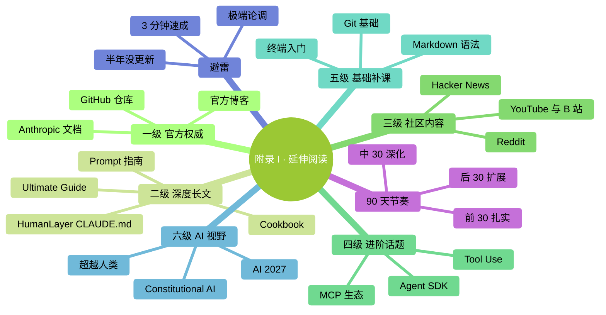

# 附录 I：延伸阅读

> 读完本书后，值得进一步看的资料。**按优先级排列**——先看前面的。

### 本章地图（一眼看全貌）

<!-- diagram: MM-43 -->

## 一级：官方权威（最该看）

### 1. Anthropic 官方文档

- 地址：[docs.anthropic.com](https://docs.anthropic.com)
- 内容：Claude Code、API、prompt engineering 全套
- **最权威 + 更新最及时**
- 英文为主，浏览器翻译能看懂

### 2. Claude Code GitHub 官方仓库

- 搜 GitHub "claude-code" 找 Anthropic 官方
- **Issues / Discussions** 区有大量真实问题
- Changelog 跟踪最新特性
- **装完就加收藏**

### 3. Anthropic Blog

- 地址：[anthropic.com/news](https://www.anthropic.com/news)
- 产品大更新、研究进展、最佳实践
- 每月 1 次浏览就好

---

## 二级：高质量长文（核心思想）

### 4. HumanLayer 的 CLAUDE.md 文章

- 搜 "HumanLayer CLAUDE.md"
- 本书 Ch 14（CLAUDE.md 最佳实践）很多原则来自这里
- 深度讨论为什么 CLAUDE.md 应该短、为什么不用 `/init`

### 5. FlorianBruniaux 的 Claude Code Ultimate Guide

- GitHub 上的 `claude-code-ultimate-guide`（本书的灵感来源之一）
- 英文、面向有经验的开发者
- 信息密度极高，不适合零基础，但**深度超过本书**

### 6. Anthropic Prompt Engineering Guide

- docs.anthropic.com 的 "Prompt engineering" 章节
- 官方最全的 prompt 技巧合集
- 学完本书后精进 prompt 必读

### 7. Anthropic Cookbook

- GitHub `anthropics/anthropic-cookbook`
- 真实代码示例合集
- 覆盖 API 调用、tool use、agent 等

---

## 三级：社区内容（获取手感）

### 8. Reddit r/ClaudeAI

- 用户社区
- 真实使用心得 / 技巧 / 踩坑
- **不要照单全收**——有时 karma 最高的不一定对

### 9. Hacker News

- 搜 "Claude" 关键词
- 资深用户讨论
- 观点独到、也最冷峻

### 10. YouTube / B 站

- 关键词："Claude Code"
- 视频教程**时效性强**——注意发布时间（Claude Code 迭代快，半年前的视频可能过时）
- 中英文都有

---

## 四级：进阶话题（有需求再看）

### 11. Agent SDK / Multi-Agent

- Anthropic Agent SDK 文档
- LangChain / LangGraph
- CrewAI、AutoGen、MetaGPT

**先问自己**：我真的需要多 agent 吗？大多数场景 subagent 够用。

### 12. MCP 生态

- MCP 官网：[modelcontextprotocol.io](https://modelcontextprotocol.io)
- GitHub `modelcontextprotocol/servers`（官方 MCP 集合）
- `awesome-mcp-servers`（社区集合）

### 13. Tool Use / Function Calling

- Anthropic 文档的 "Tool use" 章节
- 如何让 AI 调用外部工具
- 想自己写 Agent 必读

---

## 五级：基础知识补课（零基础补充）

### 14. 终端 / 命令行入门

- Mac：Apple 官方 "Terminal User Guide"
- Windows：Microsoft Learn "PowerShell 快速入门"
- 本书附录 A、B 也有速查

### 15. Git 基础（如果你想更深入用 Claude Code 处理代码）

- [pro git](https://git-scm.com/book/zh/v2) 中文版在线免费
- 只需前 3 章（安装、基础、分支）

### 16. Markdown 语法

- CLAUDE.md / Skill / Command 都用 markdown
- [Markdown 语法速查](https://www.markdownguide.org/cheat-sheet/)（15 分钟学完）

---

## 六级：AI 全景视野（大方向思考）

### 17. 《AI 2027》（非虚构报告）

- 关于 AI 未来 1-2 年的详细推演
- 帮你理解"为什么 Claude Code 这种工具会出现"

### 18. 《超越人类：AI 浪潮下我们如何生存》

- 非技术视角讨论 AI 对工作 / 生活的影响
- 适合读完本书觉得"我好像需要更大视野"时读

### 19. Anthropic 的 Constitutional AI 论文

- 关于 Claude 为什么比较"守规矩"的技术原理
- 学术向，但理解 AI 背后设计哲学有帮助

---

## 不推荐（避雷）

- **所有标题"Claude Code 终极速成"的 3 分钟视频** —— 太浅
- **超过 6 个月没更新的 GitHub 仓库 / 教程** —— Claude Code 变化快
- **和你工作无关的炫技项目** —— 学了没用
- **鼓吹"Claude 能代替程序员"** 或 **"AI 只是玩具"** 的极端内容 —— 都不对

---

## 一份推荐的 90 天学习节奏

### Day 1-30：基础扎实

- 本书（优先） + 官方文档关键章节
- 30 天挑战清单（Ch 27）
- 每天真实场景用

### Day 31-60：深化一个方向

- 选你最关心的一个（CLAUDE.md / Skills / MCP / prompt engineering / ...）
- 读对应的深度资源（见上面二级、三级）
- 动手做 3-5 个实际项目

### Day 61-90：横向扩展 + 分享

- 了解其他 AI 工具（Cursor、Windsurf、GPT、Gemini 等）
- 在团队 / 社区分享你的经验
- 开始尝试更复杂场景（多 agent、MCP 定制、CI 集成等）

**90 天后**：你会是**身边人里最懂 Claude Code 的**。

---

**祝阅读愉快，用得顺手**。
