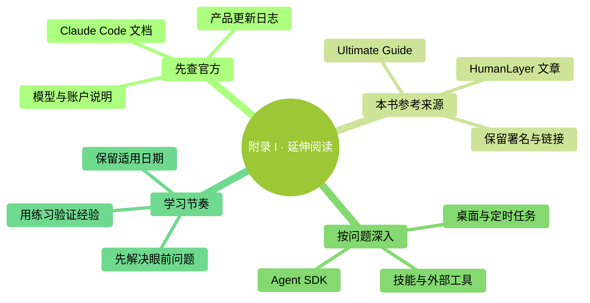

# 附录 I：延伸阅读与来源致谢

> **核验日期：2026-09-24。**遇到版本、命令、模型或费用差异，先看官方当期说明，再结合自己账户与安装版本验证。社区教程用于学习和查漏。

### 本章地图（一眼看全貌）

<!-- diagram: MM-43 -->

## 一、最先收藏的官方入口

| 你现在要查什么 | 从这里进入 | 怎样使用 |
|---|---|---|
| 安装、日常命令和各功能的现行规则 | [Claude Code 官方文档](https://code.claude.com/docs/en/overview) | 搜具体功能名；注意适用版本和环境 |
| 某个版本改了什么 | [官方 CHANGELOG](https://github.com/anthropics/claude-code/blob/main/CHANGELOG.md) | 对照本机版本，区分已发布变化和自己的账户是否开放 |
| 产品问题与已知故障 | [anthropics/claude-code](https://github.com/anthropics/claude-code) | 查看相关问题；不要把单条 Issue 当成所有用户都必现 |
| 新模型正式发布及能力说明 | [Anthropic 产品消息](https://www.anthropic.com/news) | 模型名称、发布日期与接入资格分别核对 |
| Skills 怎样写与怎样加载 | [技能文档](https://code.claude.com/docs/en/skills)、[官方示例仓库](https://github.com/anthropics/skills) | 看当前格式，先在练习项目试一个 |
| 桌面、远程、定时任务 | [Desktop](https://code.claude.com/docs/en/desktop)、[Remote Control](https://code.claude.com/docs/en/remote-control)、[云端 Routines](https://code.claude.com/docs/en/routines) | 先确认任务在哪里运行，再看条件与权限 |

本书仍以零基础操作和理解为主，官方文档是按功能查询的资料库。你不用从头把它读完：遇到“界面里为什么没有这个选项”，先看相关页面的适用条件，往往比重复安装更有用。

## 二、找回本书早期参考的那份 GitHub 教程

作者是 **Florian Bruniaux**，仓库是 [FlorianBruniaux/claude-code-ultimate-guide](https://github.com/FlorianBruniaux/claude-code-ultimate-guide)。它仍可公开访问，是本书早期组织学习主题与延伸阅读的参考之一。

本项目早期需求记录提到了源指南 **v3.39.1**，也曾将“信任校准”“新手错误”等主题与其相关章节对应。本次检查可见的[命令速查页](https://github.com/FlorianBruniaux/claude-code-ultimate-guide/blob/main/guide/cheatsheet.md)标注 **3.43.0 / 2026-08-30**。这是该页面的标注，**不等于我们已经确认整个仓库截至今天的最新版本**；网页缓存与不同文件的更新时间可能不同。

这份教程面向较有经验的使用者，适合用来发现还有哪些专题值得研究。建议先在其目录、[变更记录](https://github.com/FlorianBruniaux/claude-code-ultimate-guide/blob/main/CHANGELOG.md)里找到问题，再回到对应官方文档核实。长教程也会有局部滞后，尤其是模型、价格、权限、命令名称，不能因为仓库最近提交过，就默认每一张表都已经同步。

本轮修订保留本书面向普通人的解释、操作练习和判断方式；以参考教程查漏，以官方来源核对事实，重新编写中文说明与案例，并不逐章翻译上游正文。感谢 Florian Bruniaux 持续整理相关资料。上游采用 [CC BY-SA 4.0](https://github.com/FlorianBruniaux/claude-code-ultimate-guide/blob/main/LICENSE)；本书自己的许可见 [LICENSE](../../LICENSE)。引用和来源致谢不改变各作品的许可，不能把上游材料直接套用成本书的许可。

## 三、另一份明确影响过本书的文章

HumanLayer 的 [Writing a good CLAUDE.md](https://www.humanlayer.dev/blog/writing-a-good-claude-md)，作者署名 Kyle，发表于 2025-11-25，是第 14 章早期讨论简短规则、项目说明与按需提供材料的参考来源。

它属于作者实践文章，读它时要区分“有价值的经验”和“产品硬性规定”。例如有关文件长度、自动生成规则的建议，需要结合你的项目验证，不能直接写成 Claude Code 永久不变的限制。使用 `/init` 得到初稿之后认真删改，与不经检查就长期保留生成内容，是两种不同做法。

你可以拿自己的项目做一次比较：保留真正通用的要求，把仅对特定任务有用的材料移到单独文件或技能，再用同一项真实任务观察差异。这样读完文章得到的是经过检验的工作习惯，而不是又多了几句必须死记的口号。

## 四、按实际需要继续深入

| 当前目标 | 资料 | 不必急着做的事 |
|---|---|---|
| 让一类输出更稳定 | [Claude 平台文档](https://platform.claude.com/docs/en/home)中的提示与评估资料 | 不必为了使用新名词重写整套流程 |
| 把 Claude 集成进自己的程序 | [Claude Agent SDK](https://platform.claude.com/docs/en/agent-sdk/overview) | 先区分它与普通交互式 Claude Code 的运行和计费方式 |
| 接入一个外部服务 | [MCP 官方入门](https://modelcontextprotocol.io/docs/getting-started/intro)和该服务商文档 | 不必一次安装许多不使用的连接 |
| 看可运行的程序示例 | [Anthropic Cookbook](https://github.com/anthropics/anthropic-cookbook) | 先读依赖和说明，再在自己的练习环境运行 |
| 补 Git 基础 | [Pro Git 中文版](https://git-scm.com/book/zh/v2) | 先理解保存、差异、分支，再学复杂协作 |
| 补 Markdown | [Markdown 语法速查](https://www.markdownguide.org/cheat-sheet/) | 先用标题、列表和链接表达清楚 |

社区讨论、视频和个人文章适合发现使用场景。引用其中的建议前，问三个问题：它针对哪个版本与环境，作者是否展示了可检查的结果，换成我的材料是否仍成立。资料旧不代表思想全错，资料新也不代表每条事实都可靠。

## 五、一个可持续的学习节奏

先连续做几次你真实需要的任务：整理笔记、修改文档、检查小项目。记下反复出现的困难，再选一章或一个官方页面深入。完成一个练习之后，留下输入材料、成功标准和你确实观察到的结果；下一次版本更新，拿同一个小例子复验。

每隔一段时间检查当前用到的功能就够了。发现新模型时，先看账户能否使用，再拿熟悉的任务比较；发现新的自动化入口时，先确认运行地点、停止方式和费用。不要把追完所有更新当作学习完成的标准。

> 本书作者：**马力** · [@mali9527](https://github.com/mali9527)
> 本书原创内容的使用条件见 [LICENSE](../../LICENSE)；所链接的外部资料保留各自作者与许可。

<!-- studio:nav -->
← [附录 H：Claude Code 桌面应用简明导览](H-%E6%A1%8C%E9%9D%A2%E5%BA%94%E7%94%A8%E5%AF%BC%E8%A7%88.md) · [目录](../../README.md) · [附录 J：Fable 5.1 与 Opus 5.5 新手指南](J-Opus-4.7%E6%96%B0%E6%89%8B%E6%8C%87%E5%8D%97.md) →
<!-- /studio:nav -->
