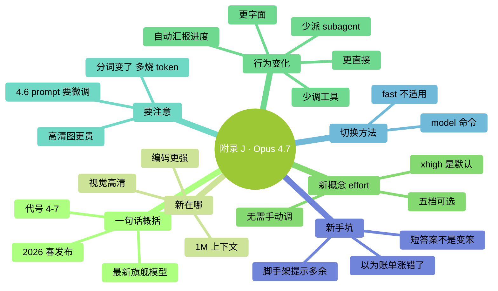

# 附录 J：Claude Opus 4.7 新手指南

> **2026-04-16** Anthropic 发布 **Claude Opus 4.7**，是当前 Claude Code 默认推荐使用的模型。本书默认以 Opus 4.7 为基线写作。这一篇把 4.7 相对 Opus 4.6 的变化、行为差异、新概念、新手坑集中讲一遍——**你只需要读这一附录，就能知道"Opus 4.7 到底带来了什么"**。

### 本章地图（一眼看全貌）

<!-- diagram: MM-44 -->


---

## J.1 一句话概括 Opus 4.7

Anthropic 于 **2026 年 4 月 16 日** 发布的旗舰模型，API 代号 `claude-opus-4-7`——**当前 Claude Code 在付费用户那里使用的默认 Opus 版本**。

它的定位：

- **当下最强的通用可用模型**（官方原话："our most capable generally available model"）
- 专门为**复杂编码 + 长期自主工作 + 视觉理解** 场景优化
- 价格和 Opus 4.6 **相同**——升级不加价
- 原生支持 **100 万 token 上下文**（1M），且**无长上下文溢价**

相比 Opus 4.6，它的核心变化可以归成三句话：

1. **更聪明**——尤其是编程、视觉、长任务自主执行
2. **更直接**——回复更短、更像工程师少客套、emoji 少
3. **更字面**——你说一，它就做一，不自作主张推广到二

---

## J.2 你会直接感受到的差异

这一节给**从 Opus 4.6 切过来的人**。如果你是第一次用 Claude Code，可以跳到 J.3。

### 差异 1：回答变短了

4.7 **根据任务复杂度动态调整回复长度**——简单问题给简短答案，不再"I'd be happy to help you..."开场。

❌ 别误以为：AI 是不是变笨了 / 是不是罢工了
✅ 正确理解：这就是新版本的默认风格

### 差异 2：更"照字面办事"

例子：你说"把 `user.email` 字段改成 `user.contact_email`"。

- **4.6 行为**：可能顺手把邻近的 `user.phone` 也重命名成 `user.contact_phone`（它觉得"你大概想统一"）
- **4.7 行为**：只改你说的那一个字段。如果要连带别的，**你得明说**

### 差异 3：默认调更少工具、派更少 subagent

4.7 会**更多用推理，更少用工具调用**。如果你之前习惯让它"读 10 个文件再判断"，现在可能只读 3 个它就开始下结论。

**应对**：需要它一次并行读多文件时明确说——
> "请同时读取 `src/auth/*.py` 里所有文件后再判断"

### 差异 4：长任务中会主动汇报进度

以前（4.6）你得问"现在到哪一步了"，4.7 会**自己在合适的节点告诉你**。如果你之前在 CLAUDE.md / prompt 里加过"每完成一步告诉我"，可以试着**拿掉**看看还需不需要。

### 差异 5：同样一段话，可能多烧 35% token

**4.7 用了新分词器**——同样的中文或代码内容，可能用 **1.0~1.35 倍** 的 token（最多多 35%）。

这不是 bug，是设计上的权衡（新分词器对模型能力有帮助）。但**月账单可能因此上涨**——见 J.6 坑 3。

---

## J.3 新概念：effort 档位

Opus 4.7 引入了 **5 档 effort**（思考投入档位），在"聪明 vs 成本/速度"之间切换：

| 档位 | 速度 | 智力 | 适合 |
|------|-----|-----|------|
| `low` | 最快 | 一般 | 成本敏感、简单批量 |
| `medium` | 快 | 中等 | 日常轻量问题 |
| `high` | 中 | 强 | 并发多会话、想省一点 |
| **`xhigh`** | 中慢 | **很强** | **Claude Code 官方默认** |
| `max` | 慢 | 最强 | 极难问题（可能过度思考，建议克制使用） |

### 对零基础最重要的一句话

**你不用手动调。** Claude Code 已经把 Opus 4.7 的默认档位设成 `xhigh`——这是官方推荐的最佳值。

> 💡 只有在你用 Anthropic API 直接写代码（见 Ch 26）时，effort 才是你要关心的 API 参数。Claude Code 用户保持默认即可。

---

## J.4 在 Claude Code 里用 Opus 4.7

### 切到 Opus 4.7

和 Ch 15 讲的 `/model` 命令完全一致：

```
/model
```

在弹出的菜单里选 **Claude Opus 4.7**（或者你看到的版本号可能显示成 "Opus" 简写）。

### 现在默认就是 4.7 了吗？

- **2026-04-23 起**，Enterprise 和 API 用户的默认 Claude Code 模型切到 Opus 4.7
- Pro / Max 订阅用户在 `/model` 菜单里点 "Opus" 时，指向的就是 4.7

你可以随时 `/model` 看当前是哪个版本——**如果显示 Opus 4.7，就是它**。

### `/fast` 在 4.7 下失效了

Claude Code 的 `/fast`（快速模式）**是 Opus 4.6 专用的加速通路**——Anthropic 通过更快的服务器路径响应请求。

切到 Opus 4.7 后：

- `/fast` 不起作用或不显示（取决于具体 Claude Code 版本）
- 这不是 bug，是正常行为
- **如果你非常在意响应速度**，可以回切 Opus 4.6 + `/fast`

### 1M 上下文——该用吗？

Opus 4.7 原生支持 100 万 token 上下文（5 倍于传统 200K）。好消息：**按标准 API 价格，没有长上下文溢价**。

但——上下文越长，**每轮输入越烧 token**。除非你真的需要（比如让它读整个大型代码库），**日常用默认上下文就够**（见 Ch 12 讲上下文原理）。

---

## J.5 prompt 写法的几个微调

如果你之前用过 4.6（或抄过 4.6 的教程），4.7 下可以试试这几个调整：

### 调整 1：第一轮就说清楚

官方推荐"把 Claude 当作受委托的工程师"——意图、约束、验收标准、文件路径一次性给全。这和 Ch 19（输入技巧）讲的 **WHAT / WHERE / HOW / VERIFY** 模板完全一致。

### 调整 2：要更深思熟虑时显式要求

```
Think carefully and step-by-step before responding; this problem is harder than it looks.
```

（中文等效："**请仔细、一步一步地思考再回答；这个问题比看起来更难**"）

### 调整 3：要快速响应时也显式要求

```
Prioritize responding quickly rather than thinking deeply.
```

（中文等效："**优先快速回复，不必深度思考**"）

### 调整 4：需要并行子任务时明确说

4.7 默认会派更少 subagent。如果你明确需要并行——

> "请在同一轮内启动多个 subagent 分别处理这些文件"

### 调整 5：把 4.6 的"脚手架提醒"拿掉

- "记得检查一下幻灯片布局"
- "记得复审一下代码"
- "输出前请确认格式正确"

这类加在 prompt 末尾的提醒，给 4.7 可能**多余**——它默认就会做这些。**试着去掉**，看质量是否还稳。如果没降，以后就不用写了。

---

## J.6 新手最容易踩的 5 个坑

### 坑 1：以为回答短就是 AI 变笨

**事实**：4.7 的简短回答是**主动设计**——任务简单就不写长文。

**别做**：反复"你能详细说说吗 / 多举几个例子吗"——除非你真的需要。

### 坑 2：沿用 4.6 的 prompt 感觉"变味了"

你熟悉的某个 4.6 prompt 在 4.7 下结果不对劲？可能是因为：

- 4.7 更字面，不会自作主张泛化
- 4.7 默认少调工具/少派 subagent
- 以前"隐含"的指令，现在要显式写

**解法**：把指令拆得更明确 + 把验收标准写出来。

### 坑 3：账单突然涨了——两个原因叠加

- **分词器换了**：同文本可能多 1.0~1.35 倍 token
- **默认档位 `xhigh`**：比 4.6 的默认更高档

**如果成本敏感**，两种办法：

1. 切回 Sonnet 4.6 做日常任务（见 Ch 15 的选型建议）
2. API 模式下可手动把 effort 调成 `high`（Claude Code 用户一般不需要）

### 坑 4：粘高清截图一次烧几千 token

Opus 4.7 最大支持 **2576px（≈3.75MP）** 的图像（旧版只到 1568px）。清晰度大升级，但**单张高清图消耗成倍增长**。

**建议**：

- 截图先压缩到 1000~1500px（一般够用）
- 只有在需要 OCR、看清设计稿细节、验证像素级内容时用高清原图

### 坑 5：`/fast` 找不到了，以为功能被删了

如前所述，`/fast` 是 **Opus 4.6 的快速通路**。切到 4.7 后它不起作用是正常的。

**如果你特别想要 `/fast`**：回切 Opus 4.6（`/model` → Opus 4.6）。

---

## J.7 什么时候该用 Opus 4.7？

这一节是 Ch 15（模型与成本）"选型原则"的 4.7 补丁版：

| 场景 | 推荐 |
|------|------|
| 复杂重构、架构设计、长任务（30 min+）自主执行 | **Opus 4.7（默认 xhigh）** |
| 看截图 / 分析设计稿 / 看清图表细节 / OCR | **Opus 4.7**（视觉升级最大） |
| 需要跨很多文件的代码审查 | **Opus 4.7** |
| 日常文件读写、写文档草稿、普通修改 | **Sonnet 4.6 够用**（便宜 + 快） |
| 简单批量任务（改格式、翻译、速查） | **Haiku 4.5**（最便宜） |

**90% 用户的经验法则**：

- **默认 Sonnet 4.6**——成本和速度的甜区
- **复杂任务切 Opus 4.7**——深度推理一次值回票价
- **超简单的切 Haiku**——不要浪费

---

## J.8 官方权威资源

以下是学完本附录后可以深入读的官方原文（优先级从高到低）：

1. **发布公告**（浏览 5 分钟）：[anthropic.com/news/claude-opus-4-7](https://www.anthropic.com/news/claude-opus-4-7)
2. **Opus 4.7 Claude Code 最佳实践**（核心 + 实用，浏览 15 分钟）：[claude.com/blog/best-practices-for-using-claude-opus-4-7-with-claude-code](https://claude.com/blog/best-practices-for-using-claude-opus-4-7-with-claude-code)
3. **新特性完整清单**：[platform.claude.com/docs/en/about-claude/models/whats-new-claude-4-7](https://platform.claude.com/docs/en/about-claude/models/whats-new-claude-4-7)
4. **4.6 → 4.7 迁移指南**：[platform.claude.com/docs/en/about-claude/models/migration-guide](https://platform.claude.com/docs/en/about-claude/models/migration-guide)
5. **effort 档位官方建议**：[platform.claude.com/docs/en/build-with-claude/effort](https://platform.claude.com/docs/en/build-with-claude/effort)

---

## 本节小结

- Opus 4.7 是 **2026-04-16 发布的旗舰模型**，Claude Code 默认推荐
- 相比 4.6：**更聪明、更直接、更字面**，但**分词器换了，会多烧 10~35% token**
- 新增 5 档 **effort**（low / medium / high / **xhigh（默认）** / max），Claude Code 用户**不用手动调**
- `/model` 切换、`/fast` 只对 4.6 有效
- 4.6 的 prompt 在 4.7 下可能需要**写更明确 + 去掉脚手架提醒**
- 视觉升级最大（支持 2576px），适合看截图 / 设计稿——但烧 token
- 成本敏感**回切 Sonnet 4.6** 或 **Haiku 4.5** 没有任何问题

---

> 本附录随 Anthropic 新版本发布持续更新。
> **任何时候想知道当前用的哪个版本**：在 Claude Code 里敲 `/model`。
>
> 如果未来出现 Opus 4.8 / 5.x，本附录会第一时间补写差异。


---

<!-- chapter-nav -->

📖  [← 附录 I · 延伸阅读](I-延伸阅读.md)  ·  [📑 返回目录](../../README.md)  ·  （全书完）
