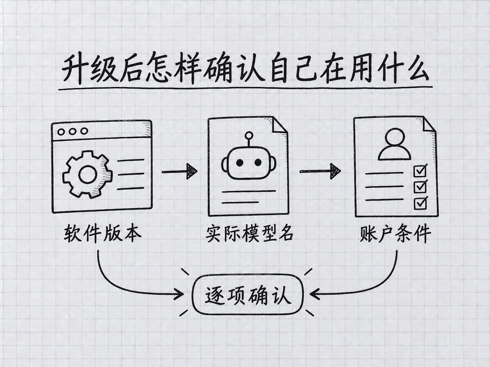

# 附录 J：Fable 5.1 与 Opus 5.5 新手指南

> **适合谁读**：几个月前用过 Claude Code，现在回来升级的人；已经会基本操作，想知道新模型怎么选的人。
>
> **预估时长**：主线阅读与动手 25 分钟，支线 10 分钟。
>
> **学完能做什么**：确认自己实际使用的新模型，调整思考投入，理解付费加速与自动回退，把一个长任务交代清楚。
>
> **核对日期：2026-09-24。** 本附录按 Claude Code 命令行版本 **2.1.280 或更新版本**说明。文件路径保留旧名称，方便已有链接继续访问；正文已更新。

---

## 开场三问

- **你会遇到什么问题**：旧教程还在介绍 Opus 4.7，新菜单却出现 Fable 5.1、Opus 5.5、不同的 effort 档位；照旧经验操作，效果和费用都变了。
- **不读这篇会踩什么坑**：升级了软件，却继续用保存的旧模型；把最高档位一直开着；把 Fable 的可选状态误认成套餐免费包含。
- **读完你会多会什么事**：确定当前模型和付款方式，再用一个小任务检验新版本是否适合自己的工作。

### 本章地图（一眼看全貌）

本章图解：[升级后怎样确认自己在用什么](#j2-升级软件以后再确认完整模型名)。

---

> 🎯 **【主线】—— 本篇必读核心**
> 第一次使用新模型，读到“如果你卡住了”即可。无需先理解全部模型参数。

## J.1 两个新名字，怎样放进你的工作里

**Claude Fable 5.1** 于 **2026 年 9 月 1 日**发布；**Claude Opus 5.5** 于 **9 月 22 日**发布。两者都能用于 Claude Code。Fable 面向更难的推理和长时间任务，Opus 5.5 则是现在值得先尝试的常用模型。这里没有“买了更新的就可以不检查结果”的含义。[Fable 发布说明](https://www.anthropic.com/claude-fable-and-mythos-5-1)、[Opus 发布说明](https://www.anthropic.com/claude-opus-5-5)

先想一个与你有关的例子：你有三份活动方案，需要找出预算和日期上的冲突，整理出一份可以执行的安排。可以先用 Opus 5.5，把材料和完成标准给全。如果它遗漏了关键约束，先指出遗漏，确认是不是文件没读到、要求没说清。只有当问题确实在复杂判断上，才值得试更高投入或 Fable。

Fable 并不意味着“小任务也必须交给它”。它的标准 API 输入/输出单价是每百万 token **10/50 美元**；Opus 5.5 是 **4/20 美元**。token 是模型处理内容的单位，不是固定字数。两者模型窗口都是 **1M token**，最大输出 **128K token**；窗口是可处理空间，不是免费赠送额度。[Fable 规格](https://platform.claude.com/docs/en/models/fable-5-1/overview)、[Opus 规格](https://platform.claude.com/docs/en/models/opus-5-5/overview)

对用订阅的人，最先核对的仍是“这个模型消耗哪份额度”，而不是拿 API 单价计算月费。相关套餐差别和查账方法已放在[第 15 章](../part3-深度概念/15-模型与成本.md)。

## J.2 升级软件以后，再确认完整模型名

先退出正在输入的 Claude Code 对话，回到普通终端。Mac 的终端和 Windows 的 PowerShell 都可以输入：

<!-- diagram: FIG-040 -->


*图：先核对当前版本、可用模型与账户资格，再决定使用方式。*
<!-- /diagram: FIG-040 -->

```sh
claude --version
```

`--version` 表示显示版本号。如果低于 **2.1.280**，先按[第 2 章的安装与更新方法](../part1-从零起步/02-安装-Claude-Code.md)升级。原生安装通常用 `claude update`；通过软件包管理器安装的，按原来的安装方式更新。本篇统一用 2.1.280 作为最低操作基线，是为了同时覆盖两款新模型。

回到工作文件夹后，可以在普通终端启动一场明确指定模型的会话：

```sh
claude --model claude-opus-5-5
```

这条命令中的 `--model` 表示“本次启动使用后面的模型”。如果已进入会话，就用 `/model` 打开选择器；希望长期改用这个版本，可以输入 `/model claude-opus-5-5`。不要把普通终端命令与会话里的斜杠命令输反。[命令行参数参考](https://code.claude.com/docs/en/cli-reference)

下面是**用于读懂选项的文字示意，不是实测截图，实际排序和可选项以你的界面为准**：

```text
当前模型：看完整名称和版本
需要试用：在 /model 中选中模型，按 s，仅用于本次会话
准备长期使用：按 Enter 保存，或输入 /model 完整模型名
出现 Requires usage credits：先确认额外用量，再决定是否继续
```

在当前官方直连环境中，`opus` 通常指 Opus 5.5，`fable` 指 Fable 5.1；公司的网关——统一转发模型请求的服务——可能另有映射。已保存的模型、恢复的旧会话及组织设置，也可能影响启动结果。**升级程序后看一眼实际模型名**，比只凭一个“Opus”简写放心。确切选择、会话与默认设置的关系见[模型配置说明](https://code.claude.com/docs/en/model-config)。

## J.3 effort 是投入档位，不是回答长短开关

旧版教程曾建议 Opus 4.7 保留 `xhigh`。现在换到 Opus 5.5，不能把这一条机械照搬。**Opus 5.5 默认 `medium`；Fable 5.1 默认 `high`。** 模型之间的同名档位并不是统一刻度，`medium` 也不等于“只能做中等难度的事情”。

可以在 Claude Code 会话里输入 `/effort` 打开选择，或者输入 `/effort medium` 明确选择 medium。常见五档为 `low`、`medium`、`high`、`xhigh`、`max`，表示逐步提高思考投入。档位会影响时间和消耗，但不是每升一档都稳定提升结果。新手先用模型默认值，拿真正会遇到的任务比较，再决定是否调整。[effort 官方说明](https://platform.claude.com/docs/en/build-with-claude/effort)

举个练习场景：整理一页记录时，medium 已经把负责人和日期列对了。把档位调高后，仍是同样三项结果，只是等得更久，就没有必要为这件事长期使用高档。处理几份相互冲突的方案时，若提高投入后多找出了一个关键矛盾，这个调整才有具体价值。

Opus 5.5 和 Fable 的思考机制始终开启，旧教程中的“关闭思考让它马上回答”不能照搬；相关开关键对它们不起关闭作用。想要简短答案，应直接要求“用三句话解释”，而不是把降低 effort 当成字数限制。[当前交互快捷键说明](https://code.claude.com/docs/en/interactive-mode)

也不必为了升级，把所有旧提示词重写一遍。先保持任务不变，比较模型默认表现；如果慢得不合适，再调整投入。如果答案不对，回到依据和检查标准，而不是一口气拉到 `max`。

## J.4 新模型更能持续工作，你要把“做到哪里算完”说清楚

长任务的关键，是让 Claude 知道最终交付什么、允许碰哪些材料、怎样判断完成。你不必把每一个中间步骤都替它安排好，也不要只给一句“帮我把这些都搞定”，让它猜你真正需要什么。

下面是**本书设计的练习输入，不是已完成任务的实测记录**：

> **你**：请比较工作文件夹里的三份活动方案，产出一份“待决定事项.md”。先找日期、人数、预算口径不一致的地方，再给出可供我选择的修改建议。每个问题标明来自哪份材料；没有依据的数字不要补。保留三份原稿，不联系任何人，也不代我预订。完成后检查：三份材料是否都覆盖、金额是否沿用原单位、每个建议是否有依据。过程中发现影响结论的新情况，请简短告诉我；完成时列出仍需我决定的事项。

这里的文件名只是示例，你应换成自己的实际材料。这个任务已经允许读取、比较和生成结果，但没有授权对外发消息或预订。**换用更强模型，不等于把任务边界扩大。** Claude Code 的权限规则也独立于模型选择；提示词说明意图，权限设置决定哪些操作能执行。[权限说明](https://code.claude.com/docs/en/permissions)

新模型的长任务表现值得尝试，但你仍要看“完成了什么”。如果它说“下一步我将核对金额”，随后结束了回答，而文件里还留着未经核对的数字，那就是任务未完成。可以指出具体剩余项，让它继续完成；连续尝试没有进展时，先查缺少什么信息。

官方也提醒，长任务可能出现中途结束、进度不足或未经要求的扩展。对入门使用，实用做法是把范围和完成条件写明，并在拿到结果后抽查来源，而不是把“模型会自检”当作人的检查已经多余。[Opus 5.5 用法建议](https://platform.claude.com/docs/en/build-with-claude/prompt-engineering/prompting-claude-opus-5-5)、[Fable 5.1 用法建议](https://platform.claude.com/docs/en/build-with-claude/prompt-engineering/prompting-claude-fable-5-1)

## J.5 看懂“加速”和“换模型”，别凭感觉判断故障

旧版书曾把 `/fast` 写成某个旧模型专属的入口。现在 **Opus 5.5 支持快速模式**，订阅用户使用它会走额外付费用量。它仍是 Opus 5.5，并没有因为响应更快而变成另一款“简化模型”。要不要用，应看你是否需要缩短等待，以及是否接受相应费用；第一次学会读文件、改文档时，不需要为练习打开加速。[快速模式说明](https://code.claude.com/docs/en/fast-mode)

另一类变化是**回退**：原本选择的模型在某个请求上没有继续处理，系统把请求交给另一个模型。回退与 fast 是两回事。Fable 5.1 和 Opus 5.5 在部分安全检查触发时会出现这种情况，界面会说明切换。Opus 5.5 的某些网络安全请求可能转给 Opus 4.8，某些生物领域请求可能转给 Opus 5。[模型切换说明](https://support.claude.com/en/articles/16049681-why-claude-switched-models-in-your-conversation-with-opus-5-or-opus-5-5)

因此，发现版本变了，先看消息记录和当前选择，不必马上断定订阅失效。你最初选中了 Fable，也不能据此保证这次对话的所有回答都出自 Fable。若模型在正常工作中错误拒绝，可以记录提示并通过官方反馈入口报告；不要把不断改写请求去“躲过检查”当成教程技巧。

反过来，模型显示正确也不保证任务已经完成。新模型的回答更短、措辞更顺，或者汇报得更有条理，都只是交流表现。你的判断仍落在文件是否正确、依据是否可靠、修改是否符合要求上。把这一条留住，后续模型再更新，你也有稳定的检查方法。

---

## 本章小结

- Fable 5.1 与 Opus 5.5 都已发布，本篇基线是 Claude Code 2.1.280 或更新版本。
- 升级后确认完整模型名；旧会话和保存的设置可能仍使用旧选择。
- Opus 5.5 默认 medium，Fable 5.1 默认 high，不用一律开最高档。
- Fable 是否包含在套餐里，要按账户和席位核对。
- fast 是付费加速，回退是模型变化，1M 则是空间上限。
- 把长任务的目标、边界和完成条件讲清楚，再检查实际结果。

## 动手任务

### 任务 1：确认一次升级结果（约 5 分钟）

1. 在普通终端输入 `claude --version`，记录版本；低于 2.1.280 时按第 2 章更新。
2. 启动 Claude Code，打开 `/model`，记录完整模型名及是否显示额外收费提示。
3. 打开 `/effort`，记录当前档位；再用 `/usage` 查看账户用量。无需更换模型或购买额度。

**成功标志**：你能清楚写下“软件版本、模型版本、思考档位、付款方式”四项，且不把它们混为一谈。

### 任务 2：让它完成一个可核验的小任务（约 10 分钟）

1. 准备两段自己写的活动安排，故意放入一个日期冲突。不要用真实客户资料。
2. 参考 J.4，要求它找冲突、标来源并生成一份建议，明确保留原文。
3. 手动核对它是否找出冲突，有没有擅自补数字。如果没有完成，把漏掉的项明确指出。

**成功标志**：你拿到一份能对照原文检查的结果。完成这项任务不要求 Fable，也不要求 fast；使用当前可用的模型即可。

## 如果你卡住了

**问题 A：已经更新，还是没有 Fable 5.1 或 Opus 5.5。** 看清软件版本、账户可用范围和组织限制。公司网关也可能没有接入完整模型名；保留错误提示，问管理员确认映射，不要反复改成猜测的名字。

**问题 B：选 Fable 后提示额外用量。** 这可能符合套餐规则。Pro 的 Fable 从开始使用就另行付费；不想增加支出，可以取消并继续使用已包含的模型。详见[第 15 章](../part3-深度概念/15-模型与成本.md)。

**问题 C：模型变慢，或任务结束得太早。** 先查看 effort 和是否真的完成；高档位可能增加等待。任务未完成时指出剩余交付物；如果缺材料，补材料。不要把反复发“继续”当成唯一排查办法。

---

> 🌿 **【支线】—— 可选深入**
> 以下内容适合从旧版本迁移、或通过第三方服务使用 Claude Code 的人。

## 🌿 支线 J.A：保留有用的提示词，把旧版本口诀放下

**这段讲什么、什么时候读**：你存了一套几个月前的提示词，升级后想判断哪些该改时，回来读。

“说明目标、提供依据、写出验收条件”仍然有效，因为它们表达的是你的任务。容易过时的是依赖某一代模型特点的口诀：永远默认 Sonnet、Opus 一定最贵、必须设 xhigh、任务一结束就清空、思考过程越长越可信。不要把这些句子原封不动留在每次都会读到的项目规则里。

可以做一个小整理：先挑你最常用的三条提示词，保留任务与限制，去掉没有明确用途的重复要求。用同一份材料试一下，检查质量有没有下降。只要结果确实变差，就把需要的约束补回来；不必为了追求“新模型不需要提醒”，删除仍然帮助你的说明。

Fable 5.1 的官方指南专门提到，低投入时可能减少检索，长任务可能少报进度，也可能做出超出原请求的扩展。你可以针对观察到的问题补一句具体要求，例如“涉及最新价格请查官方来源”，或“只修改指定文件”。这比把整篇提示词模板复制进项目更容易维护。[Fable 5.1 提示指南](https://platform.claude.com/docs/en/build-with-claude/prompt-engineering/prompting-claude-fable-5-1)

对 Opus 5.5，同样先评估默认档位，不必继承以前的最大投入；需要可见进度时说清什么时候希望听到汇报。提示词的作用是帮助它完成你的任务，不是保证一个固定咒语能长期适用于所有模型。

## 🌿 支线 J.B：同一个别名，为什么同事打开的是另一个版本

**这段讲什么、什么时候读**：你和同事都输入 `/model opus`，显示却不同，或者在第三方云上无法选中新模型时，再看这一节。

模型**别名**是便于输入的短名字。服务把短名字对应到哪个完整版本，会受到 Claude Code 版本、服务提供方和组织配置影响。例如，本篇核对时官方直连的 `opus` 已指向 Opus 5.5，而一些第三方环境仍可能指向旧版。`fable` 在 Claude apps gateway 会话中也可能仍指向 Fable 5。完整名称能减少歧义，但不能让供应商突然获得一个没有部署的模型。

因此，排查时最好一次给管理员四项信息：Claude Code 版本、连接的服务、你输入的名称、界面返回的错误。不要把真实密钥贴进截图。管理员确认支持的新版本和名称后，你再按他提供的配置操作。[不同提供方的模型配置](https://code.claude.com/docs/en/model-config)

如果你是在自己写程序，通过 API 连接模型，那又是另一层迁移。Fable 5.1 和 Opus 5.5 有涉及思考内容、工具选择与响应格式的兼容性变化，不能只把程序里的模型名称替换掉就认定完成。本篇面向使用 Claude Code 的人，不要求你改这些参数；程序开发者应另读[Fable 规格与迁移入口](https://platform.claude.com/docs/en/models/fable-5-1/overview)和[Opus 规格与迁移入口](https://platform.claude.com/docs/en/models/opus-5-5/overview)。

<!-- studio:nav -->
← [附录 I：延伸阅读与来源致谢](I-%E5%BB%B6%E4%BC%B8%E9%98%85%E8%AF%BB.md) · [目录](../../README.md) · [附录 K：第三方接入，先确认支持范围](K-%E7%AC%AC%E4%B8%89%E6%96%B9%E6%A8%A1%E5%9E%8B%E6%8E%A5%E5%85%A5.md) →
<!-- /studio:nav -->
