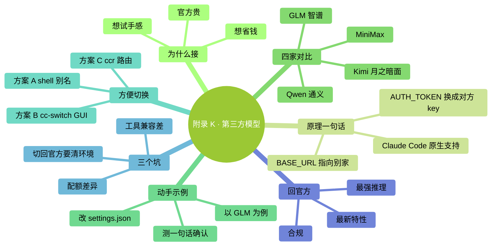

# 附录 K：接入第三方模型（GLM / 通义 / Kimi / MiniMax）

> Claude Code 是 Anthropic 的官方客户端，但它**不是只能连 Claude 模型**。因为它接入方式是标准的 Anthropic Messages API，任何提供这个协议的服务商都能当后端——国内主流的 **GLM / 通义千问 / Kimi / MiniMax** 都已经官方兼容。这意味着：你可以把 Claude Code 的顺手体验，配上国产模型的价格。这一篇讲**怎么接入、怎么切换**——实用为主，不挖太深。

### 本章地图（一眼看全貌）

<!-- diagram: MM-45 -->


---

## K.1 为什么你可能会想接

**一句话**：Claude 贵，国产便宜一大截，体验几乎一样。

具体对比（2026 年 4 月的公开报价，仅供参考）：

| 模型 | 输入 ¥/M token | 输出 ¥/M token | 备注 |
|---|---|---|---|
| Claude Sonnet 4.6 | ≈ $3 | ≈ $15 | 官方基准 |
| GLM-4.7 | 包月套餐 ≈ $3 起 | 同 | "GLM Coding Plan"订阅制 |
| Qwen3-Coder | 按量，远低于 Claude | 同 | 阿里云百炼平台 |
| Kimi K2.6 | $0.60 | $2.50 | 月之暗面，比 Sonnet 便宜 5-6× |
| MiniMax M2.7 | $0.30 | $1.20 | 比 Sonnet 便宜 ~90% |

常见三种触发场景：
- 官方配额用完了，月底前想接着干活
- 日常任务（改个注释、生成测试、翻译）其实用国产就够了，想省着点
- 想亲自感受一下"国产模型在 coding 场景上到底怎么样"

---

## K.2 原理：一行 URL 的事

Claude Code 原生就认两个环境变量：

- `ANTHROPIC_BASE_URL`——把"默认指向 Anthropic"换成"指向别家"
- `ANTHROPIC_AUTH_TOKEN`——把 Anthropic API Key 换成对方的

**就这两行**。Claude Code 不会问你"到底连的是谁"，它只管按 Anthropic Messages API 发请求，对方按协议回就行。

> 为什么国产能接？因为 GLM / 通义 / Kimi / MiniMax 四家**都官方提供了 Anthropic 兼容端点**。这不是社区 hack，是厂商主动做的——他们知道 Claude Code 的入口价值。

---

## K.3 四家主力一张表

| 服务商 | `ANTHROPIC_BASE_URL` | 推荐模型（2026-04） | 拿 API Key |
|---|---|---|---|
| **智谱 GLM** | `https://api.z.ai/api/anthropic` | `glm-4.7` | [z.ai/model-api](https://z.ai/model-api) |
| **通义千问** | `https://dashscope-intl.aliyuncs.com/api/v2/apps/claude-code-proxy` | `qwen3-coder-plus` | [阿里云百炼](https://bailian.console.aliyun.com) |
| **Kimi（月之暗面）** | `https://api.moonshot.ai/anthropic` | `kimi-k2-turbo-preview` | [platform.moonshot.ai](https://platform.moonshot.ai) |
| **MiniMax（国际）** | `https://api.minimax.io/anthropic` | `MiniMax-M2` | [platform.minimax.io](https://platform.minimax.io) |
| **MiniMax（国内）** | `https://api.minimaxi.com/anthropic` | `MiniMax-M2` | [platform.minimaxi.com](https://platform.minimaxi.com) |

> "推荐模型"是各家当下 coding 场景的主力。各家都在快速迭代，具体以官方文档为准。

---

## K.4 动手接一下（以 GLM 为例）

以 **GLM** 为例走一遍，其他三家是同样流程、只换 URL + Key。

**第 1 步**：去 [z.ai/model-api](https://z.ai/model-api) 注册账号，进"API Keys"页，创建一个 Key，复制下来（形如 `<YOUR_ZAI_KEY>`）。

**第 2 步**：打开你的 Claude Code 全局配置 `~/.claude/settings.json`（没有就新建），加一段 `env`：

```json
{
  "env": {
    "ANTHROPIC_BASE_URL": "https://api.z.ai/api/anthropic",
    "ANTHROPIC_AUTH_TOKEN": "<粘贴你的 GLM Key>",
    "ANTHROPIC_DEFAULT_SONNET_MODEL": "glm-4.7",
    "ANTHROPIC_DEFAULT_OPUS_MODEL": "glm-4.7",
    "ANTHROPIC_DEFAULT_HAIKU_MODEL": "glm-4.5-air"
  }
}
```

> 最后三行是把 Claude 内部的 Haiku/Sonnet/Opus 三个 tier，分别映射到 GLM 的哪个模型。**不改也行**——厂商都有默认映射——但显式写出来更放心。

**第 3 步**：重启 Claude Code（退出再进）。随便问一句：

```
你现在连的是哪个后端？回我一句就行。
```

**预期**：回复会显示"我是 GLM-4.7"或类似提示——说明接上了。

**第 4 步**（可选）：验证能正常读文件、跑命令。让它读 README 前 10 行并总结，测一下工具调用是否正常。

---

## K.5 其他三家的配置

通义、Kimi、MiniMax 三家，配法和上面完全一样——**只换 `ANTHROPIC_BASE_URL`、`ANTHROPIC_AUTH_TOKEN`、三个模型名**（参考 K.3 的表）。

---

## K.6 怎么"方便地切换"

一个 `settings.json` 只能配一家。但你大概率要在"Claude 官方 / 国产便宜档"之间来回切。三种方案，按懒的程度排：

### 方案 A：shell 别名 + 多份配置（最朴素）

把 settings.json 复制三份：`settings.claude.json`、`settings.glm.json`、`settings.kimi.json`，放在 `~/.claude/` 下。

在 `~/.zshrc` 或 `~/.bashrc` 里加：

```bash
alias cc-claude='cp ~/.claude/settings.claude.json ~/.claude/settings.json'
alias cc-glm='cp ~/.claude/settings.glm.json ~/.claude/settings.json'
alias cc-kimi='cp ~/.claude/settings.kimi.json ~/.claude/settings.json'
```

用之前敲一下对应别名，再启动 `claude`。**零依赖、永远不会坏**。

### 方案 B：cc-switch（图形界面）

[cc-switch](https://github.com/farion1231/cc-switch)——开源桌面工具，菜单栏里挂着，点一下换配置。适合不喜欢命令行配来配去的人。

装好后添加每家的配置（BASE_URL + Key + 默认模型），下次要换后端直接在菜单栏点一下。

### 方案 C：claude-code-router（按场景自动路由）

[claude-code-router](https://github.com/musistudio/claude-code-router)（简称 `ccr`）——一个本地代理。用它你可以定规则：**默认 Claude Sonnet；代码生成用 GLM；长对话用 Kimi**——按 prompt 特征自动挑模型。

适合：**一天内密集用几家、想省事也想省钱**的进阶用户。新手建议先用方案 A 熟悉原理。

---

## K.7 三个真·新手坑

**坑 1：请求配额（RPM / TPM）差异大**

Claude 官方的 rate limit 对日常用是松的。国产有些平台免费 tier 限制比较严——比如每分钟 2 次请求、每分钟 20k token。遇到 429 报错去服务商控制台看当前档。

**坑 2：工具调用 / 提示缓存兼容度参差**

所有四家都"兼容 Anthropic 协议"，但协议里的**细枝末节**（比如 `anthropic-beta` header、prompt caching、并发 tool_use、超长 thinking）——兼容程度不一样。

你在 Claude 上跑得很顺的复杂任务，切到国产有时会报 tool_use 异常 / 上下文截断。**碰到就切回官方看是不是后端问题**，别怪自己 prompt 写错了。

**坑 3：切回 Claude 官方，记得清环境**

设过 `ANTHROPIC_BASE_URL` 后，如果你只是**删掉 settings.json 的 env 段**，有些情况下还有残留（shell 环境变量优先级更高）。如果回官方还连不上：

```bash
unset ANTHROPIC_BASE_URL
unset ANTHROPIC_AUTH_TOKEN
echo $ANTHROPIC_BASE_URL  # 确认是空的
claude  # 再启动
```

---

## K.8 什么时候该回 Claude 官方

国产便宜，但**不是所有场景都适合**。下面三种情况建议回官方：

- **需要最新能力**——比如本书附录 J 讲的 Opus 4.7、effort 档位、1M 上下文、adaptive thinking。国产目前还没有等价产品。
- **极长 / 极复杂任务链**——几十次连续工具调用、跨文件深度重构、多 subagent 协作。Claude 在长工具链稳定性上依然领先。
- **企业合规 / 数据策略有要求**——有些公司只允许走 Anthropic / Bedrock / Vertex 合规通道。这种场景别自作主张切后端。

---

## 小结：三条最实用的结论

1. **Claude Code 连什么模型**只是一个 `ANTHROPIC_BASE_URL` 的事，不是魔法
2. **日常任务先用国产**能省 80%+ 成本，复杂任务再回 Claude——一台机器跑两档，最划算
3. **切换方案按你懒的程度挑**：方案 A shell 别名够 90% 的人用；图形党用 cc-switch；想搞"一天多家自动路由"再折腾 ccr


---

<!-- chapter-nav -->

📖  [← 附录 J · Claude Opus 4.7 新手指南](J-Opus-4.7新手指南.md)  ·  [📑 返回目录](../../README.md)  ·  （全书完）
