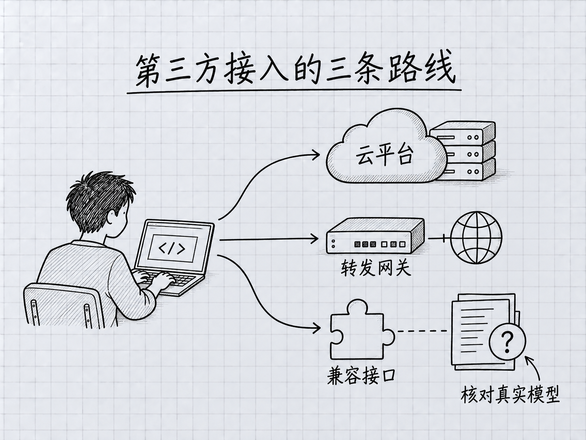

# 附录 K：第三方接入，先确认支持范围

> 本附录供已经用过 Claude Code、需要判断其他接入方案的人阅读。初次学习先走第 0、2 章。旧版的免费额度、价格排行与“一换地址就全兼容”的说法已撤下。

### 本章地图

本章图解：[第三方接入的三条路线](#k1-第三方至少有三种意思)。

## K.1 “第三方”至少有三种意思

**第一种是云平台提供 Claude。** Amazon Bedrock、Google Cloud 的 Agent Platform、Microsoft Foundry 等有各自的接入与模型开放条件。模型仍可能是 Claude，但账户、结算、地区和功能支持要按对应部署说明核对，不能直接照搬个人 Pro 订阅的待遇。

<!-- diagram: FIG-041 -->


*图：第三方接入先分清直连、网关和本地服务，再核对各自条件。*
<!-- /diagram: FIG-041 -->

**第二种是网关转发 Claude 请求。** 网关是夹在客户端与模型服务之间的一层服务，组织可能用它管理认证、用量和预算。地址虽然换了，实际提供的也可能仍是 Claude。你需要知道凭据属于谁、账单记到哪里，以及网关是否转发所需功能。

**第三种是其他模型供应商提供兼容接口。** 有些供应商发布了在 Claude Code 中使用其模型的文档。但“供应商给出兼容方案”不等于“Anthropic 官方支持所有非 Claude 模型”。Anthropic 当前[网关文档](https://code.claude.com/docs/en/llm-gateway)明确区分了这件事，并说明不支持通过网关把 Claude Code 路由到非 Claude 模型。

所以，如果你采用第三种路线，应把它视为供应商维护的兼容方案，检查其当前支持范围。遇到新版本不兼容，不能保证按照本书主线排错就能解决。没有确定需求时，不必为了便宜的宣传数字先改掉已经正常工作的环境。

## K.2 一次接入前，需要确认五项

| 要确认的内容 | 为什么要看 |
|---|---|
| 官方接入文档和适用客户端版本 | 第三方安装说明也可能落后；Claude Code 自身安装以第 2 章和 Anthropic 文档为准 |
| 服务端点与密钥类型 | 国内、国际、按量 API、Coding Plan 可能不是同一地址或同一种密钥 |
| 实际模型与别名映射 | 菜单里的 `opus` 可能被映射到另一款模型，不代表 Opus 5.5 |
| 计费与额度 | 赠送是否到期、可用模型范围、请求速率和付费设置都可能不同 |
| 数据与工具兼容 | 请求会送到哪里，是否支持图片、工具调用、缓存和长任务 |

截至本版核对时，[Z.AI 的 Claude Code 接入文档](https://docs.z.ai/devpack/tool/claude)与 [MiniMax 的接入文档](https://platform.minimax.io/docs/token-plan/claude-code)仍可访问。旧的 Kimi 链接已跳转至[新平台文档入口](https://platform.kimi.ai/docs/overview)。这些是查阅入口，不是价格或稳定性的排名。本次没有替任何一家执行注册、付费或真实模型测试。

尤其要区分供应商文档里的两个部分：如何安装 Claude Code，以及如何接它自己的服务。前者可能仍写着过时的 Node.js 前提；后者才是该供应商的配置依据。遇到冲突时，按各自负责的产品核对，不把一篇兼容教程当成全套最新说明。

## K.3 看懂一份配置，不要直接覆盖整份设置

下面用 Z.AI 文档中仍列出的接口地址说明配置含义。它是**结构示例**，不是包含可用密钥的文件，也没有替你验证套餐是否开放对应模型。执行前先重新查看该供应商的当前说明。

```json
{
  "env": {
    "ANTHROPIC_BASE_URL": "https://api.z.ai/api/anthropic",
    "ANTHROPIC_AUTH_TOKEN": "<YOUR_PROVIDER_TOKEN>",
    "ANTHROPIC_DEFAULT_OPUS_MODEL": "<MODEL_FROM_PROVIDER_DOCS>",
    "ANTHROPIC_DEFAULT_SONNET_MODEL": "<MODEL_FROM_PROVIDER_DOCS>",
    "ANTHROPIC_DEFAULT_HAIKU_MODEL": "<MODEL_FROM_PROVIDER_DOCS>"
  }
}
```

`ANTHROPIC_BASE_URL` 是服务地址；`ANTHROPIC_AUTH_TOKEN` 是服务要求的凭据；三个模型变量是别名映射。尖括号里的内容是占位符，不能原样运行。不要仅因为书里介绍了 Fable，就自行推断第三方也存在同样的 Fable 映射或调用资格。

Mac 的用户级设置通常在 `~/.claude/settings.json`；Windows PowerShell 对应 `$env:USERPROFILE\.claude\settings.json`。先用编辑器打开并留一份私有备份，确认是否已有 `env`、权限或其他设置；把所需字段合并进去，**不要用上面的整段覆盖原文件**。含密钥的文件不进入公开 Git 仓库。企业统一管理的环境先遵照管理员方案，不自行切换服务。

环境变量还可能来自终端或系统设置，编辑这一份文件不一定能改变最终生效值。切换时先保存工作并退出原会话，再按供应商的官方步骤启动一个新会话。不要用复制整份配置的别名在多个并行任务间来回覆盖公共设置，这可能让不同任务使用了你没预期的账户。

## K.4 怎样判断真的接对了，怎样退回原来的路线

验证分三层。第一，查看客户端当前配置和提供方控制台的请求记录，确认端点、实际模型与计费账户。**不要把模型自称“我是某某”当成证据**，那只是它生成的一句话。

第二，在不含私人资料的练习目录里测试：读一个短文本、提出一次小修改、检查真实文件结果。如果你的任务需要图片或特定外部工具，再分别验证。普通聊天成功，不代表所有工具都兼容。

第三，回控制台查看这次请求是否产生用量，以及用量落在哪个套餐或余额下。只有这三层对得上，才适合逐步用于实际工作；费用比较也应以完成同类任务的真实记录来做，不能由每百万 token 的单价直接推断能省多少。

要恢复原路线，先保存现有工作与设置，再撤回这次新增的端点、凭据和模型映射，检查终端、系统与用户设置是否还有残留。打开新终端并重新启动 `claude` 会话后，核对 `/status`、`/model` 和账户用量。不要为了“清干净”删除整个 `.claude` 目录，那里面还可能有会话、规则和其他有用配置。

## 本章小结

云平台、网关与非 Claude 兼容方案不是同一回事。先查提供方支持范围，再查实际模型和账单；保留原设置，逐步测试小任务。若你的目的只是使用官方 Opus 5.5 或 Fable 5.1，先按第 15 章确认正式访问路径，不必先增加一层兼容配置。

<!-- studio:nav -->
← [附录 J：Fable 5.1 与 Opus 5.5 新手指南](J-Opus-4.7%E6%96%B0%E6%89%8B%E6%8C%87%E5%8D%97.md) · [目录](../../README.md)
<!-- /studio:nav -->
