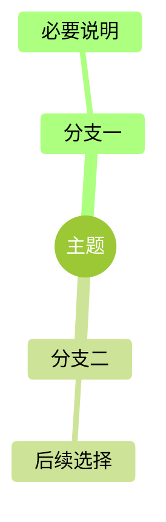

# 插图规范 · forest-v1

新增图只启用 Mermaid mindmap；旧 ASCII 与 flowchart 保留，不强制重画。按作品隔离图号与输出；同书重复 ID 阻断。

总控中可从 templates/mindmap.md 复制；独立书仓可按本页示例起步。分配单书 MM-XX，在该书图示索引登记，并在 book.yaml diagrams 关联单元。定位注释为 `<!-- diagram: MM-XX -->`。

共同样式：forest；字体栈 `-apple-system, 'SF Pro Text', 'PingFang SC', 'Helvetica Neue', sans-serif`；17px；线色 #D9D9D9。本规范的 forest-v1 是新作品样式依据，不在单张图自造参数。导入已有作品时沿用其已采用风格文件与版本，不强行改写旧图。

图应帮助理解，术语与正文一致。生成失败不给旧图充数；PDF检查中文、溢出、留白与图号对应。

## 独立书仓可用的最小模板

<!-- diagram: MM-XX -->

