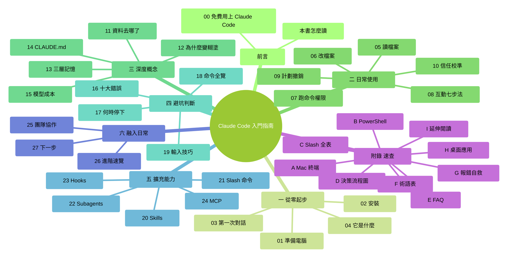

# 前言：本書怎麼讀

我是**馬力**，這本書的作者。歡迎。正式開始前，先花 10 分鐘搞清楚——這本書是給誰寫的、怎麼讀最省力、讀完你能得到什麼。

### 全書地圖（一張圖看清整本書脈絡）

下圖是整本書的結構。先用 30 秒掃一眼，你會對"我要讀的是什麼"有個**整體感**——後面每章開頭也會有一張更細的"章首導覽"，但**這張圖只畫一次**，它是整本書的座標系。

<!-- diagram: MM-08 -->

> 圖較寬——**移動端可左右滑動**檢視完整結構。

---

> 🎯 **【主線】—— 本章必讀核心**
>
> 下面 6 節是全書導讀的骨架。讀完即可進入第 1 章。預估 10 分鐘。

---

## 0.1 這本書適合誰

你同時滿足下面**幾乎全部**條件時，這本書最適合你：

- **不會程式設計**——從沒寫過一行程式碼，也不想專門去學
- **沒用過命令列**——開啟"終端"或"PowerShell"會發懵，甚至不知道它們在哪、長什麼樣
- **沒用過 AI 程式設計工具**——Cursor、Copilot、Windsurf 這些名字對你是陌生的
- **有真實的工作場景想解決**——比如整理一堆下載的檔案、把雜亂的表格清洗一下、把一堆資料總結成一篇文件、給自己做點小自動化
- **用 Mac 或 Windows 電腦**（Linux 使用者本書不專門覆蓋，可自行類推）

如果你**已經會程式設計**或熟悉終端，本書前半部分對你會略顯囉嗦——但第 10、12、14 章（信任校準、上下文、CLAUDE.md）對所有層次的讀者都有價值。

## 0.2 讀完你能做什麼

認真讀完並完成所有動手任務後，你能：

1. 獨立**安裝並啟動** Claude Code
2. 在終端裡發起**有效對話**——讓它讀檔案、改檔案、跑命令
3. **讀懂權限提示**，知道什麼時候該允許、什麼時候該拒絕
4. 在 Claude **變糊塗時知道該怎麼辦**
5. 寫一份自己的 **CLAUDE.md**，讓 Claude 長期記住你的偏好
6. 識別 **10 個新手常踩的坑**
7. 至少裝一個擴充能力（Skill、自定義命令 或 MCP）
8. 明白**什麼時候該停下來、改手工做**

簡言之：**從"不敢開啟終端"到"能獨立用 Claude Code 解決日常工作任務"**。

## 0.3 本書用到的記號

全書使用這幾種固定記號：

| 記號 | 含義 |
|------|------|
| ⚠️ | 危險操作或容易出錯的地方，停下來看清楚 |
| 💡 | 小貼士，可選但有用 |
| 📌 | 重點，必須記住 |
| ❓ | 常見疑問 |
| `反引號裡的字` | 命令、程式碼、檔名、按鍵 |
| **你**：... | 示例對話中你說的話（粗體） |
| Claude：... | Claude 的回覆 |

當你看到類似 `ls ~/Desktop` 這種程式碼方框裡的文字，**那是需要你一字一字打進終端的命令**，不是普通的中文閱讀內容。

還有兩個**貫穿全書的重要標誌**——告訴你一段內容是"必讀"還是"可跳過"：

- 🎯 **【主線】** = 本章必讀核心。讀完就合格，可以進下一章
- 🌿 **【支線】** = 可選深入。第一遍讀**可以直接跳過**，用熟了再回頭看

比如本章——你正讀到的就是"主線"。本章末尾有兩條"支線"，第一遍不讀完全沒問題。

## 0.4 章節地圖

全書 27 章 + 11 個附錄，分 6 個部分：

| 部分 | 章節 | 講什麼 |
|------|-----|-------|
| **前言** | 本書怎麼讀 + 第 0 章 | 怎麼讀這本書；**國內零成本免費跑通 Claude Code** |
| **一、從零起步** | Ch 1-4 | 電腦怎麼準備、怎麼裝、第一次對話、Claude Code 是什麼 |
| **二、日常使用** | Ch 5-10 | 讀檔案、改檔案、跑命令、權限機制、稽核、信任校準 |
| **三、深度概念** | Ch 11-15 | 隱私與資料、上下文原理、三層記憶、CLAUDE.md、模型與成本 |
| **四、避坑與判斷力** | Ch 16-19 | 10 大錯誤、何時停下、常用命令、輸入技巧 |
| **五、擴充能力** | Ch 20-24 | Skills、自定義命令、Subagents、Hooks、MCP |
| **六、融入日常** | Ch 25-27 | 團隊協作、進階速覽、下一步 |

📌 **強烈建議按順序讀**——後面的章節都假設你已經掌握前面的內容。**每章的"主線"讀完就行，支線可以最後再回來翻**。

## 0.5 別搞錯——還有兩種"會幹活的 Claude"

Anthropic（開發 Claude 的公司）目前有**三種不同形態**的產品都能幫你"讀檔案、改檔案、跑任務"，一定要對號入座：

| 產品 | 介面 | 適合誰 |
|------|-----|-------|
| **① Claude Code（終端版）** | 命令列視窗，只能打字 | **本書主講**——願意學一點基礎終端的人 |
| **② Claude Code 桌面應用** | 圖形介面 | 不愛切終端、想多會話視覺化編排的人 |
| **③ Claude Cowork** | 全圖形，不寫程式碼 | 完全不想學終端、任務是整理檔案/做表格/處理文件的知識工作者 |

📌 **一句話分流**：
- **願意學點基礎終端，換一套威力大的長期工具** → 繼續讀本書
- **只想讓 AI 幫整檔案、做表、寫文件，對終端沒興趣** → 去 `claude.com/cowork` 用 Cowork，和本書教的類似但更直觀

我們不強留你——你節省時間，對大家都好。

> 💡 **順便說一句（很多人不知道）**：Claude Code 雖然是 Anthropic 官方客戶端，但它**不是只能連 Claude 模型**。因為它用的是標準 Anthropic Messages API 協議，**國內主流大模型（智譜 GLM、通義千問、Kimi、MiniMax）都已經官方相容**——你可以把同一個 Claude Code 命令列，接到便宜 5-10 倍（甚至完全免費）的國產模型上用。本書前言之後專門有一章 **[第 0 章 · 先告訴你怎麼免費用上 Claude Code](./01-免費用上Claude-Code.md)** 講零成本怎麼跑通，不會程式設計也能照做；進一步的多家對比和切換方案在 **[附錄 K · 接入第三方模型](../附錄/K-第三方模型接入.md)**。

## 0.6 每章都有的三件套

從第 1 章起，每章**主線末尾**都有這**三件套**，順序固定：

1. **本章小結**——合上書也能複述的幾條要點
2. **動手任務**——帶預估時間、步驟、成功標誌
3. **如果你卡住了**——列最可能的 2-3 個卡點 + 解決辦法

動手任務**一定要做**。光看不練，真開啟終端時會發現手是陌生的——**動手任務本身就是最好的自測**，能做出來就是真懂了。

---

## 本章小結

- 這本書給**完全零基礎**的普通人，用 Mac 或 Windows
- 讀完能從"不敢開啟終端"到"獨立解決日常工作任務"
- **Claude Code 有三種形態**：終端版（本書主講）、桌面應用、Cowork——看清楚自己該用哪個
- **每章分 🎯 主線 / 🌿 支線**——第一遍讀只讀主線就夠
- 每章主線末尾有**三件套**：小結 / 動手任務 / 卡住了
- **按順序讀**最省力

---

## 動手任務

### 任務 1：想清楚你為什麼讀這本書（2 分鐘）

合上書，對自己說一遍："我為什麼要讀這本書？我期望學完能具體解決什麼問題？"

**成功標誌**：你能**具體說出** 1 件你最近想讓 AI 幫你處理、但不知道怎麼做的事。比如："把我下載資料夾裡 300 個 PDF 按主題分類"、"把 10 個 Excel 合併成一個"、"把一年的會議筆記整理成摘要"。

**為什麼做這個任務**：帶著具體目標讀書，比泛泛地"學習一下"效率高 5 倍。

---

## 如果你卡住了

**症狀：你讀完本章覺得"術語太多、好複雜"**
- 原因：Ch 0 會提到終端、PowerShell、Cowork 等好幾個名字，你可能一個都沒聽過。這正常。
- 解決：別擔心，後面都會講。特別是第 1 章會從"什麼是終端"從零講起。**直接往下讀就行**。

**症狀：不確定自己是不是"真零基礎"**
- 原因：你可能用過命令列一次兩次、或者跟著教程跑過一段程式碼。
- 解決：這仍然算"零基礎"。只要你沒把終端當日常工具用，本書就適合你。頂多前兩章讀得快一點。

---

主線到這裡結束。如果你想進第 1 章，**往下翻，直接跳到下一章的檔案**。

下面是兩條支線——對本書怎麼用得更好感興趣的人可以看看，第一遍讀完全可以跳過。

---

> 🌿 **【支線】—— 可選深入（學有餘力再看）**
>
> 下面兩小節是關於"怎麼讀這本書"的補充建議和本書背景。第一遍讀時**完全可以直接跳到第 1 章**；等你讀完前三部分、對本書節奏有感覺了，再回來看看。

---

## 🌿 支線 0.A：讀這本書的節奏建議

> 這段講什麼：怎麼分配閱讀時間、哪些章可以跳、遇到不懂怎麼辦。
> 什麼時候回頭讀：讀完 Ch 1-2 覺得資訊量大想規劃一下，就回來看這段。

- **每次讀 1-2 小時，別一口氣灌完**——認知負擔過載會讓你記不住
- **第一部分（Ch 0-4）儘量連著讀完**——心理門檻都在這幾章，一鼓作氣過
- **每章先讀 🎯 主線、完成動手任務**，再決定要不要讀當章支線
- **進階章節（第五部分 Ch 20-24）可以先跳**——用熟了基礎再回來
- **附錄隨時查**，不用死記硬背
- **遇到看不懂的術語**：先往下讀一兩段，通常下一段會解釋；還不懂，翻**附錄 F 術語表**
- **第二遍閱讀**：建議在用 Claude Code 1 個月左右時重讀——那時你的問題和第一次不一樣，支線會突然變得有用

## 🌿 支線 0.B：這本書和其他 Claude Code 教程有啥不一樣

> 這段講什麼：為什麼你讀這本書，而不是其他同類教程。
> 什麼時候回頭讀：好奇作者視角 / 想對比其他資源的時候。

市面上已有不少 Claude Code 教程（英文版 Ultimate Guide、中文 awesome-claudcode-tutorial 等），但它們幾乎都有同一個問題：**預設讀者已經會程式設計或熟悉終端**。

本書的差異化取捨：

| 維度 | 大多數同類教程 | 本書 |
|------|--------------|-----|
| 前置知識 | 假設會 git、熟悉 API 等 | **從"什麼是終端"開始講** |
| 前幾章密度 | 快節奏，新手容易卡 | **前 5 章顆粒度最細**，每步都手把手 |
| 示例型別 | React 元件、後端 API | **日常任務**（整檔案、做表格、寫文件） |
| 結構 | 線性長文 | **主線 / 支線雙軌** |
| CLAUDE.md 這類高槓杆內容 | 常常一句"跑 /init"帶過 | **整整一章講透**，含反模式 |

**簡單講**：如果你已經是程式設計師，本書顯得囉嗦；如果你是零基礎，其他教程讀起來像天書。這本書就是填"零基礎到入門"這段路——這也是我（馬力）寫它的原因。

---

好了。準備好就進入第 1 章，我們從最基礎的"什麼是終端"講起。

——馬力，2026 年春

---

<!-- chapter-nav -->

📖  （本書開篇）  ·  [📑 返回目錄](../../README.md)  ·  [第 0 章 · 先告訴你怎麼免費用上 Claude Code →](./01-免費用上Claude-Code.md)
