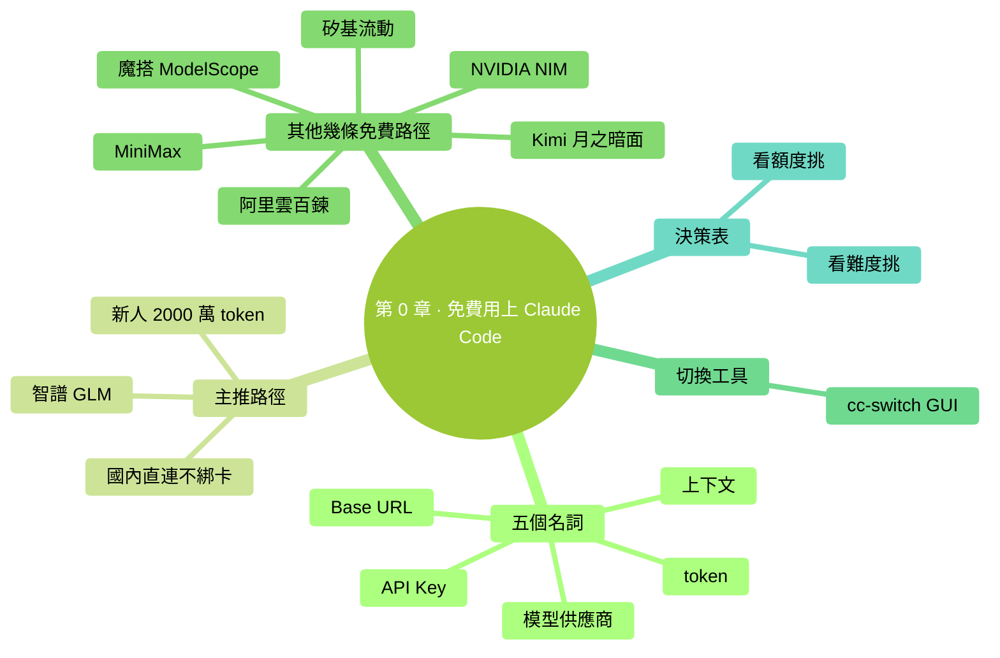

# 第 0 章：先告訴你怎麼免費用上 Claude Code

> **本章在全書的位置**：第 0 章（前言之後、第 1 章之前） / 預估閱讀+動手時長：**主線 30-45 分鐘 + 支線 10 分鐘**
>
> **學完能做什麼（主線）**：從國內一條免費路徑領到 API Key，把它配進 Claude Code，跑出第一句"它真的回我了"。整個過程**不綁信用卡、不要海外手機號、不開代理**。

---

## 開場三問

- **你會遇到什麼問題**：跟著別的教程把 Claude Code 裝好了，最後卡在登入環節——要海外手機號、要 Visa/Master 信用卡、要"翻牆"，三個裡有一個搞不定就用不上。
- **不讀這章會踩什麼坑**：以為自己"裝失敗了"，刪掉重來；或者聽信"中轉站"賣 Key 的，把錢打過去發現號被封。
- **讀完你會多會什麼事**：知道 Claude Code **不一定要連 Claude 官方**，國內有好幾條**官方且免費**的路可以走，挑最穩的一條三五分鐘就能跑通。

⚠️ **本章和第 1 章一樣適用"顆粒度最細"原則**——主線主推那一條會一步步寫到位，包括"按回車""複製貼上"這種級別。零基礎讀者請**逐字跟著做**。

### 本章地圖（一眼看全貌）

<!-- diagram: MM-46 -->


---

> 🎯 **【主線】—— 本章必讀核心**
>
> 下面 11 節 + 動手任務，讓你從"裝好但用不上"走到"第一句話回得很順"。預估 30-45 分鐘。

---

## 0.1 五個名詞，先認它們

下面五個詞全章會反覆出現，先 30 秒掃一遍——後面看到不再發懵就行，不用現在記死。

| 名詞 | 大白話 |
|------|------|
| **API Key** | 你向某個模型供應商表明身份的一長串字元——像門禁卡。一定要保密，洩露了別人就能用你的額度 |
| **模型供應商** | 提供模型 API 服務的公司——比如智譜、阿里雲、Kimi 都是；本章講的就是怎麼在 Claude Code 裡換不同的供應商 |
| **Base URL** | API 的地址。Claude Code 預設指向 Anthropic 官方；換供應商就是把這個地址改掉 |
| **上下文** | Claude 一次對話能記住的字數總量。詳見第 12 章；本章只要知道"越大越能聊長任務"就行 |
| **token** | 計費單位。粗略 1 個漢字 ≈ 1 token，1 個英文單詞 ≈ 1 token。免費額度都是按 token 算的 |

---

## 0.2 為什麼這一章放在最前面

Claude Code 裝上之後預設連的是 **Claude 官方**——但官方賬號有三個國內常見門檻：

- **付費賬號需要 Visa/Master 信用卡**（國內簽帳金融卡不一定行）
- **手機號驗證需要海外手機號**（國內號經常失敗）
- **網路得能訪問 anthropic.com**（預設在國內訪問不穩）

但有一個**很多人不知道的事實**：Claude Code 是 Anthropic 的官方客戶端，**它不綁死 Claude 模型**——它走的是叫 "Anthropic Messages API" 的標準協議，**任何提供這套協議的服務商都能當後端**。國內主流的智譜、通義、Kimi、MiniMax 都已經**官方相容**這套協議——這意味著你換一個 Base URL + 一把 API Key，就能把 Claude Code 接到國內便宜（或者乾脆免費）的模型上去。

📌 **一句話總結**：Claude Code 的"皮"是 Anthropic，"芯"可以換。**這一章就是教你怎麼換芯，免費跑起來**。

> 💡 **要不要回 Claude 官方？** 當然可以——能拿到信用卡和海外手機號、網路也通，本書後面的章節預設就是 Claude 官方的體驗。但**現在不要讓這些門檻擋住你**，先用免費方案跑通，把第 1-15 章讀完。等你對 Claude Code 上手了再決定要不要"升級"到官方賬號。

---

## 0.3 主推路徑：智譜 GLM（手把手，Mac / Windows 都給）

我從七八條可選路徑裡選出**最適合零基礎讀者**的一條：**智譜 GLM**。理由如下：

- 新使用者註冊送 **2000 萬 token**——這個量按本書第 1-15 章的練習節奏，能用三個月以上
- **官方提供 Anthropic 協議端點**，配置就改兩行字，沒有協議轉換那種彎彎繞
- **國內直連**，不要海外手機號、不開代理
- 智譜（Z.AI）是國內一線大模型公司，平臺穩定

下面四步從註冊到跑通，**逐字跟著做**。

### 第 1 步：註冊智譜開放平臺賬號（約 3 分鐘）

1. 用瀏覽器開啟 [https://bigmodel.cn](https://bigmodel.cn)
2. 點右上角"**註冊/登入**"
3. 用國內手機號註冊——收驗證碼、設密碼
4. 註冊完成後，去**郵箱驗證**那一欄，繫結一個郵箱並完成驗證

**成功標誌**：登入後頁面右上角顯示你的使用者名稱，左側能看到"個人中心"。系統會**自動**把 2000 萬 token 的體驗額度發到你賬戶裡。

> ❓ **沒收到額度？** 多數情況是"郵箱沒繫結"——回個人中心補一下郵箱驗證就發放。

### 第 2 步：建立 API Key（約 1 分鐘）

1. 在智譜開放平臺，左側選單點"**API Keys**"（也叫"金鑰管理"）
2. 點"**建立新金鑰**"
3. 給它起個名字，比如 `claude-code`，點確定
4. 系統會給你一串以字母+數字組成的長字串，**點"複製"**——這就是你的 API Key

⚠️ **API Key 只在建立那一刻能看到完整值**。複製完先粘到一個臨時記事本里別丟；如果丟了只能重新建立一把。

### 第 3 步：配置 Claude Code（Mac 和 Windows 各自看）

Claude Code 讀一份叫 `settings.json` 的配置檔案。我們要做的是把"指向智譜"和"用智譜的 Key"寫進去。

> 📌 **前提**：你已經按第 2 章裝好了 Claude Code。如果還沒裝，**先去第 2 章把 Claude Code 裝上，再回來這一節**。

#### Mac 使用者

開啟**終端**（不知道終端是啥？翻第 1 章）。在終端裡輸入：

```bash
mkdir -p ~/.claude
open -e ~/.claude/settings.json
```

第一行是"如果 `~/.claude` 資料夾不存在就建一個"；第二行是"用 Mac 自帶的文本編輯（TextEdit）開啟這個檔案"——檔案不存在的話編輯器會提示新建。

把下面這段**整段**粘進去（粘完替換裡面 `<貼上你的智譜 Key>` 那串佔位文字）：

```json
{
  "env": {
    "ANTHROPIC_BASE_URL": "https://api.z.ai/api/anthropic",
    "ANTHROPIC_AUTH_TOKEN": "<貼上你的智譜 Key>",
    "ANTHROPIC_DEFAULT_SONNET_MODEL": "glm-4.7",
    "ANTHROPIC_DEFAULT_OPUS_MODEL": "glm-4.7",
    "ANTHROPIC_DEFAULT_HAIKU_MODEL": "glm-4.5-air"
  }
}
```

按 `Cmd + S` 儲存，關掉編輯器。

#### Windows 使用者

按 `Win 鍵`，搜"**記事本**"，開啟。然後**檔案 → 開啟 → 在"檔名"框裡直接輸入**：

```
%USERPROFILE%\.claude\settings.json
```

檔案不存在記事本會問你要不要新建——選**新建**。

把上面那段 JSON **整段**粘進去（同樣替換 Key 佔位）。`Ctrl + S` 儲存，關掉記事本。

> 💡 **`~/` 和 `%USERPROFILE%` 是什麼？** 它們都代表"你自己的使用者資料夾"，Mac 上是 `/Users/你的名字`，Windows 上是 `C:\Users\你的名字`。詳見第 1 章。

### 第 4 步：啟動 Claude Code 驗證（約 1 分鐘）

**關掉**所有正在跑的 Claude Code 視窗，**重新開啟終端**（這一步重要，否則舊的環境變數會留著），輸入：

```bash
claude
```

進去後隨便問一句：

```
你現在連的是哪個模型？回我一句就行。
```

**預期**：回覆會提到"GLM"或"智譜"或"glm-4.7"之類的字眼——說明接通了。

**到這裡，你就免費用上 Claude Code 了**。繼續往下讀第 1 章 / 第 2 章 / 第 3 章，把整本書的練習跑一遍。

---

## 0.4 備選 1：阿里雲百鍊（DeepSeek V4 / 通義千問）

**適合誰**：希望用國內最大牌雲服務商的人；想試 DeepSeek V4 模型的人；做過實名認證的開發者。

**免費額度**：新使用者**每個模型獨立 100 萬 token**，3 個月有效期。覆蓋**通義千問全系、DeepSeek 全系、Kimi、MiniMax、智譜 GLM**——也就是說你登入百鍊一次能領好幾份。

**關鍵資訊**：

| 項 | 值 |
|---|---|
| 註冊入口 | [bailian.console.aliyun.com](https://bailian.console.aliyun.com) |
| Anthropic 端點 | `https://dashscope.aliyuncs.com/apps/anthropic` |
| 推薦模型（程式設計） | `deepseek-v4-flash`（預設就 1M 上下文，無需字尾） |
| 備用推薦 | `qwen3-coder-plus`（通義官方主推） |

**坑提醒**：網上有教程讓你在模型名後加 `[1m]` 字尾（比如 `deepseek-v4-flash[1m]`）開 1M 上下文——**這是錯的**。百鍊上的 V4 模型預設就是 1M 上下文，**模型名裡別加方括號**，加了反而報"模型不存在"。

**詳細步驟**：參見 **附錄 K · K.4 節**（以 GLM 為例的完整流程），**百鍊把 K.4 裡的 BASE_URL 和模型名換成上表的值即可**。

---

## 0.5 備選 2：魔搭社群 ModelScope（每天 2000 次免費呼叫）

**適合誰**：每天用得不多（開發學習、偶爾問問），不想為了幾個 token 註冊一堆賬號的人。阿里達摩院旗下的開源模型社群。

**免費額度**：登入就送，**每日 2000 次 API 呼叫**——按呼叫次數算，不按 token。注意單個模型還有獨立上限：DeepSeek-R1 推理版每天 200 次、Qwen3-Coder 每天 500 次，其他不少模型 2000 次共享池。

**關鍵資訊**：

| 項 | 值 |
|---|---|
| 註冊入口 | [modelscope.cn](https://modelscope.cn) |
| 介面風格 | OpenAI 相容（**不是** Anthropic 直接相容） |
| 推薦模型 | `deepseek-ai/DeepSeek-V4-Flash`、`Qwen/Qwen3-Coder` |

**重要提醒**：魔搭的介面是 **OpenAI 相容格式**，Claude Code 預設講的是 Anthropic 協議。直接接會報錯——需要中間放一個**協議轉換層**（最常用的是 `claude-code-router`，開源、本地跑）。

**詳細步驟**：附錄 K 的 **K.6 方案 C** 介紹了 `claude-code-router` 的安裝和配置——把裡面的目標模型換成魔搭的端點即可。**對零基礎讀者：先用 0.3 節的智譜方案跑通，等用熟了再來折騰 ModelScope**。

---

## 0.6 備選 3：矽基流動 SiliconFlow（註冊送 2000 萬 token）

**適合誰**：希望一次拿一大筆免費額度、慢慢花的人；想用 DeepSeek R1/V3 系列（含推理模型）的人。

**免費額度**：註冊即送 **2000 萬 token**——比智譜那 2000 萬還要"無門檻"些（不強制郵箱驗證）。

**關鍵資訊**：

| 項 | 值 |
|---|---|
| 註冊入口 | [siliconflow.cn](https://siliconflow.cn) |
| 介面風格 | OpenAI 相容 |
| 推薦模型 | `deepseek-ai/DeepSeek-V3.2`、`Qwen/Qwen3-Coder-480B`、`zai-org/GLM-4.6` |

**重要提醒**：和魔搭一樣是 **OpenAI 相容協議**——直接接 Claude Code 不行，需要 `claude-code-router` 這種轉換層。

**詳細步驟**：參考附錄 K · K.6 方案 C。

---

## 0.7 備選 4：Kimi（月之暗面）

**適合誰**：寫中文為主、長文件處理多的人。Kimi 在中文長文場景上口碑很好。

**免費額度**：新使用者有**註冊 trial credit**（具體金額會變，以官網為準）；不算"白嫖大戶"，但夠你試用熟悉。月之暗面也有 **Kimi Code Plan** 月度套餐（約 99 元/月）適合後續認真用。

**關鍵資訊**：

| 項 | 值 |
|---|---|
| 註冊入口 | [platform.moonshot.cn](https://platform.moonshot.cn)（國內）/ [platform.moonshot.ai](https://platform.moonshot.ai)（國際） |
| Anthropic 端點 | `https://api.moonshot.cn/anthropic` |
| 推薦模型 | `kimi-k2-thinking-turbo`、`kimi-k2-turbo-preview` |

**詳細步驟**：附錄 K · K.4 + K.5（Kimi 在 K.5 裡和 GLM 是同樣流程，只換 BASE_URL + Key + 模型名）。

---

## 0.8 備選 5：MiniMax

**適合誰**：想試 MiniMax M2 系列的人。MiniMax 在程式設計和 agentic（讓 AI 自己跑工具鏈）場景上一直在快速進步。

**免費額度**：新使用者有 trial credit；國內做了 **Token Plan** 套餐（同時覆蓋文本、語音、影像、影片）。

**關鍵資訊**：

| 項 | 值 |
|---|---|
| 註冊入口（國內） | [platform.minimaxi.com](https://platform.minimaxi.com) |
| 註冊入口（國際） | [platform.minimax.io](https://platform.minimax.io) |
| Anthropic 端點（國內） | `https://api.minimaxi.com/anthropic` |
| Anthropic 端點（國際） | `https://api.minimax.io/anthropic` |
| 推薦模型 | `MiniMax-M2` |

**詳細步驟**：附錄 K · K.5。

---

## 0.9 備選 6：NVIDIA NIM（黃大善人的免費桶）

**適合誰**：想試 GLM-5、Kimi K2、MiniMax M2.1 等等十幾款模型、不想分別註冊的人。

**免費額度**：註冊即用，**速率限制約 40 請求/分鐘**——不限總量，只限頻率。屬於"開發學習級"免費——量大商用不行。

**關鍵資訊**：

| 項 | 值 |
|---|---|
| 註冊入口 | [build.nvidia.com](https://build.nvidia.com) |
| 介面風格 | OpenAI 相容（**不是** Anthropic 直連） |
| 國內直連 | ✅ 可以 |
| 推薦模型 | `z-ai/glm4.7`、`moonshotai/kimi-k2`、`minimaxai/minimax-m2.1` |

**重要提醒**：NVIDIA NIM 的**雲上免費 API 是 OpenAI 協議**——直接接 Claude Code 不通，需要 `claude-code-router` 或 `LiteLLM` 這類轉換層。**注意**：NVIDIA 官方文件裡講的"Claude Code 直連 NIM"是指**自己部署 NIM 服務**的場景，和這裡的"雲上免費"是兩回事。

**詳細步驟**：附錄 K · K.6 方案 C。**對零基礎讀者：暫緩**——熟悉智譜那條路之後再來玩。

---

## 0.10 cc-switch：圖形化一鍵切換

註冊了幾家之後，你早晚會想"今天我用智譜、明天換百鍊"——手動改 `settings.json` 累。這時候用 **cc-switch**。

**它是什麼**：一個開源的桌面小工具（Mac / Windows 都有），選單欄掛著一個圖示，點一下就能切換 Claude Code 的後端供應商，不用每次手改配置檔案。

**核心好處**：

- **預設了 50+ 家供應商**——智譜、百鍊、Kimi、MiniMax、ModelScope、SiliconFlow 都在內建預設裡，選一下、粘 Key、給個暱稱就完事
- **選單欄點選切換**——不用關 Claude Code、不用改檔案
- 支援配額和餘額展示（部分供應商）、Codex / OpenCode / Gemini CLI 一併管

**下載地址**：[github.com/farion1231/cc-switch](https://github.com/farion1231/cc-switch) → Releases 頁選自己系統的安裝包。

⚠️ **網傳 `[1m]` 寫法是錯的**：網上有些 cc-switch 教程讓你在模型名後追加 `[1m]` 來開 1M 上下文，**這個寫法不被任何主流國產供應商接受**——它是 Anthropic 自家 Claude Code 內部的展示約定（見附錄 J），不是模型 ID。**填模型名時不要加方括號**。如果你確實想給 Codex 啟 1M 上下文，cc-switch 在"新增供應商"介面有個獨立開關，用那個，別動模型名。

**詳細步驟**：參見附錄 K · K.6 方案 B（cc-switch GUI 切換方案）。

---

## 0.11 我該挑哪條？決策表

零基礎讀者**直接選第一行**就好——其他幾行是給"智譜用了一陣想試別家"的你回頭查的。

| 你的情況 | 推薦 | 為什麼 |
|---|---|---|
| 完全零基礎、想 5 分鐘跑通 | **智譜 GLM**（0.3 節） | 2000 萬 token 免費、原生 Anthropic 協議、不用代理 |
| 想試 DeepSeek V4 這種當下最火的開源模型 | 阿里雲百鍊 | DeepSeek V4 Flash 預設 1M 上下文，每模型 100w token |
| 呼叫次數少、不在意單個模型限額 | 魔搭 ModelScope | 2000 次/天純免費，但要裝 `claude-code-router` |
| 想要一次大額度（2000w token）、慢慢花 | 矽基流動 | 註冊即送，但 OpenAI 協議要裝轉換層 |
| 經常多家來回切 | **+ cc-switch**（0.10 節） | 選單欄一鍵切，不用每次改配置 |
| 已能拿到 Visa 卡 + 海外手機號 + 網路通 | 直接用 Claude 官方 | 體驗最強、特性最新（見第 2 章預設流程） |

---

## 真實對話示例（接通智譜後的樣子）

```
**你**：你現在連的是哪個模型？

Claude：你好！我是基於 GLM-4.7 的助手，由智譜 AI 提供。
有什麼可以幫你的？

**你**：幫我建一個資料夾叫 my-first-test

Claude：[請求許可權執行 mkdir my-first-test]

**你**：（按 y 同意）

Claude：✅ 已建好。資料夾 my-first-test 在你當前目錄裡。
要不要我在裡面放一個 README.md 佔位？
```

注意**完全沒有任何"我現在不是 Claude 官方"的違和感**——Claude Code 的互動介面、許可權彈窗、`/` 命令、檔案操作全都正常。**唯一區別**：回答裡偶爾會冒出"GLM"字樣——這就是底層模型在說話。

---

## 本章小結

- Claude Code **不綁死 Claude 模型**——換 Base URL + Key 就能接國內供應商
- 國內最穩的零基礎免費路徑是 **智譜 GLM**（2000 萬 token，原生 Anthropic 協議）
- 其他備選按需選：百鍊有 DeepSeek V4、魔搭按次免費、矽基流動一次給大額度、Kimi/MiniMax 各有特色
- **`[1m]` 字尾是錯的**——國產平臺沒人吃這個寫法
- 嫌手改配置麻煩就用 **cc-switch** 圖形化切換
- 備選路徑詳細步驟都彙總在 **附錄 K**

---

## 動手任務

### 任務：拿智譜免費額度跑通你的第一句對話（預估 15-20 分鐘）

**步驟**：

1. 開啟 [bigmodel.cn](https://bigmodel.cn) 註冊賬號、綁郵箱
2. 在"API Keys"頁建立一把 Key、複製下來
3. 按 0.3 節第 3 步把 `~/.claude/settings.json`（Mac）或 `%USERPROFILE%\.claude\settings.json`（Windows）配好
4. **重新開啟**終端、輸入 `claude` 啟動
5. 問一句"你是誰、用的什麼模型？"

**成功標誌**：回覆裡能看到 "GLM" 或 "智譜" 字樣。

**失敗了怎麼辦**：

- **報 401 / Authentication failed**：Key 複製不全或多了空格，回控制台再複製一次
- **報 connection refused / unable to connect**：BASE_URL 拼錯——比對 0.3 節那段 JSON 一字一字檢查
- **回答完全是英文 + 自稱 Claude**：環境變數沒生效——徹底關 Claude Code 和終端再重開

> 💡 **任務完成後**：把這把 Key 也儲存到密碼管理器裡。它會陪你走完後面 27 章。

---

## 如果你卡住了

**症狀 A：註冊智譜時簡訊一直收不到**
- 最可能原因：手機號被用過、運營商遮蔽
- 解決：換個號試；或先用別家——0.4 阿里雲百鍊通常用阿里雲賬號秒過

**症狀 B：粘進 settings.json 後 Claude Code 啟動報錯"JSON 解析失敗"**
- 最可能原因：JSON 裡多了一個逗號、或者 Key 裡帶了換行符
- 解決：去 [jsonlint.com](https://jsonlint.com) 把整段貼進去校驗，提示改哪一行就改哪一行

**症狀 C：跟著別的教程在模型名後加了 `[1m]` 結果報"模型不存在"**
- 最可能原因：你看到的就是網傳那個錯教程
- 解決：把 `deepseek-v4-flash[1m]` 改回 `deepseek-v4-flash`——百鍊預設就是 1M 上下文，不需要字尾

**症狀 D：回答正常但**特別慢**（一句話要等 30 秒）**
- 最可能原因：免費檔共享池高峰期排隊、或者你選了重型推理模型
- 解決：把 `ANTHROPIC_DEFAULT_SONNET_MODEL` 從 `glm-4.7` 換成更輕量的 `glm-4.5-air`；或換時段

**還是不行？** → 翻**附錄 G 報錯自救手冊** + **附錄 K 第三方模型接入**詳解。

---

> 🌿 **【支線】—— 可選深入（學有餘力再看）**
>
> 下面一節講"免費方案能撐多久"和"什麼時候該升級到付費"。第一遍讀完全可以跳過。

---

## 🌿 支線 0.A：免費額度撐得住一本書的練習嗎

> 這段講什麼：每條免費路徑**到底夠你做多少事**，以及什麼時候你會"不夠用"。
> 什麼時候回頭讀：用了一兩週開始好奇額度還剩多少時。

按本書的練習節奏粗略估算（一次完整對話 + 一兩次工具呼叫約 2000-5000 token）：

| 路徑 | 免費額度 | 大致能做的事 |
|---|---|---|
| 智譜 GLM | 2000 萬 token / 3 個月 | **本書第 1-15 章全部練習 + 自己玩兩週**，富裕 |
| 阿里雲百鍊 | 100 萬 token / 模型 / 3 個月 | 單模型夠第 1-5 章；想長期用就多領幾個模型 |
| 魔搭 ModelScope | 2000 次/天 | 偶爾問問夠；不適合長任務 |
| 矽基流動 | 2000 萬 token（一次性） | 類似智譜，但花完就要充錢 |

**什麼時候你會用完免費額度**：

- 開了**自動接受模式**讓 Claude Code 跑長任務（一次幾十萬 token 砍出去）
- 反覆用 Opus 這種最重模型來做小事（高階模型 token 計費更狠）
- 對著同一個檔案改改改改——每次都把全文塞進上下文

**省著花的小技巧**：

1. **小事用小模型**——本書 0.3 節配的 `glm-4.5-air` 比 `glm-4.7` 便宜數倍，問答級任務用它夠了
2. **及時 `/clear`**——不需要的對話上下文清掉，下一句不帶累贅
3. **用計劃模式（第 9 章）**——先讓它出方案再動手，避免改了又退

> 用完了之後怎麼辦？一是去**別家**領新一份免費（同一家不能反覆領，但供應商有 N 家）；二是開始考慮**官方 Claude 賬號**或者智譜/Kimi/MiniMax 的**月度 Coding Plan** 套餐（約 ¥20-99/月）。本書後面所有講"成本"的章節（特別是第 15 章）會讓你判斷這筆錢值不值。

---

主線到這裡結束。下一章我們正式開始動手：**先把電腦準備好**——開啟終端、看懂提示符、用基礎命令在資料夾間穿梭。

---

<!-- chapter-nav -->

📖  [← 前言 · 本書怎麼讀](./00-本書怎麼讀.md)  ·  [📑 返回目錄](../../README.md)  ·  [第 1 章 · 先把電腦準備好 →](../part1-從零起步/01-先把電腦準備好.md)
