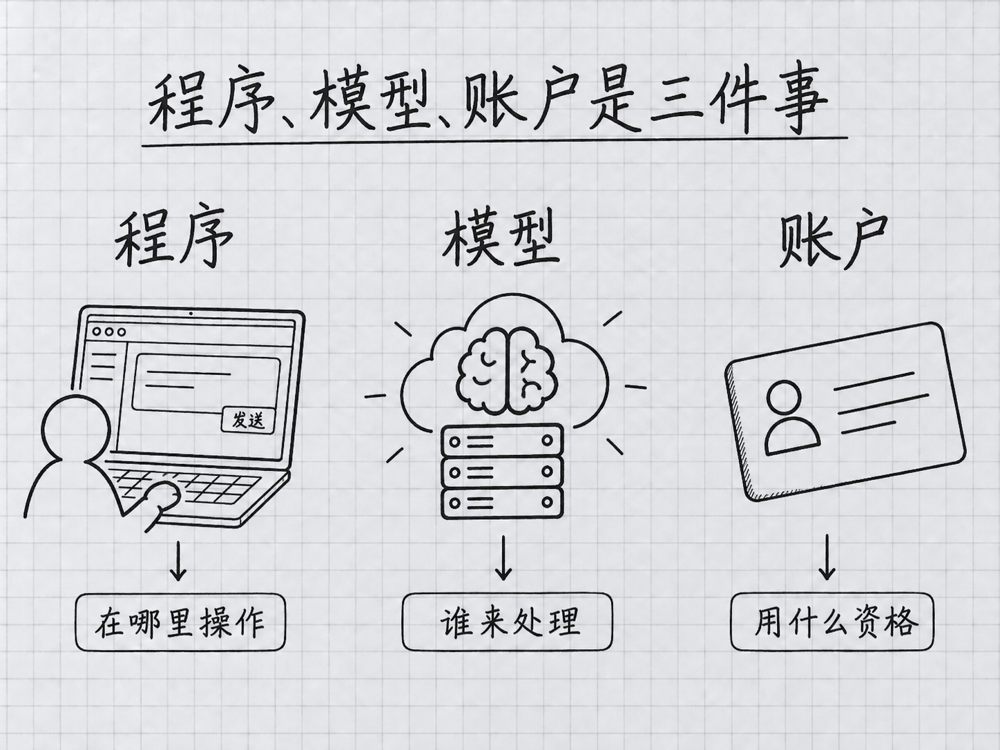

# 第 0 章：先選好賬號與費用路徑

> **本章在全書的位置**：前言之後、第 1 章之前 / 約 15 分鐘。
>
> **學完能做什麼**：判斷自己是否有 Claude Code 使用資格，分清訂閱、API 和第三方接入，決定下一步從哪裡開始。
>
> 老版把這一章叫“免費用上 Claude Code”。現在保留檔案地址，方便舊連結繼續訪問；內容已改為賬號與費用準備。活動贈送額度不能當成長久有效的免費承諾。

## 開場三問

- 你會遇到什麼問題：能開啟 Claude 聊天網站，卻不一定能使用 Claude Code。
- 不讀會踩什麼坑：把第三方平臺餘額、Claude 訂閱和 API 餘額當成同一個錢包。
- 讀完多會什麼事：在安裝前確認自己的可用路徑，不因模型不可用而反覆重灌程式。

### 本章地圖

本章圖解：[程式、模型、賬戶是三件事](#01-三件东西不要混成一件)。

> 🎯 **【主線】—— 本章必讀核心**

## 0.1 三件東西，不要混成一件

你接下來會用到三個不同的東西。**Claude Code 是幫你讀檔案、改檔案和執行命令的工具**；**Claude 模型負責理解任務和生成回答**，例如 Opus 5.5、Fable 5.1；**賬戶決定你能訪問哪些服務，以及費用由誰承擔**。同一臺電腦裝好了工具，換一個賬戶，能選的模型和可用額度也可能不同。

<!-- diagram: FIG-002 -->

*圖：程式是操作入口，模型處理任務，賬戶決定可用資格。*
<!-- /diagram: FIG-002 -->

把它想成裝好了一個影片播放軟體：軟體存在，不等於你已經訂閱每一個付費頻道。Claude Code 的安裝程式可以取得，也不等於請求模型永久免費。官方目前明確說明，Claude 免費聊天計劃不包含 Claude Code 使用資格。[官方安裝與賬號說明](https://code.claude.com/docs/en/setup)

另外，本書可以在 GitHub 閱讀，與使用雲端模型的費用是兩件事。你完全可以先讀、先準備練習資料，再決定是否購買適合自己的服務。本章不要求你下單，也不會讓你先把支付方式交給不明來源的中轉站。

## 0.2 按自己的情況選擇路徑

| 你的情況 | 先確認什麼 | 後面怎樣登入 |
|---|---|---|
| 已有個人 Pro 或 Max 訂閱 | 套餐是否有效、Code 使用範圍和額度 | 在 Claude Code 中走 Claude 賬號登入 |
| 公司提供 Team 或 Enterprise | 自己的席位、管理員授權、資料規則 | 按組織提供的方式登入 |
| 準備用開發者 API | Console 中的餘額、預算和計費賬戶 | 走 Console/API 路徑，按使用量計費 |
| 只有免費聊天賬號 | 當前沒有包含 Code 的訂閱資格 | 先讀與準備，或自行選擇合適的正式路徑 |
| 使用其他雲平臺或相容服務 | 提供方明確支援什麼、如何計費和處理資料 | 只按該提供方最新文件配置，見附錄 K |

**API** 可以理解為軟體向另一項服務發請求的介面。採用 API 時，常用一把 **API Key（介面金鑰）**證明賬戶身份；誰拿到它，誰就可能使用對應額度，因此不要把它放進公開倉庫或聊天截圖。**token** 是模型處理文字的計量單位，不能穩定地換算成“一個漢字”或“一分鐘”。詳細費用留到第 15 章再算。

個人訂閱和 API 按量付費各有適用場景，但錢包不共用。買了 Pro，不代表 Console 自動出現同等金額的 API 餘額。第三方提供的優惠更不會自動兌換成官方 Opus 或 Fable 的訪問權。

## 0.3 在 Mac 或 Windows 上完成同一張準備單

這一步只需要瀏覽器，不用懂終端。Mac 可以開啟 Safari 或你慣用的瀏覽器；Windows 可以開啟 Edge 或你慣用的瀏覽器。輸入 [claude.com/pricing](https://claude.com/pricing)，檢視個人或團隊計劃。**先閱讀，不必點購買。** 接著登入你自己的賬戶，在賬戶設定裡確認當前計劃；如果是公司發的賬戶，向負責管理的人核對席位與 Code 是否開放。

把這三項記到自己的普通筆記裡：**賬號型別、費用由誰承擔、遇到額度限制去哪裡檢視**。不記密碼或金鑰。看到自己的套餐名稱、知道預算由自己還是公司管理，就完成了準備；找不到套餐或 Code 入口時，先停在這裡查賬號，不要跳去“修復安裝”。

如果選擇 API，開啟 [Claude Console](https://platform.claude.com/)，確認進入的是自己的組織。看清餘額、計費與可用的支出控制。使用量估算並不等於銀行賬單，仍應以提供方控制檯為準。你不需要為了跟著本書學終端，先批次建立金鑰。

還要確認[官方支援地區](https://www.anthropic.com/supported-countries)。能瀏覽介紹頁、能下載安裝器與具備服務資格不是同一回事。本書不提供“任何地區都能直連”“絕對不需要某種驗證”的保證。公司電腦也應先確認哪些資料可以交給雲端服務處理。

## 0.4 為什麼不再按七個平臺逐個承諾免費額度

舊版列過多個供應商的新人贈送、免費次數和低價套餐。這樣的數字變化很快：可能只限特定模型、另有到期時間，或者沒有開放 Claude Code 所需的工具呼叫。把四月的活動額度照抄到九月，會讓你在安裝前就作出錯誤預算。

因此，本版主線以官方支援路徑講清第一次成功；相容服務統一放在[附錄 K](../%E9%99%84%E5%BD%95/K-%E7%AC%AC%E4%B8%89%E6%96%B9%E6%A8%A1%E5%9E%8B%E6%8E%A5%E5%85%A5.md)。如果你已經在用某個服務，可以繼續按其官方文件核對：**端點、金鑰型別、實際模型、客戶端支援範圍、賬單**。端點就是請求送到的服務地址。能得到一句回答，僅說明一次請求成功，不證明檔案編輯、圖片、長上下文和其他工具都相容。

尤其別用“請告訴我你是什麼模型”作為身份鑑定。模型的文字回答可能受提示詞影響；應看提供方設定、請求記錄或模型清單。在相容服務裡把選單名設成 `opus`，也不會把另一個模型變成 Anthropic 的 Opus 5.5。

## 本章小結

- 安裝程式、呼叫模型、支付費用是三件事。
- 免費聊天計劃不自動包含 Claude Code。
- 訂閱、Console API、第三方服務要各查各的資格和賬單。
- 活動額度有條件和有效期，不當作永久免費路線。
- 先完成賬號準備，再到第 1、2 章學習終端與安裝。

## 動手任務

1. **寫一張賬號準備單（5 分鐘）**：記錄自己採用哪條路徑、費用歸誰、去哪裡看用量。成功標誌是三項都能用一句話說明，且筆記裡沒有金鑰。
2. **確認學習入口（3 分鐘）**：沒用過終端，繼續第 1 章；會用終端，讀第 2 章；只想用桌面介面，先看附錄 H。成功標誌是知道下一步讀哪裡，而不是同時嘗試多種安裝方式。

## 如果你卡住了

- **登入聊天網站沒問題，Code 卻要求升級**：先檢查是否只有免費聊天計劃。
- **訂閱裡有額度，API 卻報餘額不足**：檢查是否誤選了 Console/API 計費路徑。
- **公司賬號沒有新模型**：核對組織開放範圍，別用私人金鑰替公司繞過管理規定。

> 🌿 **【支線】—— 可選深入**

## 🌿 支線 0.A：只想瞭解 Fable 5.1 和 Opus 5.5，從哪裡看

如果你已熟悉舊版，可以直接讀第 15 章和附錄 J。Opus 5.5 於 2026 年 9 月 22 日釋出，Fable 5.1 於 9 月 1 日釋出，本版已納入兩者。它們都是 Claude 模型，與 Code 的許可權模式、桌面介面或賬戶計劃不是一個層級的東西。

第一次練習無需先把所有模型試一遍。先讓當前可用的日常模型完成一個小任務，再根據完成質量與費用決定是否需要更強的模型。Fable 的可用額度和費用有套餐條件，不能因選單裡出現它，就假定每次使用都含在已有訂閱內。具體比較、切換命令和來源見[第 15 章](../part3-%E6%B7%B1%E5%BA%A6%E6%A6%82%E5%BF%B5/15-%E6%A8%A1%E5%9E%8B%E4%B8%8E%E6%88%90%E6%9C%AC.md)。
